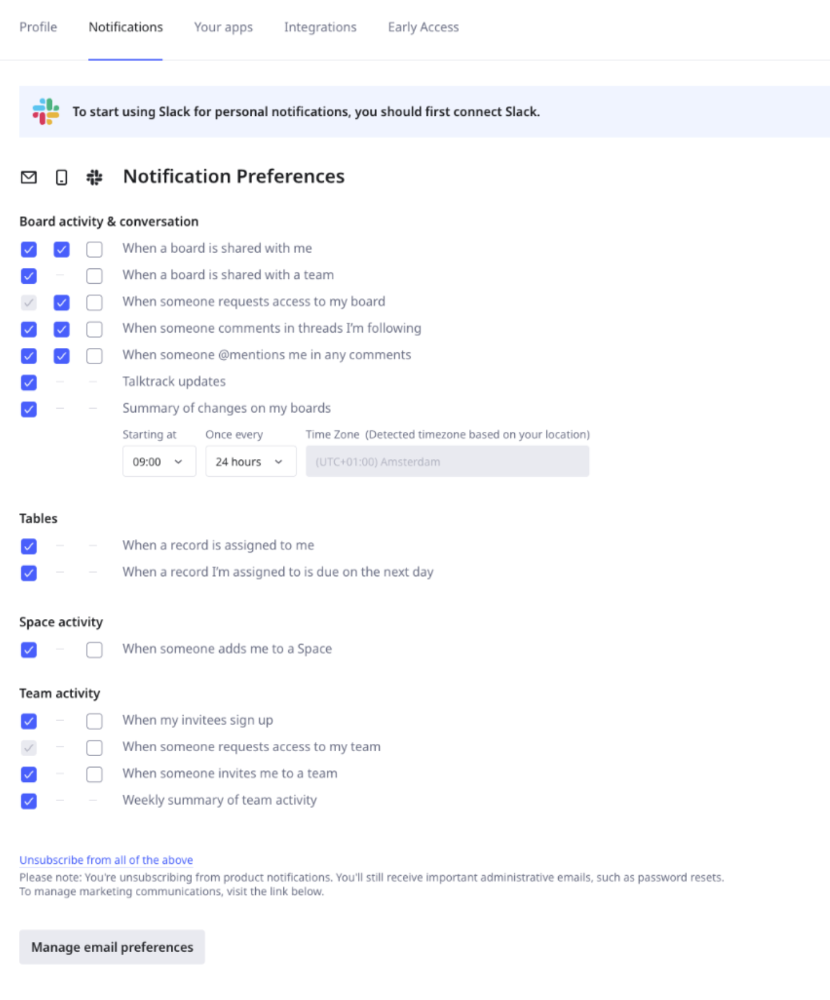

You can update what [notifications](#update-notification-preferences) and [emails](#update-email-preferences) you receive from Miro in your **Profile settings**.

 *Set your notifications and email preferences menu in **Profile settings**.*

:::note
You cannot change notification and email preferences for other members of your team. Each member configures their own profile settings.
:::

### Update notification preferences

You can update notification preferences for Board activity and conversation, Tables, Spaces, and Team activity, by email, mobile, and Slack.

Follow these steps:

1. From your Miro **Home** dashboard, click your avatar in the upper-right.
2. Click **Profile**.
   The **Profile settings** view opens.
3. Click the **Notifications** tab.
4. (Optional) Click **Connect to Slack** to receive notifications by Slack.
5. For each row, select whether you want notification by email, mobile, or Slack.
   Your preferences are saved automatically.
6. If you select **Summary of changes on my boards**, you can optionally specify the start time and notification period.

   > **NOTE:** Time zone is set based on your location.

To disable all notifications, at the bottom click **Unsubscribe from all of the above**.

:::note
You can also receive Miro notifications in [Microsoft Teams](../../integrations-apps/microsoft/microsoft-teams/10-miro-notifications-in-microsoft-teams.md) and [Google Chat](../../integrations-apps/google/01-miro-for-google-chat.md). These integrations you configure separately.
:::

:::tip
Configure notifications for individual boards and comments threads. For boards, from [the Board bar](../../getting-started/start-here/your-first-board/05-toolbars.md#board-toolbar-main-menu) click the vertical three-dots, then click **Preferences**. For comments, click the comment, then click the bell icon. For more information, see [Comments](../facilitation-tools/asynchronous-tools/01-comments.md#follow-all-comment-threads).
:::

### Update email preferences

You can manage which email communications you receive from Miro in the following categories:

- **Newsletters and digests**
  Stay in the loop with regular product updates, admin newsletter, or community newsletter.
- **Product news and recommendations**
  Stay informed on the latest Miro features.
- **Learning resources**
  Build your Miro skills with tips from our team and real-world examples.
- **Surveys and product interviews**
  Share your feedback and insights to help shape the future of Miro.
- **Marketing emails and promotions**
  Receive promotions and partner updates.

Follow these steps:

1. From your Miro **Home** dashboard, click your avatar in the upper-right.
2. Click **Profile**.
   The **Profile settings** view opens.
3. Click the **Notifications** tab.
4. Scroll to the bottom and click **Manage email preferences**.
   The **Communications Preferences** view opens.
5. Toggle each row on or off to receive or never receive that email.

 *The Communication Preferences menu in **Profile Settings** > **Manage email preferences**.*

To disable all email communications, at the bottom click **Unsubscribe from all**.

:::tip
You can also manage email preferences using the **Unsubscribe** or **Manage preferences** links at the bottom of Miro emails.
:::
