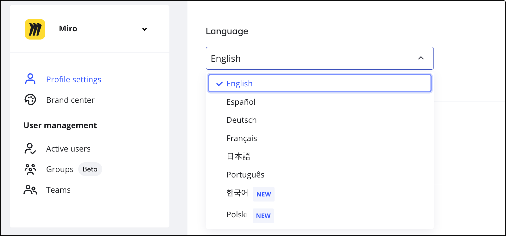
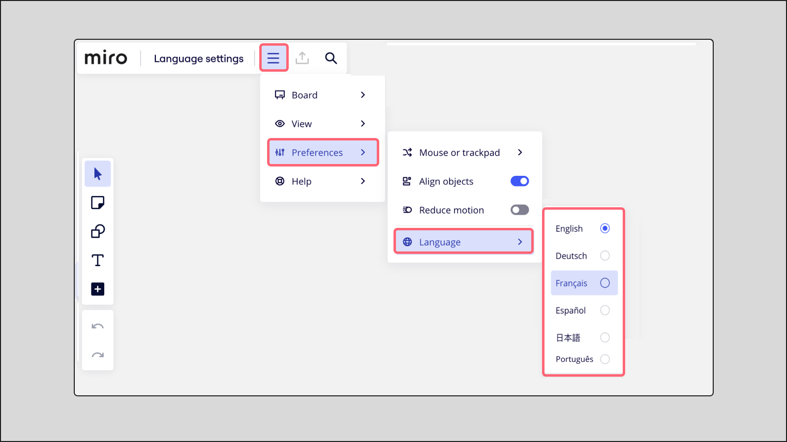

You can update your language in Miro with just a few clicks from your Profile settings. Your language settings will be reflected across your Miro boards, dashboard, and settings.

## Supported languages

Miro currently supports the following languages:

- English
- French
- German
- Japanese
- Spanish
- Portuguese
- Korean
- Polish

> **Available for**: All plans
> **Available on**: Desktop browser, some limitations on Desktop app, Tablet app

## How to change your language in Miro

1. Go to your [Profile settings](https://miro.com/app/settings/user-profile).
2. Scroll down to **Language.**
3. Choose your preferred language from the dropdown menu.

:::note
Language settings are currently available in your browser only and apply to the user interface of your Miro boards, dashboard, and settings.
:::

*Miro language settings for logged in users*

## Language settings for non-registered Miro users

If you're not a registered Miro user or you're not logged in, and therefore don't have access to Profile settings, you can still collaborate using your preferred language.

Adjust your language settings anytime from your Board menu > **Preferences** > **Language**.

*Miro language settings for users not logged in*

## Frequently asked questions

**Why aren’t all features localized for my language?**

We’re at the beginning of our journey to localize Miro for you. Please bear with us as we continue to update additional features and assets, including the Learning Center, Notifications, Help Center, and a few other areas. Since Miro is constantly updated to provide a better user experience, there may be a delay across multi-language updates. For the most up-to-date information, please check the English version.

**Why is the website available in different languages?**

Website and product language availability may differ. Register your interest in what languages you’d like to see next on the [Community Wish List](https://community.miro.com/ideas).

**Are language settings ever selected automatically for users?**

To make sure you enjoy a seamless user experience we try our best to detect your preferred language. You can also update your language preferences at any time from your Miro Profile settings.
