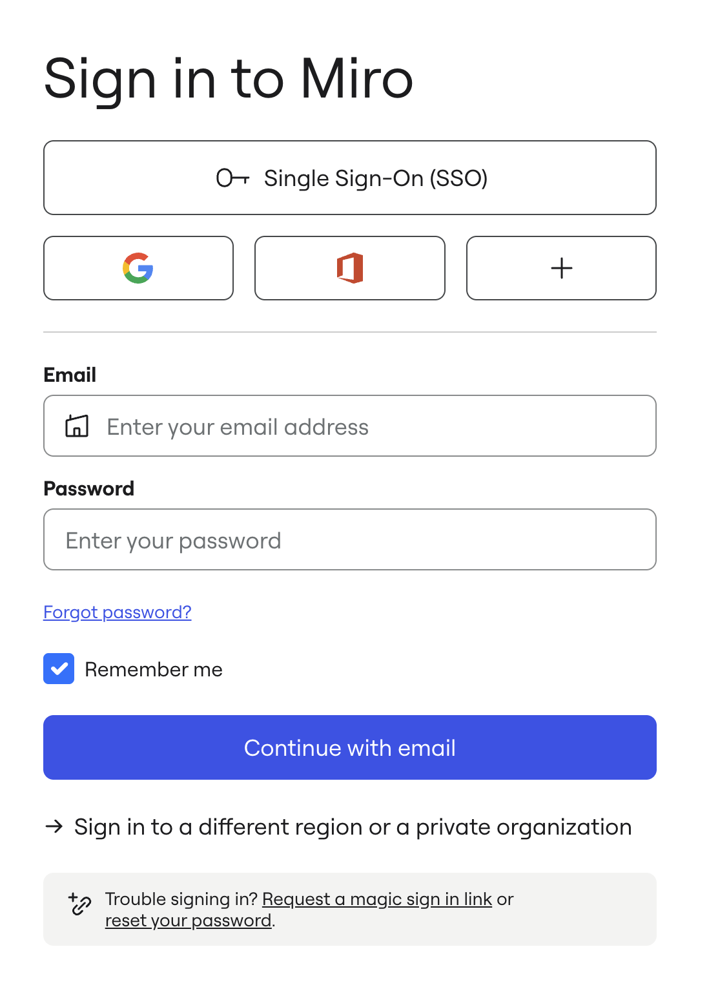
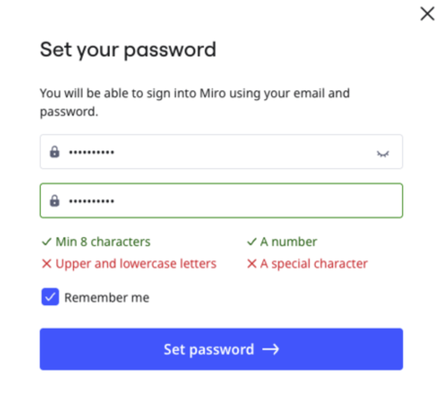

You can change your Miro password at any time.

:::note
The option to change a password is not available if you access Miro via [SSO](../../enterprise-administration/security-integrations/single-sign-on-sso/09-single-sign-on-sso.md).
:::

:::note
Changing your password ends your Miro session on all other devices.
:::

### How to change your password in profile settings

1. Open your [Profile settings](https://miro.com/app/account/profile/).
2. Scroll to **Password**, and click **Change**.
3. Enter your new password and your current password.
4. Click **Save password.**

*Changing a password in Miro profile settings*

### How to reset your password

1. To reset your password, on the [Miro login page](https://miro.com/login/) click **Forgot** **password?**.
   ***Forgot password?** links to the password reset instructions. You can also click **reset your password** at the bottom.*
2. Enter the email you use to log in to Miro and click **Continue**. We will send you the password reset instructions.
3. Click the link in the received email.
4. Create a new password and click **Continue**.
5. Log in with the new password.

## Miro password requirements

Your Miro password must meet the following requirements:

- Minimum of 8 characters
- At least 1 uppercase letter
- At least 1 lowercase letter
- At least 1 number
- At least 1 special character

*Miro indicates which password requirements are met in real time.*

## FAQ

- *I tried to reset my password but I did not get the recovery email. What do I do?*
  - Make sure there are no typos in the email you submitted. If you find a typo, try to recover the password again. Open your **Spam, Promotions, Junk, Social**, and **Updates** folders and check to see if Miro confirmation email is there.
  It also may be that a firewall is preventing the email from reaching your inbox. Ask your system administrator to allowlist the necessary [domains and subdomains](../troubleshooting-technical-questions/technical-guidelines/07-miro-domains-reference.md).
- *When I click the link in the recovery email, I get the error message "Something went wrong! The recovery code that you’re using is incorrect". How can I reset my password?*
  - Open the [Miro login page](https://miro.com/login/) and your inbox in incognito mode of your browser. Request the reset password email by clicking **Forgot password**. Switch to your inbox and click the link in the new email you will receive.

If issues persist, [contact Miro Support Team](../tools/troubleshooting/06-contacting-miro-support.md).
