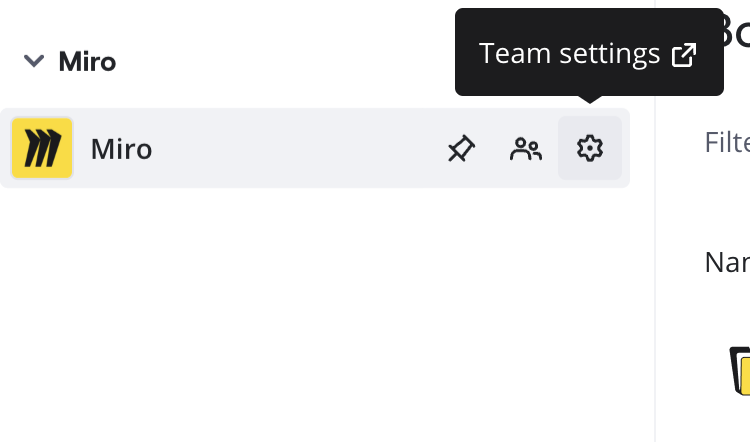
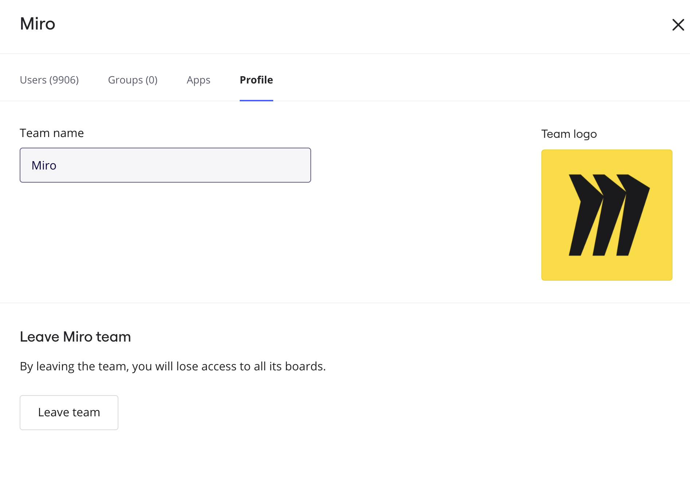
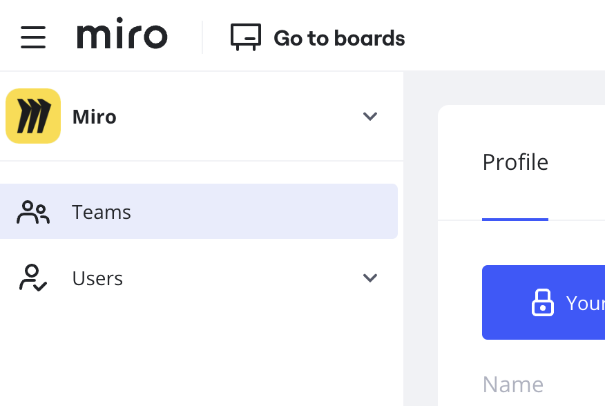
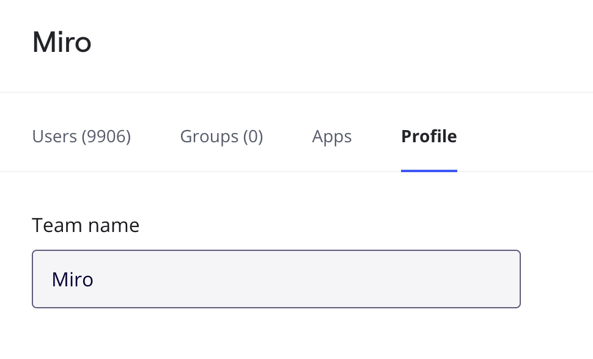

When a team you participate in becomes inactive or irrelevant to you, it may be worth it to free up space for your next big thing and leave that team.

### Leaving a team

You can leave a team from the dashboard or from team settings.

:::warning
When you leave a team, you lose access to the boards in that team, including any you created.
:::

- Go to the [dashboard](https://miro.com/app/dashboard/), in the top-left select the team name. A sidebar opens that shows each organization and team. For your team, select the **Team settings** gear icon.
  *Getting to Team settings*
  The team profile opens in a separate tab.  Under **Leave &lt;team name&gt; team**, select **Leave team**.
  
  *Access team profile to leave your team*

:::note
For Business and Enterprise plans, a member remains in the organization even when they have left all teams. The member must continue to authenticate with organization settings, for example SSO and 2FA, if enabled. Only Company admins can remove a user from the organization.
:::

## How it works for Team Admins

When a user leaves, their content ownership is assigned to the next Team Admin in alphabetical order. Team Admins receive an email notification.

To leave the team as a Team Admin, you may need to assign a new Team Admin before you go. They will be notified about their new role.
If you are the last remaining person in the team, you will only be able to [delete](../../administration/team-management/06-delete-and-restore-teams.md) it.

### Frequently asked questions

1. *I would like to leave a team without losing my boards in the team. How can I do that?*
   - Prior to leaving the team, [move your boards to another team](../managing-boards/04-how-to-move-a-board.md) that you are a member of. If you don't have another team, you can [create it](../../plans-billing/manage-your-subscription-and-plan/03-upgrade-your-plan.md) by clicking the plus button on the left sidebar of your dashboard.
2. *I can only see the option to* [*delete my profile*](07-how-to-delete-your-profile.md)*. How do I leave a team?*
   - You are in your [Profile settings](01-profile-settings.md). Deleting your profile results in losing access to all your Miro data. To leave a team from your profile settings, in the sidebar select **Teams**.
   *Open the Teams view*
   Search and select the team you want to leave. In the team view, select **Profile**. The team profile view opens.
   *Open Team Profile*
   Under **Leave &lt;team name&gt; team**, select **Leave team.**
3. *How can I leave a board?*
   - Check out [this article](../managing-boards/06-how-to-leave-a-board.md).
