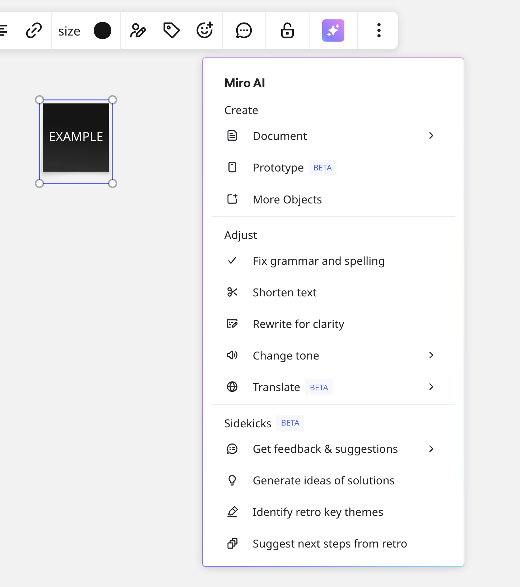

[AI Terms](https://miro.com/legal/ai-features-addendum/) apply to your use of Miro AI as part of the Miro Services. The AI Terms do not modify the existing Agreement between Miro and you but expand on the same to address Miro AI specifically, and all existing Agreement terms remain unchanged.

Miro AI is a suite of artificial intelligence features that enhances team productivity, streamlines workflows, and sparks creativity during your brainstorming, planning, and project management sessions.

*Miro AI in the context menu.*

Miro AI automates tedious tasks while empowering teams to focus on innovating and strategic thinking, from generating new ideas to summarizing discussions and creating structured documents.

:::note
Miro AI is only available for team members. Guests and visitors cannot use Miro AI.
:::

:::note
Miro AI in this article refers to a set of core AI productivity features available to all Miro users. [AI Workflows](02-miro-ai-workflows-overview.md) is a separate suite of advanced features that includes Sidekicks and Flows.
:::

## Key features

- **Generative AI for ideation and content creation**
  Create a variety of content from simple text prompts. You can also select board objects to use as input to generate new ideas.
- **Summarization and information synthesis**
  Surface the most critical information on your board. Miro AI can analyze a collection of sticky notes, comments, or other text on a board and provide a concise summary, identify key themes, and even suggest actionable next steps.
- **Diagramming and process mapping**
  Generate various types of diagrams automatically. Provide Miro AI with a text description of a process or system, and Miro AI can create flowcharts, UML diagrams, and entity-relationship diagrams, which you and your team can manually edit and refine. You can also provide an image of a diagram for Miro AI to convert into an editable diagram on the board.
- **Content refinement and translation**
  Change the tone of text, correct grammar and spelling, and translate content into several languages. Miro AI can also transform a selection of sticky notes into a more structured format, like a table or a presentation slide.
- **AI-powered clustering**
  Group related sticky notes based on keywords and sentiment. Use Miro AI to significantly speed up the process of organizing large sets of qualitative data gathered during user research or brainstorming, affinity mapping, and thematic analysis.

## Miro AI capabilities

Miro AI includes the following suite of artificial intelligence capabilities.

### Create with AI

Create with AI enables users to prompt, generate, and iterate on various types of content using Miro AI and Formats.

**More information:** See [Create with AI](03-create-with-ai.md).

### Conversation summaries

Conversation Summaries enable you to generate a summary of lengthy comment threads on your Miro board.

For boards with a lot of activity, you can quickly review and prioritize specific insights.

**More information:** See [Conversation Summaries](11-conversation-summaries.md).

### Miro AI Translate

Translate text on your canvas into 17 languages.

**More information:** See [Miro AI Translate](12-miro-ai-translate.md).

### Miro AI with Formats

For more information about using Miro AI with different Formats, see the following articles:

- [Miro AI with Sticky notes](16-miro-ai-with-sticky-notes.md)
- [Miro AI with images](15-miro-ai-with-images.md)
- [Miro AI with diagrams and mind maps](13-miro-ai-with-diagrams-and-mindmaps.md)
- [Miro AI with Docs and text](14-miro-ai-with-docs-and-text.md)
- [Miro Prototypes](../miroverse/prototyping/03-miro-prototypes.md)

### Catch up

Catch up highlights key updates to your Miro board since you last visited. You can also get a summary of changes with action items, or a step-by-step walkthrough.

**More information:** See [Catch up (BETA)](../working-on-the-board/03-catch-up.md).

## Miro AI credits and add-on

Miro AI credits enable you to perform AI actions in Miro. For each AI action you perform, you consume AI credits. Most AI features consume one (1) credit per action, however some features may consume more.

Miro allocates a set number of AI credits to your account each month. The number of credits allocated depends on your plan.

**More information:**

- [Miro AI credits and AI add-on](../../plans-billing/billing-and-payments/03-miro-ai-credits.md)
- (Enterprise) [Miro AI credits for Enterprise plans](../../enterprise-administration/enterprise-subscription-management/enterprise-billing/03-miro-ai-credits-for-enterprise-plans.md)

### Miro AI credits add-on

The [Miro AI credit add-on](../../plans-billing/billing-and-payments/03-miro-ai-credits.md) is a paid subscription that increases your monthly AI credit limit.

## Miro AI reference info

To learn more about Miro AI, including which large language models (LLMs) Miro AI uses, see [Miro AI reference](18-miro-ai-reference.md).
