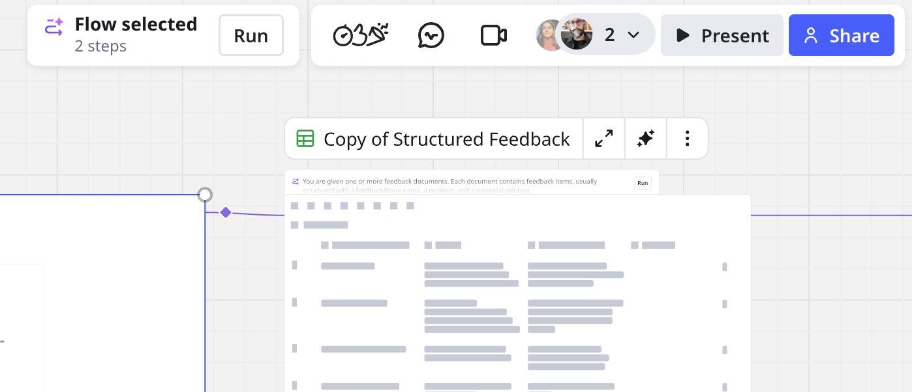
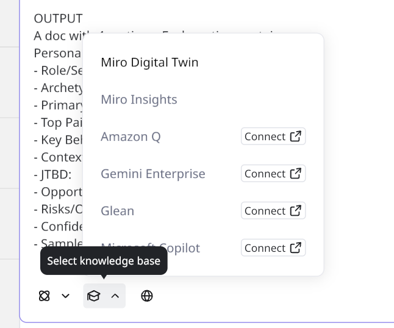
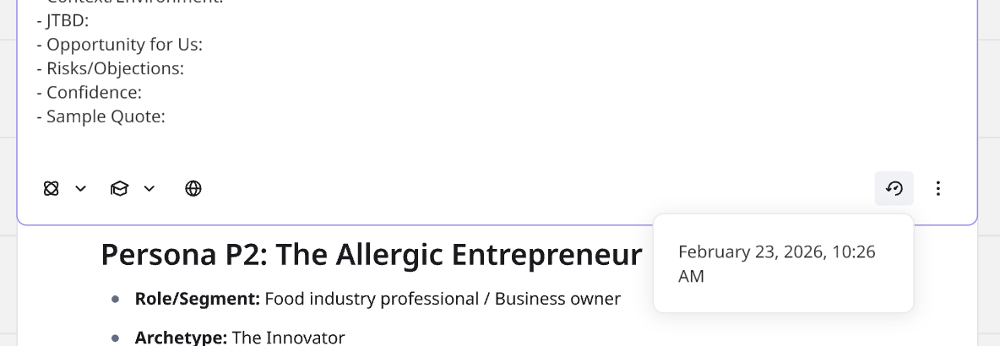
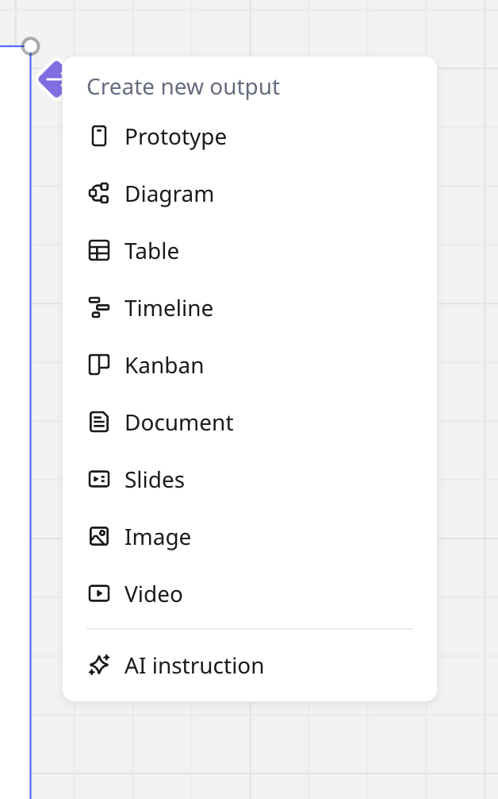
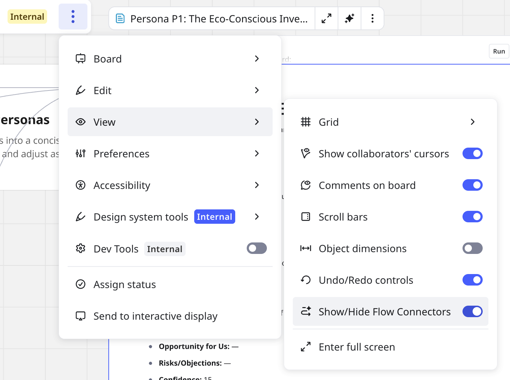
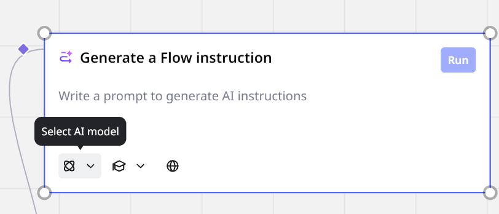
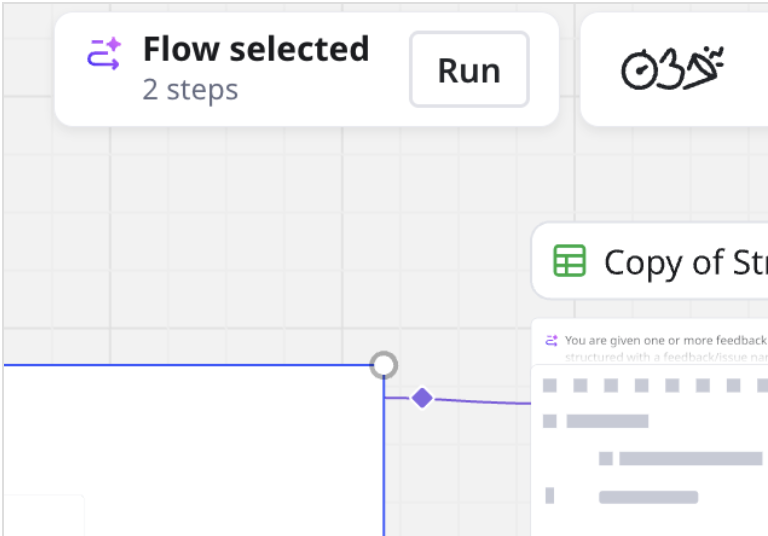

Flows enable you to chain Formats on the canvas to build AI-powered workflows. Each Format acts as input for the next, turning complex, multi-step processes, like sprint planning, writing briefs, or leveraging customer data, into automated Flows.

To learn which Formats support Flows, see [Supported Formats](#supported-formats).

This article explains how to use Flows. For general information about Flows, see [Flows overview](04-flows-overview.md).

:::tip
Get readymade Flows templates in the [Template picker](../../getting-started/start-here/your-first-board/04-templates.md).
:::

## Create and run a Flow

The following procedure uses basic Flows UX elements to create a Flow from scratch. To ensure you can start creating Flows faster, see [Flows UX elements](#flows-ux-elements).

Follow these steps:

1. Add a [supported Format](#supported-formats) or [AI Instruction](#ai-instruction-block) block to the canvas.
2. (Optional) Connect any existing Format or instruction block to the Format you just added. Use the diamond AI connectors to connect your Flow.
3. Above the Format, click the **TASK** bar.
   A **TASK** bar expands into a box where you can specify your prompt for that position in your Flow.
4. In the **TASK** box, add your prompt. For example, in a Doc you can generate a Product Requirements Document (PRD). You can use output from any connected Format or AI instruction block.

   > 💡 The **TASK** box enables you to select a large-language model (LLM), knowledge provider, or web search. In the bottom-left, select an AI model, knowledge base, or search the web. Options vary depending on the Format.
5. (Optional) To create new output, on the right click the diamond AI connector.
   The **Create new output** menu opens.
6. (Optional) To create a new input, on the left click the diamond Miro AI connector.
   The **Create new input** menu opens.
7. To complete your Flow, repeat steps 1-6 for as needed.
8. To run your Flow, in the **TASK** bar click **Run**.
   *The **Flow selected** context menu shows you how many steps the Flow includes.*

## Use Knowledge with Flows

Knowledge integrates with providers like Glean, web search, and Miro Insights, to retrieve everything your company knows, using internal and external sources.

For any Format in your Flow, click the **TASK** bar. The **TASK** bar expands. On the bottom-left select, and connect, your knowledge base.

 *Specify an internal knowledge base for your Flow*

You can convert data from your own knowledge resources into Formats like Docs, Tables, Sticky notes, and Slides. Then connect each Format to use your data as input or output a Flow.

**More information:** See [Knowledge](09-knowledge.md).

## Revert output in a Flow

You can revert output for any Format in your Flow. For example, you run a Flow accidentally and overwrite a Doc.

To revert a Format in your Flow to an earlier state, click the Format **TASK** bar. The **TASK** bar expands. On the bottom-right, click the counter-clockwise icon. Select any version in the last 24 hours to restore.

 *The Revert feature enables you to restore any version of your Format from the last 24 hours.*

## Flows UX elements

Understanding the following Flows UX elements will help you start creating Flows faster.

### Miro AI connector

[Supported Formats](#supported-formats) and Instruction Blocks have a diamond Miro AI connector on the left that enables you to connect input, and on the right which connects output.

Click the Miro AI connector on either side to open the **Create new input** or **Create new output** menus.

*Click the Miro AI connector to open the input and output menus.*

:::tip
You can also drag the Miro AI connector to existing content.
:::

### Intelligent connector highlighting

Click any object in your Flow to see only those connections highlighted.

### Hide Flow connectors

For complex Flows with many connections, you can hide all Flow connectors to simplify your view.

In the [Board](../working-on-the-board/02-miro's-new-simplified-user-interface.md) bar, click the vertical three-dots. Then select **View**. Toggle **Show/Hide Flow Connectors** to the off position. To show all Flow connectors, toggle to the on position.

 *Show or hide all Flow connectors on your board.*

:::note
**Show/Hide Flow Connectors** impact your board view only. Collaborators can adjust their own toggle.
:::

### On-Format prompt

You can prompt any Format or instruction block in your Flow, which ensures that each Format in the chain can perform a specialized Flow task.

Click the **TASK** bar above any Format in your Flow. The **TASK** bar expands. Add your prompt and describe how you want the Format to read input content, or any content on the board, and specify rules and output for the next Format in your Flow.

 *The on-Format prompt box appears in the **TASK** bar above each Format in your Flow.*

### AI Instruction block

You can select a large-language model (LLM), or any available [knowledge](09-knowledge.md) provider, to run a prompt in a standalone block, anywhere in your Flow.

For a given Format, click the diamond Miro AI connector. From the input or output menu, select **AI** **Instruction**.

 *Instruction Blocks enable you to chain instructions, accept input, and pass output to the next Format.*

### Global run button

You can start your run from any Format or AI instruction block in your Flow. Click to select the Format or block. The **Flow selected** context menu appears next to the Collaboration bar.

 *The Flow selected context menu*

The **Flow selected** menu shows how many steps remain to be executed. To run the Flow, click **Run**.

## Supported Formats

Flows support the following Miro Formats.

- Diagrams
- Docs
- Images
- Embed iFrame Code
- Kanban
- Prototypes
- Slides
- Tables
- Timeline
