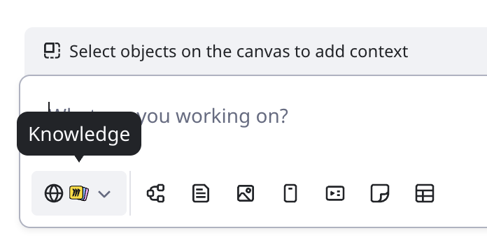

Knowledge in Miro integrates with providers like Glean, Microsoft Copilot (Beta), and Miro Insights, to make your company's knowledge accessible and actionable directly on the canvas.

Knowledge enables teams to retrieve internal information and web-search results seamlessly, and use the Miro canvas as their prompt for faster development.

[Connect knowledge systems](#use-knowledge-to-retrieve-company-info) you already use, then easily convert what your company knows into Formats like Docs, Tables, Sticky notes, and Slides.

Knowledge supports the following integrations, including web search.

- [Amazon Q](../../integrations-apps/amazon-web-services-aws/03-amazon-q-beta.md) (Beta)
- [Gemini Enterprise](../../integrations-apps/google/01-gemini-enterprise-integration.md)
- [Glean](../../integrations-apps/glean/01-glean-for-miro.md)
- [Microsoft Copilot](../../integrations-apps/microsoft/01-microsoft-copilot-integration.md)
- [Miro Insights](../tools/use-miro-insights/02-use-miro-insights-on-the-canvas.md)

Company admins must enable and approve each integration for their teams.

:::note
Some integrations like Microsoft Copilot and Gemini Enterprise require paid licenses with the respective provider.
:::

To learn more about specific Knowledge integrations, see [Integrations & Apps](../../integrations-apps).

## Key features

- **Knowledge integrations**
  Knowledge connects Miro to leading providers like [Glean](../../integrations-apps/glean/01-glean-for-miro.md), [Microsoft Copilot](../../integrations-apps/microsoft/01-microsoft-copilot-integration.md) (Beta), [Amazon Q](../../integrations-apps/amazon-web-services-aws/03-amazon-q-beta.md) (Beta), and Miro Insights, which enables you to retrieve and apply your company's knowledge directly to the canvas.
- **Enterprise knowledge as prompt**
  Use retrieved knowledge as context to prompt [Miro AI](01-miro-ai-overview.md) and advance from ideation to creation faster.
- **Multiple access points**
  Knowledge is available at several entry points in Miro, like [Sidekicks](07-sidekicks.md) and [Flows](04-flows-overview.md), ensuring you specify the most relevant content for a given stage in your workflow.

:::note
Admins can manage Knowledge and Miro AI permissions, web search capabilities, and Format creation to ensure compliance with their organization's policies.
:::

## Use Knowledge to retrieve company info

Access Knowledge at any of the following entry points.

:::note
When you connect a knowledge provide for the first time, you are asked to authenticate.
:::

- [**Sidekicks**](06-sidekicks-overview.md)
  Above the Creation bar, click **Sidekicks**. The **Sidekick** panel opens. In the prompt box, click **Knowledge**. Connect or toggle a knowledge provider to the on position.
  *In the Sidekick panel, select a knowledge provider to retrieve company knowledge in Miro.*
  Write your Sidekick prompt. You can optionally select objects on the canvas to add context. When you execute your prompt, Knowledge leverages the provider(s) you have selected.

  > 💡 Use Knowledge to create specialized Sidekicks that assist you with tasks on the canvas as custom AI agents.
- [**Docs**](04-flows-overview.md) **in Flows**
  From the Doc context menu, click **Edit with AI**. The **Sidekick** panel opens. In the prompt box, click **Knowledge**. Connect or select a knowledge provider. When you execute your prompt, Knowledge leverages the provider you selected.
- [**AI Instruction block**](05-flows.md) **in Flows**
  In an AI Instruction block, click **Select knowledge base.** Connect or select a Knowledge provider. When you execute your AI instruction, Knowledge leverages the provider you have selected.
- **Standalone chat**
  You can access Knowledge resources in the Miro standalone chat app.
  - Above the Creation bar, click **Sidekicks**. The **Sidekick** panel opens. Above **Hey \{Your name\}**, click the down caret, then click **Explore more Sidekicks**. Click the **Knowledge** tab.
  - In the Creation bar, select **Tools, Media and Integrations**. Search and select your Knowledge provider. For example, **Gemini**.The chat panel opens.
