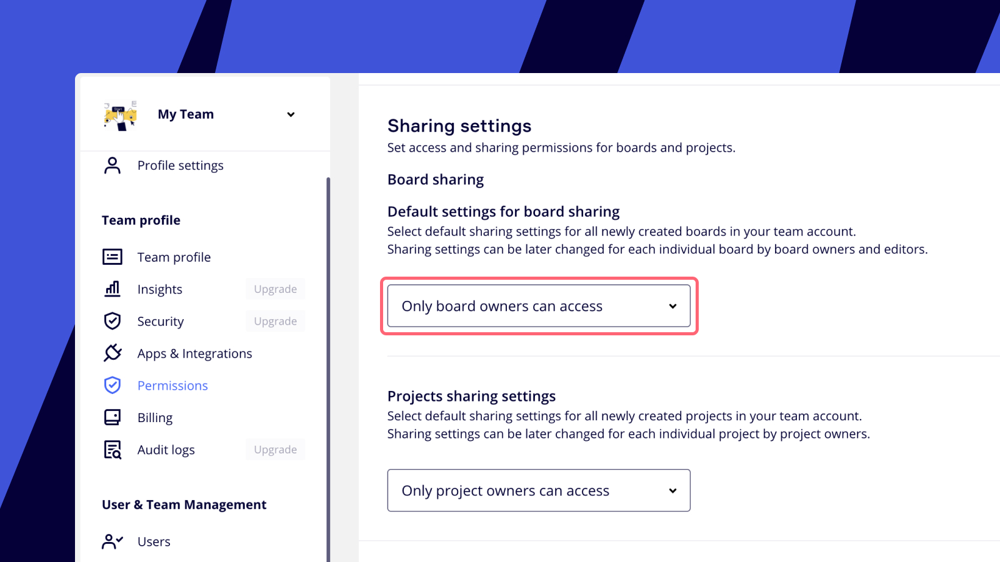
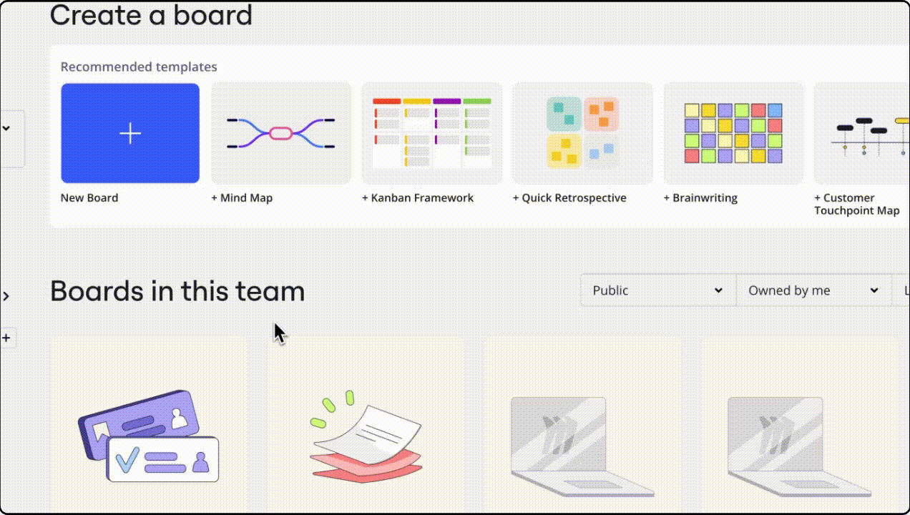
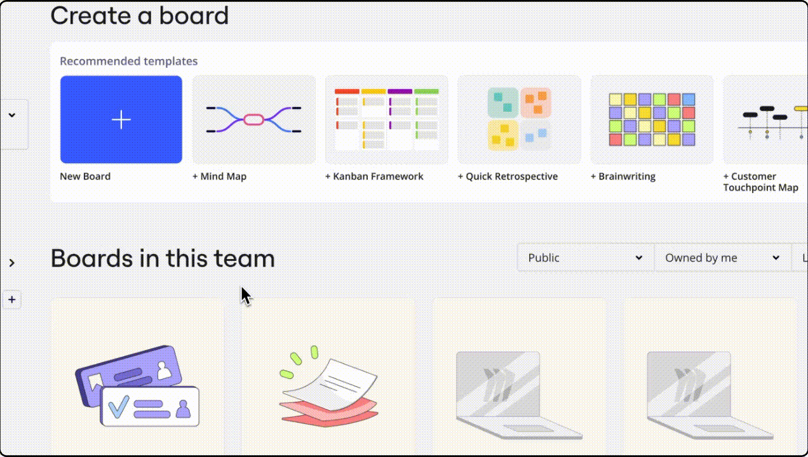

If you're starting an individual project or want to work on a board before sharing it with your team, you can create a private Miro board or make an existing shared board private.

## Understanding private boards

Private boards are boards that are not shared with anyone and are only accessible by the board owner. This feature is available on the Starter, Education, Business, and Enterprise plans.

On the Free plan, all boards created within a team are visible to all team members. You can see who is on your team in your [Team settings](../../administration/get-started-as-a-miro-admin/01-i-am-a-new-miro-admin.-where-to-start.md) on the **Active users** tab. If you want a private board on a Free plan, you must be the only member of that team.

## Manage board privacy

You can create a new board with private access from the start or change the settings of an existing board to make it private.

### Create a new private board

To ensure a new board is private from the moment of its creation, follow these steps.

1. **For Admins: Set default sharing settings (optional).** If you are a Team or Company Admin on a Starter, Business, Enterprise, or Education plan, you can set all new boards to be private by default.
   1. Go to **Team settings** > **Permissions** > **Sharing settings**.
   2. Under **Default settings for board sharing**, choose **Only board owner can access**.
      
      *Default sharing settings*
2. **Check the board's location.** Before creating your board, make sure you are in the **Boards in this team** section of your dashboard. If you create a board within a shared [space](../spaces/01-spaces.md), the board will automatically be shared with all members of that space.
   > ✏️ If you have a private space that is not shared with anyone, you can safely create your board there.
3. **Confirm privacy settings.** After creating your board, open the **Share** dialog. Here you can verify if the board is [shared with your team](03-sharing-boards-and-inviting-collaborators.md). If it is, set the team's access level to **No Access**.
   
   *Removing team access to a board*

### Make a shared board private

To make an existing board private on a Starter, Business, Enterprise, or Education plan, you must remove access for all collaborators. Open the **Share** dialog and stop sharing the board at every level:

- Set team access to **No access**.
- (On Enterprise) Set Company access to **No access**.
- Disable any public link (set to **No access**).
- If the board is in a space, move it out or unshare the space.
- Remove all individual users listed under **Sharing settings** until only you (the owner) remain.

:::note
If you are **not** the board owner but need to make a board private, you must [invite your own email address](03-sharing-boards-and-inviting-collaborators.md#inviting-via-email) to the board before removing team, space, or company access. If you fail to do this, you will lose access to the board as soon as you change the sharing settings.
:::

*Setting a shared Miro board to private*

You can always [check who has access to your board](05-who-has-access-to-my-board.md) in the **Share** window.

## FAQ

Why did my boards become locked after downgrading to the Free plan?

The Free plan doesn't allow private boards. Please share the board with your team to unlock it. More information is in this article: [The board is locked](../tools/troubleshooting/15-the-board-is-locked.md).

I have seen the option to upgrade to make my board private. Is my board public by default?

On the Free plan, it is shared with the entire team by default. It only relates to your boards being "shared with the team" within your Free team.

Can my public boards be found online?

Miro strives to keep public boards from being indexed by search engines like Google or Bing. However, anyone with the link can access these boards, and the link might be shared beyond your intended audience. Depending on your Miro plan, you can enhance security by [setting a password](13-password-protection-for-public-boards.md) for your public board.

I am a member of a free team and of a paid team. Can I move my boards from the free team to the paid one to make them private?

Yes, you can [move your Miro boards](../managing-boards/04-how-to-move-a-board.md).

Can my public boards be duplicated?

Yes, if this is allowed in your [board content settings](14-how-to-allow-or-restrict-copying-and-exporting-boards-and-content.md).

When I share a board publicly, do I need to pay for users who will access the board via the board link?

No, visitors will be able to access the board for free. Learn how you can [share your boards publicly](08-collaboration-with-visitors.md).
