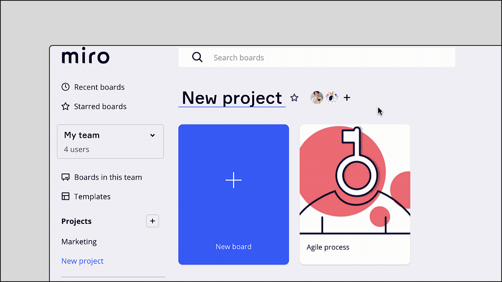
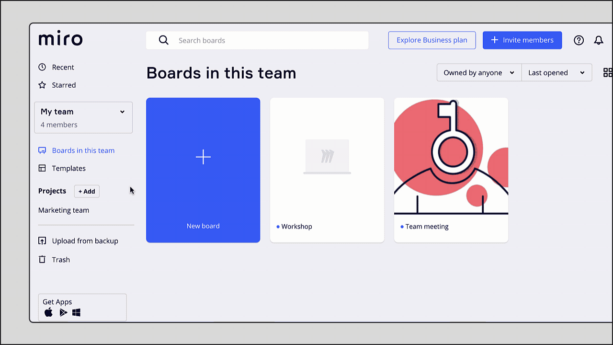

A project is a collection of boards within a team. Projects make it easier to organize, find, and share your boards.

> 🚀  Publish your project templates on [Miroverse](https://miro.com/miroverse/submission/?backToUrl=/) and inspire organized teamwork for over 60 million users.

<iframe allowfullscreen="" frameborder="0" height="315" src="//fast.wistia.com/embed/iframe/clvhobou8c" width="560"></iframe>

*Teams, projects, and boards in Miro*

## Where to find your projects

All your projects are listed alphabetically in the left-hand navigation of your dashboard. You can click on the project name to open the project settings and see its details and participants.

### Project settings

1. On the left sidebar, go to **Projects**.
2. Click the project name.
3. At the top of the project dashboard, click the project name again.
4. The project settings will open.

*Opening a project in Miro to see its details*

## How to star important projects

Star your ongoing or frequently used projects for easier access. When you click the star on a project for the first time, a new **Starred projects** section appears on your left sidebar. You can expand and collapse **Starred projects** to manage your dashboard.

To star a project, click the **star** icon next to the project name.

*Starring a project*

## How to create a project

1. On the left sidebar, go to **Projects**.
2. Click the **+ Add** () button.
3. The project dialogue box will open.
4. Type the **Project name**.
5. Click **Create** **project**.
6. You can then [Add boards](#how-to-add-boards-to-a-project) and [Add members](#how-to-add-members-to-a-project).

*Creating a new project*

## How to add boards to a project

1. Open the [project settings](#project-settings).
2. Click **Add boards**.
3. Scroll or search to find and select boards to add to the project.
4. Click **Move boards**.

*The option to add boards to a project in the project settings*

## Sharing projects

### Sharing a project with a team member

> **Who can do it:** Project owners, project co-owners, editors

To share a project with a team member, you can [add them to the project](#how-to-add-members-to-a-project). Depending on their level of collaboration, you can set their access to [Can view, Can comment, or Can edit](../../getting-started/start-here/05-roles-in-miro.md). The access you choose will apply to all boards in the project.

### Sharing a project with the whole team

> **Who can do it:** Project owners, project co-owners

1. Open the project settings.
2. Toggle on **Anyone in your team can view this project**.

:::note
Team Admins can configure [default sharing settings](11-default-sharing-settings.md) for new projects.
:::

*Sharing a project with the whole team*

### Sharing a board within a project

You can change a project member's access level via the board **Share** dialog. For example, a project member with comment access may be invited as an Editor to a specific board in the project. **The highest level of access granted will always apply,** whether sharing a project, or a board within a project.

You can share a board with users outside your team or project by inviting them as a board [Visitor](08-collaboration-with-visitors.md) or [Guest](07-collaboration-with-guests.md).

### Private projects

To make sure a project is private in Miro, do not add members, check that [team access](#sharing-a-project-with-the-whole-team) is toggled off, and adjust your team and company share settings to **No access** for all boards within the project.

**The highest level of access granted will always apply,** whether sharing a project, or a board within a project. For example:

- if a board is located in a private project but is shared with the entire team*,* all team members will have access.
- if a board is not shared with anyone explicitly but is stored in a project shared with the team, all team members will have access.

Learn more in [public vs private boards](12-public-boards-vs.-private-boards.md).

## Adding and managing project members

:::note
Only team members can be invited as project members.
:::

Project members can:

- access all boards within the project, including any exiting boards and any new boards either added or created
- create new boards within the project
- add existing boards to the project
- be notified of all changes for all boards within a project

### How to add members to a project

> **Who can do it:** Project owners, project co-owners, editors

1. Open the [project settings](#project-settings).
2. Click **Add members**.
3. Scroll or search to find and select team members to add.
4. You can choose to **Notify members** when they’ve been added to the project.
5. Click **Add**.

*Adding members to a project*

### How to change user access levels

1. Open the project settings
2. Open the access level dropdown next to the user’s name
3. Choose the access level (**Is co-owner**, **Can edit**, **Can comment** or **Can view**)

*Changing a user's access level to a project*

### How to remove a project member

:::warning
After removing a project member they may still have access to the project via [email invitations](03-sharing-boards-and-inviting-collaborators.md#inviting-via-email) or through [team, company, or public link access](03-sharing-boards-and-inviting-collaborators.md#sharing-boards-via-a-public-link) .
:::

1. Open the project settings
2. Open the access level dropdown next to the user’s name
3. Choose **Remove**

*Removing a user from a project*

### How to change the project owner

> **Who can do it:** Project owner, project co-owner

:::note
When you transfer project ownership to another user, it doesn’t change the owner of individual boards within the project.
:::

1. Open the project settings
2. Open the access level dropdown next to the user’s name
3. Choose **Is owner**

*Granting project owner access*

## How to move boards to a project

> **Who can do it:** Project owner, project co-owner, editor

:::note
When moving a board to a project the board link does not change.
:::

**From the board information card:**

1. In the top-left board header, click the board name
2. The board information card will open
3. Next to **Location**, click the **project name** (or **no project**)
4. From the dropdown select a project to move the board to
5. Click **Move**

***Moving a board to a project from the board information card*

**From the dashboard:**

1. Hover over the board you wish to move
2. Click the three dots (**...**) to open the board menu
3. Select **Move to project**
4. From the dropdown, select a project to move the board to
5. Click **Move**

*Moving a board to a project from the board information card*

## How to create a new board in a project

1. On the left sidebar, go to **Projects**
2. Click the project name
3. Within the project dashboard, click + **New board**

*Creating a new board within a project*

## How to remove a board from a project

1. In the top-right board header, click the board name
2. The board information card will open
3. Next to **Location**, click the project name
4. From from the project dropdown, choose **None**

***Removing a board from a project*

## How to leave or delete a project

> **Who can do it:** Project owner

:::note
Deleting a project does not delete any boards in that project.
:::

1. Open the project settings
2. Choose **Delete project**

All other project members who are *not* project owners will see the option **Leave project.** If the project is [shared with everyone in the team](#sharing-a-project-with-the-whole-team) users will not have the option to leave or delete a project.

After leaving or deleting a project, users will still have access to any boards within that project shared with them [via email](03-sharing-boards-and-inviting-collaborators.md#inviting-via-email) or [team access](03-sharing-boards-and-inviting-collaborators.md).

*Deleting a project*

## How to duplicate a project

While you cannot duplicate a project, you can [duplicate boards](../managing-boards/03-how-to-duplicate-a-board.md) in a project, then create a new project and move the board copies to the new project.

:::warning
If you downgrade to Free Plan, you can no longer create a new project, or edit or delete your existing projects.
:::

## Frequently asked questions

**How can I organize my projects?**

We do not currently support the option to archive projects, create links to projects, create projects inside projects, or to change the order of projects and boards. However, we recommend managing the organization of current and ongoing projects using starred projects.
