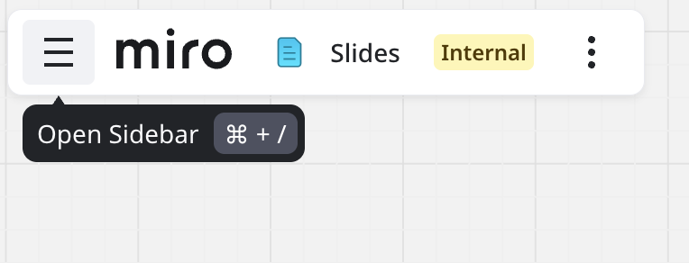
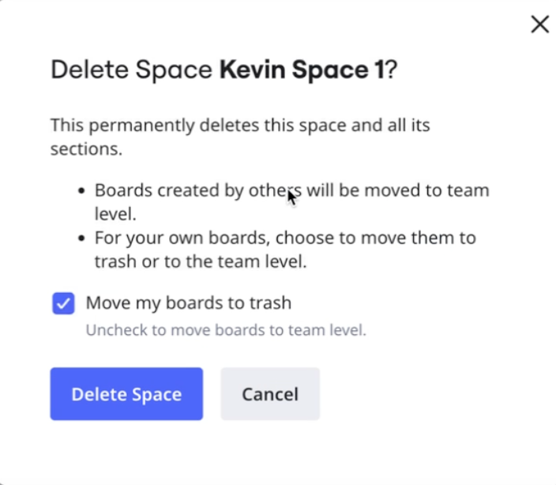

To enable users to manage work across multiple boards and find content more easily, Miro introduces Spaces—the refreshed experience for content management in Miro.

Spaces reimagines the dashboard and sidebar to enable contextual and hierarchical content management.

:::note
Spaces replaces projects as the principal way teams organize their Miro content. All existing projects are automatically converted into Spaces.
:::

Each Miro organization can have multiple teams and a team can have multiple Spaces—a Space for each business context that it wants to represent in the Miro innovation workspace.

You can [create your own Space](#how-to-create-a-space), or choose a Space template, called a [Blueprint](04-blueprints-beta.md).

:::tip
For general information, see the [FAQ](#faq).
:::

## Key features

- **Spaces**
  Organize your content according to specific business goals.
- **Sections**
  Create sections in your Space to further organize your content.
- **Reorder boards and sections**
  Drag and drop a section or other content to change the order inside a Space.
- **Focused sidebar**
  Enables quick and efficient navigation between all content inside a Space.
- **Pinned Spaces**
  Pin your favorite Spaces to the sidebar for quick access.
- **Share Spaces**
  Share with key team members. Control access to your Space with the same process and parameters as you did for projects.
- **Space Overview**
  Sets a board as your Space Overview, which enables you to surface context and clarity for content inside the Space. You can also create a custom [Dashboard](03-space-overview-dashboard-beta.md).

**More information:**

- [Spaces guide](#spaces-guide)
- [Space Overview](02-space-overview.md)
- [FAQ](#faq)

## Spaces guide

The home dashboard is simplified, and enables you to sort and filter all boards in the team, including boards that are not in any Space.

*Home dashboard with Spaces*

To create a new Space or Miro board, import content, or explore templates and the Miroverse, select the **Create new** button.

You can also choose a Space template, called a [Blueprint](04-blueprints-beta.md).

:::note
When you create a board from the template strip, the board does not belong to a space. To learn how to move a board into a Space, see [How to move boards between Spaces](#how-to-move-boards-between-spaces)**.**
:::

:::tip
From the Spaces dashboard, you can switch between Miro teams. Select your team name in the upper-left corner to access the team picker.
:::

### Boards not in a Space

Prior to Spaces, you may have had some Miro boards that were not included in any project, which means that currently no Space includes these boards.

To locate a board that is not in a Space, in the **Home** area set **Filter by:** to **Boards not in a Space**. The home dashboard updates to show all boards not in a Space.

### Spaces sidebar

When you open a board inside a Space, the sidebar shows other content in the Space. You can also [create new sections](#how-to-create-sections-inside-spaces).

:::note
If you access a board via link, the sidebar is closed by default.
:::

To access the Spaces sidebar, open a board inside a Space. If the sidebar is collapsed, then in the [Board bar](../working-on-the-board/02-miro's-new-simplified-user-interface.md) click the **Open Sidebar** hamburger menu.

*On your Miro board, the Board bar includes the **Open Sidebar** hamburger menu.*

In the Spaces sidebar, you can open the **Create new** (**+**) menu, which enables you to create a new board inside the Space, [create a new section](#how-to-create-sections-inside-spaces), move boards to the Space, import, and explore templates and Miroverse.

:::tip
From the **Create new** (**+**) menu**,** select a Format like Docs or Slides to create a new board with your selection in Focus mode.
:::

If you access a board not in a Space, then the sidebar shows **Recent**, which lists recently visited content grouped by time frame.

To search and filter content in the sidebar, whether in a Space or under **Recent**, select the magnifying glass in the top-right of the sidebar.

To close the sidebar, select the **X** in the top-right corner.

### Pinned Spaces

In the sidebar, **Pinned Spaces** enables fast access to your favorite spaces. To pin a Space, hover over a Space, and select the pin icon.

:::note
Your previously starred projects are now pinned Spaces.
:::

### Spaces options

To access the Spaces **Options** menu, open a Space and select the three dots (...) in the top-right corner.

The Spaces **Options** menu enables you to select the following actions:

- **Copy Space link**
  Copy a link to your Space instantly and share.
- **Share**
  Invite team members to share access to your Space, and assign roles. You can also set **No access** or **Can view** for all other members in your team.
- **Rename**
  Rename your Space.
- **Delete**
  Delete your Space.

:::tip
You can also select the three dots (**...**) for a Space in the sidebar to access the Spaces **Options** menu.
:::

### Roles in Spaces

A role specifies which privileges a user has for existing and newly created boards inside the Space. You can use roles to configure access to your Space at any time.

:::note
All existing permissions for your projects are carried over to Spaces.
:::

You can have one of the following Space roles:

- **Owner**
  Can edit and delete the Space, add and remove boards, set visibility for the entire team, assign Space-level and board-level roles, and transfer ownership to another user. A Space owner is automatically an Editor for all content inside the Space.
- **Co-owner**
  Can update Space-level the role for a given user, and assign Space-level roles. A Space co-owner is automatically an Editor for all content inside the Space.
- **Editor**
  Can edit any board in the Space, and assign board-level roles.
- **Commenter**
  Can comment on any board in the Space.
- **Viewer**
  Can view any board in the Space.

A user may already have a board-level role specified for a given board. If they receive a higher Space-level role, the higher role takes priority for all boards inside the Space. If the member loses their Space-level role, they retain their original board-level role.

**More information:** See [Roles in Miro](../../getting-started/start-here/05-roles-in-miro.md).

### How to create a Space

You can quickly create a new Space for your team.

:::tip
You can also choose a Space template, called a [Blueprint](04-blueprints-beta.md).
:::

Follow these steps:

1. Choose one of the following:
   - In the **Home** dashboard, in the upper right, select **+ Create new**. Then select **Space**.
   - In the sidebar next to **Other spaces**, select the plus (**+**) sign.
     The **New space** modal opens.
2. Name your new Space.
   Max: 60 characters.
3. Select **Create Space**.
   The **Invite to &lt;Name&gt;** modal opens.
4. Do one of the following:
   - Use search to locate and select a team member by email address.

     > 💡 You can select multiple team members.
   - Click **the team** in the search bar to select individual or all team members, then select **Choose**.
5. Select **Add to Space**.
6. Select the permissions you want to grant.

   > ✏️ The permissions you grant apply to all Miro boards inside the Space. To learn more, see [FAQ](#faq).
7. Select **Done**.
   You have successfully created a Space.

### How to share a Space

As a Space owner and co-owner, you can share a given Space with members of your team, and assign roles.

Follow these steps:

1. Open the Space [**Options** menu](#spaces-options).
2. Select **Share**.
   The **Invite to &lt;Name's&gt; Space** modal opens.
3. Do one of the following:
   - Use search to locate a team member by email address, then select the team member.

     > 💡 You can search and select multiple team members.
   - Click **the team** in the search bar to select individual or all team members, then select **Choose**.
4. Select the permissions you want to grant.

   > ✏️ The role and permissions you grant apply to all boards inside the Space. To learn more, see [FAQ](#faq).
5. (Optional) Add a custom message.
6. Select **Send invitations**.

   You have successfully shared a Space with your team or team member(s).

### How to change Space access for an entire team

You can update whether your entire team can access your Space.

:::note
Permissions for members that you individually invite are [managed separately](#how-to-manage-access-to-a-space).
:::

Follow these steps:

1. Open the Space [**Options** menu](#spaces-options).
2. Select **Share**.
3. For a team under **SPACE ACCESS**, specify one of the following options:
   - **Can view**
     All team members can view your Space and any board inside the Space.
   - **Can comment**
     All team members can comment on any board inside the Space. Includes view.
   - **Can edit**
     All team members can edit your Space and any board inside the Space. Includes view and comment.
   - **No access**
     No team members besides any you individually invite can access your Space.

     You have successfully changed Space access for your entire team.

### How to manage access to a Space

As a Space owner or co-owner, you can manage access to a given Space and assign roles.

You can manage access and permissions for individual team members, and manage access for everyone else in the team.

Follow these steps:

1. Open the Space [**Options** menu](#spaces-options).
2. Select **Share**.
3. Under **SPACE ACCESS**, select **Manage access**.
   The **Manage people access** view opens.
4. Modify permissions for invited team members.

   > 💡 To add team members, select **Add people**.
5. To confirm your changes, select **Done**.
   You return to the start of the modal.
6. (Optional) Under **SPACE ACCESS**, specify access for everyone else in the team.

   You have successfully managed access to a Space.

**More information:** See [Roles in Spaces](#roles-in-spaces).

### How to create sections inside Spaces

To organize to your content, you can optionally create sections inside your Space.

Sections appear only in the [Spaces sidebar](#spaces-sidebar). You must open a board inside your Space to view and manage sections.

Follow these steps:

1. In the [Spaces sidebar](#spaces-sidebar), select **Create new** (**+**).
2. Select **Add section**.
   An untitled section is added to the sidebar.
3. Name your new section, and press **Enter**.

   You have successfully created a section.

In the Spaces sidebar, you can now drag and drop content to your new section. For a given board, you can also select the three dots (**...**) to open the **Options** context menu, and select **Move to section**.

To rename or delete a section, select the three dots (**...**) for the section you want to modify, and select **Rename** or **Delete**.

:::note
Space members with Editor access or higher can create, rename, and delete sections, and move boards to another section. Content admins can manage any section inside a Space where they are member.
:::

### How to reorder content and sections inside a Space

You can change the order of sections and content inside a Space.

By default, Miro orders all content and sections inside a space by creation time in descending order. The latest content is on top.

To reorder content inside a Space, in the Spaces sidebar drag-and-drop your selection up or down. You can select any section, or any content inside a section.

:::tip
To move a section, you can also access the context menu. Select the three dots (**...**), and select **Move up** or **Move down**.
:::

### How to set a Space Overview

You can designate any board inside your Space as the Space Overview, which provides a default point of entry for anyone who access the Space.

To learn how to set a Space Overview, see [Space Overview](02-space-overview.md). You can also create a unique [Dashboard](03-space-overview-dashboard-beta.md) for your Space Overview.

### How to move boards between Spaces

You can move your Miro board from Space to Space.

:::tip
The following procedure also applies for boards not in any Space.
:::

Follow these steps:

1. From the board bar in the top-left of your Miro board, select the three vertical dots.
   The **Main menu** opens.
    *Move board to another space*
2. Select **Board** > **Move to** > **Other Space**.
   The **Move board to Space** modal opens.
3. Select a Space from the list in the drop-down menu.

   > ✏️ Only Spaces where you have edit rights are shown.
4. (Optional) Select **Notify members** to send an email to all members in your target Space.
5. Select **Move**.
   You have successfully moved your board to another Space.

Alternatively, you can move your board to another space from the sidebar.

Follow these steps:

1. In the board sidebar, hover over the board you want to move, and select the three dots (**...**) to access the context menu.
    *From the board sidebar, move board to another Space*
2. Select **Move to Space**.
   The **Move board to Space** modal opens.
3. Select a Space from the list in the drop-down menu.

   > ✏️ Only Spaces where you have edit rights are shown.
4. (Optional) Select **Notify members** to send an email to all members in your target Space.
5. Select **Move**.
   You have successfully moved your board to another Space.

### How to bulk move boards between Spaces

You can bulk move boards from Space to Space.

Follow these steps:

1. In the dashboard sidebar, select the cross (**+**) to open the **Create new** menu.
2. Select **Move boards here**.
   The **Move boards to &lt;Space name&gt;** modal appears.
3. (Optional) To locate only boards that you own, select **Only search boards owned by me**.
4. Select boards—or use the search to locate and select boards—that you want to move to your Space.
5. (Optional) Select **Notify members**.
6. Select **Move boards**.
   You have successfully bulk moved Miro boards from one Space to another.

:::tip
You can also bulk move boards from the Space Settings menu. In the Space Settings menu, select Add boards.
:::

### How to delete a Space

As Space owner, you can delete your Space. Boards inside your Space that were created by other team members are moved to the team level.

You can choose whether to move the boards that you own to the team level, or move them to the trash.

*Space owners can choose to retain boards they own at the team level, or trash them.*

Follow these steps:

1. In [Spaces options](#spaces-options), click **Delete**.
   The delete Space modal opens. **Move boards to trash** is selected by default.
2. (Optional) To keep boards that you own at the team level, deselect **Move boards to trash**.
3. Click **Delete Space**.
   Your Space is deleted. Boards created by other team members are moved to the team level. If you skipped step 2, then your own boards are moved to trash.

## Conclusion

Spaces more than replaces projects. Spaces radically transforms how you manage content in Miro. Especially for an organization with hundreds of users, and potentially thousands of Miro boards, Spaces simplifies content discovery and management.

Indeed, Spaces advances the Miro workspace experience as a world class innovation platform.

**More information:** See [FAQ](#faq).

## FAQ

**What happened to projects?**

Your projects are migrated to Spaces automatically. Content creation, permissions, and sharing all work the same.

**What about boards that were not in a project? Where are they now?**

To find boards not in a Space, from the **Home** dashboard, filter by **Boards not in a Space**. Boards that were not in a project are not included in a Space.

**What about my starred projects?**

Projects that you had starred are now pinned Spaces.

**Does Spaces use the same roles and permissions as projects?**

Spaces enhances the existing Miro board administration. Permissions set for projects carry over to Spaces. The Content Admin, project admin—now Space admin—and access roles are unchanged.

**What happens if I get a link to a board that previously belonged to a project?**

The link directs you to the board, now inside the converted Space. The Spaces launch converts each project into a Space. All board permissions previously set still apply.

**I want to migrate projects to my Enterprise account. Is it safe?**

Yes, it's safe. Your projects will become Spaces.

**What if a user has higher board permissions than Space permissions?**

The user gets the highest-level role. For example, if the user has only Comment permissions for a Space, and has Editor permissions for a board in that Space, then the user retains Editor permissions for that board. Conversely, if the user has View access to a board inside a Space, and Editor access to that Space, then the user has Editor access to that board.

**Who can see boards in my Space?**

Any board you have in a Space is visible to any user with access to the Space.

**What content permissions does an Owner or Co-owner have inside a Space?**

A Space Owner or Co-owner has Editor privileges to all child content inside a Space.

**Where can I learn more about all the other simplified UI changes?**

To learn more about Miro’s enhancements to the board UI, see [Miro’s new simplified user interface](../working-on-the-board/02-miro's-new-simplified-user-interface.md).
