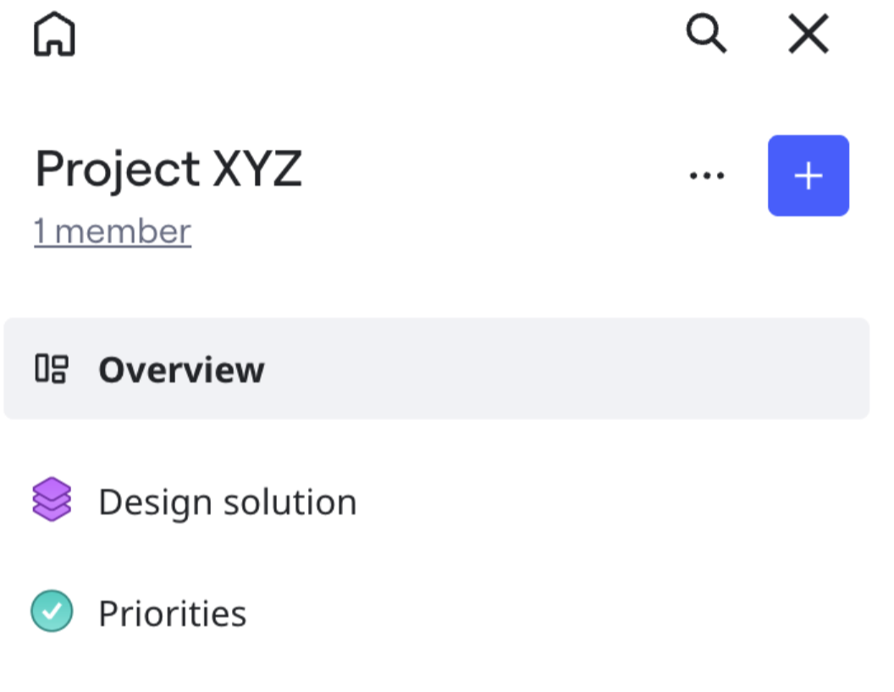
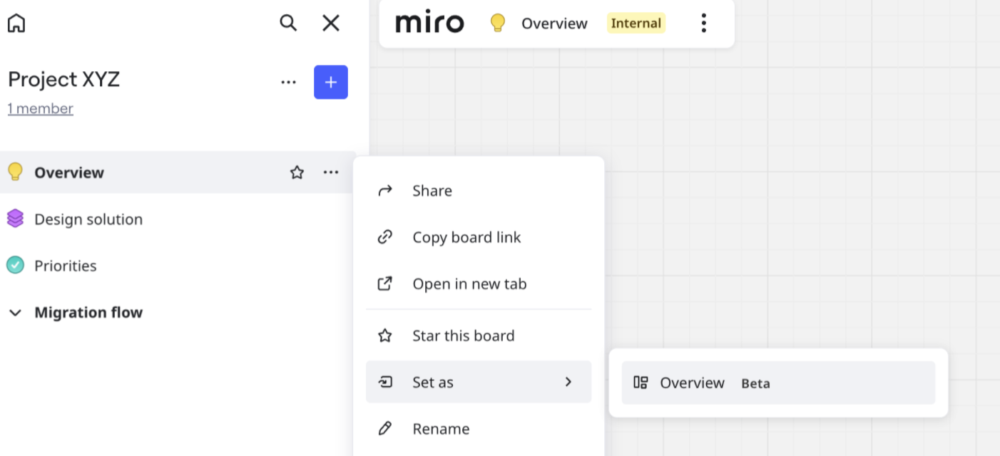

In a Space, you can designate any board to act as the Space Overview. That board becomes the default point of entry for anyone who accesses the Space, giving context and clarity. The Space Overview ensures teams stay aligned, and transforms your Space into an intelligent and dynamic workspace.

This article describes the Space Overview feature, and how to create a Space Overview. To learn more about Spaces, see [Spaces](01-spaces.md).

*Access the Space Overview in the Space sidebar.*

## Key features

- **Enhanced organization**
  Use a Space Overview as a centralized hub for all Space activity and resources. You can regularly update the Space Overview for stakeholders.
- **Visibility**
  A Space Overview is visible to all Space members, and accessible at the top of the Space sidebar. The Overview is an essential point of reference during and between meetings.
- **Improved team communication and alignment**
  Link to specific boards, decisions, and resources inside the Space.

## Create a Space Overview

1. Open a Space where you are Owner or Co-owner.
   The Space view opens.
2. For the board that you want to set as Space Overview, click the three dots (**...**).
3. Click **Set as** > **Overview**.
   The Space Overview board retains its name and sets at the top of the Space sidebar.

:::tip
You can also open a board inside your Space, then in the Space sidebar click the three-dots (**...**) for the board you want to designate as Space Overview.
:::

*You can optionally set a board as the Space Overview from the Space sidebar.*

## Remove a Space Overview

1. Open the Space where you are Owner or Co-owner.
2. In the Space sidebar, for the **Overview** click the three-dots (**...**).
3. Click **Remove from overview**.
   The removed Space Overview returns to the Space level and the icon reverts to the original.

:::note
If a Space Overview board is trashed or moved outside the Space, then the board is automatically removed as the Space Overview.
:::
