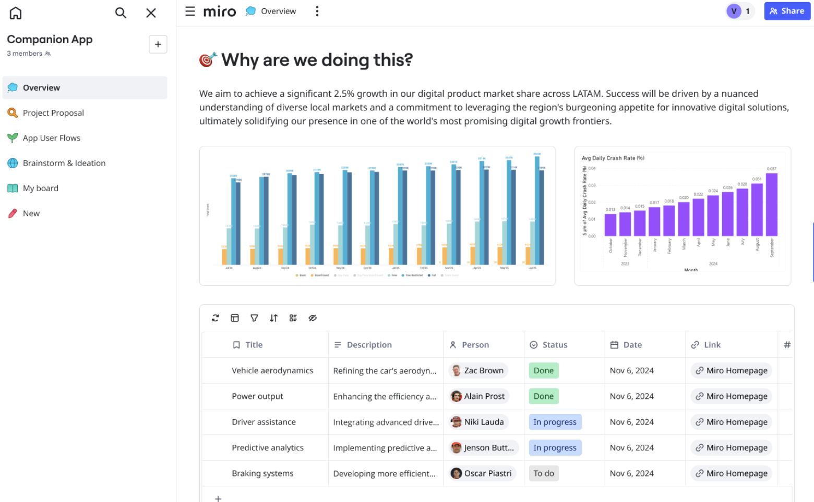

Your [Space Overview](02-space-overview.md) is the default point of entry for anyone who accesses your Space. You can create a Dashboard to give the Overview a structured view of activity and content inside the Space.

*Space Overview Dashboard*

This article explains how to create a Dashboard for your Space Overview. To learn more about Space Overviews, see [Space Overview](02-space-overview.md).

## Key features

- **Automatic layout**
  Arrange widgets into rows and columns with automatic resizing and positioning.
- **Drag-and-drop organization**
  Easily organize content by dragging widgets to your dashboard.

## Create a Space Overview Dashboard

1. [Set a Miro board as Space Overview](02-space-overview.md).
2. On the board, on the Creation bar click **Tools, Media and Integrations** (**+**).
3. Search and select **Dashboard**.
4. Click on the canvas where you want to drop your Dashboard.
5. To build your dashboard, drag a supported Miro Format or object. For example, Tables, Timelines, and text. You can also add synced copies.
   *The Dashboard automatically resizes your Formats or objects.*
6. (Optional) Drag and re-arrange each widget to organize your Dashboard.
7. (Optional) To set your Dashboard as the default view when anyone accesses your Space Overview, from the **Dashboard** context menu, click the three-dots (**...**), then select **Set as default view**.

:::tip
To use your Dashboard as a project template, you can create and include a Space Overview and Dashboard in a [Custom Blueprint](05-custom-blueprints.md).
:::
