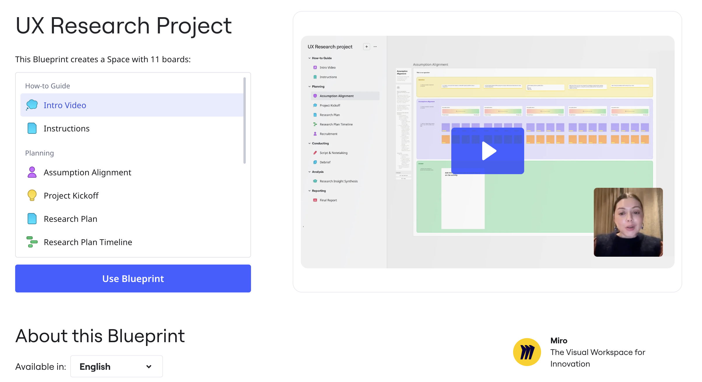

Blueprints are readymade [Spaces](01-spaces.md) with all the boards, Formats, tools, and templates that your team needs to complete their innovation workflow. Choose a suitable Blueprint, and your team has all workflow materials pre-configured. No need to build your Space from scratch.

*A Blueprint is a Space with preset templates.*

## Blueprints for end-to-end projects

Blueprints ensures that all team members follow the same structured approach from start to finish. A Blueprint includes preset boards, Formats, and tools that incorporate industry best practices, and provide an end-to-end workflow. Teams can collaborate more effectively, and consistently.

:::note
Blueprints are unavailable in Free plans. Users on Free plans can see Blueprints with a prompt to upgrade.
:::

## Access Blueprints

### From the Miro dashboard

1. On the right side of your dashboard, click **Explore templates**.
   The template picker opens.
2. On the left, click **Blueprints**.

### From a Miro board

1. From the creation bar, click **Templates**.
   The template picker opens.
2. On the left, click **Blueprints**.
