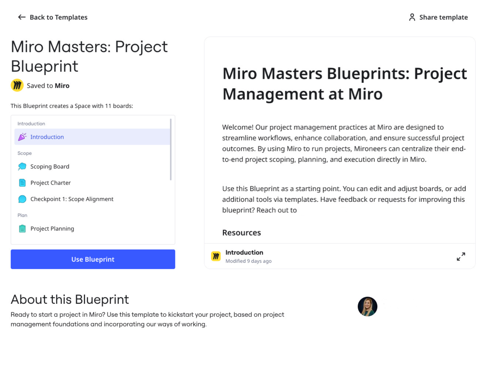
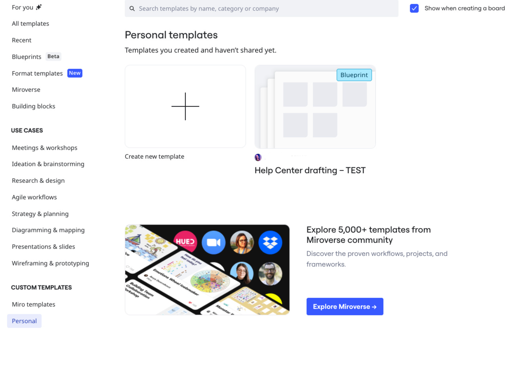
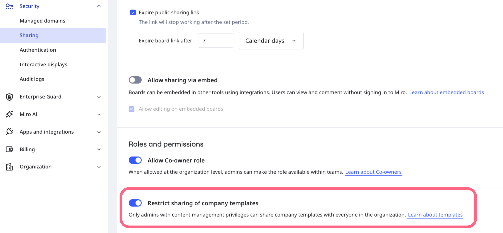

A Custom [Blueprint](04-blueprints-beta.md) is a [Space](01-spaces.md) template that you create for your unique processes and workflows. A Custom Blueprint can include boards, Formats, or any Miro resource tailor-fit to your needs.

*A Custom Blueprint has all the boards and Formats you need for a specific goal.*

Create and manage a Custom Blueprint as a reusable template for your design process, delivery process, rollout, or quarterly planning, for example. You can create and save a Custom Blueprint to your organization, team, or personal library.

You can also save an existing Space into a Custom Blueprint.

To learn more about Blueprints in general, see [Blueprints](04-blueprints-beta.md).

## Discover Custom Blueprints

You and your team can find all Custom Blueprints under **Custom templates** in the [template picker](../../getting-started/start-here/your-first-board/04-templates.md).

*The template picker now includes Custom Blueprints created at the personal, team, and company levels.*

## Create a Custom Blueprint

You can create a Custom Blueprint from the sidebar on your Home dashboard, inside a Space, or from a board inside a Space.

Follow these steps:

1. [Create a Space](01-spaces.md#how-to-create-a-space), or in the left sidebar choose an existing Space.
2. For the Space you want to save as a Custom Blueprint, in the left sidebar click the three-dots (**...**).
   The **Options** menu opens.
3. Click **Save as Blueprint**.
   The **Save as Blueprint** modal opens.
4. Name your Blueprint.
5. (Optional) Add a description.
6. To specify who can use your Custom Blueprint, select **Personal**, **Team**, or if enabled **Company**.

   > 💡 Learn more about how to [Create a Custom Blueprint at company level](#create-a-custom-blueprint-at-company-level).
7. Click **Save template**.
   Your Custom Blueprint is now available under **Custom templates** in the [template picker](../../getting-started/start-here/your-first-board/04-templates.md). If you created a Custom Blueprint the team level, then anyone in your team can find your Custom Blueprint in their template picker.

:::tip
To give a high-level view of content and activity inside your Space, include a [Space Overview](02-space-overview.md) and [Dashboard](03-space-overview-dashboard-beta.md) in your Custom Blueprint.
:::

## Share a Custom Blueprint

You can copy and share a link to a Custom Blueprint created at the team and company levels.

Follow these steps:

1. From your Home dashboard, click **Explore templates**.
   The template picker opens.
2. On the left under **Custom templates**, click **[Your team] templates** or **[Your company] templates**.
3. Hover over the Custom Blueprint you want to share, and click **Preview**.
4. In the upper-right, click **Copy link to share**.

:::note
Custom Blueprints saved to your personal library cannot be shared or moved to team or company libraries.
:::

## Edit a Custom Blueprint

You can update your Custom Blueprint to add new sections, boards, or Formats, for example.

Follow these steps:

1. From your Home dashboard, click **Explore templates**.
   The template picker opens.
2. On the left under **Custom templates**, click **[Your team] templates**, or **Personal** if your Custom Blueprint is shared with only you.
3. Hover over the Custom Blueprint you want to edit, and click the three-dots (**...**).
4. Select **Edit**.

   > 💡 From the team or personal template picker, you can also hover over your Custom Blueprint and click **Preview**, then **Edit template**.

   The Custom Blueprint opens from the first board in the Space with the sidebar open. A blue banner indicates that you are editing, and that changes are automatically saved.
5. Edit your Custom Blueprint. For example, add sections in the sidebar, or update existing boards and Formats. To learn more about managing Spaces, see the [Spaces](01-spaces.md) guide.
6. In the blue banner, click **Stop editing**.
   You return to your Home dashboard. All changes to your Custom Blueprint are saved. No changes are shared with anyone already using the template.

:::note
Company admins and Content admins can edit Custom Blueprints created at the company level.
:::

## Delete a Custom Blueprint

You can delete any Custom Blueprint that you have created.

Follow these steps:

1. From your Home dashboard, click **Explore templates**.
   The template picker opens.
2. On the left under **Custom templates**, click **[Your team] templates**, or **Personal** if your Custom Blueprint is shared with only you.
3. Hover over the Custom Blueprint you want to delete, and click the three-dots (**...**).
4. Click **Delete**.
   Your Custom Blueprint is deleted.

:::note
Company admins and Content admins can delete Custom Blueprints created at the company level.
:::

## Create a Custom Blueprint at company level

### Starter and Business plans

In Admin Console under **Security** > **Sharing**, the option **Restrict sharing of company templates** is turned off by default.Anyone in the organization can optionally create their Custom Blueprints for the entire company.

Admins cannot change this setting.

Company admins and Content admins can create, edit, and delete Custom Blueprints created at the company level.

### Enterprise

By default, only Company admins and Content admins can create Custom Blueprints at the company level. Users must request that you save their Space as a Custom Blueprint at the company level.

As Company admin, you can [(Enterprise) Enable users to create Custom Blueprints at company level](#enterprise-enable-users-to-create-custom-blueprints-at-company-level).

Company and Content admins can create, edit, and delete Custom Blueprints created at the company level.

### (Enterprise) Enable users to create Custom Blueprints at company level

By default, users on an Enterprise subscription cannot create Custom Blueprints at the company level. As Company admin, you can change this setting.

*For Enterprise, users are unable to create Custom Blueprints at the company level by default. Company admins can change this setting.*

Follow these steps:

1. As Company admin, go to Admin Console.
2. Go to **Security** > **Sharing**.
3. Under **Roles and permissions**, toggle **Restrict sharing of company templates** to the off position.
   Anyone in the organization can now create a Custom Blueprint at the company level.

:::note
You can toggle **Restrict sharing of of company templates** back on anytime. Changes impact Custom Blueprints created after your toggle restriction on or off.
:::
