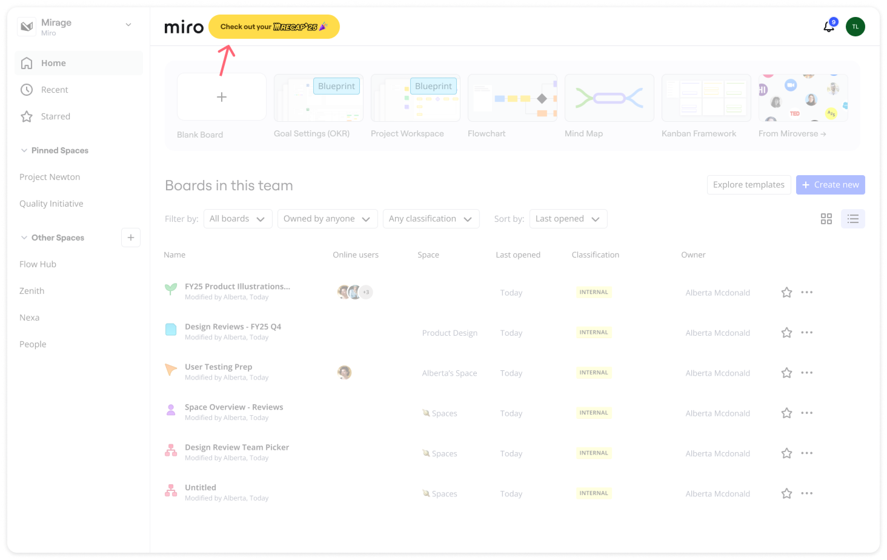
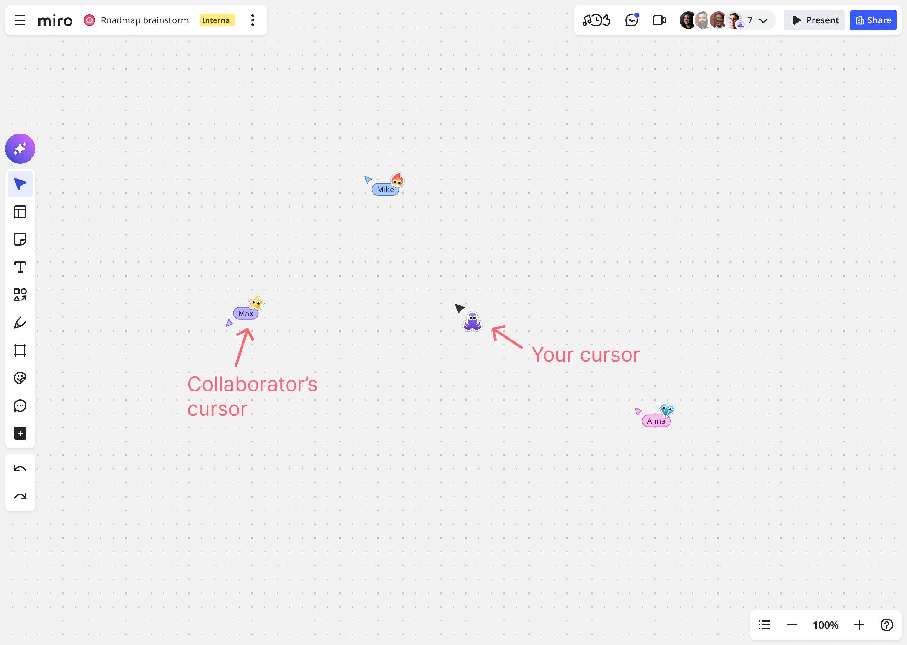
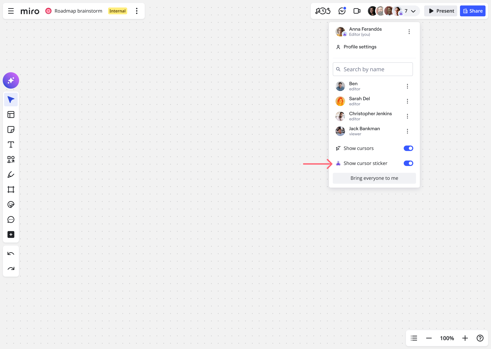
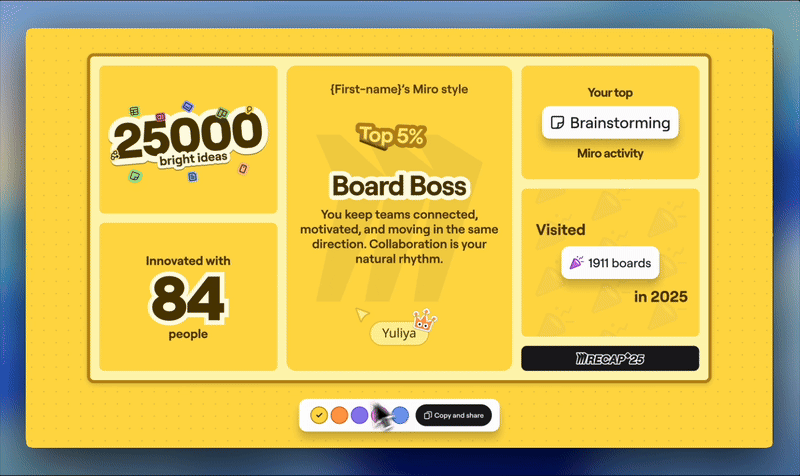

Your Miro Recap is a personalized summary of your year in Miro: your stats, your top collaborators, and your unique working style, and more. It's a chance to look back on your ideas and contributions, celebrate your teamwork, and discover how you got great done in 2025.

Available for: Selected users on Free, Starter, Business, and Enterprise plans

Available on: Desktop

## Who can access Miro Recap 25?

Miro Recap 25 is available to a selected group of highly active users on Free, Starter, Business, and Enterprise plans. Recap is personal and built for individual users. You can only access your own Miro Recap and data.

## Where can I access my Recap?

To access your Miro Recap 25, go to miro.com/recap25. On desktop, you can also access your Recap directly from the Miro dashboard. Miro Recap 25 will be available until January 31, 2026.

## Is my Recap private?

Yes, your Miro Recap is private, and only you can see it. Your Recap data is based on your activity in Miro over the past year, and is not shared with other Miro users. Your team and/or company admin cannot access your Recap or personal usage metrics. If you want to share your Miro Recap, you can download any slide and share it on social media or other platforms. [Learn more about sharing your Recap.](01-miro-recap-2025.md#how-to-share-your-2025-miro-recap)

## Miro Recap 25 data highlights explained

Your Recap highlights aggregated key collaboration and activity metrics from the past year. Miro processes usage metrics in accordance with the [Miro Privacy Policy](https://miro.com/legal/privacy-policy/).

The following list explains data points used in the Miro Recap:

- **Time spent in Miro**

  Approximate time spent working on Miro boards individually or collaboratively with other Miro users (including registered and non-registered participants)
- **Number of collaborators**

  Total number of unique registered users who participated in your collaboration sessions
- **Time spent collaborating**

  Approximate time spent in collaboration sessions with registered and non-registered participants
- **Ideas dropped onto the canvas**

  Approximate number of sticky notes or text widgets you added to Miro boards in the last year
- **Top day**

  The day of the week when you were most active on average
- **Top month**

  The month in 2025 when you were most active
- **Days using Miro**

  Distinct number of days you logged into and used Miro in 2025
- **Boards visited**

  Total number of boards you visited in 2025, including viewing, commenting, or editing
- **Formats created**

  Approximate number of formats (diagrams, prototypes, docs, tables, Kanban boards, timelines, slides, and others) you added to the canvas
- **Favorite format**

  The format you used most often in 2025
- **Top activity**

  The use case you performed the most in Miro, based on features and templates you used
- **Top AI user**

  This highlight is based on your adoption and discovery of Miro AI capabilities, including Create with AI, Sidekicks, and Flows
- **Top collaborators**

  Registered Miro users who collaborated with you the most, based on time spent and boards shared
- **Number of countries you’ve collaborated across**

  Total number of countries where you or your collaborators were located, estimated by IP address (does not account for tools that may alter your location, like VPN)

## How your Miro working style is defined

Your Miro working style is defined based on your activity in Miro over the past year, including your collaboration habits, product and feature usage, and adoption patterns.

## Your Miro cursor sticker

At the end of your Miro Recap, you’ll unlock a personalized cursor sticker based on your Miro working style. This sticker will display alongside your name on the cursor when you’re working on a Miro board. It will be visible to you and other collaborators, unless you have turned cursors off. Here's how your cursor sticker will appear to you and other collaborators:

You can activate or deactivate your custom cursor at any time. You can do this in the Miro Recap or in the settings in the [People toolbar](../../getting-started/start-here/your-first-board/05-toolbars.md).

Your custom cursor will be available until January 31, 2026.

## How to share your 2025 Miro Recap

1. Go to `https://miro.com/recap25`.
2. Download any slide or multiple slides of your Miro Recap.
   
3. Select a social channel to share your Recap.
4. (Optional) Add a personal message to your post.
5. Follow the on-screen instructions to post your Recap.
