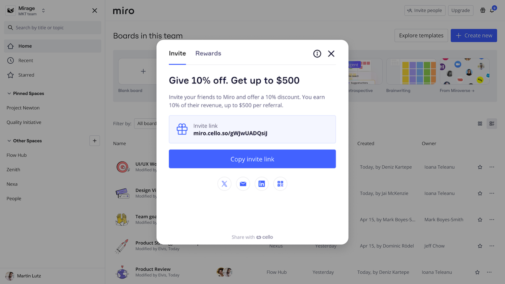

Miro's referral program enables existing users to earn cash by referring new companies to Miro. This revenue-sharing program offers payouts of up to $500 per successful referral.

## How the referral program works

**For You (Referrer):**

- Get 10% of the referred account’s monthly payments for each new company who signs up with your referral code, up to $500 per referral.

**For the Referred account (Invitee):**

- Invitees get a 10% discount on their subscription for 11 consecutive months.
- Invitees will need to apply the promo code during sign-up for a paid plan in order to claim the discount.

## Using the referral program

1. Click the **Referral Program** icon in the upper right corner of your dashboard.
2. Click **Copy invite link**.
   
   *Copy the invite link to send to your potential referrals*
3. Send the link to contacts at other companies via email, social media, or messaging apps.

### Getting paid for your referrals

Before you can collect any payments for your referrals, you’ll need to add your payment details.

1. Click the **Referral Program** icon in the upper right corner of your dashboard.
2. Click on the **Rewards** tab.
3. Click on **Add payment details**.
4. Select your payout country/region from the drop down.
5. Select your preferred payment method from the available options.
6. Enter your payment details.
7. Agree to the Cello terms of use.
8. Click **Save payment method**.
   .png)
   *Set up your payment information to enable payment for your referrals*

:::note
You can update your payment method at any time by clicking on the **Update payment details** button from the **Rewards** tab.
:::

### Tracking your referrals

You can view your referrals on the **Referral Program** dashboard.

1. Click the **Referral Program** icon in the upper right corner of your dashboard.
2. Click on the **Rewards** tab.
3. You’ll see a summary of your Rewards total at the top, along with a list of any active referrals and the amount of their payout.
   .png)
   *Referral program earnings will be shown on the Rewards tab*

## Program Policies

- **Eligibility Criteria:**
  - Invitees must be new companies signing up with a work email.
  - Invitees must apply the promo code before it expires.
  - Referrals to colleagues within your own company (same email domain) are not eligible.
- **Promo Code Details:**
  - Promo codes expire 60 days after issuance.
  - Promo codes must be applied during check-out for any paid plan.
  - Accumulate referral payments up to a total of $500.
  - Invitee's Discount is active for 11 months post-sign-up.
- **Program Modifications:**
  - We reserve the right to modify or terminate the referral program at any time.
  - Changes will be communicated via email or posted on our website.
- **Preventing Abuse:**
  - Any fraudulent activity or misuse will result in disqualification from the program.
- **Regional availability:**
  - The referral program is available in the following countries: Austria, Belgium, Brazil, Canada, Czechia, Denmark, Finland, France, Germany, Greece, Hungary, Ireland, Italy, India, Netherlands, Norway, Poland, Philippines, Portugal, Romania, Spain, Sweden, Switzerland, United Kingdom, United States.

## Frequently Asked Questions

**Is there a limit to the number of companies I can refer?**

There's no limit to the number of companies you can refer. However, the maximum discount you can earn is $500 per referral.

**What if the contact forgets to apply the promo code?**

The promo code is essential for the invitee discount and referrer payment. Remind them to apply it directly during sign-up or within the first 60 days after sending the code.

**How long is the promo code valid?**

The promo code expires 60 days after it's issued. Ensure your contact uses it within this period.

**Can I refer someone from the same company?**

No, referrals must be from different companies. Invitees must use a work email with a domain different from yours to qualify.

**How do I track my earned discounts?**

Click the Referral Program icon on Miro’s dashboard in your account to view successful referrals and accumulated payments.

**Will I be notified when a referred company uses my referral link and promo code?**

Yes, you'll receive a notification within the Referral Program dashboard once the referred company successfully signs up and applies the promo code.

**What happens if the promo code expires before use?**

If the promo code expires, the invitee won't receive the discount. They would need a new referral link and promo code to participate.

**Does my reward change if the referred company cancels their subscription?**

If the account cancels a subscription, the monthly received payments will stop for this referral.

**What should I do if I encounter issues with my referral discount?**

Contact our customer support team for assistance.

**Can I refer multiple contacts within the same company account?**

Referrals must be to new accounts. Multiple contacts within the same account will count as a single referral.

**What should I do if I haven't received my referral award?**

If you believe you should have received a reward but it hasn't been applied, please contact our customer support team for assistance. The first payment is expected to be received at least a month from a registered new paid account.
