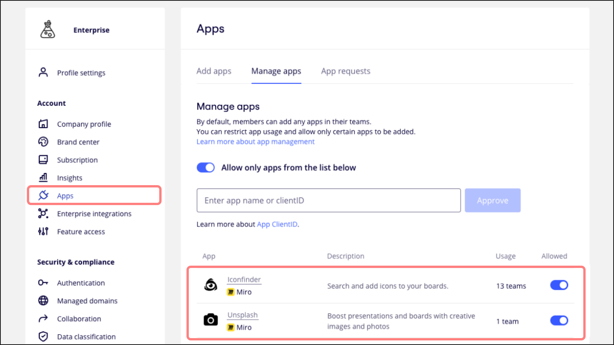
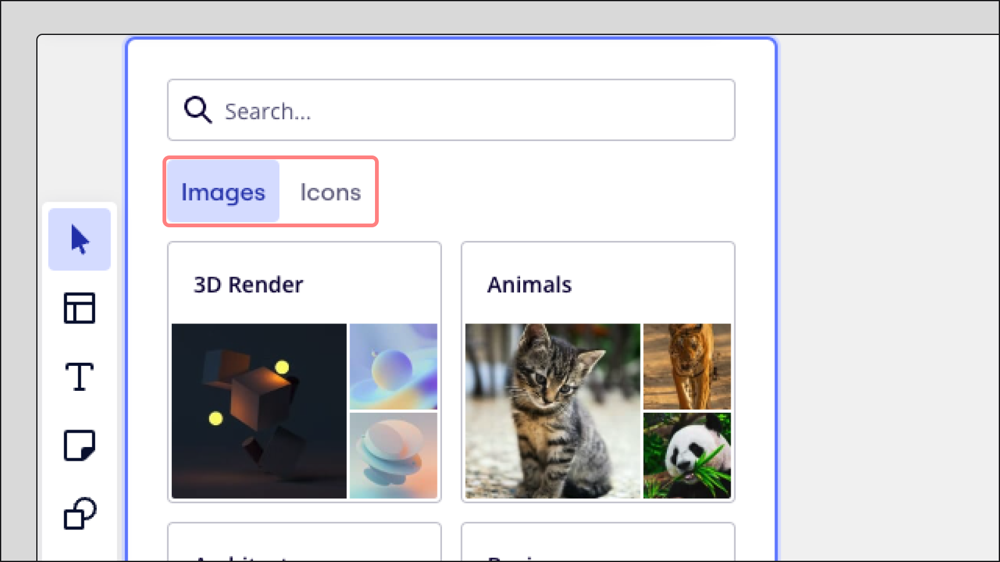
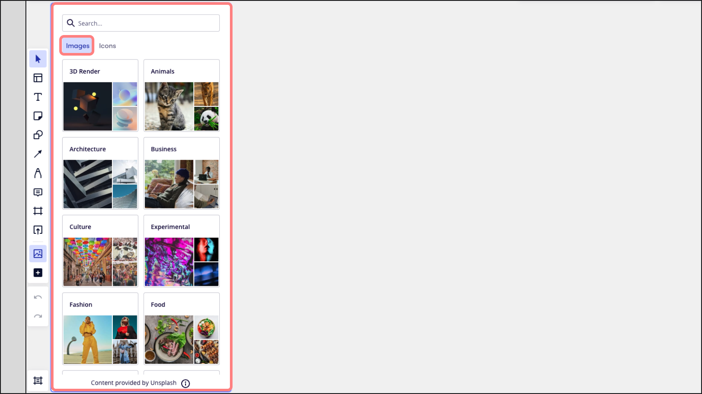
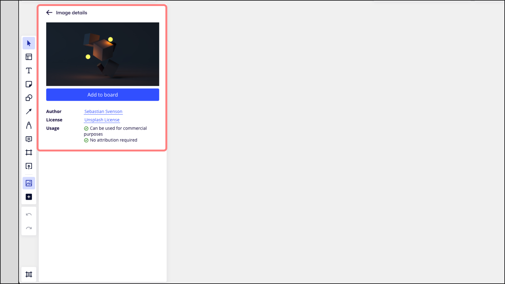
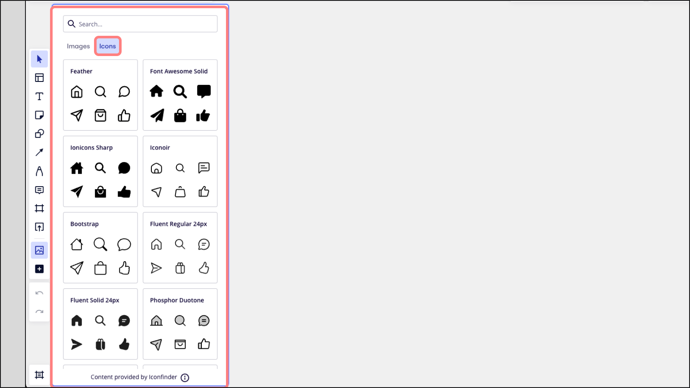
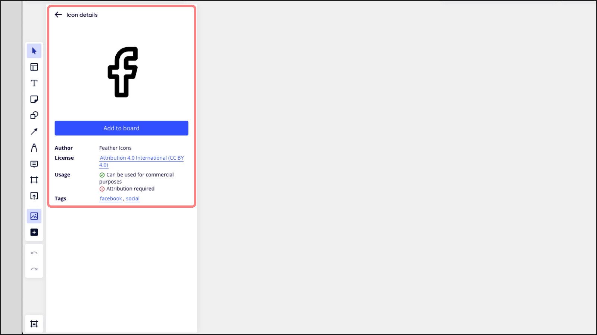
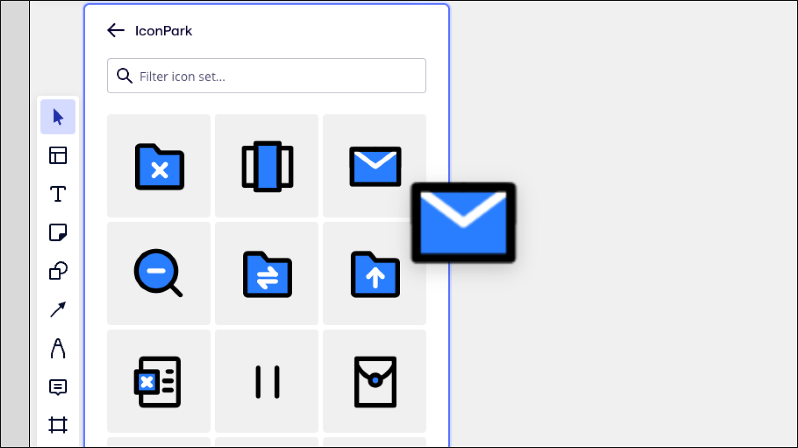
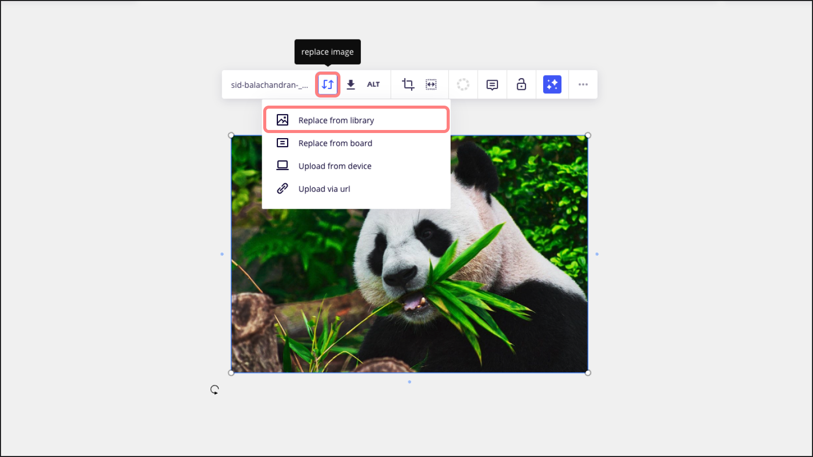
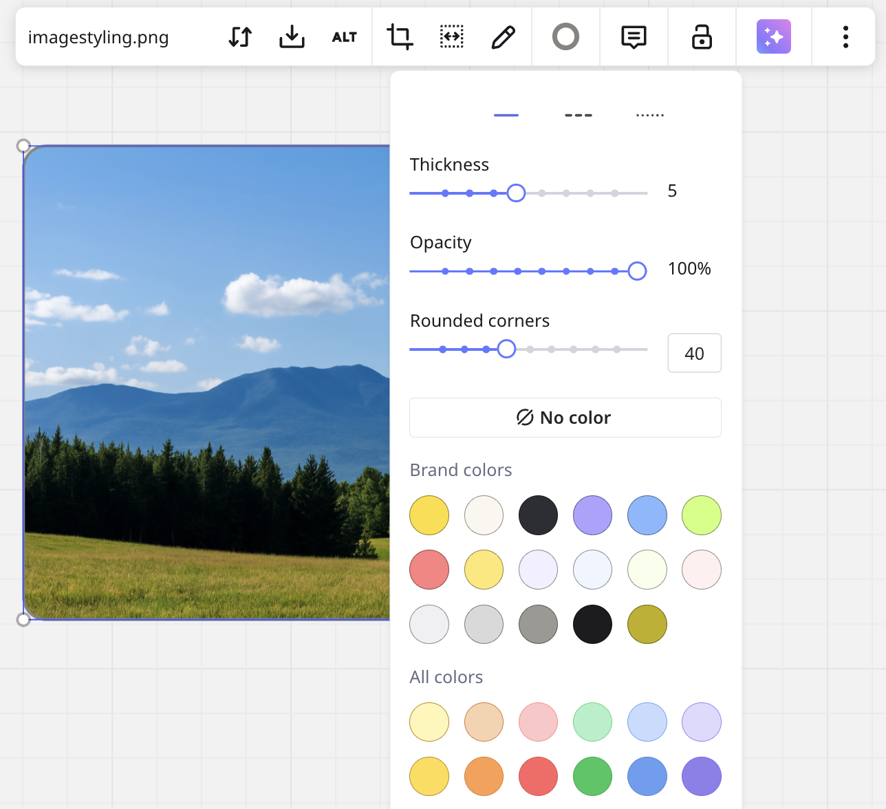
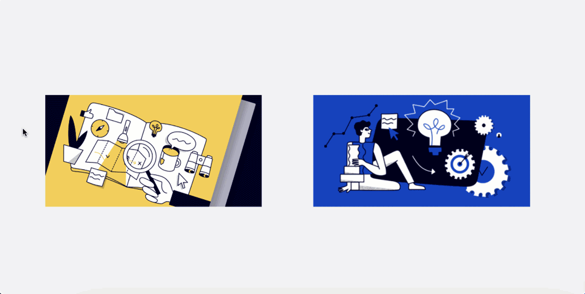

Create engaging and professional-looking boards and presentations. Browse, search, and swap a variety of images and icons from Unsplash and Iconfinder in a single library.

## Getting started with Images and Icons

To start, install the [Unsplash](https://miro.com/marketplace/unsplash/) app and/or [Iconfinder](https://miro.com/marketplace/iconfinder/) app from the Miro Marketplace. Admins can manage access to these apps in their [app management](../../enterprise-administration/managing-apps-on-enterprise-plan/02-app-management.md) settings, allowing or restricting access at any time.

*Managing access to Unsplash and Iconfinder apps*

When Unsplash access is allowed, a dedicated tab for images from Unsplash will be included in the Images and Icons library. Similarly, when access to Iconfinder is allowed, it also appears as a separate tab in the library.

*Unsplash and Iconfinder tabs*

### How to access Images and Icons

1. Go to the [creation toolbar](../../getting-started/start-here/your-first-board/05-toolbars.md#creation-toolbar) on the left side of your board.
2. Click the **More apps** icon (**+**) and search for ‘Images and Icons’.
3. Open the **Images and Icons** app.

*Launching the Images and Icons app*

### Images by Unsplash

Get royalty-free images from Unsplash. Browse image categories for inspiration, or search for a specific image.

*Browsing Unsplash images*

Hover over an image and click the information icon (**i**) in the bottom-left corner to open its details. Within image details you can view the image author, license, and usage.

*Viewing an image’s details*

To add an image from Unsplash, click to select and then place it on your board, or use drag-and-drop.

*Adding an image to the board*

### Icons by Iconfinder

Access a wide range of icons from Iconfinder. Browse icon packs, or search for a specific icon.

*Browsing icons*

Hover over an image and click the information icon (**i**) in the bottom-left corner to open its details. Within image details you can view the image author, license, and usage.

*Viewing an icon’s details*

To add an icon from Iconfinder, click to select and then place it on your board, or use drag-and-drop.

*Adding an icon to the board*

### Replacing images and icons

Replace images directly from the Images and Icons library. This is especially helpful for updating presentation [templates](../../getting-started/start-here/your-first-board/04-templates.md).

1. Click on the image or icon to open the context menu.
2. Click the **Replace image** icon.
3. Select **Replace from library**.
4. The Images and Icons app will open.
5. Select a new image or icon.

*Swapping icons and images on the board*

## Styling images

You can easily enhance the appearance of your images in Miro using various styling options. Whether you want to add a border, adjust the opacity, or round the corners, Miro provides flexible options for customizing your images to fit your board's aesthetic.

*Styling images*

Here's how you can style your images and the options available for customization:

### Border Style

- **Border Thickness**: Adjust the thickness of the border around your image using a slider. This allows you to make the border more prominent or subtle, depending on your needs.
- **Border Color**: Select a color for the border from Miro’s color palette, including brand and custom colors.

### Opacity

You can change the opacity of your image using a slider, allowing you to make it more transparent or fully opaque. This feature is useful for blending images seamlessly with other elements on your board.

### Corner Style

**Rounded Corners**: You can round the corners of your image. Use the slider to adjust the corner radius, which will give the image softer edges. Set it to 0 for sharp corners, or increase the value for more rounded corners.

### Color

- **Border Color**: Choose a color for the image’s border from Miro’s color options.
- **Shape Fill Color**: While this doesn't apply directly to images, you can create a colored effect by adjusting the opacity and adding a colored shape overlay to your image for a tinted effect.

### Crop images

There is no need to use third-party software to crop images, as Miro has a tool for it. Select an image or choose **Crop** on the context menu. This enables the crop mode, which allows editing of the **rectangular** selection.

Crop boundaries snap to surrounding board content to ensure the layout of images is visually crisp. You can update the position and scale of the images you are cropping without losing alignment with other content on the board. When it is done, just click anywhere on the board.

You can **crop images in various shapes** (e.g. a circle, square, etc.). Select the image, click the **Crop** icon in the context menu, and select a shape from the dropdown.

You can also **bulk-crop images in various shapes**. Click and drag to select the images, click the **Crop** icon in the context menu, and choose a shape from the dropdown.

*Bulk-cropping images into a circle*

:::tip
You can always revert your cropped image to its original, just double click and expand the crop selection to its original size.
:::

###

### Bulk resize images

Resize multiple images on your board at once by height or width. Then use [Auto layout](../working-on-the-board/08-structuring-board-content.md#auto-layout) to instantly align them.

**How to bulk resize images**

1. Drag the cursor to select all the images you want to resize
2. Click the resize icon in the context menu. You need to select multiple images before the resize option appears
3. Select **Match height** or **Match width**
4. Click on the gray **Auto layout** icon in the upper right corner

### Adding GIFs

Add GIFs to your Miro boards to bring ideas to life with fun animated content. GIFs play for individual users for 8 seconds or one loop when added to the board, and when users hover over them. GIFs only play for each user interacting with the board, not for everyone in real-time.

Turn on [Reduce motion](../../getting-started/accessibility-in-miro/06-reduce-motion.md) to disable GIF autoplay.

:::tip
GIFs in presentations and [Miro Talktracks](../facilitation-tools/asynchronous-tools/02-talktrack-board-recordings.md) play automatically and loop endlessly while they're visible on the screen.
:::
