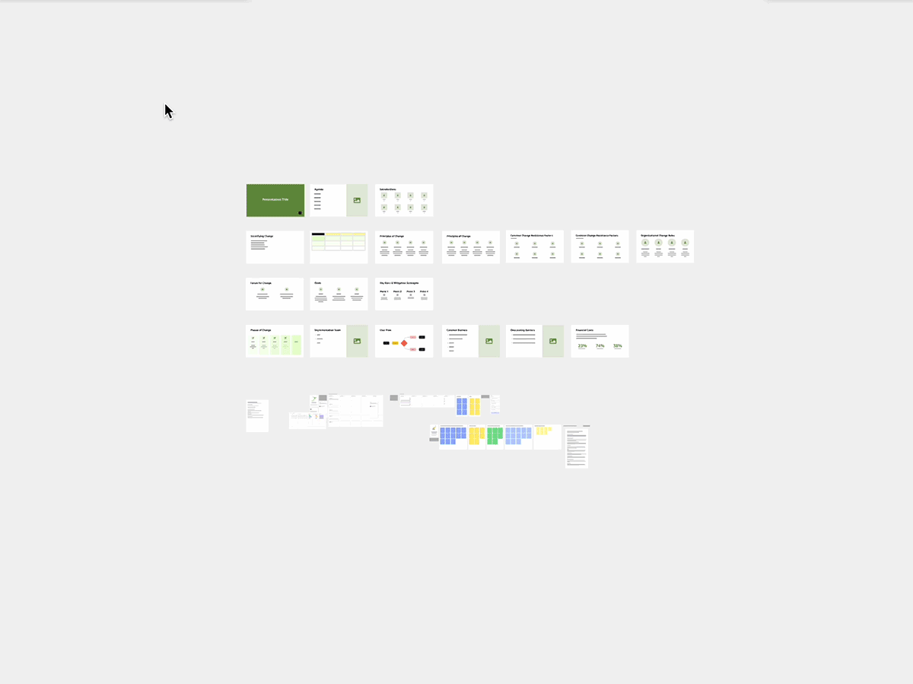
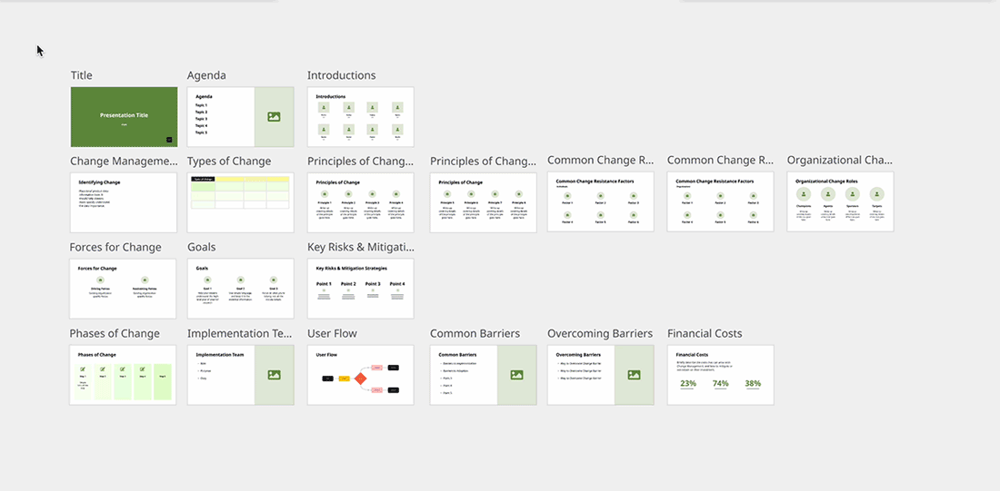

Explore tips to improve board performance during collaborative sessions and on large boards, and troubleshoot issues like slow performance and navigation, board freezing and endless loading.

## How to improve board performance

Board performance may slow down during **collaborative sessions** with many users, as well as on **large boards** containing a lot of content.

Tips for collaborative sessions Tips for large boards

The growing number of users on a board and their intensive activity can influence the board’s performance. Users with older and less powerful devices are at a higher risk of performance lagging.

**If you're participating in a collaborative session, be sure to:**

- close or minimize all redundant tabs and windows, if you're working in a desktop [browser](../technical-guidelines/02-supported-browsers-&-browser-restrictions.md)
- hide collaborators’ cursors and close all sidebars
- avoid selecting and changing multiple board objects at the same time
- minimize navigation across the board
- if you access Miro on a laptop, make sure that you are in high-performance mode rather than a power-saving mode

**If you're planning a collaborative session in Miro:**

- invite users who don’t need editing access as viewers. Learn how to set up [board access rights](../../sharing-boards/01-board-access-rights.md)
- be sure to keep the board content tidy - for guidelines, read **Tips for large boards,** found on the second tab above.

The maximum number of objects that you can add to a board is 100,000. However performance can be impacted starting from 1,000 objects. For a better experience, we recommend keeping the number of objects on the board below 5,000.
**To find the number of objects on your board:**

- select all objects on the board (ctrl-A on Windows, cmd-A on Mac, or drag a selection box around all your objects)
- the context menu will appear where you'll see the total number of objects
- click **Filter** to see the number of objects by type

*Measuring the number of objects on a board*

Along with the number of objects, heavier or more complex objects (especially uploaded files and documents) can also slow down your board.

**To speed up a large board, keep it tidy:**

- Delete unnecessary content, especially heavy uploaded files and documents (e.g. vector PDFs with many details or high resolution images)
- Convert heavy PDFs and images in high resolution to PNG/JPG files and re-upload them onto the board
- Downscale your board content if it looks too large at 100% zoom level:
  - go to the map in the bottom right corner and set the zoom to 100%
  - if at this zoom level, your content looks too large, select it using **Ctrl + A** (for Windows) or **Cmd + A** (for Mac) and downscale it
  - consider also downscaling any large images
    ****
    *Downscaling content*
- [resolve comments](../../facilitation-tools/asynchronous-tools/01-comments.md)
- convert [pen](../../essential-tools/10-pen.md) handwriting to images:
  - make a screenshot of a drawing
  - upload it onto the board
  - delete the drawing
- if possible, split the board into a few boards:
  - copy a part of the board content by selecting it and pressing **Ctrl + C** (for Windows) or **Cmd + C** (for Mac)
  - [create a new board](../../../getting-started/start-here/your-first-board/01-create-a-miro-board.md) and paste the content onto the board
  - delete the copied content from the original board

## How to troubleshoot poor performance or endless loading

Your device, internet connection, browser and other factors can influence board performance and loading speed. If you experience poor performance or your board or dashboard won’t load in a browser, Desktop app, on a tablet or mobile device, try our troubleshooting steps.

:::warning
Before exploring the solutions below, check the [Miro Status Page](https://status.miro.com/) for reports of performance degradation.
:::

Browser Desktop app Tablet, mobile

1. Open Miro in [incognito](https://support.google.com/chrome/answer/95464) **(private) mode** and/or in a **different browser**If Miro works in incognito mode or in a different browser, clear your browser's cache & cookies.

**How to clear Miro website data in Chrome**

1. Go to `https://miro.com/` and open the **Developer tools** of Chrome (**Command + Option + J***on Mac*, **Ctrl + Shift + J** *on Windows*)2. Choose the tab **Application > Storage**. Click **Clear site data.**​ This should remove any Miro data saved in your Chrome browser, and you can start a new session. Please note that you will be logged out from your Miro profile*The option to clear site data in Chrome*

You may also need to update the browser to the latest version or disable certain extensions. Please check the list of [supported browsers](../technical-guidelines/02-supported-browsers-&-browser-restrictions.md).

2. Check your **internet connection**. If your network bandwidth doesn't reach the minimum of 8 Mb/s, switch to another, preferably faster network

3. Make sure your device meets the [**system requirements**](../technical-guidelines/01-system-requirements.md):

- CPU - 3 GHz (2 cores/4 threads)
- RAM Memory - 8 GB

4. If you access Miro on a laptop, ensure that you are in **high-performance** mode rather than power-saving mode.

5. If you experience an issue with specific boards, try [**duplicating them**](../../managing-boards/03-how-to-duplicate-a-board.md) and see if the issue persists on the copied board.**For users who can't load and access Miro:**

6. Check if your connection supports **WebSockets.** Read more about WebSockets and troubleshooting steps in [How to add Miro to allowed apps](../../tools/troubleshooting/01-add-miro-to-allowed-apps.md#websockets).

7. Check if your browser supports **WebAssembly**. Miro relies on WebAssembly to render board content. If your browser, extensions, or security settings block WebAssembly, boards may fail to load. To check if your browser supports WebAssembly, try opening [this test page](https://wasm.joway.io/). If that's not the case, check with your IT team or review your browser settings to ensure WebAssembly is **allowed**.

8. Check with your IT department if your company uses **firewalls** or a **proxy** that may block Miro. Follow the guidelines to allowlist Miro or provide a by-pass in [How to add Miro to allowed apps](../../tools/troubleshooting/01-add-miro-to-allowed-apps.md#websockets).

If the issue persists, [contact Miro Support](../../tools/troubleshooting/06-contacting-miro-support.md#how-to-contact-miro-support) and send us [the browser console logs](../../tools/troubleshooting/07-how-to-troubleshoot-and-report-a-bug.md#how-to-record-console-logs).

1. Check if you experience slow performance or endless loading using a [**web version**](https://miro.com/app/dashboard/). If you can’t access Miro from the web version, try the troubleshooting guide for **Browser**
2. If you don’t experience any issues in your browser, **reset the application data**

   **How to reset the app data on Windows**

   Press Alt, click **Help** in the top-right corner, and choose **Reset application data**:

   
   *Resetting the app data on the Desktop app for Windows*

   If you cannot find the menu, you probably use the app downloaded from the MS Store. In this case, to reset the app data, open Windows **Settings** > **Apps** > **Apps and Features** > find **Miro** on the list > **Advanced options** > **Reset**.

   **How to reset the app data for macOS**

   While in the Miro app, click **Help** in the top menu and choose **Reset application data**:

   
   *Resetting the app data on Mac*
3. If the issue persists, try to delete and [**reinstall the app**](https://miro.com/apps/)

If you’re still facing issues, [contact Miro Support](../../tools/troubleshooting/06-contacting-miro-support.md#how-to-contact-miro-support) and send us [the app console logs](../../tools/troubleshooting/07-how-to-troubleshoot-and-report-a-bug.md#how-to-record-console-logs).

1. Check your **Internet connection**. If your network bandwidth doesn't reach the minimum of 8 Mb/s, switch to another, preferably faster network.
2. Make sure your device meets the **technical requirements**:

- for Miro on tablets:- 6 GB RAM- iOS 12.0 or higher, Android 6.0 or higher, Windows 10 version 1607 or higher- Screen resolution of 768×1024 pixels or higher
- For Miro on mobile:- iOS 12.0 or higher- Android 6.0 or higher

Delete and **reinstall the app** on your device

**For iPad users:**Note that board performance degradation on iPad may be caused by iPad RAM limitations. Try the following:

1. Close all unnecessary background applications before using Miro - this should improve performance
2. Work on boards that are smaller in size - this should lighten the load of the app on the system
3. Switch to another device (laptop or computer) with better RAM and use the browser version of Miro

## How to troubleshoot typical issues

Syncing... Please wait Connection restored

The pop-up notification **Syncing... Please Wait** usually means that a heavy load is being processed and the process is lacking the necessary power to be completed in the expected time. Thus the message may appear if you are working on an extremely heavy board when bulk-moving, for instance, a lot of objects, or if there's a packet loss. Note that even if your board looks relatively simple, for Miro the heavy objects would be high-resolution images, PDF files or Pen drawings (because those are vector graphics which are hard to render), or tables - this can cause the performance degradation that triggers the message.

Please try to divide your board into smaller ones by copying and pasting your content to a new board and see if the issue persists. If that does not help:

- Ensure that your device meets the minimum system requirements and that your browser is updated to the latest version.
- If you have many tabs open in the browser, try closing them or freezing them before working in Miro so your browser can direct all its processing power to the Miro app without dividing it between many tabs.
- Test Miro in the Incognito (private) mode (to exclude the possibility of browser extensions interfering) and in a different browser. Close all browser tabs and applications running in the background if needed.
- Clear your browser's cache & cookies, restart your browser and hard refresh the page by clicking F5 (or Ctrl / Cmd + R) several times.
- If you experience problems with specific boards, try to duplicate them and check if the problem persists there. You can also try opening a board with fewer items/smaller board to see if the problem still occurs.
- If you use VPN, check if the issue persists when you turn it off.
- Try to duplicate the board and check if the error is reproduced on the new one.

Generally, **Reconnecting...**, **Connection restored** error can appear in the following cases:

- When there are some connectivity issues on your side. Makes sure your network connection meets the minimum requirements. Possibly, try switching to a faster network.
- When you are working on multiple heavy boards opened in the same browser. If this appears to be your case, close all extra tabs & running applications in your browser and refresh the browser page.

It is also worth checking your WebSocket connection (esp if you’re having issues on all the boards, even the smallest ones). Get in touch with your IT department and ask them to enable the WebSocket connections on ports 80 and 443 (SSL) and [double-check if anything else can be the cause](../../tools/troubleshooting/01-add-miro-to-allowed-apps.md).

## Frequently asked questions

*Does the board performance depend on the plan I am using (free/paid)?*

No,  board performance is not affected by your plan.

*Do the sharing settings of my board impact the performance?*

The sharing settings should not affect board performance, but the number of users on your board can influence it. You can use the tips for collaborative sessions above.
