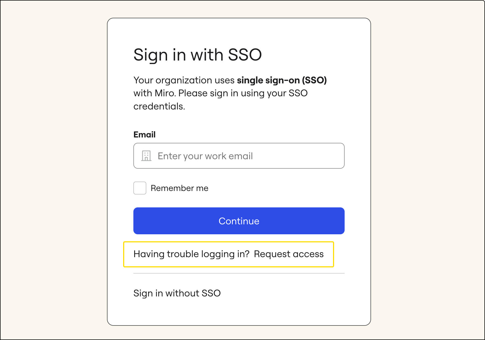
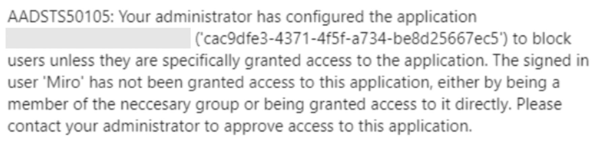
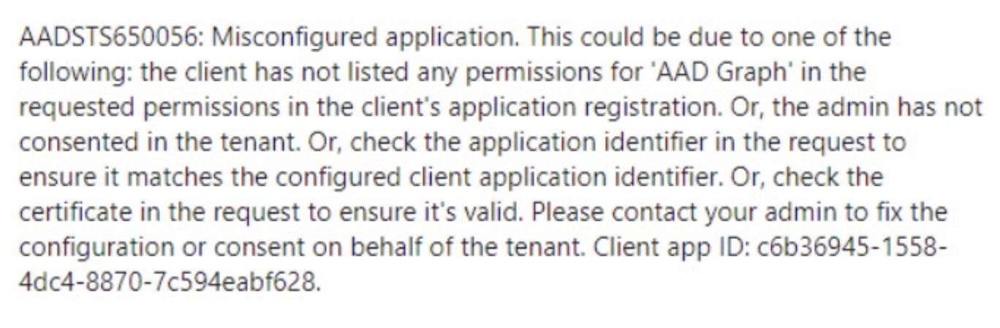

Get troubleshooting advice for you and your IT administrators around issues related to single sign-on (SSO).

> **✏️** Learn more about [configuring Miro SSO](../../../enterprise-administration/security-integrations/single-sign-on-sso/09-single-sign-on-(sso).md) and [Miro SCIM](https://developers.miro.com/docs/scim).

## Miro SSO errors

If you see any of these SSO error messages, explore the solutions below. You may need help from your IT department or Company Admins.

Your email is not associated with an SSO account

This happens when the email address that you entered in Miro is not recognized as a user that should be authenticated via SSO.

Possible causes:

- **You are not a member of any subscription that established SSO as their login requirement**. Sign in via standard options (email and password) or get in touch with your admin to get invited to your company’s subscription.
- **You are supposed to log in via SSO, but there is a mixup with your email address**. Perhaps you have several emails (or aliases), and the invitation to the plan with established SSO was sent to your other address. Log in with another email address.

Your email is not associated with the SSO Account. Request access from your Company Admin

This usually happens in two scenarios:

- **Your user profile in the Identity Provider system is not given permission to sign into Miro (you don’t have a role assigned)**. If this is the case, you probably won’t find Miro as a tile on your provider’s MyApps dashboard. Get in touch with your provider’s admin to get the necessary permissions.
- **You recently changed your email** (e.g. due to marriage), and the change has not been properly applied in all systems, creating conflicts. Get in touch with your admin to clarify the situation, and if needed, they will get in touch with us to approve any necessary changes.

If you are unable to log into Miro via SSO you can request access from Company Admins by clicking the corresponding button on the [Miro SSO login page](https://miro.com/sso/login/).

*The option to request access from Company Admins*

You will need to enter the confirmation code sent to your email address. Once you enter the code, a notification will be sent to the Admins of your company's subscription, notifying them that you need assistance.

Something went wrong: Validate signature for response was unsuccessful

This means that there is misconfiguration either in your Miro SSO settings or on the end of your Identity Provider. It’s likely that none of your colleagues can log in. Please get in touch with your IT department or the Identity Provider admin so they can check the following points:

- The SAML response must contain the signed *assertion*. This is a Miro requirement.
- Your Identity Provider may be treating Signed responses in a specific way. For instance, Google SSO *unsigns* the assertion when the *response* is signed. If that’s the case - unsign the response.
- The SAML response contains the required signed assertion but the X.509 certificate value that is supposed to validate it is not present (can also happen if your VPN/firewall [cuts off parts of data transfer](../../tools/troubleshooting/01-add-miro-to-allowed-apps.md)). Ensure that the X.509 certificate value is passed in the SAML traffic to Miro.
- The SAML response contains a *different* X.509 certificate value than the one added in the [Miro settings](../../../enterprise-administration/security-integrations/single-sign-on-sso/09-single-sign-on-(sso).md) so there’s a mismatch and validation fails. Check that the certificate values on the IDP side and on the Miro side match.

Something went wrong: User was not provided in SAML response

This means that there is a misconfiguration on the end of your Identity Provider - either in the general setup or for your specific user profile. Please get in touch with your IT department or the Identity Provider admin so they can check the following points.

- The Username (NameID, Unique user ID) format in your SSO configuration is unspecified or set to a non-email attribute, so the user value sent to Miro cannot be recognized. Specify Username to **EmailAddress** on the Identity Provider side (or to any other attribute that is in the email format).
- The SAML response does not contain the email value for the user, so the user cannot be recognized (this can also happen if your VPN/firewall [cuts off parts of data transfer](../../tools/troubleshooting/01-add-miro-to-allowed-apps.md)). Ensure that the email is passed in the SAML traffic to Miro.
- The SAML response is encrypted. Please do not use encryption, as Miro does not support it.

Something went wrong: SAML response is not correct

This usually happens when there are issues with your profile on the Identity Provider end.
Possible causes:

- **Your user profile in the Identity Provider system is configured incorrectly**. For example, you are not given permission to sign into Miro (you don’t have a role assigned). If this is the case, you probably won’t find Miro as a tile on your provider’s MyApps dashboard. Get in touch with your provider’s admin to get the necessary permissions.
- **Your user profile in the Identity Provider system is configured correctly but has restrictions in place**. For example, there are IP restrictions, so you are only allowed to log in from certain places. Reach out to your Identity Provider’s admin and ask them about your permissions.

To authorize with SSO, please use the URL link provided by your employer

This means that you’re not supposed to access Miro from this page or that the SSO configuration in your Miro Enterprise plan is not complete. In this case, you might be able to log in from your MyApps dashboard.
Possible causes:

- **Your IDP is configured for** [IdP-initiated login](https://blogs.oracle.com/dcarru/sp-vs-idp-initiated-sso) **only, and you should not be able to sign in from the Miro sign-in page.** Log in via the provided link from your MyApps dashboard or reach out to your Company Admin for instructions.
- **SSO is enabled in your Miro Enterprise plan but the configuration has not been finished**. Get in touch with your IT department or Identity Provider Admin, so they finish the configuration according to [these instructions](../../../enterprise-administration/security-integrations/single-sign-on-sso/09-single-sign-on-(sso).md).

## Entra or ADFS errors

The single sign-on configuration is not available for this application in the Enterprise applications experience.

The whole text of the message: *The single sign-on configuration is not available for this application in the Enterprise applications experience. Miro (formerly RealtimeBoard) is a multi-tenant application and the application is owned by another tenant.**To change properties such as the reply URL and identifiers, contact the owner of the application.*Get in touch with your IT department and ask them to check the SSO configuration. Most likely, there is already a configured Miro app in your Entra ID where our identifier (`https://miro.com/)` is used and therefore taken. Entra is more or less unique in that this identity provider requires the identifier (Entity ID) to be unique.
To possibly resolve the situation, we advise you to check the Enterprise Applications of your Entra instance and use the one that you already have configured for your Miro settings.
If you're sure there are no other Miro apps in your Enterprise apps, try getting a new copy of the Miro app from the Entra gallery.

An error occurred. Contact your administrator for more information

Share this community post with your IT department: [“An error occurred. Contact your administrator for more information”](https://blog.kloud.com.au/2015/07/22/adfs-sign-in-error-an-error-occurred-contact-your-administrator-for-more-information/)

No access granted: error AADSTS50105

Share this community article with your IT department: ["Role not assigned" error](https://docs.microsoft.com/troubleshoot/azure/active-directory/error-code-aadsts50105-user-not-assigned-role)

Misconfigured application: error AADSTS650056

We checked Microsoft [documentation for the error AADSTS650056](https://docs.microsoft.com/azure/active-directory/manage-apps/application-sign-in-problem-federated-sso-gallery) (as well as some [suggestions from the community](https://blogs.aaddevsup.xyz/2019/11/aadsts650056-misconfigured-application/)) and it looks like the error might be caused by the changes you added to the app permissions. Your Entra admin may need to give consent to the Miro app to allow the end-users to authenticate in Miro. [This Microsoft tutorial](https://docs.microsoft.com/azure/active-directory/manage-apps/configure-admin-consent-workflow) should be helpful in this case.

Read [the support.microsoft.com article about other possible SSO errors](https://support.office.com/article/how-to-troubleshoot-issues-that-you-encounter-when-you-sign-in-to-office-apps-for-mac-ipad-iphone-or-ipod-touch-when-using-active-directory-federation-services-e44357b4-c9c4-4580-a946-ef5dabdb98cd?ui=en-US&rs=en-US&ad=US).

## Google SAML errors

Please refer to [this section of Google documentation](https://support.google.com/a/answer/6301076?hl=en) that lists possible errors and instructions on how to resolve the situation.

## Issues logging in to the Miro app via SSO on the desktop app, tablet, or mobile

If you are unable to log in to the Miro app via SSO on a desktop/tablet/mobile device but can log into the [browser version](https://miro.com/app/), try the following:

1. Delete the app from the device and reinstall it. For the desktop app, please be sure to remove all app folders following [these instructions](../../../getting-started/apps-for-devices/05-desktop-app.md#how-to-reset-the-app-data). The most common cause of this issue is bad cache so thoroughly deleting everything and reinstalling anew should help.
2. Try changing the default browser of your device to a different one for a test to see if, with a different browser, you can complete the process. Ensure that your preferred browser allows [third-party cookies](https://akohubteam.medium.com/how-to-enable-third-party-cookies-on-your-browsers-f9a8143b8cc5).
3. Check if your identity provider does *not* manage the **RelayState** parameter. It is a unique token that Miro generates and uses to recognize that the user is supposed to be sent back to the app as opposed to staying on the browser page. See that any fields in your IdP configuration that manage **RelayState** are left *empty* (the field may be named differently, for example, in Okta that would be **Default RelayState**, in Google SSO - **Start URL**).
4. If the issue persists, it is possible that this specific device cannot access the company's SSO environment. Check with your IT department if there are any restrictions regarding specific devices which are allowed to use SSO. For example, with MDM solutions, issues can arise if Miro is not properly [allowlisted](../../tools/troubleshooting/01-add-miro-to-allowed-apps.md).
5. For the Miro Desktop app specifically - check that our app's schema works successfully for you and is not broken. To do that, enter **miroapp://** in the address line of your preferred browser and click to open it *as a website* (do not simply hit enter, as that will start the search instead).
   
   At this moment, you are supposed to get a ​popup prompting you to open the Miro app. If that does not happen, the schema may be broken. To check if the schema is correctly installed, follow the instructions for Windows or Mac (this is not applicable to MS Store version of the Miro app).

   For Windows For Mac

   1. Go to the [Registry Editor App](https://support.microsoft.com/windows/how-to-open-registry-editor-in-windows-10-deab38e6-91d6-e0aa-4b7c-8878d9e07b11)
   2. Press Ctrl + F and find **miroapp.** Your registry should look like this: **

   1. Run the following command in the Terminal app:

      **sudo /System/Library/Frameworks/CoreServices.framework/Versions/A/Frameworks/LaunchServices.framework/Versions/A/Support/lsregister -dump URLSchemeBinding | grep miroapp**

      The result should look something like this:

      

If your situation differs (the schema record is not shown in the registry or is shown at a different path, for example), try and re-install the app [from our website](https://miro.com/apps/).

If that does not help, please reach out to your IT team and ask them to check situation, especially the following points:

- whether custom URI protocols are allowed. If they are blocked, our schema may be prevented from being installed during the app installation process.
- whether the registry is under some other restrictions or policies that may prevent or modify standard installation.

## My email changed, and I can’t log in to my profile via SSO

Please note if your organization uses SSO, the email address change needs to be made on the Miro side and on the Identity Provider side before an end-user tries to use their new credentials to log into Miro. If the change has not been done prior to the next login, your email is recognized as a new user, and you may have issues logging in to Miro.

Get in touch with your admin to clarify the situation. You and your admin may need to contact [Miro Support](../../tools/troubleshooting/06-contacting-miro-support.md#how-to-contact-miro-support) so that we can delete your new empty profile and change the email address on the existing profile. Please provide the following information:

- Your new email address and your old email address
- CC your company’s Miro Admin and ask them to send a confirmation that we can proceed with the change (required due to security reasons)

:::note
If you couldn't find a solution above, [contact Miro Support](https://miro.com/contact/recover/).
:::
