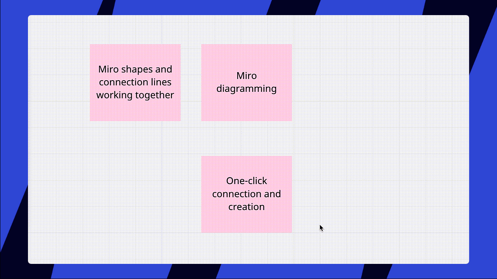

Working on an infinite whiteboard canvas, it's hard to resist the temptation to fill it with infinite content. But having strategic thinking is crucial when arranging board content. We've outlined several ways to structure board content and show relations between objects on the board.

## Auto layout

Align and distribute widgets on your Miro boards quicker with auto layout:

1. [Select the widgets](10-working-with-objects.md) you need to align.
2. Click on the grey icon in the upper right corner and drag it horizontally.

:::warning
Please note that this feature currently doesn't work in [table cells](../advanced-tools/05-grid.md).
:::

*Smart alignment of several widgets*

## Grouping

You can group multiple objects togetherby [selecting them](10-working-with-objects.md) and clicking the **group objects** button (or using **Ctrl + G** *for Windows* or **Cmd + G** *for Mac*). After that, they will behave as a single object (although you canstill edit each object within the group).

:::warning
You cannot group [mind map nodes](../advanced-tools/03-mind-map.md), objects within [tables](../advanced-tools/05-grid.md), [Kanban](../advanced-tools/02-columns-formerly-kanban.md), [USM](../advanced-tools/07-user-story-mapping.md), and objects located in different [frames.](../essential-tools/07-frames.md)
:::

*Group option in the object menu*

You can also group shapes and make a [custom template](../../getting-started/start-here/your-first-board/04-templates.md) out of them. To do that, choose three dots on the context menu and select **Save as template**.

:::tip
To move a single object within a group, double-click it and drag.
:::

*Moving an object within a group*

## Aligning

You can align multiple objects by [selecting them](10-working-with-objects.md) and clicking **Align objects** button on the context menu. Selected objects can be aligned horizontally, vertically, and on left/right sides in relation to each other. You can align any objects (such as sticky notes, pictures, frames, etc.).

:::warning
You cannot align grouped objects or objects within [tables](../advanced-tools/05-grid.md).
:::

*Aligning objects*

:::tip
Find more tips on how to arrange objects (filter, send to back, bring to front, etc.) in the article [Work smarter, not harder](21-work-smarter-not-harder.md).
:::

## Framing

All objects on a board can be separated into groups using the [frames](../essential-tools/07-frames.md) feature. To make this happen, select the **frames** tool on the creation toolbar and drag the cursor across the board to set the size of the frame.

You can also create a frame out of the existing objects. Simply [select them](10-working-with-objects.md) by dragging the cursor across, then click three dots on the context menu and choose **Create frame**.

*Creating a frame*

Frames allow you to structure it and manage the big picture easier. When you share [a link to a frame](16-internal-and-external-linking.md), it's much easier for your collaborators to find the necessary content.

Structuring the content will also be helpful for when you want to [export the board](../import-and-export/export/03-how-to-export-your-board.md): every frame can be considered a separate image or a page in a PDF document - or a slide in a [presentation](https://help.miro.com/hc/articles/360017731073).

:::tip
Check [the article about frames](../essential-tools/07-frames.md) to learn how to move and re-order, resize, duplicate, hide, export frames, and change frame color.
:::

## Linking

[Connection lines](../essential-tools/05-connection-lines.md) allow you to link objects on the board. This is helpful when building diagrams or creating mind maps.

There are two ways you can create a connection line:

- choose an arrow on the [toolbar](../../getting-started/start-here/your-first-board/05-toolbars.md) and draw a line
- select an object, click or drag one of the blue dots:
  - click the dot to automatically create a line or an object
  - drag the dot to connect the object to another one *manually*
    
    *One-click creation and connection in Miro*

## Frequently asked questions

1. *How can I change the size of my board?*
   - Miro board is endless and being expanded as long as new content is added. However, please note that boards with a large number of widgets become less smooth to navigate and load. Find out how you can improve board performance [here](../tools/troubleshooting/04-board-performance-and-loading-issues.md).
2. *How can I select multiple objects?*
   - Find the instructions [here](10-working-with-objects.md).
3. *I need to create links that lead to different parts of the board and put them in one place for easier navigation. How do I do that?*
   - Structure your board content by creating [frames](../essential-tools/07-frames.md), copy [links to the frames](16-internal-and-external-linking.md) and paste them in a specif place on your board or in [visual notes](../essential-tools/17-visual-notes.md). You can also navigate between frames on the [frames panel](../essential-tools/07-frames.md).
