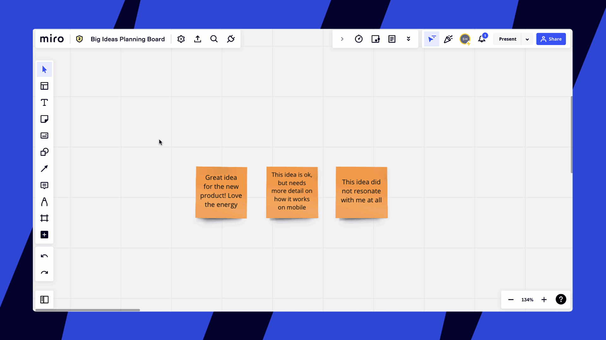

The clustering tool arranges sticky notes into containers, sorting them by tag, color, author, and keywords - or you can create your own cluster.

## How to cluster sticky notes

1. Drag the selection field across the cards, or select cards one by one while holding down **Shift** or **Ctrl** *(for Windows)* or **Command** *(for Mac)*
2. Click **Cluster objects** in the context menu
3. Select Cluster by **Color, Tag, Author, Keywords or Create a cluster**

*How to cluster stickies*

### How to cluster sticky notes by color

If you cluster by color, you need to manually add a title to each group of stickies.

*Clustering by color*

### How to cluster sticky notes by tag

If you cluster by [tag](../essential-tools/14-sticky-notes.md#tags), titles are generated automatically. If a sticky note has several tags, it will be duplicated in several clusters. If some stickies have no tag, they will be grouped in one cluster under a “no tag” title.

*Clustering by tag*

### How to cluster sticky notes by author

If you cluster by author, the name of each cluster is the name of the respective author who created those sticky notes.

*Clustering by author*

### How to cluster sticky notes based on your selection

If you choose **create a cluster**, all the selected stickies will be automatically grouped in one cluster. Once the cluster is created, you can move it to any place on your board.

1. Drag the selection field across the cards, or select cards one by one while holding down **Shift** or **Ctrl** *(for Windows)* or **Command** *(for Mac)*
2. Click **Cluster objects** in the context menu
3. **Click****C****reate a cluster**

*Creating a cluster*

### How to cluster by keywords

Use Cluster by keywords to jump-start the organization of thoughts and themes across sticky notes — a perfect tool for brainstorms, large workshops, or user research projects. This AI-powered feature can help you identify initial patterns, so you have more time to refine key data and get to core insights.

Cluster by keywords is supported for all Miro in-app languages. You can even cluster together sticky notes with text in different languages.

#### **How to cluster by keywords**

1. Drag the cursor to select the stickies you want to cluster
2. Click on the **c****luster objects** icon in the Context menu
3. Click **Keywords**
4. Miro will cluster similar stickies, and suggest keywords in the titles. Any stickies that aren’t similar are grouped into an #uncategorized cluster
5. You can then easily move clusters of categorized stickies around the board

*Clustering stickies by keywords*

### How to cluster by sentiment

You can use Cluster by sentiment to organize groups of similar opinions or points of view. This AI-powered tool allows your team to quickly see what's resonating and what isn't. Clustering is organized into three containers: Positive, Neutral, and Negative. The containers can be renamed to suit your team's needs.

Cluster by sentiment is supported for all Miro in-app languages. You can even cluster together sticky notes with text in different languages.

#### **How to cluster by sentiment**

1. Drag the cursor to select the stickies you want to cluster
2. Click on the **c****luster objects** icon in the Context menu
3. Click **Sentiment**
4. Miro will cluster similar stickies into three containers: Positive, Neutral, Negative. Any stickies that aren’t similar will typically fall into the Neutral container.
5. You can then easily move clusters of categorized stickies around the board or rename them to suit your team's needs

## Clustering containers

When you cluster objects on the board, they’re grouped into containers. All objects grouped in a container can easily be moved together around the board.

*Keywords clustered into containers*

To **rename a cluster**, double-click the title and start typing a new name.

*Renaming a cluster*

To **move a cluster**, click and drag the title of the container.

*Dragging a container around the board*

To **resize the container,** click the title then drag its borders to adjust the size.

*Resizing a container*

You can always **reorganize clustered content** by moving individual objects in and out of a container.

*Moving an object between containers*
