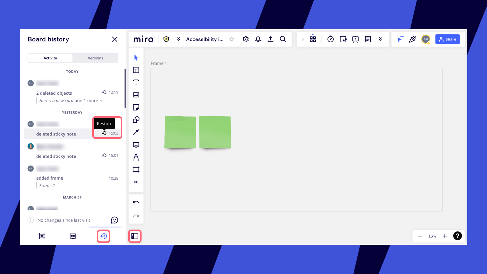

With the board content restoration functionality, you can be sure that accidental content deletion doesn’t get in the way of your team's productivity. Board editors can easily restore objects recently deleted from their boards.

:::tip
Check out [this guide](../managing-boards/12-board-history-versions.md) to learn how to restore a board version.
:::

### What content can be restored

- Any content deleted from the board during their current active session and 30 minutes after the content was deleted in case the session is over
- The last 1000 objects deleted from the board – if the restoration occurs more than 30 minutes after the content was deleted
- Any content deleted from the board if the objects were selected and deleted simultaneously for an indefinite period of time – until the next 1000 objects are deleted

### How to restore content

To restore deleted objects, do the following:

1. Click the **Open sidebar** icon on the bottom-left corner.
2. In the opened board overview, click the **Board history** icon.
3. Click the **Restore** icon on any object you wish to recover. The deleted objects will reappear on the board (exactly where they were before being deleted), and the board will zoom in to that part of the board.

*Restoring a deleted object*

### Limitations

> **⚠️** Please note, there will be edge cases when:

- content will be restored to a different part of the board (e.g. when a [connection line](../essential-tools/05-connection-lines.md) is restored and the [sticky note](../essential-tools/14-sticky-notes.md) it was attached to was repositioned on the board)
- content will lose its connection to the object it was linked to initially (e.g. when a [card](../essential-tools/02-cards.md) is deleted from a [table](../advanced-tools/05-grid.md), and then restored – it will be restored to the same part of the board but will not be attached to the table anymore)
- certain content will not be restored. Current limitations include:

- [lines](../essential-tools/05-connection-lines.md) that were connected to objects deleted from the board later
- text from a table cell if it was removed from the table (if the table was deleted together with the text, it will be restored)
- [user story map](../advanced-tools/07-user-story-mapping.md) (both the framework and the cards)
- [comments](../facilitation-tools/asynchronous-tools/01-comments.md) deleted separately

  
  *The banner that you get if some content has not been restored*

As a rule, if objects were deleted and then restored simultaneously, all links within this batch will be restored as well, but there is a chance that links to external objects outside the board will not be restored.

Note that [board duplicates](../managing-boards/03-how-to-duplicate-a-board.md) don't support the option to restore objects that were deleted on the original board.

### Frequently asked questions

1. *My content disappeared but I don't see the option to restore deleted objects. What do I do?*
   - Please note that certain content cannot be restored (please see the limitations above). If your content included other types of widgets, please:
   - make sure that you opened the correct board
   - check the list of your [custom templates](../../getting-started/start-here/your-first-board/02-custom-templates.md) with a similar name
   - check the board [mini-map](21-work-smarter-not-harder.md#board-navigation) to see whether there is content in different parts of the board
   - make sure that you are authorized in Miro under the correct email address if you have several Miro profiles.
