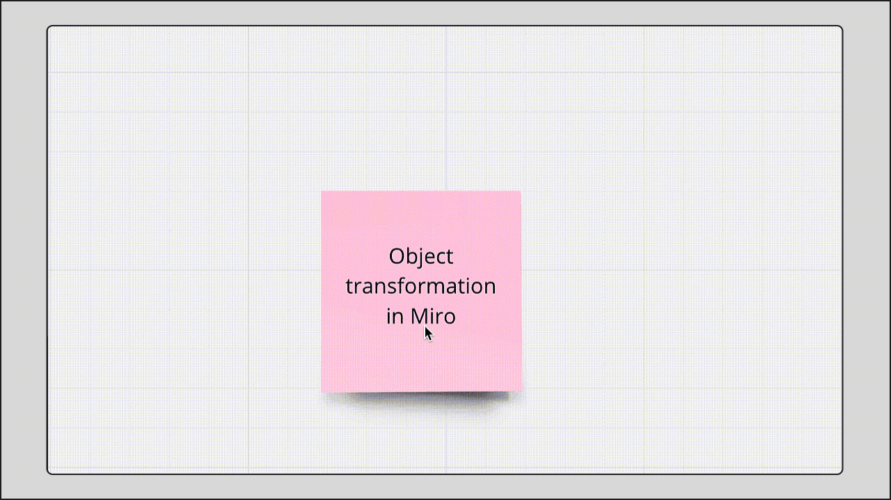
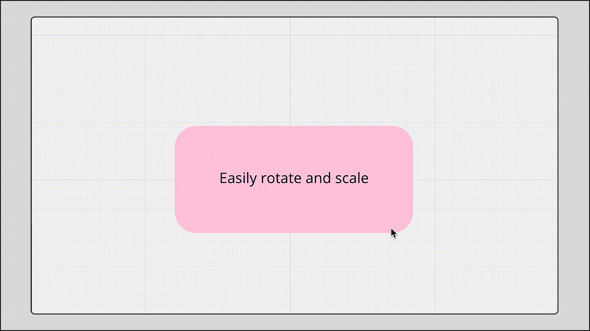

Change objects in your diagram in a flash with the **switch type** feature. It allows you to instantly transform one object into another, whether it’s a [sticky note](../essential-tools/14-sticky-notes.md), [a text box](../essential-tools/16-text.md), [a card](../essential-tools/02-cards.md) or [a shape](../essential-tools/11-shapes.md). Switch type is available for basic shapes and [diagramming shape packs](../formats/diagramming/01-miro-for-mapping-diagramming.md#available-shape-packs).

**To transform an object:**

1. Switch to the [**Select** tool](05-using-miro-with-a-mouse-trackpad-or-touchscreen.md#switching-between-the-pan-and-select-tool)
2. Click the object that you'd like to transform
3. Click the **switch type** icon on the object menu
4. Then select a new object from the dropdown

*Transforming a sticky note into a shape and a text box*

The text and the color of your object will stay the same. Please note that transforminga sticky note into a text or a shape discards emojis and tags. Turning a shape or a text box into a sticky note adjusts the color to a similar one because there are limited colors available for stickies.

You can also rotate objects on your board and scale them. [Select an object](05-using-miro-with-a-mouse-trackpad-or-touchscreen.md#switching-between-the-pan-and-select-tool) (the select tool should be enabled) and drag the special icon to rotate it. Note that certain objects (Kanban, mind map, tables) cannot be rotated.

To change the object size, drag the white dots. To change the width/length of a shape or a card, drag one of the object's sides.

*Rotating and scaling a shape*

Learn more about working with objects in [this article](21-work-smarter-not-harder.md).
