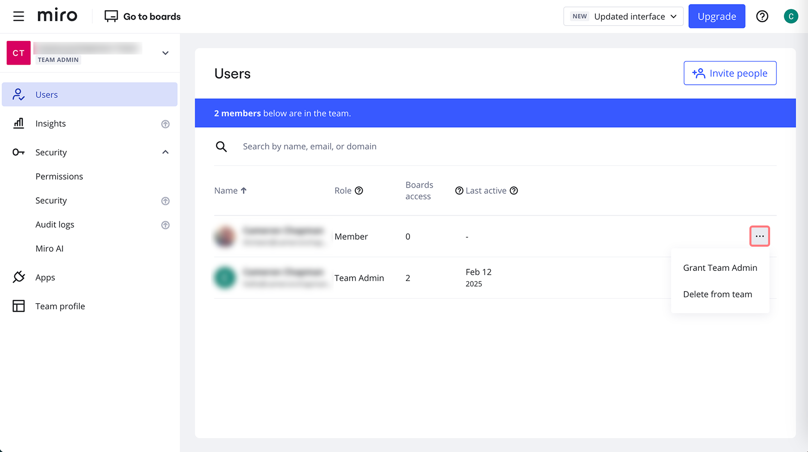
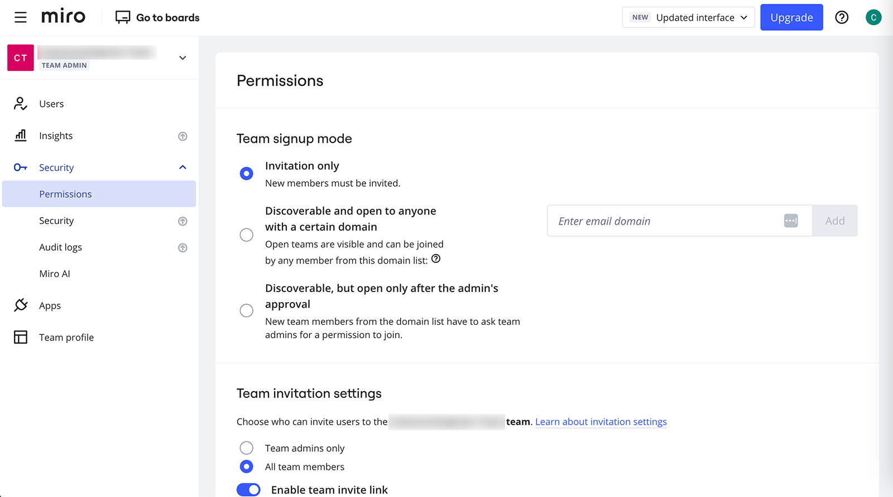

Der Leitfaden ist hilfreich für alle, die gerade ein kostenloses Miro-Team eingerichtet haben und mehr über die Verwaltungsoptionen erfahren möchten.

> **Einrichtung durch:** Team-Admins

Um deine Team-Einstellungen zu öffnen, klicke auf deinen Avatar in der oberen rechten Ecke des Dashboards und dann auf **Admin-Konsole**.

Free-Preisplan-Admins haben Zugriff auf die folgenden Bereiche der Admin-Konsole:

Verwalte deine Teammitglieder im Tab **Nutzer**. Lade neue Mitglieder ein, indem du auf die Schaltfläche **Personen einladen** in der oberen rechten Ecke klickst. Hinweis: Zum Free-Team eingeladene Personen haben Zugriff auf alle Boards im Team. Klicke auf die drei Punkte neben einem Nutzer, um [ihn zum Admin zu befördern](../user-management/06-how-to-manage-admin-roles.md) oder [ihn aus dem Team zu löschen](../user-management/08-remove-users.md).

*Verwalten von Nutzern im Free-Preisplan*

Sicherheit Free-Preisplan Admins können *zwei Arten von Berechtigungen* für ihr Team einrichten: **Modus für die Team-Anmeldung** und **Einstellungen für die Einladung**. Durch [die Konfiguration des Team-Anmeldemodus](../team-management/02-manage-team-signup-mode.md) kannst du dein Team für Personen in der Domain auffindbar machen. In den Einladungseinstellungen definieren Admins, wer neue Nutzer zum Team einladen und den Einladungs-Link für das Team aktivieren bzw. deaktivieren kann. Auf diesem Tab findest du auch die **Einstellungen für das Freigeben**.

>  [Führe ein Upgrade deines Teams durch](../../plans-billing/manage-your-subscription-and-plan/03-upgrade-your-plan.md) zur Konfiguration der Board-Freigabe und der Content-Berechtigungen.

Berechtigungseinstellungen im Free-Preisplan

Auf dem Tab **Apps** kannst du neue Apps für dein Team installieren. Hinweis: Einige Integrationen werden im Free-Preisplan nicht unterstützt. Um eine App zu deinstallieren, wähle sie aus der Liste – dadurch öffnet sich das Profil der App, wo du die Schaltfläche Für Team deinstallieren findest.

In dem Tab **Teamprofil** kannst du [den Teamnamen und das Logo ändern](../team-management/04-update-team-name-or-logo.md). Unter den **Details deines Preisplans** siehst du die Möglichkeit, deinen Preisplan zu upgraden, indem du auf **Preisplan ändern** klickst. Darunter findest du die Gesamtzahl der Boards und die Anzahl der Teammitglieder.
