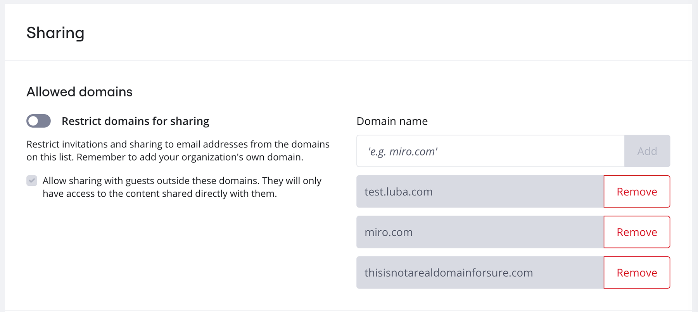
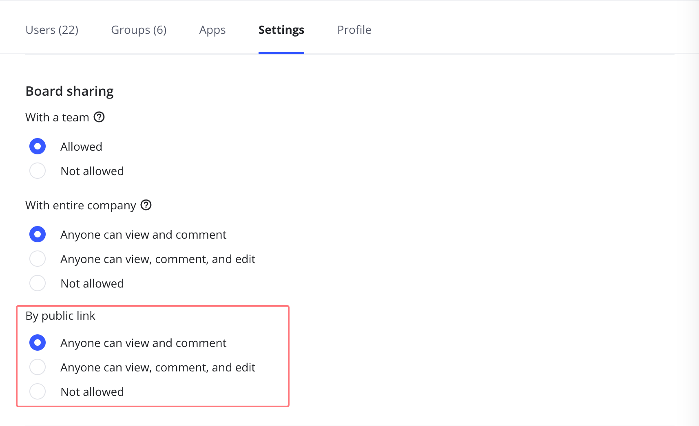
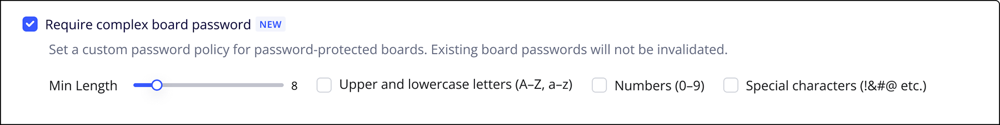
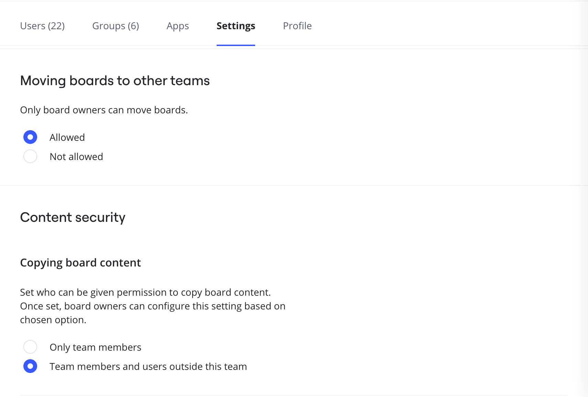
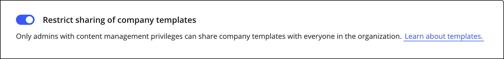

Datensicherheit und Vertraulichkeit sind für die meisten Unternehmen ein wichtiges Anliegen. Aus diesem Grund bietet unser Enterprise-Preisplan leistungsstarke Tools für die Kontrolle von Informationssicherheitsrisiken. Dazu gehören eine sicherere Zugriffsverwaltung mit der SAML-basierten Single Sign-on-Option und eine bessere Kontrolle der Nutzerrechte und -berechtigungen mit erweiterten Admin-Funktionen. Zusätzlich führen wir optionale Einschränkungen ein: Freigabe außerhalb der erlaubten Domains und Freigabe über einen öffentlichen Link.

:::note
Die Einstellungen der Freigaberichtlinie beeinflussen auch die verfügbaren Zugriffseinstellungen beim Einbetten von Boards in eine bestimmte App. Mehr erfahren: [Freigaberichtlinie bei Enterprise-Plänen für die Einbettung von Integrationen verwalten](../../managing-apps-on-enterprise-plan/05-how-to-allow-or-restrict-embedding-miro-boards-in-supported-apps.md).
:::

## Freigabe außerhalb der erlaubten Domains einschränken

Auf Unternehmensebene Auf Teamebene

Sobald du erlaubte Domains auf Unternehmensebene festgelegt hast, ist die Option zum Freigeben von Boards außerhalb der Domains für alle Unternehmensmitglieder und -teams eingeschränkt.

1. Gehe zu **Unternehmenseinstellungen** >**Sicherheit** >**Freigabe**.
2. Aktiviere **Erlaubte Domains einschränken**.
3. Füge die Liste der vertrauenswürdigen Domains hinzu, die in deinem Enterprise-Preisplan verwendet werden.

Um die Freigabe für [Gast-Mitwirkende](../../../using-miro/sharing-boards/07-collaboration-with-guests.md) zu ermöglichen und die Zulassungsliste zu umgehen, aktiviere das Kontrollkästchen **Freigabe für Gäste außerhalb dieser Domains zulassen**.

Wenn **Freigabe für Gäste außerhalb dieser Domains zulassen** aktiviert ist, können Nutzer mit Domains außerhalb der Zulassungsliste Boards mit ihnen teilen, aber sie können trotzdem keine Teams unter [Team-Auffindbarkeit](../../managing-enterprise-teams-and-content/11-manage-team-privacy-and-discovery-on-enterprise-plan.md) finden.

*Die Liste der vertrauenswürdigen Domains und die Option zur Freigabe für Gäste außerhalb dieser Domains*

Alle Nutzer, die zum Abo eingeladen wurden, bevor die Einstellung aktiviert wurde, bleiben in deinem Preisplan und behalten den Zugriff auf die freigegebenen Inhalte. Allerdings wird es nicht möglich sein, andere Inhalte mit ihnen zu teilen.

Außerdem kannst du **alle Nutzer anhand der Zulassungsliste bestätigen**, falls es Nutzer gibt, deren Domain nicht erlaubt ist. Du kannst sie im folgenden Pop-up entfernen:

*Nutzer, deren E-Mail-Adressen nicht mit der Zulassungsliste übereinstimmen*

Wenn du den Zugriff auf Teamebene einschränkst, können Nutzer außerhalb der erlaubten Domains nicht auf das Team oder die Boards darin zugreifen oder dazu eingeladen werden. Die Option ermöglicht es dir, die Einstellungen für ein bestimmtes Team zu aktivieren, ohne die Freigaberegeln für alle Enterprise-Nutzer einzuschränken. Darüber hinaus bietet es dir die Möglichkeit, eine bestimmte Domain für ein Team zuzulassen, ohne sie für das gesamte Unternehmen erlauben zu müssen.

:::note
Wenn die Domänen auf der Zulassungsliste nicht auf Teamebene konfiguriert sind, gelten die Unternehmenseinstellungen. Wenn die Zulassungsliste auf Teamebene konfiguriert ist, hat sie Vorrang vor den Einschränkungen auf Unternehmensebene. Zum Beispiel, wenn **Domain 1** auf Unternehmensebene auf der Zulassungsliste steht und **Domain 2** auf Teamebene, wird **Domain 1** auf Teamebene nicht erlaubt sein, es sei denn, sie wird zur Zulassungsliste auf Teamebene hinzugefügt.
:::

So konfigurierst du die erlaubten Domains für ein bestimmtes Team:

1. Gehe zu **Teams** und wähle das Team aus, das du konfigurieren möchtest.
2. Gehe zu **Einstellungen** und scrolle nach unten zu **Erlaubte Domains für das Team**.
3. Aktiviere die Umschaltoption **Erlaubte Domains einschränken**.
4. Gib deine erlaubten Domains ein und klicke auf **Hinzufügen**.
   Um die Freigabe für Gäste außerhalb der Domains zu erlauben, aktiviere das Kontrollkästchen **Freigabe für Gäste außerhalb der erlaubten Domains aktivieren**.

*Die Option zur Beschränkung erlaubter Domains für ein bestimmtes Team innerhalb eines Enterprise-Abos*

Sobald du die Freigabe außerhalb der erlaubten Domains einschränkst, können die Nutzer des Unternehmens ihre Boards nur mit Personen aus den angegebenen Domains teilen. Wenn die Einstellung aktiviert ist und ein Unternehmensnutzer versucht, sein Board mit einer nicht erlaubten Domain zu teilen, erhält er folgende Meldung:

*Das Board kann nicht mit einem Nutzer geteilt werden, dessen Domain nicht in der Zulassungsliste enthalten ist*

:::note
Wenn die Freigabe über einen öffentlichen Link in deinem Unternehmen erlaubt ist, können [öffentliche Boards](../../../using-miro/sharing-boards/03-sharing-boards-and-inviting-collaborators.md) weiterhin von *jedem mit dem Board-Link* (und Passwort, falls eingerichtet) aufgerufen werden.
:::

## Freigabe über einen öffentlichen Link einschränken

Unternehmens-Admins können alle Unternehmensnutzer oder Mitglieder eines bestimmten Teams daran hindern, [Unternehmens-Boards öffentlich zu teilen](../../../using-miro/sharing-boards/03-sharing-boards-and-inviting-collaborators.md). Sobald die Einstellung deaktiviert ist, verschwindet die Option **Jeder mit dem Link** aus dem Freigabemenü der Boards im Unternehmen oder Team.

Auf Unternehmensebene Auf Teamebene

So schränkst du die öffentliche Freigabe für alle Nutzer des Unternehmens ein:

1. Gehe zu **Unternehmen** **Einstellungen >** **Sicherheit > Freigabe**.
2. Schalte **Boards können öffentlich geteilt werden** aus.

Dadurch wird die Option „Jeder mit dem Link” aus dem Freigabemenü des Boards entfernt. Dies bedeutet auch, dass alle Boards, die zuvor mit einem öffentlichen Link geteilt oder auf Webseiten eingebettet wurden, für öffentliche Nutzer nicht mehr verfügbar sind und ihre aktiven Sitzungen in den Boards geschlossen werden.

Wenn Admins die Möglichkeit zur öffentlichen Freigabe von Boards erneut aktivieren, müssen die Nutzer die öffentliche Freigabe für jedes Board manuell reaktivieren.

Falls du die Bearbeitung auf öffentlich freigegebenen Boards zulassen möchtest, aktiviere die Option **Bearbeitung auf öffentlich freigegebenen Boards zulassen***.* Wenn du *das Kästchen deaktivierst,* wird der öffentliche Zugriff auf alle Boards, die zuvor für die öffentliche Bearbeitung freigegeben wurden, eingeschränkt.

:::note
Freigabe über einen öffentlichen Link ist standardmäßig auf Teamebene aktiviert und auf „Jeder kann ansehen und kommentieren“ für neu erstellte Teams festgelegt. Wenn dies jedoch auf Unternehmensebene **deaktiviert** ist, können Teams keine Boards öffentlich freigeben, selbst wenn dies auf Teamebene erlaubt ist.
:::

So schränkst du die öffentliche Freigabe von Boards für ein bestimmtes Team ein:

1. Gehe zu **Teams** und wähle das Team aus, das du konfigurieren möchtest.
2. Gehe zu **Einstellungen** und scrolle nach unten zu **Freigabeeinstellungen**.
3. Unter **Board-Freigabe** > **Über öffentlichen Link** siehst du drei Optionen: Du kannst auswählen, ob du die Freigabe öffentlich nur für das Ansehen und Kommentieren zulassen möchtest, für das Ansehen, Kommentieren und Bearbeiten oder um die öffentliche Freigabe für das Team einzuschränken.

*Die Option zur Konfiguration der Freigabe über einen öffentlichen Link für ein Team innerhalb des Enterprise-Abos*

**Ablauf des öffentlichen Links (Unternehmensebene)**

Um die Sicherheit öffentlich freigegebener Boards zu erhöhen, aktiviere den Ablauf des öffentlichen Links. Dies bedeutet, dass alle Links zum Board, die für Besucher freigegeben werden, nach einer gewissen Zeit nicht mehr funktionieren, wenn das Board nicht geöffnet wurde. Dies gilt für alle Boards, sobald der Ablauf der öffentlichen Links in den Unternehmenseinstellungen aktiviert ist.

So aktivierst du den Ablauf der öffentlichen Links:

1. Gehe zu **Unternehmenseinstellungen > Sicherheit > Freigabe**.
2. Scrolle nach unten zum Abschnitt **Inhalt**.
3. Aktiviere das Kästchen für **öffentlichen Freigabelink ablaufen lassen**.
4. Lege die Anzahl der Tage bis zum Ablauf inaktiver Links fest. Du kannst zwischen 30 und 999 Tagen wählen.

:::warning
Wenn das Passwort für ein Board zurückgesetzt wird, wird auch das Ablaufdatum für dieses Board zurückgesetzt.
:::

## Passwörter für öffentliche Boards verlangen (Unternehmensebene)

Du kannst auch obligatorische Passwörter für alle Boards erzwingen, die über einen Link öffentlich freigegeben werden.

1. Gehe zu **Unternehmenseinstellungen > Sicherheit > Freigabe**.
2. Scrolle nach unten zum Abschnitt **Inhalt**.
3. Aktiviere das Kästchen **Passwörter für öffentlich freigegebene Boards erforderlich**.

Sobald diese Funktion aktiviert ist, gilt dies sofort für Boards, die zuvor über einen öffentlichen Link zugänglich waren, und alle Boards, die in Zukunft öffentlich zugänglich sein werden, können nicht mehr ohne Passwort aufgerufen werden.

- *Für Boards, die zuvor über einen* [*öffentlichen Link*](../../../using-miro/sharing-boards/03-sharing-boards-and-inviting-collaborators.md) *ohne Passwörter zugänglich waren:*
  Wenn Boards zuvor über einen öffentlichen Link ohne Passwörter zugänglich waren, werden offene Sitzungen widerrufen und die Besucher werden zur Eingabe eines Passworts aufgefordert, wenn sie versuchen, auf einen zuvor zugänglichen Link zuzugreifen.
- *Für alle Boards:*
  Um ein Board über einen Link öffentlich zugänglich zu machen, muss von der Person mit Eigentum über das Board oder vom [Content-Admin](../../managing-enterprise-teams-and-content/12-content-admin-permissions.md) ein Passwort festgelegt werden. Wenn ein Passwort entfernt wird, wird die Option **Jeder mit dem Link** im Freigabemenü der Boards in **Kein Zugriff** umgewandelt. Teammitglieder mit Bearbeitungsrechten können ein Board über einen öffentlichen Link freigeben, wenn das Passwort bereits festgelegt wurde. Andernfalls müssen sie den Eigentümer des Boards kontaktieren, um ein Passwort festzulegen.
- Wenn die Option „*Link ablaufen lassen, wenn Board inaktiv für 'x' Tage*“ festgelegt ist, erscheint im Freigabedialog ein Uhrsymbol mit der Meldung, dass der öffentliche Zugriff nach der angegebenen Anzahl von Tagen verschwindet.
  
*Öffentliche Freigabeoption im Enterprise-Preisplan mit obligatorischen Passwörtern*

Du kannst auch verlangen, dass Passwörter komplex sind und festlegen, welche Anforderungen sie erfüllen müssen. Diese können umfassen:

- Minimale Passwortlänge (von 6–14 Zeichen; Standard ist 8).
- Groß- und Kleinbuchstaben.
- Zahlen.
- Sonderzeichen.

*Einstellungen für komplexe Board-Passwörter*

## Einschränkung der team- und unternehmensweiten Freigabe (Teamebene)

:::note
Die team- und unternehmensweite Freigabe ist standardmäßig aktiviert, wenn die Einstellungen nicht vom Unternehmens-Admin angepasst worden sind.
:::

Unternehmens-Admins von Enterprise-Preisplänen können auch die unternehmensweite oder teamweite Freigabe aktivieren bzw. deaktivieren.

1. Gehe zu **Teams** und wähle das Team aus, das du konfigurieren möchtest.
2. Gehe zu **Einstellungen** und scrolle nach unten zu **Freigabeeinstellungen**.
3. In **Board-Freigabe** wähle aus, ob die Freigabe für ein Team erlaubt oder nicht erlaubt ist. Für unternehmensweite Einstellungen wähle aus, ob das Unternehmen freigegebene Boards nur ansehen und kommentieren oder auch bearbeiten darf oder ob die Freigabe nicht erlaubt sein soll.*Board-Freigabeeinstellungen im Enterprise-Preisplan*

Durch das Aktivieren der Board-Freigabe für ein Team können Teammitglieder ihre Boards und Projekte einfach mit dem gesamten Team teilen.

Durch Deaktivierung dieser Option wird sie aus dem Freigabemenü von Team-Boards und Projekten entfernt. Zuvor freigegebene Boards und Projekte sind für Teamnutzer nicht mehr verfügbar, es sei denn, sie werden auf andere Weise freigegeben.

Wenn der Admin die Möglichkeit zur Freigabe für das Team erneut aktiviert, werden zuvor freigegebene Boards und Projekte nicht automatisch für das Team freigegeben, und die Nutzer müssen sie erneut manuell freigeben.

*Die Option, ein Board mit dem Team zu teilen, kann im Freigabemenü ausgeblendet werden*

Nutzer auf Enterprise-Preisplänen mit deaktiviertem [Vertraulichkeitsschutz für Teams](../../managing-enterprise-teams-and-content/11-manage-team-privacy-and-discovery-on-enterprise-plan.md) können auch [ihre Boards mit dem gesamten Unternehmen zum Ansehen, Kommentieren oder Bearbeiten mit einem Klick freigeben](../../../using-miro/sharing-boards/03-sharing-boards-and-inviting-collaborators.md). Du kannst diese Option für ein bestimmtes Team sperren, indem du unter der Einstellung **Für das ganze Unternehmen** die Option **Nicht erlaubt** auswählst. Oder du kannst die Freigabe nur für das Ansehen und Kommentieren oder auch für das Bearbeiten zulassen.

Bitte beachte: Wenn der [Vertraulichkeitsschutz für Teams](../../managing-enterprise-teams-and-content/11-manage-team-privacy-and-discovery-on-enterprise-plan.md) in deinem Unternehmen aktiviert ist, ist die Option, Boards für das gesamte Unternehmen freizugeben, auch dann nicht verfügbar, wenn dies auf Teamebene erlaubt ist.

*Die Option, das Board für das gesamte Unternehmen freizugeben, kann im Freigabemenü ausgeblendet werden*

## Einschränkung der Möglichkeit, Boards in andere Teams zu verschieben (Teamebene)

:::note
Die Fähigkeit, Boards in andere Teams zu verschieben, ist standardmäßig aktiviert, wenn die Einstellung nicht vom Unternehmens-Admin angepasst wurde.
:::

Wenn ein Unternehmens-Admin das Verschieben von Boards für ein Team nicht zulässt, können die Mitglieder dieses Teams keine Boards in andere Teams oder aus diesem Team verschieben. Die Einstellung ist für jedes Team in **Teameinstellungen > Berechtigungen** konfiguriert.

:::note
Nutzer ohne Administratorrechte können Boards nicht in ein Team verschieben, wenn die [Option zum Erstellen von Boards](../../managing-enterprise-teams-and-content/10-team-permissions-on-enterprise-plan.md) im Zielteam für sie eingeschränkt ist.
:::

*Die Option, das Verschieben von Boards in und aus dem Team zu beschränken*

## Unternehmensweite Freigabe eigener Vorlagen beschränken

> **Erhältlich für:** Enterprise-Preisplan
> **Verfügbar für:** Unternehmens-Admins

Unternehmens-Admins können die Freigabe eigener Vorlagen auf Unternehmensebene zulassen oder einschränken. Wenn die Freigabe eingeschränkt ist, können Teammitglieder keine eigene Vorlage ohne Admin-Genehmigung für das Unternehmen freigeben.

1. Gehe zu **Unternehmenseinstellungen** > **Sicherheit** > **Einstellungen**.
2. Scrolle nach unten zu **Rollen und Berechtigungen**.
3. Aktiviere **Freigabe von Unternehmensvorlagen einschränken**.

*Die Option, die Freigabe von Unternehmensvorlagen zu beschränken*

## Häufige Fragen

Erhalten Mitglieder Benachrichtigungen, wenn Unternehmens-Admins die oben genannten Freigabeeinstellungen auf Team- oder Unternehmensebene ändern?

Nein, in solchen Fällen erfolgt keine Benachrichtigung. Die Regeln werden sofort angewendet.

Gibt es ein Dashboard, auf dem wir alle Boards verfolgen können, die mit einem öffentlichen Link geteilt werden?

Derzeit gibt es kein solches Dashboard.

Ich habe die Option zum Einschränken von erlaubten Domains deaktiviert, aber wir können immer noch keine Boards für Nutzer außerhalb der erlaubten Domains freigeben. Wie kann ich das beheben?

Es ist möglich, dass die Einstellung weiterhin auf Unternehmens-/Teamebene aktiviert ist. Bitte prüfe nach, ob die Einschränkung in den Unternehmenseinstellungen oder Teameinstellungen deaktiviert ist.
