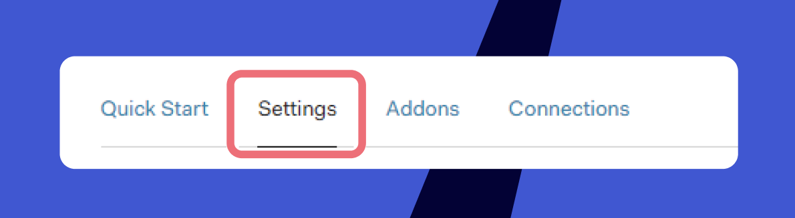
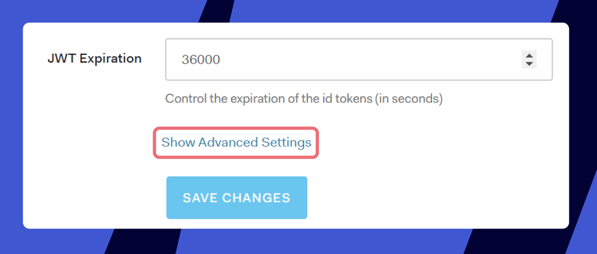
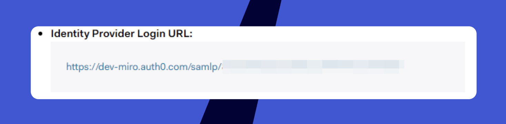

*Es wird dringend empfohlen, die Funktion in einem separaten Inkognito-Modus-Fenster deines Browsers zu konfigurieren.* *Auf diese Weise bleibt die Sitzung im Standardfenster und du kannst die SSO-Autorisierung deaktivieren, falls etwas nicht richtig konfiguiert ist.*

Wenn du eine Testinstanz einrichten möchtest, bevor du SSO für die Produktion aktivierst, fordere sie bitte bei deiner Kontaktperson bei Miro oder bei deinem/deiner Miro-Vertriebsberauftragten an. Es werden nur diejenigen zu dieser Testinstanz hinzugefügt, die SSO konfigurieren.

## Erstellen der Miro-Anwendung innerhalb deines Tenants

1. Erstelle die Anwendung in deiner **Anwendungsliste**.
   create_application_button.jpg
   *Auth0 Anwendungsabschnitt*
2. Wähle den App-Typ **Reguläre Webanwendungen**.
   application_types_list.jpg
   *Liste der App-Typen*
3. Geh zum Tab **Settings** und stelle sicher, dass du die aufgeführten Optionen genau so auswählst, wie unten beschrieben.
   


   |  |  |
   | --- | --- |
   | **Token Endpoint Authentication Method** | POST |
   | **Allowed Callback URLs** | `https://miro.com/sso/saml` |
   | **Application Login URI** | `https://miro.com/sso/saml` |
   | **Allowed Origins (CORS)** | h[ttps://miro.com/](https://miro.com/) |
   | **JWT Expiration** | 36000 (Standardeinstellung) |
4. Klicke auf **Erweiterte Einstellungen anzeigen:**
   

   und gehe dann zu **Zertifikate** und kopiere dein x509 Signing Certificate:
   copy_the_certificate.jpg
   *Tab "Erweiterte Einstellungen" in Auth0*
5. Wechsle zu Miro und öffne deine SSO-Einstellungen (Business-Preisplan-Admins finden die Einstellungen auf dem Tab **Sicherheit**, Enterprise-Preisplan-Admins müssen zum Tab **Enterprise-Integrationen** gehen) und füge dann das **x509-Signaturzertifikat** in das entsprechende Feld ein, wie auf dem Screenshot unten gezeigt:
   certificate_in_Miro_SSO_settings.jpg
   *Miro **Security** Tab mit SAML-Einstellungen*

## Konfigurieren von SAML für die Anwendung

1. Gehe zurück zur Konfigurationsseite der App Auth0 und wähle den Tab **Addons** und das Addon **SAML2**:
   add-ons_catalog.jpg
   *Auth0 Add-ons Katalog*Es erscheint ein Pop-up-Fenster mit den Einstellungen für die Anfrage und der URL **Application Callback:
   add-on_settings.jpg***Tab " **Addon-Einstellungen***
2. Stelle sicher, dass die **URL** auf **`https://miro.com/sso/saml` eingestellt ist [.](https://miro.com/sso/saml)**Die **Einstellungen für** die Anfrage sollten auf folgende Werte gesetzt werden:

   ```
   {
    "nameIdentifierFormat": "urn:oasis:names:tc:SAML:1.1:nameid-format:emailAddress",
    "nameIdentifierProbes": [
    "http://schemas.xmlsoap.org/ws/2005/05/identity/claims/emailaddress"
    {
   {
   ```
3. Schalte die Tabs auf **Nutzung** um und kopiere die **Identitätsanbieter Login URL:**mceclip2.png
   *Identitätsanbieter Login URL Feld in Auth0*
4. Wechsle erneut zu Miro und füge die URL in das Feld**SAML Sign-in URL** ein.
5. Klicke auf **Speichern**, damit die Einstellungen für deinen Miro-Preisplan übernommen werden.

## Überprüfen der Konfiguration

Du kannst jetzt zurück zur Auth0-Konsole gehen und wieder zum Tab **Settings** des Add-ons wechseln.  Klicke auf Debug, um den Anmeldeversuch einzuleiten.

debug.jpg
Auslösen des Anmeldeversuchs.

Dadurch wird der IdP-Anmeldeversuch eingeleitet, woraufhin du dir die Ergebnisse ansehen kannst.

Falls Probleme auftreten sollten, kannst du dich gerne [an unser Supportteam wenden](../../../using-miro/tools/troubleshooting/06-contacting-miro-support.md).

## SSO-Konfiguration in Miro testen

1. Führe die obigen Schritte aus, um deine SSO-Einstellungen zu konfigurieren.
2. Klicke auf die Schaltfläche **SSO-Konfiguration testen**.
3. Überprüfe die Ergebnisse:

- Wenn keine Probleme gefunden werden, wird die Meldung **SSO Konfigurationstest war erfolgreich** angezeigt.
- Wenn Probleme gefunden werden, wird die Meldung **SSO-Konfigurationstest fehlgeschlagen** angezeigt, gefolgt von detaillierten Fehlermeldungen, die dir zeigen, was behoben werden muss.


*SSO-Konfiguration in Miro testen*
