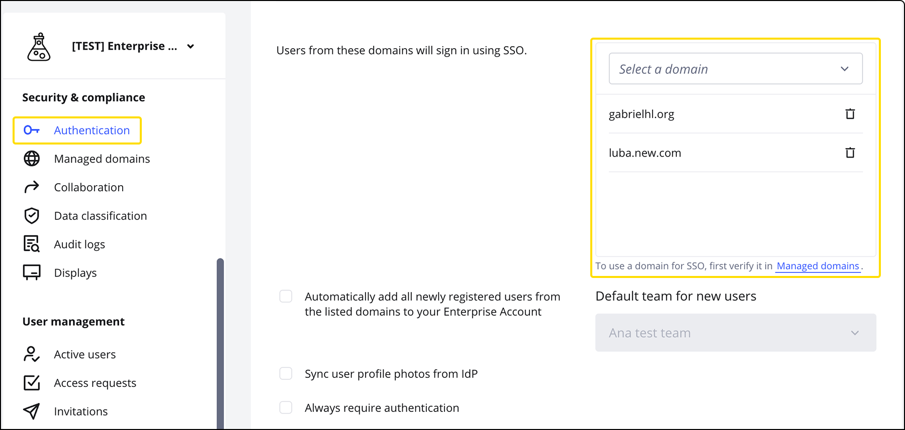
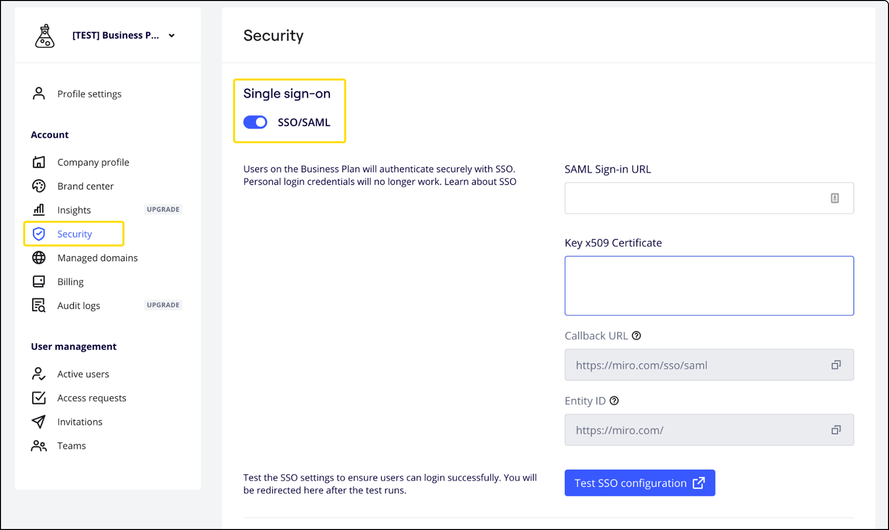
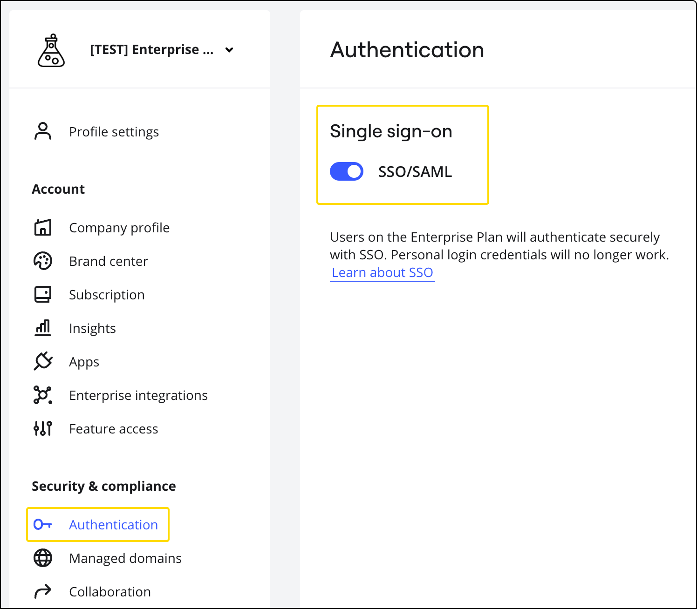
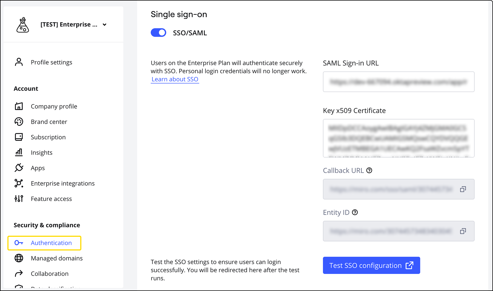
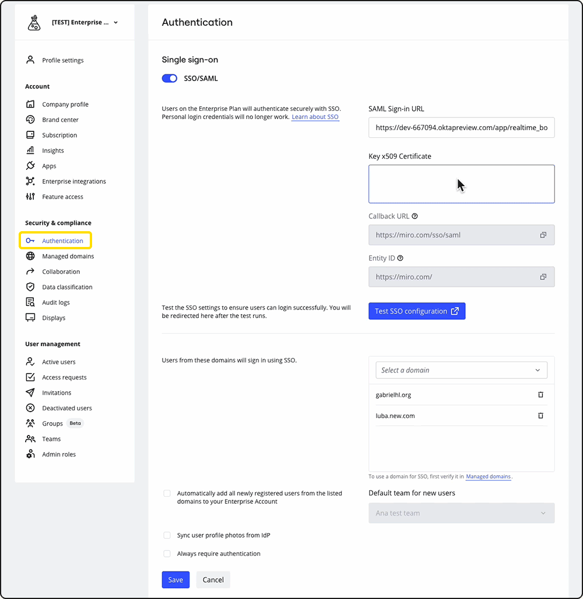
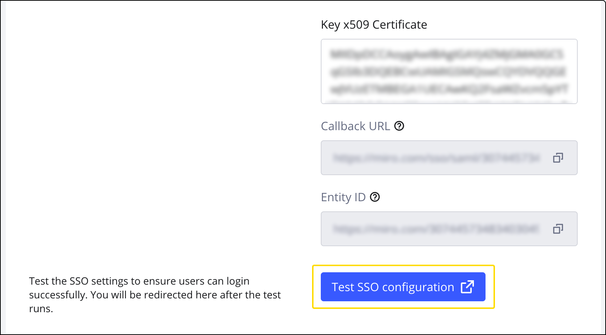

Mit SAML-basiertem Single Sign-on (SSO) können Nutzer über einen Identitätsanbieter (IdP) ihrer Wahl auf Miro zugreifen.

> **Erhältlich für:** Business-Preisplan, Enterprise-Preisplan
> **Erforderliche Rolle:** Unternehmens-Admin

## So funktioniert SAML SSO

1. Wenn jemand versucht, sich über SSO bei Miro anzumelden, sendet Miro eine SAML-Anfrage (Security Assertion Markup Language) an den Identitätsanbieter (IdP)
2. Der Identitätsanbieter validiert die Anmeldeinformationen der Person und sendet eine Antwort an Miro, um die Identität des Mitglieds zu bestätigen
3. Miro bestätigt die Antwort und gewährt Zugriff, sodass sich das Mitglied bei seinem Miro-Konto anmelden kann

## Was passiert nach der Aktivierung von SSO?

**Erstmalige Aktivierung von SSO**

Wenn du SSO zum ersten Mal einrichtest, können bestehende Nutzer ohne Unterbrechung weiter in Miro arbeiten. Wenn sie sich jedoch das nächste Mal abmelden, ihre Sitzung abläuft oder sie versuchen, sich von einem neuen Gerät aus anzumelden, müssen sie sich über SSO anmelden.

Alle anderen Anmeldeoptionen werden deaktiviert, einschließlich Standardanmeldung + Passwort, Google, Facebook, Slack, AppleID und O365.

**Time-out bei Inaktivität**

Wenn du [Time-out bei Inaktivität](../../security-integrations/security-management/02-idle-session-timeout.md) aktiviert hast, werden die Personen automatisch aus ihrem Miro-Profil abgemeldet und müssen sich erneut über SSO autorisieren.

**Mehrere Teams und Unternehmen**

Wenn deine Nutzenden in mehreren Miro-Teams oder -Unternehmen sind, kannst du es so konfigurieren, dass sie denselben Identitätsanbieter für die Authentifizierung verwenden.

**Wer muss sich mit SSO anmelden?**

Die Anmeldung über SSO ist nur für aktive Personen obligatorisch, die Teil deines Enterprise-Abos sind *und* für die eine Domain in deiner SSO-Konfiguration aufgeführt ist.

- Nutzer, die von Domains auf Miro zugreifen, die nicht in deinen SSO-Einstellungen hinzugefügt wurden, müssen sich nicht mit SSO anmelden, sondern sollten stattdessen die Standard-Anmeldemethoden verwenden.
- Nutzer aus einer bestätigten Domain, die nicht Teil deines Miro Enterprise-Abos sind, müssen sich nur über SSO anmelden, wenn die [Just-in-Time-Bereitstellung (JIT)](../../user-management/13-user-provisioning-on-enterprise-plan.md) aktiviert ist. Diese Personen werden automatisch zu einem vorkonfigurierten Team hinzugefügt und müssen SSO für die Anmeldung verwenden.
- [Verwaltete Nutzer, d. h. alle Nutzer](../../user-management/06-managed-users-on-enterprise-plan.md) innerhalb deiner bestätigten Domain(s), einschließlich aller verwalteten Nutzer, die auch Mitglied eines Teams außerhalb deines Enterprise-Abos sind. Um den Zugriff auf bestimmte Teams zu beschränken, aktualisiere die Einstellungen für die [Domainsteuerung](../../canvas-25-admin-features/domain-control/01-domain-control.md).
  > ✏️ Bei einem Enterprise-Abo kann eine Organisation über bestätigte und nicht bestätigte Domains verfügen. Bei bestätigten Domains werden die Nutzer zu verwalteten Nutzern, die sich mit SSO authentifizieren müssen. Für nicht bestätigte Domain Nutzer in der gleichen Organisation sind E-Mail und Passwort zur Authentifizierung erforderlich.

**Nutzerdaten verwalten**

Die Nutzerdaten werden nach erfolgreicher Anmeldung automatisch von deinem Identitätsanbieter in Miro zugewiesen. Einige Parameter wie Name und Passwort können nicht geändert werden. Andere Parameter wie Abteilung und Profilbilder sind optional.  /span>

- Die Nutzernamen bei Miro werden nach jeder erfolgreichen Authentifizierung aktualisiert. Weitere Informationen zum Einrichten von Nutzernamen bei Miro findest du in den erweiterten SSO-Einstellungen. Wenn du die E-Mail-Adresse einer Person ändern musst, kannst du dies nur über [SCIM](../../security-integrations/system-for-cross-domain-identity-management-scim/02-scim.md) tun. Wenn du kein SCIM verwendest, [wende dich bitte an das Support Team](https://help.miro.com/hc/requests/new?referer=help-center-article).


*Domainauswahl in den SSO-Einstellungen*

> **💡**Um eine Profilsperre zu verhindern, erstelle ein provisorisches Nutzerkonto mit einer E-Mail-Adresse, die eine Domain hat, die nicht in den SSO-Einstellungen aufgeführt ist, wie provisorischernutzer@gmail.com. Andernfalls kannst du dich an den Support wenden, der SSO für die gesamte Organisation deaktivieren kann.

## Konfiguration von SSO

### Identitätsanbieter (IdP)

Verwende einen Identitätsanbieter deiner Wahl. Dies sind die beliebtesten Identitätsanbieter:

- [OKTA](../../security-integrations/single-sign-on-sso/07-how-to-configure-okta-sso.md)
- [Entra ID](../../security-integrations/single-sign-on-sso/05-how-to-configure-entra-id-sso.md) von Microsoft
- [OneLogin](../../security-integrations/single-sign-on-sso/08-how-to-configure-onelogin-sso.md)
- [ADFS](../../security-integrations/single-sign-on-sso/02-how-to-configure-adfs-sso.md) von Microsoft
- [Auth0](../../security-integrations/single-sign-on-sso/03-how-to-сonfigure-auth0-sso.md)
- [Google SSO](../../security-integrations/single-sign-on-sso/06-how-to-configure-google-sso.md)
- [Jumpcloud SSO](https://support.jumpcloud.com/support/s/article/single-sign-on-sso-with-miro)

### So konfigurierst du deinen IdP

> **** [Wenn dein Unternehmen mehrere Identitätsanbieter](../../security-integrations/single-sign-on-sso/01-adding-multiple-identity-providers.md) (IdPs) hinzufügen möchte, registriere dich für unsere [private Beta-Version](https://coda.io/form/Miro-Multi-IdP-Private-Beta-Sign-Up_dkoTJMza_jV).

1. Gehe zum Konfigurationsbereich deines Identitätsanbieters und folge den Anweisungen des Anbieters, um Single Sign-On zu konfigurieren.

2. Füge die folgenden Metadaten hinzu. Wir empfehlen, alle optionalen Felder auszulassen und die Standardwerte beizubehalten.

#### Spezifikationen (Metadaten)

|  |  |
| --- | --- |
| **Protokoll** | SAML 2.0 |
| **Binding** | HTTP-Redirect für SP zu IdP HTTP Post für IdP an SP |
| **Die Service-URL** (von SP initiierte URL)  Auch bekannt als Launch-URL, Antwort-URL, Relying Party SSO Service URL, Ziel-URL, SSO-Anmelde-URL, Identitätsanbieter-Endpunkt usw. | https://miro.com/sso/saml |
| **Assertion Consumer Service URL**    Auch bekannt als Erlaubte Callback-URL, Benutzerdefinierte ACS-URL, Antwort-URL | https://miro.com/sso/saml |
| **Entity-ID**    Auch bekannt als Identifier, Relying Party Trust Identifier | https://miro.com/ |
| **Standard-Relay-Status** | muss in deiner Konfigurationleer bleiben |
| [**Signierungsanforderung**](https://developers.onelogin.com/saml/examples/response) | Eine nicht signierte SAML-Antwort mit einer signierten Zusicherung  Eine signierte SAML-Antwort mit einersignierten Assertion |
| **SubjectConfirmation Methode** | "urn:oasis:names:tc:SAML:2.0:cm:bearer" |
| Die SAML-Antwort des Identitätsanbieters muss einx509-Zertifikat mit einem öffentlichen Schlüssel des Identitätsanbieters enthalten.  DetaillierteSAML-Beispiele ansehen. Lade die [Miro SP Metadaten-Datei](https://drive.google.com/file/d/1BN58fiwC062F5MC-PsO3QN7JlCbKNCSJ/view) (XML) herunter. | |

:::warning
Verschlüsselung und Single Log-out werden nicht unterstützt.
:::

#### Anmeldeinformationen

Alle zusätzlichen Felder außerhalb der unten genannten sind nicht erforderlich. Wir empfehlen, alle optionalen Felder auszulassen und die Standardwerte beizubehalten.

|  |  |
| --- | --- |
| Erforderliche Attribute der Anmeldeinformationen | |
| **NameID**(entspricht der E-Mail-Adresse einer Person)  Auch bekannt als SAML_Subject, Primärschlüssel, Anmeldename, Format des Nutzernamens der Anwendung usw. | &lt;NameID Format="urn:oasis:names:tc:SAML:1.1:nameid-format:emailAddress"&gt; |
| **Optionale Attribute, die mit der Assertion gesendet werden**  (wird bei jeder neuen Authentifizierung über SSO aktualisiert und verwendet, wenn vorhanden/verfügbar) | - "DisplayName" oder "http://schemas.microsoft.com/identity/claims/displayname" (als präferierter Name verwendet)  [mceclip0.png](http://schemas.xmlsoap.org/ws/2005/05/identity/claims/givenname)  - “FirstName”, "GivenName" oder "http://schemas.xmlsoap.org/ws/2005/05/identity/claims/givenname"; - “LastName”, "Surname" oder "http://schemas.xmlsoap.org/ws/2005/05/identity/claims/surname"; - „ProfilePicture“ – die verschlüsselte URL des Bildes |

### So aktivierst du SSO in deinen Miro-Einstellungen

Business-Preisplan Enterprise-Preisplan

1. Gehe zu deinen **Unternehmenseinstellungen** > **Sicherheit** > **Single Sign-On**
2. Aktiviere **SSO/SAML

*
*security-sso.png****

1. Gehe zu deinen **Unternehmenseinstellungen** > **Sicherheit & Compliance** > **Authentifizierung** > **Single Sign-On
2. Aktiviere **SSO/SAML

*
*sso-enterprise.png******

:::note
Durch die Aktivierung von SSO in deinen Einstellungen wird SSO nicht sofort für die Personen aktiviert. Das SSO-Login ist verfügbar, nachdem deine [Domains bestätigt wurden](../../canvas-25-admin-features/domain-control/01-domain-control.md). Wenn du dann im nächsten Abschnitt SSO konfigurierst, musst du sicherstellen, dass du deine bestätigten Domains hinzufügst.
:::

### So aktivierst du SSO in deinen Miro-Einstellungen

Nachdem du die SSO/SAML-Funktion in den Single Sign-on-Einstellungen aktiviert hast, füllst du die folgenden Felder aus:

1. **SAML Sign-in URL** (in den meisten Fällen öffnet es die Website deines Identitätsanbieters, auf der die Nutzenden aufgefordert werden, ihre Anmeldeinformationen einzugeben)
2. **x.509-Zertifikat mit einem öffentlichen Schlüssel** (von deinem Identitätsanbieter)
3. Alle Domains und Subdomains sind erlaubt oder erforderlich  (ACME.com oder ACME.dev.com), um sich über deinen SAML-Server zu authentifizieren
4. Füge deine bestätigte(n) Domain(s) hinzu. Für **Nutzer aus diesen Domains, die sich mit SSO anmelden**, klicken Sie auf ***Wähle eine Domain***und wähle eine deiner Domains aus, um sie der Liste hinzuzufügen.


*Miro-SSO-Einstellungen*

### So verlängerst du dein SSO-/SAML-Zertifikat

Auch wenn dein x.509-Zertifikat mit einem öffentlichen Schlüssel abgelaufen ist, funktioniert das SSO weiterhin. Wir empfehlen jedoch dringend, es zu verlängern, damit du Miro weiterhin sicher verwenden kannst. x.509-Zertifikate mit öffentlichem Schlüssel gewährleisten die Sicherheit, den Datenschutz, die Authentifizierung und die Integrität der Daten, die zwischen deinem Identitätsanbieter und Miro ausgetauscht werden.

Diese Zertifikate sind nur für einen bestimmten Zeitraum gültig, der von deinem Identitätsanbieter definiert (und bestätigt) werden kann. Bitte erfrage das Ablaufdatum bei deinem Identitätsanbieter.

Dieser Prozess besteht aus zwei Schritten:

1. Verlängere das Zertifikat bei deinem Identitätsanbieter. Bitte lies in dessen Anweisungen nach, wie dabei vorzugehen ist.
2. Füge das verlängerte Zertifikat zu deiner SSO-Konfiguration bei Miro hinzu.

#### Verlängerte Zertifikate zu Miro hinzufügen

:::warning
Wir empfehlen, das x.509-Zertifikat zu einem Zeitpunkt auszutauschen, an dem dein Unternehmen nicht so stark ausgelastet ist (z. B. am Wochenende oder nach den Geschäftszeiten). So vermeidest du, dass es bei der Anmeldung zu Unterbrechungen kommt.
:::

1. Gehe in den **Einstellungen** deines Unternehmens auf **Authentifizierung** und dann auf **Single Sign-on**
2. Lösche den Inhalt im Feld **Schlüssel für das x.509-Zertifikat**
3. Füge den neuen Schlüssel in dieses Feld ein
4. Scrolle nach unten und klicke auf **Speichern**
   
*Erneuern eines x.509-Zertifikats in Miro*

## Testen deiner SSO-Konfiguration

Teste deine SSO-Konfiguration, bevor du sie aktivierst, um die Wahrscheinlichkeit von Anmeldeproblemen für deine Nutzer zu verringern.

1. Führe die obigen Schritte aus, um deine SSO-Einstellungen zu konfigurieren.
2. Klicke auf die Schaltfläche **SSO-Konfiguration testen**.
3. Überprüfe die Ergebnisse:

- Wenn keine Probleme gefunden werden, wird die Meldung **SSO Konfigurationstest war erfolgreich** angezeigt.
- Wenn Probleme gefunden werden, wird die Meldung **SSO-Konfigurationstest fehlgeschlagen** angezeigt, gefolgt von detaillierten Fehlermeldungen, die dir zeigen, was behoben werden muss.


*Test der SSO-Konfiguration*

## Optionale, erweiterte SSO-Einstellungen

Der Abschnitt „optionale Einstellungen“ kann von fortgeschrittenen Nutzenden verwendet werden, die mit der Konfiguration von SSO vertraut sind.

### Just-in-Time-Zugriff (JIT) für neue Personen

Erleichtere es deinen Teammitgliedern, sofort mit Miro zu beginnen, ohne auf eine Einladung warten oder einen langwierigen Onboarding-Prozess durchlaufen zu müssen. Außerdem solltest du sicherstellen, dass keine Free-Teams außerhalb deines verwalteten Abos erstellt werden (erfordert eine Domainsteuerung). SSO ist erforderlich, um die Just-in-Time-Bereitstellung (JIT) für neue Personen zu aktivieren. Allen Personen mit JIT wird die Standardlizenz deines Abos zugewiesen:

|  |  |  |
| --- | --- | --- |
| **Abo-Typ** | **Lizenztyp** | **Was passiert, wenn die Lizenzen ausgeschöpft sind** |
| Business-Preisplan | Volllizenz | Es werden keine Personen automatisch hinzugefügt; die JIT-Funktion funktioniert nicht mehr. |
| Enterprise-Preisplan (ohne [flexibles Lizenzprogramm](../../enterprise-subscription-management/enterprise-licensing/03-flexible-licensing-program-flp.md)) | Volllizenz | Personen mit einer [eingeschränkten kostenlosen](../../enterprise-subscription-management/enterprise-licensing/04-free-restricted-license.md) Lizenz |
| Enterprise-Preisplan (mit flexiblem Lizenzprogramm) | Kostenlose oder eingeschränkte kostenlose Lizenz | Hängt von den [Standardlizenzeinstellungen](../../enterprise-subscription-management/enterprise-licensing/05-license-management-on-the-flexible-licensing-program-flp.md) ab |

### So aktivierst du die Just-in-Time-Bereitstellung

Wenn du die Just-in-Time-Bereitstellung aktivierst, gilt sie automatisch für alle, die sich neu bei Miro registrieren. Bestehende Nutzer von Miro benötigen jedoch weiterhin eine Einladung, um deinem Preisplan beizutreten.

1. Gehe zu deinen SSO-Einstellungen
2. Markiere das Kästchen **Alle neu registrierten Nutzer aus den aufgelisteten Domains automatisch zu deinem Enterprise-Konto hinzufügen**
3. **Wähle ein Standard-Team für neu registrierte Nutzer** aus der Dropdown-Liste
4. Klicke auf **Speichern**

Wenn du bestimmte Domains in deinen Single Sign-on (SSO)-Einstellungen auflistest, werden alle Nutzer, die sich mit diesen Domains registrieren, automatisch zu deinem Enterprise-Abo hinzugefügt. Sie werden dem Team zugewiesen, das du in deinen Just-in-Time (JIT)-Einstellungen ausgewählt hast.

*Aktivierung der Just-in-Time-Bereitstellungsfunktion auf der Seite für Enterprise-Integrationen*

Alle *neu registrierten Personen* aus den Domains, die du in den Einstellungen aufführst, werden automatisch unter deinem Enterprise-Schirm zu **diesem** bestimmten Team hinzugefügt, wenn sie sich bei Miro anmelden.

:::warning
Dieses Team wird im Enterprise-Preisplan auch in der Liste der auffindbaren Teams angezeigt, wenn duTeamauffindbarkeit aktivierst.
:::

### DisplayName als Standardnutzername festlegen

Miro verwendet standardmäßig die Attritute **FirstName** und **LastName**. Alternativ kannst du auch einen **DisplayName** anfordern. In diesem Fall verwendet Miro den **DisplayName** *, wenn er* in der SAML-Antwort des Nutzers *enthalten ist*.

Wenn der **DisplayName** nicht vorhanden ist, aber **FirstName** + **LastName** , verwendet Miro **FirstName** + **LastName.** Bitte wende dich an den Miro-Support, um **DisplayName** zu deinem bevorzugten SSO-Benutzernamen zu machen.

Wenn keines der drei Attribute in der SAML-Kommunikation vorhanden ist, verwendet Miro die E-Mail-Adresse der Person als Nutzername.

|  |  |
| --- | --- |
| **Einstellung** | **Standardnutzername** |
| Nutzername bei Miro | FirstName + LastName |
| Alternative Einstellung | DisplayName (falls in der SAML-Anfrage der Person vorhanden) |
| Alternativlösung | FirstName + LastName (wenn DisplayName nicht vorhanden ist) |
| Bevorzugter SSO-Nutzername | DisplayName ([wende dich an den Miro-Support](../../../using-miro/tools/troubleshooting/06-contacting-miro-support.md)) |
| Keine Attribute vorhanden | E-Mail-Adresse wird als Benutzername angezeigt |

Wenn du etwas anderes siehst als erwartet, musst du dich möglicherweise über SSO authentifizieren, oder es kann sein, dass die SAML-Antwort nicht die für die Aktualisierung erforderlichen Werte enthält.

### Synchronisierung des Nutzerprofilbilds vom IdP

:::warning
Im Allgemeinen wird empfohlen, diese Option zu aktivieren, wenn du SCIM nicht aktivierst oder dein Identitätsanbieter **das**  Attribut **ProfilePicture** nicht unterstützt (zum Beispiel wird ProfilePicture von Entra nicht unterstützt). In anderen Fällen empfiehlt es sich, das ProfilePictureüberSCIM mit sofortigen Updates zu übermitteln.
:::

Wenn diese Einstellung aktiviert ist:

- wird das Profilbild auf der Website des IDP als Profilbild im Miro-Profil des Nutzers angezeigt
- haben die Nutzer keine Möglichkeit, ihr Profilbild selbst zu aktualisieren oder zu entfernen

:::warning
Wie auch beim Attribut User Name, können Personen ihre Daten bei Miro nicht sofort ändern. Die *Datensynchronisation*erfolgt jedoch nicht zeitgleich. Der Identitätsanbieter sendet das Update erst mit der*nächsten* SSO-Authentifizierung der Person an Miro (die Einstellung „Fotos des Nutzerprofils von IDP synchronisieren“ muss zu diesem Zeitpunkt aktiv sein).
:::

Wenn das Profilbild beim IDP festgelegt wurde und du möchtest, dass das Attribut in der SAML-Kommunikation weitergegeben wird, erwartet Miro das folgende Schema:

```
<saml2:Attribute Name="ProfilePicture" NameFormat="urn:oasis:names:tc:SAML:2.0:attrname-format:uri">
<saml2:AttributeValue
xmlns:xs="http://www.w3.org/2001/XMLSchema"
xmlns:xsi="http://www.w3.org/2001/XMLSchema-instance" xsi:type="xs:string">https://images.app.goo.gl/cfdeBqKfDKsap1icxecsaHF
</saml2:AttributeValue>
</saml2:Attribute>
```

## SSO und Ort der Datenspeicherung

Wenn du den Miro-Support für [den Ort der Datenspeicherung](../../canvas-25-admin-features/data-residency/02-data-residency-at-miro.md) nutzt und eine eigene URL hast (workspacedomain.miro.com), musst du die Konfiguration deines Identitätsanbieters anpassen.

:::note
Für Organisationen mit Ort der Datenspeicherung in Australien und den Vereinigten Staaten ist der Social Login nicht verfügbar. Weitere Informationen zum Ort der Datenspeicherung findest du unter [Ort der Datenspeicherung bei Miro](../../canvas-25-admin-features/data-residency/02-data-residency-at-miro.md).
:::

Dazu musst du deine [ORGANIZATION_ID] zur URL hinzufügen.

Du findest deine ORGANIZATION_ID in deinem Miro-Dashboard. Klicke dazu in der oberen rechten Ecke auf dein **Profil** und dann auf **Einstellungen**. Sie wird dir dann in der URL in der Adressleiste angezeigt.

|  | Standardwert | Wert unter Ort der Datenspeicherung |
| --- | --- | --- |
| **Assertion Consumer Service URL**(auch bekannt als Rückruf-URL, Custom-ACS-URL, Antwort-URL): | https://miro.com/sso/saml | https://workspace-domain.miro.com/ sso/saml/ORGANIZATION_ID |
| **Entity-ID**(Kennung, Relying Party Trust Identifier): https://miro.com/ | https://miro.com/ | https://workspace-domain.miro.com/ ORGANIZATION_ID |

## Einrichten der Mehr-Faktor-Authentifizierung (2FA) für Personen, die kein SSO nutzen

Die Zwei-Faktor-Authentifizierung (2FA) bietet eine zusätzliche Sicherheitsebene. Bei der 2FA muss ein zusätzlicher Schritt während der Anmeldung durchgeführt werden, um die Identität zu bestätigen. Diese zusätzliche Maßnahme stellt sicher, dass nur berechtigte Personen auf dein Abo zugreifen können.
Erfahre mehr in unserem [Admin-Leitfaden für die Zwei-Faktor-Authentifizierung](../../security-integrations/two-factor-authentication-2fa/01-enterprise-two-factor-authentication-2fa-–-admin-guide.md).

## Häufig gestellte Fragen und Klärung möglicher Probleme

Meine Domainadressen werden in den SSO-Einstellungen nicht akzeptiert. Die Meldung lautet: „Domainname wird bereits verwendet“.

Aus Sicherheitsgründen müssen alle Domains *eines Unternehmens unter dem gleichen Enterprise-Schirm (Enterprise-Abo) angesiedelt sein*. Möglicherweise werden deine Domains bereits in einem anderen Business-Preisplan oder einem [Enterprise-Preisplan](../../../plans-billing/miro-plans/04-enterprise-plan.md) verwendet. Dadurch wird verhindert, dass du das SSO für die gewünschte Domain aktivieren kannst. Bitte kläre das vorab mit deinen Kollegen und Kolleginnen.

Meine Domain erscheint nicht in der Auswahlliste der verfügbaren Domains.

Zuerst musst du deine Domains in den [Einstellungen für verwaltete Domains](../../canvas-25-admin-features/domain-control/01-domain-control.md) beanspruchen und bestätigen.

Wir müssen die E-Mail-Adressen unserer Nutzenden ändern. / Wir haben die E-Mail-Adressen unserer Nutzenden geändert. Jetzt können sie nicht mehr auf ihre Boards zugreifen.

Bitte [wende dich an unser Support-Team,](https://help.miro.com/hc/requests/new?referer=help-center-article)wenn dein Unternehmen seinen Domainnamen ändert und daher die SSO-Anmeldeinformationen der E-Mail-Adressen der Nutzenden angepasst werden müssen.

Wir würden für das SSO-Verfahren gern ein separates Gateway (z. B. MFA, wie Duo Dag) verwenden.

Das könnt ihr selbstverständlich tun. Miro unterstützt eure bevorzugte Lösung. Sie muss jedoch unter SAML 2.0 funktionieren.

Wir haben SSO aktiviert. Die Daten der Miro-Profile (Namen, Profilbilder – falls von eurem IdP unterstützt) werden aber nicht mit denen im IdP synchronisiert.

Der Name und das Profilbild werden bei Miro nach jeder erfolgreichen Authentifizierung aktualisiert, *wenn* die SAML-Antwort neue, nicht-leere Werte enthält. Weitere Informationen zum Einrichten von Benutzernamen bei Miro findest du in den erweiterten, optionalen SSO-Einstellungen.

Wie kann ich den SSO-Anbieter wechseln?

Wenn du den SSO-Anbieter wechselst, musst du den neuen IDP von Grund auf neu konfigurieren, so wie du es bei einer Ersteinrichtung tun würdest.

Wenn einer oder alle deine Nutzer bei der Anmeldung in Miro eine Fehlermeldung erhalten, schau dir bitte [diese Liste der häufigsten Fehler](../../../using-miro/tools/troubleshooting/10-i-can't-log-in-via-sso.md) und deren Behebung an.
