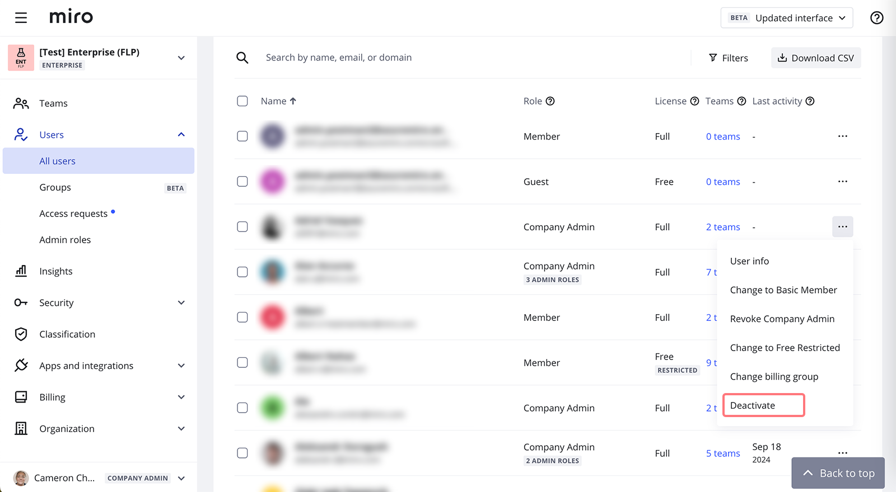
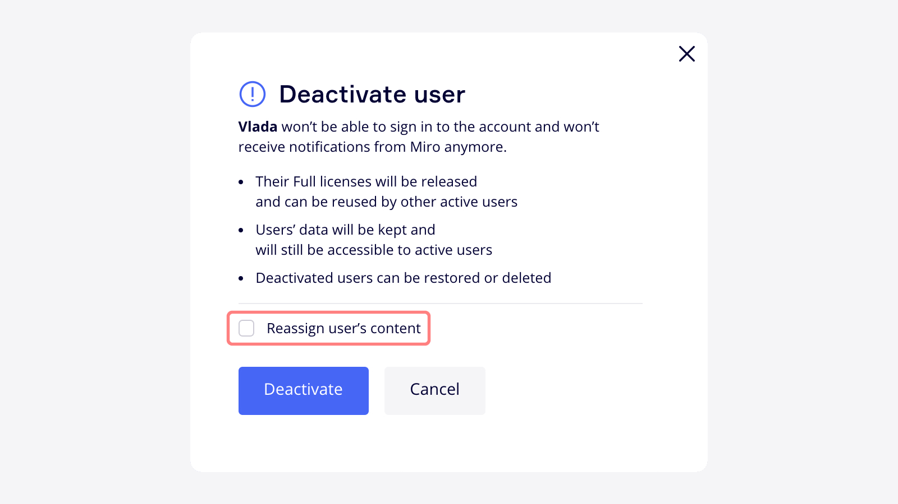
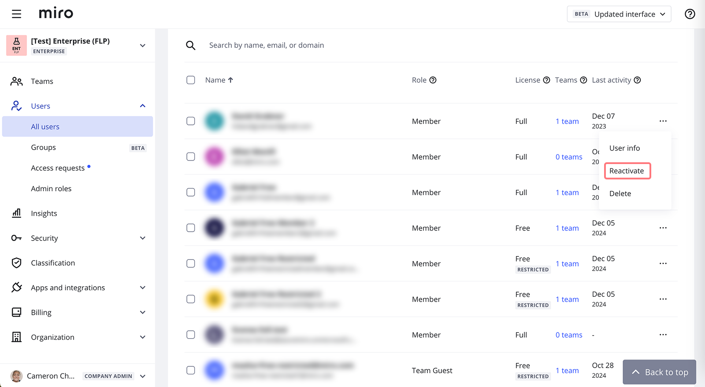
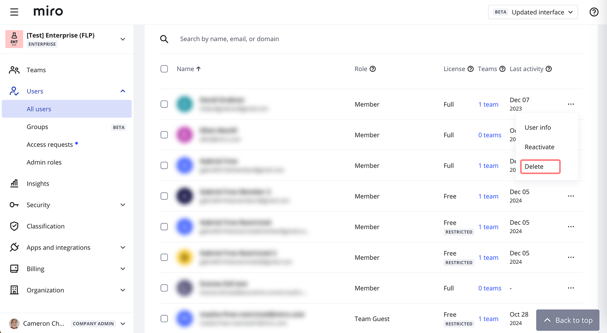

Mit der erweiterten Nutzerverwaltung in Miro können Unternehmens-Admins Nutzer deaktivieren, anstatt sie zu löschen. Deaktivierte Nutzer bleiben im Verzeichnis des Preisplans und können jederzeit wieder aktiviert werden.

> **Verfügbar für**: [Enterprise-Preisplan](../../plans-billing/miro-plans/04-enterprise-plan.md)
> **Einrichtung durch**: Unternehmens-Admins

## Regeln

- Deaktivierte Personen können nicht auf dein Enterprise-Konto und seine Funktionen zugreifen.
- Wenn du die Einstellung [Deaktivierte Personen blockieren](02-block-deactivated-users.md) aktiviert hast, wird durch Deaktivierung einer verwalteten Person die Anmeldung bei Miro verhindert.
- Deaktivierte Nutzer können sich nicht mehr über die SSO-Option deines Unternehmens anmelden, sondern kehren zu den Standard-Authentifizierungsmethoden zurück.
- Von deaktivierten Nutzern erstellte freigegebene Boards und Bereiche werden *nicht* an andere Personen neu zugewiesen und stehen Mitwirkenden weiterhin zur Verfügung (es sei denn, du entfernst den Nutzer während der Deaktivierung auch aus seinem Team. In diesem Fall werden die Boards einem Team-Admin zugewiesen. Dies ist in der Regel für [SCIM](../security-integrations/system-for-cross-domain-identity-management-scim/02-scim.md)-Operationen relevant).
- Alle [Benachrichtigungen](../../using-miro/managing-your-profile/02-miro-notifications.md) an deaktivierte Nutzer werden blockiert.
- Andere Nutzer können Boards und Bereiche nicht mit deaktivierten Nutzern teilen.
- Deaktivierte Personen können nicht zu Teams innerhalb deines Enterprise-Abos hinzugefügt werden. Unternehmens-Admins können deaktivierte Nutzer durch Einladung als Mitglieder reaktivieren, [mehr erfahren](05-manage-user-invitations-on-enterprise-plan.md).
- Deaktivierte Benutzer werden nicht in Rechnung gestellt. Ihre Lizenzen werden freigegeben und können auf einen anderen aktiven Nutzer angewendet werden.
- Folgende Attribute dürfen für deaktivierte Nutzer nicht aktualisiert werden:

|  |
| --- |
| `userName` |
| `userType` |
| `roles.value` |

## Benutzer deaktivieren

Du kannst Personen jederzeit deaktivieren. Wenn du eine Person deaktivierst, wird sie von einem **Aktiven** in einen **Deaktivierten** Zustand verschoben und nimmt keine Lizenz mehr in Anspruch. Diese Änderung wird auch in den Listen für **Aktive** und **Deaktivierte** Personen in den **Benutzer**einstellungen angezeigt.

So deaktivierst du einen Nutzer:

1. Öffne deine **Unternehmenseinstellungen**.
2. Wähle **Alle Nutzer** unter dem **Nutzer**-Menü**.**
3. Klicke auf das **Drei-Punkte-Symbol** (**...**) rechts neben einem Nutzer, den du deaktivieren möchtest.
4. Klicke auf **Deaktivieren**.
   
   *Die Option zur Deaktivierung von Nutzern im Enterprise-Plan*

   Du kannst auch mehrere Nutzer gleichzeitig deaktivieren. Wähle dazu mehrere Nutzer aus, indem du die Kästchen auf der linken Seite anklickst, oder wende Filter an und wähle bis zu 50 gefilterte Nutzer gleichzeitig aus, dann wähle unter **Massenaktionen** die Option **Deaktivieren** aus.
5. Markiere das Feld **Nutzerinhalte neu zuweisen** an, wenn du die Boards, [Vorlagen](../../getting-started/start-here/your-first-board/02-custom-templates.md) und [Bereiche](../../using-miro/spaces/01-spaces.md) des Nutzers übertragen möchtest. Für jedes Team, in dem der ausgewählte Nutzer Inhalte hatte, muss ein neuer Eigentümer gewählt werden. Das Neuzuweisen von Nutzerinhalten kann nicht rückgängig gemacht werden.
   
   *Die Option zum Neuzuweisen von Nutzerinhalten beim Deaktivieren*
6. Wähle **Deaktivieren**.

Die Deaktivierung von Nutzern entfernt nicht ihre Daten in Miro. Die Berechtigungen, die sie haben, bleiben erhalten und werden wiederhergestellt, sobald die Nutzer wieder aktiviert werden.

:::note
Anmerkung: Um einen Unternehmens-Admin zu deaktivieren, musst du zuerst die Unternehmens-Admin-Berechtigungen widerrufen.
:::

:::note
Wenn du eine Benachrichtigung **Das Team muss mindestens einen Admin haben** siehst, wenn du versuchst, einen Nutzer zu deaktivieren, bedeutet dies, dass der Nutzer der *einzige* Admin in einem Enterprise-Team oder in mehreren Teams ist. Um dies zu beheben, [lade dich zu diesen Teams ein](05-manage-user-invitations-on-enterprise-plan.md) und [erteile dir selbst Team-Admin-Rechte](../../administration/user-management/06-how-to-manage-admin-roles.md). Klicke auf die Anzahl der Teams des jeweiligen Nutzers, um zu erfahren, in welchen Teams er Mitglied ist.
:::

:::note
Wenn Ihr Unternehmen eine [SCIM](../security-integrations/system-for-cross-domain-identity-management-scim/02-scim.md)-Lösung verwendet, können Sie Nutzer auch über Ihren Identitätsanbieter deaktivieren. Wenn ein Benutzer durch SCIM deaktiviert wird, werden seine Inhalte nicht neu zugewiesen – die Option der Neuzuweisung wird nur in der Benutzeroberfläche für dieses Szenario unterstützt.
:::

### Automatische Deaktivierung für Gäste

Für Gäste (Benutzer, die ursprünglich per E-Mail zu Ihren Boards eingeladen wurden) können Sie die [automatische Deaktivierung](03-invitation-settings-on-enterprise-plan.md) aktivieren.

## Einen Benutzer erneut aktivieren

Um Nutzer erneut zu aktivieren:

1. Öffne deine **Unternehmenseinstellungen**.
2. Wähle im Menüpunkt Nutzer **Alle Nutzer** aus und dann den Tab **Deaktivierte Nutzer****.**
3. Klicke auf das **Drei-Punkte-Symbol** (...) rechts neben einem Nutzer, den du erneut aktivieren möchtest.
4. Wähle **Reaktivieren**.
5. Füge den Nutzer bei Bedarf zu Teams hinzu.
6. Bestätige **Reaktivieren**.

*Einen Nutzer reaktivieren*

Wenn du einen Nutzer reaktivierst:

- können sie sich sofort anmelden
- haben sie Zugang zu gemeinsamen Boards, Team-Boards und Boards, die sie vor der Deaktivierung erstellt haben (es sei denn, die Boards wurden neu zugewiesen)

:::note
Anmerkung: Nur Unternehmens-Admins können deaktivierte Nutzer erneut aktivieren.
:::

### Einen Nutzer dauerhaft löschen

So löschst du einen deaktivierten Nutzer dauerhaft:

1. Öffne deine **Unternehmenseinstellungen**.
2. Klicke im Menü auf **Nutzer** > **Alle Nutzer**.
3. Wähle den **Tab Deaktivierte Nutzer** aus.
4. Klicke auf das **Drei-Punkte-Symbol** (**...**) rechts neben einem Nutzer, den du löschen möchtest.
5. Wähle **Löschen**.
   
   *Löschen eines deaktivierten Nutzers*
6. Wähle aus, ob du den Inhalt des Nutzers erneut zuweisen oder ihn entfernen möchtest – wähle entweder den neuen Eigentümer aus und klicke auf **Nutzer löschen** oder wähle **Nutzer und Inhalte löschen**.

Du kannst Nutzer auch mit Massenaktionen löschen:

1. Klicke im Tab Deaktivierte Nutzer auf das Kontrollkästchen neben den Nutzern, die du löschen möchtest.
2. Klicke oben auf die Schaltfläche **Aus Unternehmen löschen**.

:::note
Hinweis: Nachdem Nutzer gelöscht wurden, können sie als Mitglieder wieder zu deinem Preisplan oder als Gäste zu einem Board eingeladen werden – von jedem, der die Berechtigung zum [Hinzufügen neuer Nutzer](05-manage-user-invitations-on-enterprise-plan.md) hat.
:::
