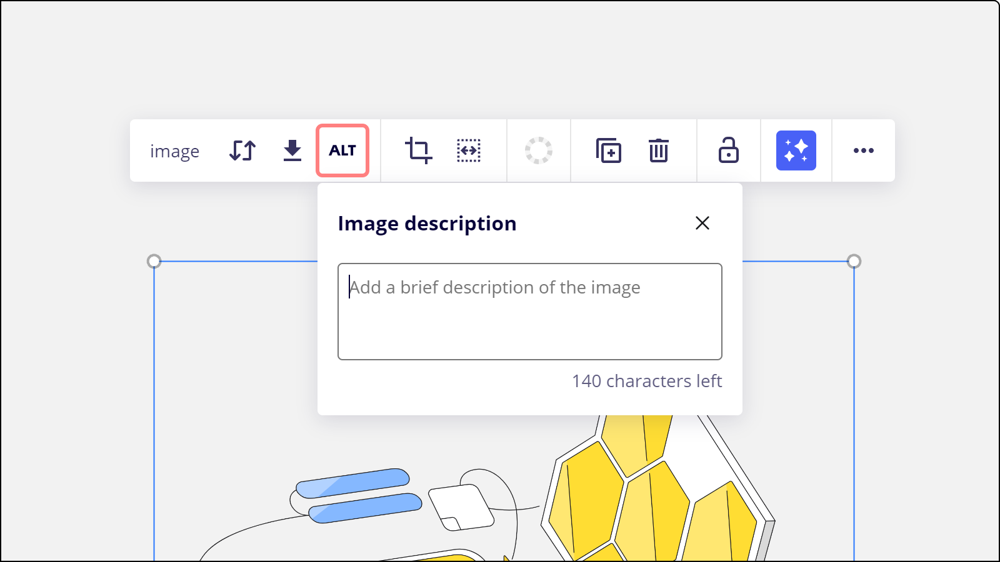
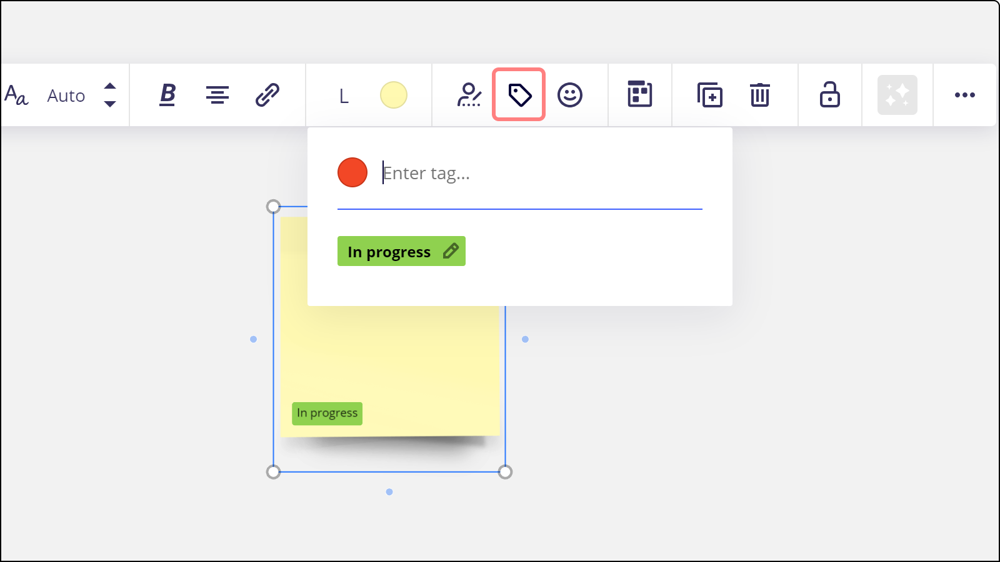
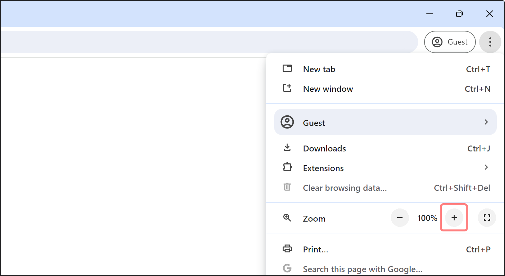
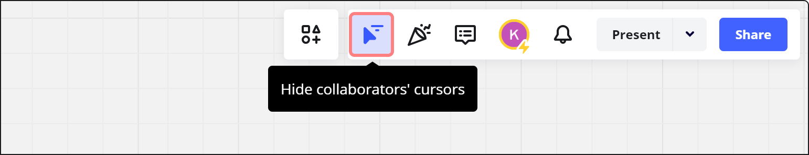
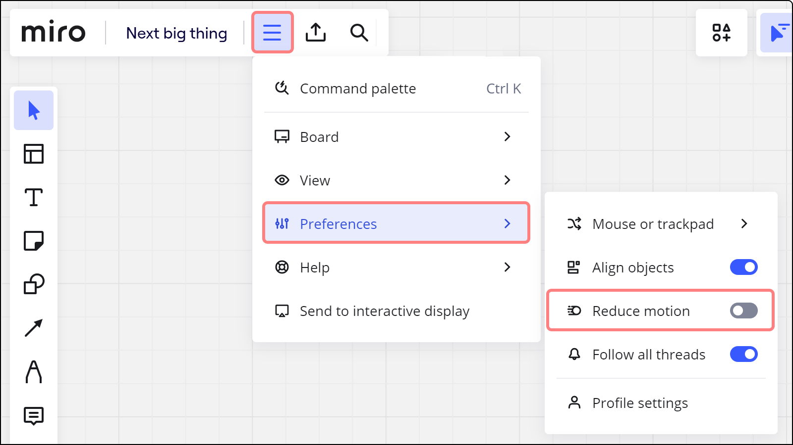
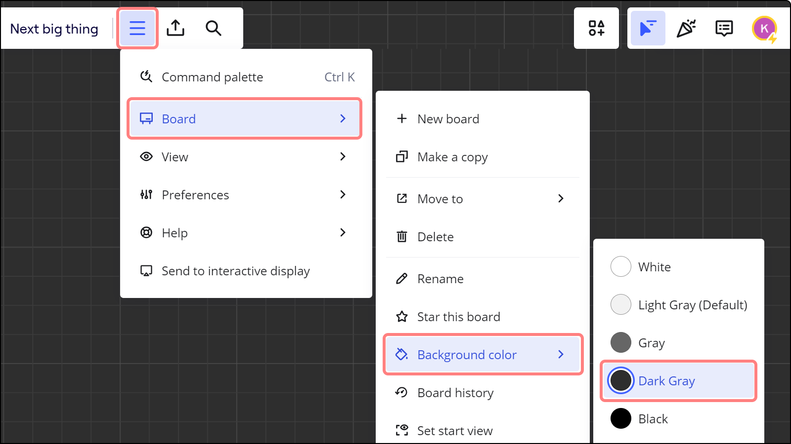
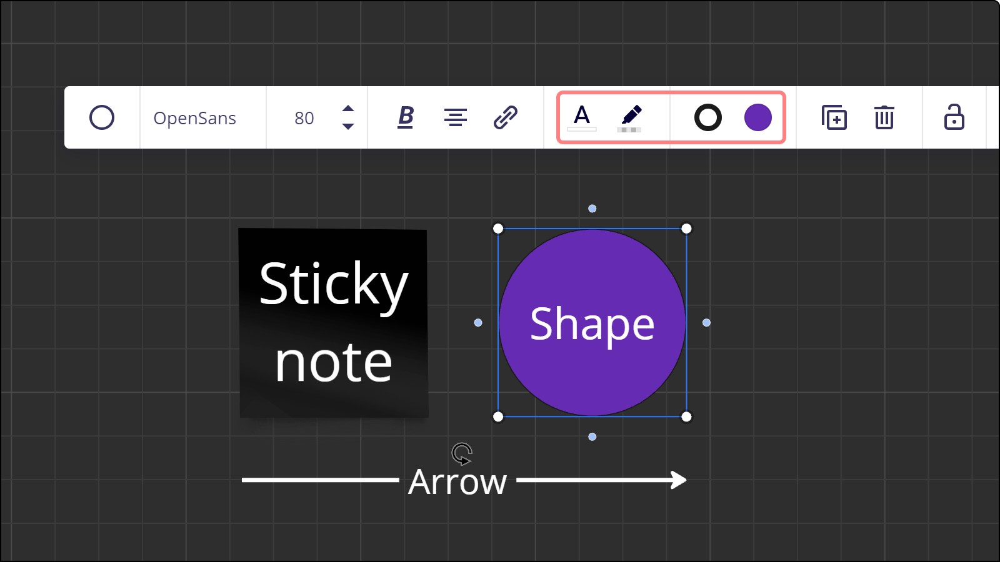
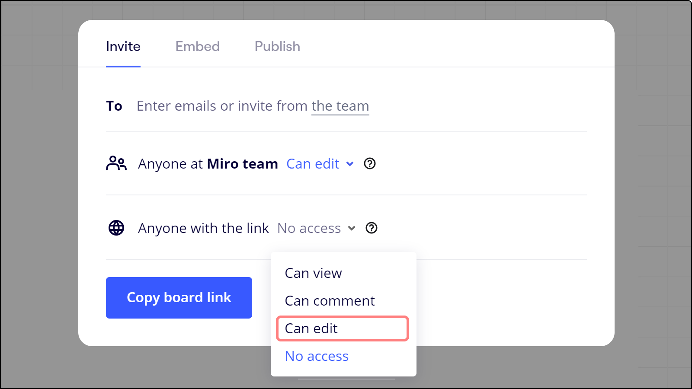
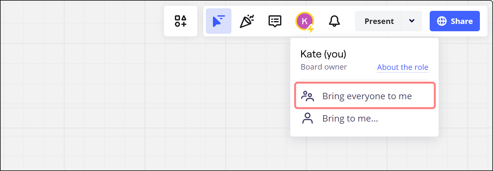
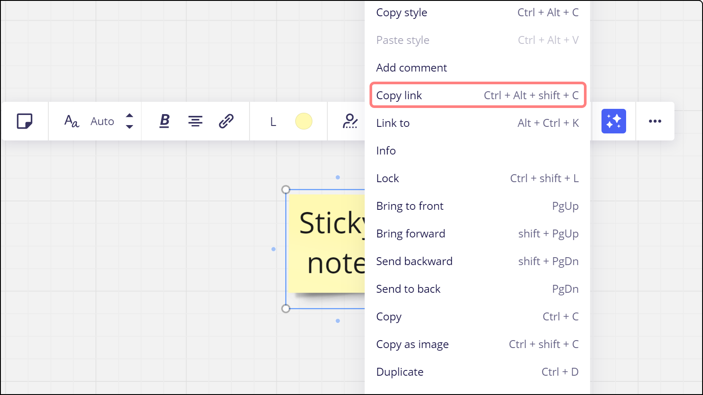

Das Miro Accessibility Team sammelt in diesem Artikel Tipps für die Gestaltung und Durchführung von inklusiven Zusammenarbeitssitzungen in Miro. Sobald wir mehr über bewährte Praktiken erfahren, die sich für unsere Kundinnen und Kunden bewährt haben, werden wir ihn regelmäßig aktualisieren.

Wir empfehlen generell, bei der Vorbereitung deines Miro-Boards zu prüfen, ob jemand, der an einer asynchronen oder Echtzeit-Zusammenarbeit teilnimmt, Zugriff benötigt.

In diesem Fall empfehlen wir, für alle Teilnehmer eines Meetings oder einer Zusammenarbeit klare Regeln auszuarbeiten. So stellst du sicher, dass alle mit den Regeln vertraut sind, bevor sie mit der Arbeit in Miro beginnen.

## Barrierefreiheitsprüfung mit Miro

Mit der Miro-Barrierefreiheitsprüfung können alle Nutzer barrierefreie Boards erstellen. Der Checker scannt dein Miro-Board, um Bereiche zu identifizieren, die möglicherweise nicht den Standards für Barrierefreiheit entsprechen. So erhältst du verwertbare Erkenntnisse, um deine Inhalte für alle Nutzer zu verbessern.

Der Checker führt die folgenden Prüfungen durch:

- Text-Kontrast
- Nicht-Text-Kontrast
- Bildbeschreibungen
- Container-Titel (Rahmen, Tabellen, Kanban Boards etc.)

Wenn du die Empfehlungen des Barrierefreiheitscheckers befolgst, verbesserst du den Zugriff für Nutzer von Bildschirmlesegeräten sowie für farbenblinde und sehbehinderte Nutzer.

### So öffnest du die Barrierefreiheitsprüfung

Um die Barrierefreiheitsprüfung zu öffnen, gehe folgendermaßen vor:

1. Öffne ein Miro-Board.
2. Wähle in der [Board-Leiste](../../using-miro/working-on-the-board/02-miro's-new-simplified-user-interface.md) die vertikalen drei Punkte aus.
   Es öffnet sich ein Kontextmenü.
3. Wähle **Board** > Barrierefreiheitsprüfung.
   Das Feld für die Barrierefreiheitsprüfung öffnet sich und scannt automatisch dein Board.

## Miro-Boards für Nutzer von Bildschirmlesegeräten besser zugänglich machen

Wenn du mit Nutzern von Bildschirmlesegeräten zusammenarbeitest, können sie Objekte auf einem Miro-Board erstellen, lesen, bearbeiten und löschen. Es gibt jedoch einige Schritte, die du unternehmen kannst, um die Nutzung deines Boards zu erleichtern.

Generell gilt: Je strukturierter die Boards sind, desto einfacher ist es für Nutzer von Bildschirmlesegeräten, auf die Inhalte zuzugreifen.Wenn du sicherstellen willst, dass Nutzer von Bildschirmlesegeräten problemlos im Board navigieren und auf die Inhalte des Boards zugreifen können, befolge diese Empfehlungen:

- [Verwende](../../using-miro/essential-tools/07-frames.md) Rahmen, um den Inhalt des Boards zu strukturieren. Vergewissere dich, dass keine Board-Objekte außerhalb der Rahmen platziert sind.
- Erstelle Rahmen in einer Reihenfolge von links nach rechts - so können die Nutzer den Ablauf der Zusammenarbeit leicht verfolgen.
- Im Idealfall sollte jeder Rahmen bei 100% Browser- und Miro-Canvas-Zoom in das Ansichtsfenster passen - so wird ein möglichst reibungsloses Nutzererlebnis gewährleistet. Die Rahmen sollten sich auch nicht überschneiden.
- Gib Bildbeschreibungen für Bilder an. Wähle einfach ein beliebiges Bild aus und aktiviere die **ALT-Schaltfläche**, dann füge deine Beschreibung hinzu, was der Nutzer wahrnehmen soll.

*Alt-Text zu Bildern hinzufügen*

### Alt-Text zu Bildern hinzufügen

Biete Textalternativen/Beschreibungen für komplexe visuelle Darstellungen wie Diagramme - verwende [Text](../../using-miro/essential-tools/16-text.md) oder [Form](../../using-miro/essential-tools/11-shapes.md) um die Anmerkung einzufügen.

### Bewusstes Verwenden von Farben für Notizen und Tags

[Das Verwenden verschiedener](../../using-miro/essential-tools/14-sticky-notes.md) Farben für Notizen ist eine gute Möglichkeit, um Ideen zu bündeln oder zwischen den einzelnen Beitragenden zu unterscheiden. Wenn du deinen Workshop inklusiver gestalten möchtest, gibt es eine Alternative zu den Farben der Notizen – den Einsatz von Tags zur Identifizierung der Verfasser von Notizen oder zur Kategorisierung von Notizen auf dem Board.

*Verwendung von Tags*

### Erhöhen der Zoomstufe des Browsers

Gehe ins Browsermenü, öffne die Zoom-Einstellungen und erhöhe die Größe der Benutzeroberfläche auf 200%. Dadurch werden die Miro-Symbolleisten und -Steuerelemente vergrößert.

Ändern der Zoomstufe des Browsers in Chrome

## Miro für bewegungsempfindliche Personen besser zugänglich machen

### Ausschalten der Cursor, um die Ablenkungen auf dem Board zu verringern

Bei Miro dreht sich alles um Zusammenarbeit, und es ist wichtig, die Cursor aller Teilnehmer am Board zu sehen, um das Erlebnis der persönlichen Begegnung zu vermitteln.

Du hast jedoch die Möglichkeit, die Cursor bei Bedarf auszuschalten, um die Ablenkung auf dem Board zu verringern, wenn die Gruppe, mit der du zusammenarbeitest, dies bevorzugt. Darüber hinaus verbessert es die allgemeine Performance des Boards, wenn du mit Dutzenden oder Hunderten von Personen zusammenarbeitest.

Ausblenden der Cursor von Teammitgliedern auf dem Board

### Einschalten Bewegung reduzieren

Animationen können ablenkend wirken, Schwindel und Reisekrankheit verursachen und Migräne auslösen. Schalte die Bewegungsreduzierung ein (Hauptmenü > Einstellungen > Bewegungsreduzierung), um:

- Verhindere, dass GIFs automatisch abgespielt werden.
- Wechsle mit dem Bereich "Rahmen" sofort zwischen den Rahmen.
- Entferne UI-Übergänge beim Öffnen/Schließen von Dialogen und Menüs.

*Bewegung reduzieren einschalten*

## Verbesserung der Barrierefreiheit von Miro für Menschen mit Lichtempfindlichkeiten

### Verwenden des dunklen Hintergrunds

Reduziere die Helligkeit deines Boards, indem du im Menü **drei Punkte** (**...**) > **Board** > **Hintergrundfarbe** einen grauen, dunkelgrauen oder schwarzen Hintergrund auswählst.

*Benutzerdefinierte Board-Farbe verwenden*

### Auswählen von dunklen Farben für Objekte auf dem Board

[Du kannst Notizen und](../../using-miro/essential-tools/14-sticky-notes.md) [Formen](../../using-miro/essential-tools/11-shapes.md) mit den dunkelsten Farben sowie ggf. weißen/hellgrauen Textfarben erstellen.

Die Farbe des Hintergrunds und des Textes einer Form

## Leitlinien für eine barrierefreie Moderation verwenden

Moderation vor, während und nach Mitwirkenden-Sitzungen kann einen großen Einfluss auf den Zugriff auf die Zusammenarbeit haben. Lies unseren Leitfaden und erfahre mehr über [10 Grundsätze für eine inklusive Zusammenarbeit](https://miro.com/10-principles-for-inclusive-collaboration/)

### Besuchern Zugriff auf das Board geben

[Um den Zugriff auf das Board zu erleichtern, kann der Moderator das Board](../../using-miro/sharing-boards/08-collaboration-with-visitors.md) Besuchern zur Verfügung stellen. Das bedeutet, dass diejenigen, die den Link zum Board erhalten, es öffnen können, ohne sich anmelden oder bei Miro registrieren zu müssen. Um dies zu aktivieren, gehst du auf Freigeben und wählst Jeder, der den Link hat, kann bearbeiten (verfügbar für Starter-, Business-, Education- und Enterprise-Preispläne). Mehr erfahren.

Freigeben eines Boards für Besucher, die es bearbeiten können

Wenn ein Nutzer ein Board nicht bearbeiten muss, solltest du ihm den Zugriff "Kann ansehen" oder "Kann kommentieren" gewähren. So müssen sich die Nutzer keine Sorgen machen, dass sie ungewollte Änderungen vornehmen.

### Verwenden von Aufmerksamkeitssteuerungsfunktionen und Links für eine bessere Board-Navigation

[Um die Navigation auf dem Board reibungsloser zu gestalten, können die Moderierenden die Funktion](../../using-miro/facilitation-tools/04-attention-management.md) Alle zu mir bringen verwenden. Das bedeutet, dass alle, die das Board geöffnet haben, dem Moderator auf dem Board folgen können, egal wo sie sich auf dem Board befinden. Mehr erfahren.

Bringe alle Teammitglieder in deine Ansicht

[Alternativ können die Moderierenden auch einen](../../using-miro/working-on-the-board/16-internal-and-external-linking.md) Link zu einem beliebigen Objekt auf dem Board kopieren und ihn mit den Teammitgliedern teilen. Dazu klickst du auf ein beliebiges Objekt, klickst auf das Menü **mit den drei Punkten** (**...**) und dann auf **Link kopieren**.

Die Option, den Link zu einem Objekt zu kopieren
