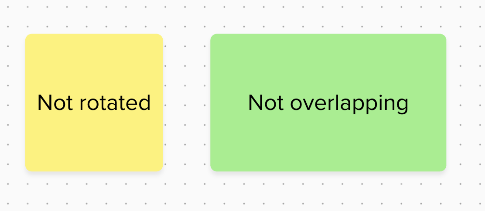

Du kannst Inhalte von deinen Mural-Boards zu Miro übertragen, indem du die Kopier-und-Einfügen-Methode anwendest. Dieser Leitfaden bietet Best Practices für diese Importmethode, erläutert den Schritt-für-Schritt-Prozess und beschreibt, was du in Bezug auf das Erscheinungsbild und das Verhalten verschiedener Objekte erwarten kannst, sobald sie in Miro eingefügt sind.

## Richtlinien für den Import aus Mural

Wenn du diese Richtlinien befolgst, erzielst du die besten Ergebnisse beim Übertragen von Inhalten von Mural nach Miro.

Für strukturierte Daten, wie Mural-Mindmaps, ist die Kopieren-Einfügen-Methode im Allgemeinen der beste Ansatz, um zu vermeiden, dass Verbindungen zwischen Elementen unterbrochen werden.

:::note
Um Inhalte mit dieser Methode in Miro zu importieren, muss der Mural-Inhalt unter einer Volllizenz oder einer kostenlosen eingeschränkten Lizenz in Mural stehen.
:::

Die Kopier-Einfüge-Methode wird auch empfohlen für den Import einzelner Widgets, die nicht vom [Mural zu Miro-Importführer (PDF)](02-mural-to-miro-import-guide-–-pdf.md) unterstützt werden, oder für Widgets, die mit der PDF-Methode nicht in hoher Qualität importiert werden.

Sei dir einiger Einschränkungen bei der Kopiermethode bewusst: Bestimmte Stilattribute und alle Bilder, die ursprünglich bei Mural hochgeladen wurden (anstatt über eine URL verlinkt), werden nicht in deine Zwischenablage kopiert und daher nicht zu Miro übertragen.

## Mural-Inhalte zu Miro kopieren und einfügen

Im Folgenden wird erklärt, wie du Inhalte von einem Mural-Board kopierst und auf ein Miro-Board einfügst.

**Voraussetzungen**

Stelle sicher, dass du Bearbeitungszugriff sowohl auf das Quell-Board in Mural als auch auf das Ziel-Board in Miro hast.

So kopierst du Inhalte von einem Mural-Board und fügst sie in ein Miro-Board ein:

1. Wähle in Mural die Objekte aus, die du kopieren möchtest.
   > 💡 Um alle Objekte auf dem Mural-Board auszuwählen, verwende die Tastenkombination **Strg+A** (Windows) oder **Cmd+A** (Mac).
2. Um die ausgewählten Objekte zu kopieren, verwende die Tastenkombination **Strg+C** (Windows) oder **Cmd+C** (Mac).
   Deine Mural-Objekte sind jetzt in deine Zwischenablage kopiert.
3. Öffne in Miro das Board, in das du den Inhalt einfügen möchtest. Verwende die Tastenkombination **Strg+V** (Windows) oder **Cmd+V** (Mac), um einzufügen.

   Du hast erfolgreich Inhalte von Mural nach Miro kopiert und eingefügt.
   > ✏️ Aus Mural eingefügter Inhalt kann in Miro einige manuelle Anpassungen erfordern. Bestimmte Stil- und Formatierungsaspekte können nach dem Einfügen anders erscheinen.

## Objekterscheinung nach dem Einfügen

Mural-Objekte können in Miro im Allgemeinen mit einigen Abweichungen von ihrem ursprünglichen Zustand kopiert und eingefügt werden. In diesem Abschnitt werden die erwarteten Ergebnisse für einige gängige Objekte beschrieben und, wo zutreffend, Best Practices vorgestellt.

### Bereiche

Bereiche von Mural kopieren und als Miro-Rahmen und -Formen einfügen.

Ein Mural-Bereich mit 100% Transparenz zeigt beim Einfügen in Miro einen transparenten, aber sichtbaren Rahmen. Wenn der Mural-Bereich einen Titel hat, erscheint dieser Titel in Miro und verhält sich wie ein Rahmentitel.

*Ein Mural-Freiformbereich mit Titel und 100% transparentem Hintergrund und Rand*

*Ein eingefügter Bereich von Mural zu Miro*

### Konnektoren

Konnektoren aus Mural werden durch Kopieren/Einfügen zu Miro-Konnektoren.

Bei Verbindungs-Labels werden die vertikalen und horizontalen Positionen in Miro zentriert eingefügt. Miro unterstützt nur eine zentrierte Position für Verbindungs-Labels.

Bezüglich der Verbindungstypen unterstützt Miro *durchgehende*, *gepunktete* und *gestrichelte* Linien. Mural umfasst zusätzlich einen *locker gestrichelten* Verbindungstyp. Miro ordnet die Typen der aus Mural eingefügten Verbindungen wie folgt zu: *solid* wird zu *solid* zugeordnet, und Mural's *loosely dashed* Typ wird zu Miro's *dashed* Typ. Andere direkte Übereinstimmungen (wie punktiert zu punktiert) werden ebenfalls beibehalten.

Miro unterstützt jede Art von Mural-Verbindungskurve, auch wenn ihr Erscheinungsbild in Miro leicht abweichen kann.

*Konnektor-Kurve von Mural*

*Miro-Verbindungskurve*

### GIFs & Bilder

GIFs und Bilder, die ursprünglich aus einer URL zu Mural hinzugefügt wurden, können in Miro kopiert und eingefügt werden.

> Ein GIF oder Bild in Mural, das direkt von einem Gerät hochgeladen oder über die Symbolleiste von Mural hinzugefügt wurde, kann mit dieser Methode nicht in Miro kopiert und eingefügt werden.

### Mindmaps

Mindmaps von Mural kopieren und als Miro Mindmaps einfügen, einschließlich des Stammknotens, jedes untergeordneten Knotens und deren Text.

Das Styling des Stammknotens bleibt größtenteils erhalten. Der Formradius kann jedoch abweichen und die Schriftgröße des Textes wird von Mural zu Miro nicht beibehalten.

Untergeordnete Knoten von Mural werden als Miro-Textknoten eingefügt und deren Formatierung wird nicht beibehalten.

Connector-Farbe und -Dicke in der Mindmap können ebenfalls variieren.

*Mindmap in Mural kopiert*

*Mindmap in Miro kopiert*

Bei Mural-Mindmaps mit mehreren Ebenen von Knoten kann sich die Knotenreihenfolge ändern, wenn sie in Miro eingefügt werden.

*Mindmap in Mural mit mehreren Knotenebenen*

*Mindmap mit mehreren Knotenebenen aus Mural nach Miro kopiert*

:::tip
Mindmaps, die von Mural nach Miro kopiert wurden, könnten ihre ursprüngliche Skalierung verlieren. Um die Mindmap nach dem Einfügen zu vergrößern, kannst du sie manuell auf dem Miro-Board strecken.
:::

### Formen

Formen aus Mural werden im Allgemeinen als Miro-Formen eingefügt. Miro unterstützt die meisten Mural-Formen direkt.

Mural enthält jedoch 16 spezifische Formen, die in Miro kein direktes Äquivalent haben. Diese Formen werden als Rechtecke in Miro eingefügt.

*Die 16 Formen, die von Mural zu Miro als Rechtecke kopiert werden*

### Notizen

Notizen aus Mural werden als Miro-Notizen eingefügt.

Miro wird die Farbe und Deckkraftstufe der Notiz so abgleichen, dass sie den nächstgelegenen verfügbaren Übereinstimmungen in Miro entspricht.

Die folgenden Unterschiede können ebenfalls auftreten, wenn du Mural-Notizen in Miro kopierst:

- Runde Notizen aus Mural werden in Miro als quadratische Notizen eingefügt.
- Listen innerhalb von Notizen werden nicht als interaktive Listen beibehalten, obwohl die einzelnen Elemente in der Miro-Notiz in separaten Zeilen erscheinen.
- Die Textschriftgröße wird nicht beibehalten, da die Miro-Notizen die Schriftgröße automatisch basierend auf Inhalt und Notizgröße einstellen.
- Rotationen, die auf Notizen in Mural angewendet werden, bleiben beim Einfügen nicht erhalten.

*Notizen in Mural kopiert*

*Notizen in Miro kopiert*

### Tabellen

Tabellen aus Mural als Miro-Tabellen einfügen.

Die folgenden Unterschiede können auftreten, wenn du Tabellen von Mural nach Miro kopierst und einfügst. Für jedes dieser Elemente kannst du deine Präferenzen in Miro nach dem Einfügen in der Regel manuell wiederherstellen:

- Tabellen, die in Mural über anderen Objekten (wie Bereichen, Formen oder Bildern) positioniert sind, können teilweise hinter diesen Objekten verborgen werden, wenn sie in Miro eingefügt werden. Möglicherweise musst du ihre Ebenen anpassen (nach vorne bringen).
- Randfarbe wird ignoriert; Rahmen werden in Grau eingefügt.
- Hintergrundopazität wird ignoriert. Transparente Zellen in Mural werden in Miro als weiße Zellen eingefügt. Jedoch wird die Hintergrundfarbe selbst (wenn nicht transparent) in der Regel beibehalten.
- Die Schriftfamilie des Textes wird ignoriert; der Text wird mit der Standardtabellenschriftart von Miro (RobertPro) eingefügt.
- Textformatierungen wie fett und kursiv werden innerhalb von Tabellenzellen ignoriert.

*Tabelle mit gemischter Formatierung in Mural kopiert*

*Tabelle mit gemischter Formatierung, die nach Miro kopiert wurde*

### Text

Textobjekte aus Mural werden als Miro-Textobjekte eingefügt. Die originalen Mural-Schriftfamilien werden nicht beibehalten. Miro ordnet die Mural-Schriftarten der nächstgelegenen verfügbaren Schriftart in Miro zu und skaliert den eingefügten Text für optimale Ergebnisse auf dem Miro-Board.
