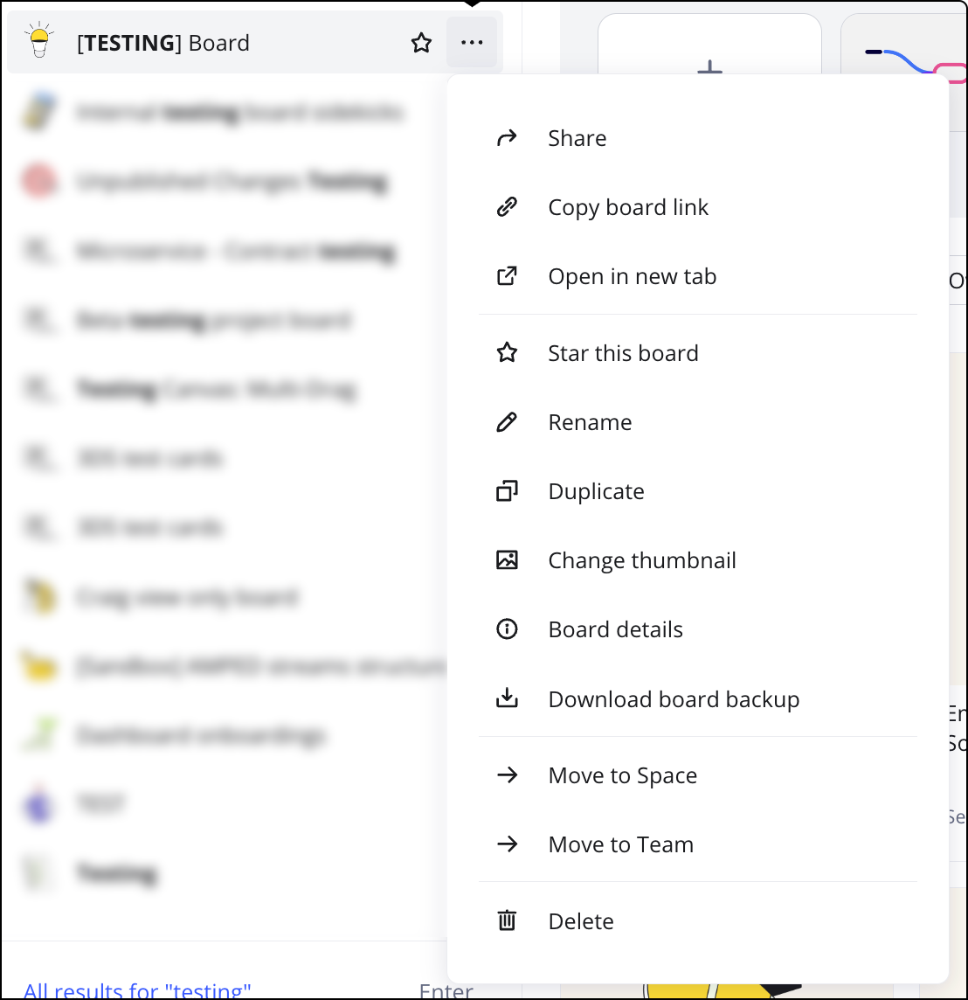

Mit der Miro-Suche kannst du ganz einfach ein Board oder einen Bereich finden.

:::tip
In [diesem Artikel](../../../using-miro/working-on-the-board/19-searching-text-on-the-board.md) erfährst du, wie du ein bestimmtes Board durchsuchst.
:::

## So verwendest du die Suche

Um ein Board oder einen Bereich auf dem [Dashboard](https://miro.com/app/dashboard/) zu finden, klicke in die **Suchleiste** oben im linken Feld der Seite oder drücke **Strg + E** *(für Windows)*/**Cmd + E** *(für Mac)*. Gib den Namen eines Boards oder Bereichs ein. Deine zuletzt geöffneten Boards und Bereiche erscheinen unter der Suchleiste. Du siehst alle Übereinstimmungen, die im aktuellen Team für dich freigegeben sind.

Wenn du Details zu einem bestimmten Board sehen möchtest:

1. Klicke auf das **Symbol mit den drei Punkten** (**...**) neben dem Board-Namen.
2. Wähle **Board-Details** aus.
   Ein Dialogfeld öffnet sich mit den folgenden Informationen:
   1. Board-Klassifizierung
   2. Board-Eigentümer
   3. Board-Beschreibung
   4. Erstelldatum des Boards
   5. Datum der letzten Änderung
   6. Board-Standort (Teamname > Bereichsname)

Du kannst die Suche nach **Eigentümer** oder **Bereichen** eingrenzen (im Free-Preisplan kannst du nur nach Eigentümer suchen). Um Filter anzuwenden, klicke auf **Alle Filter** oder wähle einen Eigentümer in der Drop-down-Liste unter der Suchleiste aus. Um einen Filter zu entfernen, klicke auf **X**.

Das Suchfenster zeigt die Ergebnisse basierend auf dem aktuellen Team, in dem du dich befindest.

Du kannst Boards auch [freigeben](../../../using-miro/sharing-boards/03-sharing-boards-and-inviting-collaborators.md), umbenennen, [verschieben](../../../using-miro/managing-boards/04-how-to-move-a-board.md) und weitere wichtige Aktionen direkt über das Menü in den Suchergebnissen ausführen. Das Menü mit allen Optionen öffnet sich, wenn du auf die **drei Punkte** (**...**) neben dem Board-Namen klickst.

*
Board-Kontextmenü in den Suchergebnissen*

:::tip
Verwende diese Funktion in Kombination mit Suchfiltern, um die Board-Organisation zu optimieren – zum Beispiel kannst du Boards nach Eigentümer filtern und sie schneller in ein Team oder Projekt verschieben als zuvor.
:::

:::tip
Du kannst außerdem die [Chrome-Sucherweiterung für Miro](https://miro.com/marketplace/chrome-search/?backUrl=%2Fmarketplace%2F) installieren. Sobald die Erweiterung hinzugefügt wurde, gib 'M*iro'* in die Adressleiste des Browsers ein und drücke die **Tab**-Taste. Die Erweiterung ermöglicht eine schnelle Suche nach Miro-Boards direkt aus der Adressleiste.
:::

## Erweiterte Suche

> **Erhältlich für:** Education-, Starter-, Business- und Enterprise-Preispläne

Nutzer mit Education-, Starter-, Business- und Enterprise-Preisplänen können die Suchleiste verwenden, um nach bestimmten Wörtern oder Ausdrücken in Board- und Bereichstiteln, Beschreibungen, Widgets, Kommentaren und Notizen auf einem Board zu suchen.

Wenn du im Business- oder Enterprise-Preisplan bist, kannst du alle Teams von deinem Dashboard aus durchsuchen und so verwandte Inhalte in deiner gesamten Organisation finden.

Das Suchfenster zeigt alle Inhaltselemente, die das gesuchte Wort oder die Phrase enthalten. Du kannst auf jedes Element im Abschnitt **Content (Inhalt)** klicken, um die Suchergebnisse anzusehen, und die Liste der Übereinstimmungen erweitern, indem du auf den Pfeil links neben dem Boardnamen klickst.

Wenn du unter diesem Abschnitt auf ein bestimmtes Suchergebnis klickst, wird das Board an der Stelle geöffnet, an der sich das Suchergebnis befindet, damit du es nicht suchen musst.
