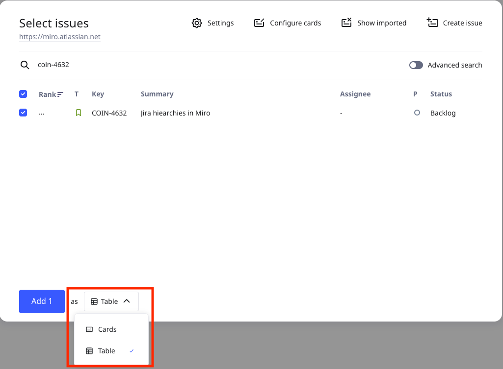

Du kannst deine Jira-Vorgänge in das Miro-Tabellenformat importieren. Eine Tabelle ermöglicht dir eine vollständige Übersicht über deine strategischen Initiativen und Workflows, von übergeordneten Epics bis hin zu spezifischen Ticketdetails.

**Weitere Informationen:** [Jira-Karten häufige Fragen](https://help.miro.com/hc/articles/360013463739).

## Importiere Jira-Vorgänge als Tabelle zu deinem Board

1. Klicke auf einem Miro-Board auf der Erstellungsleiste auf Tools, Medien und Integrationen (+).
2. Suche und wähle Jira-Karten aus.
   Wenn du dich zum ersten Mal mit Jira verbindest, musst du dich authentifizieren.
   Das **Dialogfeld Vorgänge auswählen** öffnet sich.
3. Suche und wähle deinen/die Jira-Vorgang/Vorgänge aus.
   **Vorgänge auswählen** enthält nur die Jira-Vorgänge, auf die du Zugriff hast.
4. Füge deinen Vorgang/deine Vorgänge als **Tabellen**-Format hinzu.
    *Der Hinzufügen-als-Selector ermöglicht es dir, das Tabellen-Format auszuwählen.*
5. Klicke **Hinzufügen** ***x**.*

## Untergeordnete Jira-Einträge importieren

Nachdem du übergeordnete Vorgänge als Tabelle importiert hast, kannst du untergeordnete Vorgänge importieren.

Befolge diese Schritte:

1. In der Tabelle, für die Zeile, in der du untergeordnete Vorgänge importieren möchtest, klicke in der ersten Spalte auf die vertikalen sechs Punkte. Ein Menü wird geöffnet.
2. Klicke auf **Untergeordnete Einträge importieren**.
   Das **Vorgänge auswählen** Fenster wird geöffnet.
    *Nachdem du Vorgänge importiert hast, kannst du untergeordnete Vorgänge in deine Tabelle importieren.*
3. Wähle die untergeordneten Vorgänge aus, die du importieren möchtest.
4. Klicke auf **Hinzufügen** ***x*****.**

### Verschachtelte Ansicht umschalten

Um die verschachtelte Ansicht für übergeordnete und untergeordnete Vorgänge zu aktivieren, klicke auf die **Ansichtseinstellungen**-Schaltfläche. Schalte dann **Verschachtelung** auf die Position „Ein“ um.

 *Verschachtelte Ansicht für übergeordnete und untergeordnete Vorgänge umschalten.*

:::tip
In der verschachtelten Ansicht kannst du untergeordnete Einträge ein- und ausklappen. Ein übergeordneter Vorgang hat einen Indikator, der anzeigt, ob untergeordnete Vorgänge vorhanden sind.
:::

## Tabellenlayout ändern

Um das Tabellenlayout zu ändern, klicke auf die **Layout**-Schaltfläche. Wähle dann ein Layout aus.

Zum Beispiel möchtest du ein Baumlayout verwenden.

 *Ändere das Layout deiner Jira-Vorgangstabelle.*

:::note
(Enterprise) Die Baumansicht befindet sich in der öffentlichen Betaversion und ist nur mit einer Enterprise Advanced-Lizenz verfügbar. Weitere Informationen finden Sie unter [Verständnis von Enterprise-Lizenzen](https://help.miro.com/hc/articles/33311996124306).
:::
