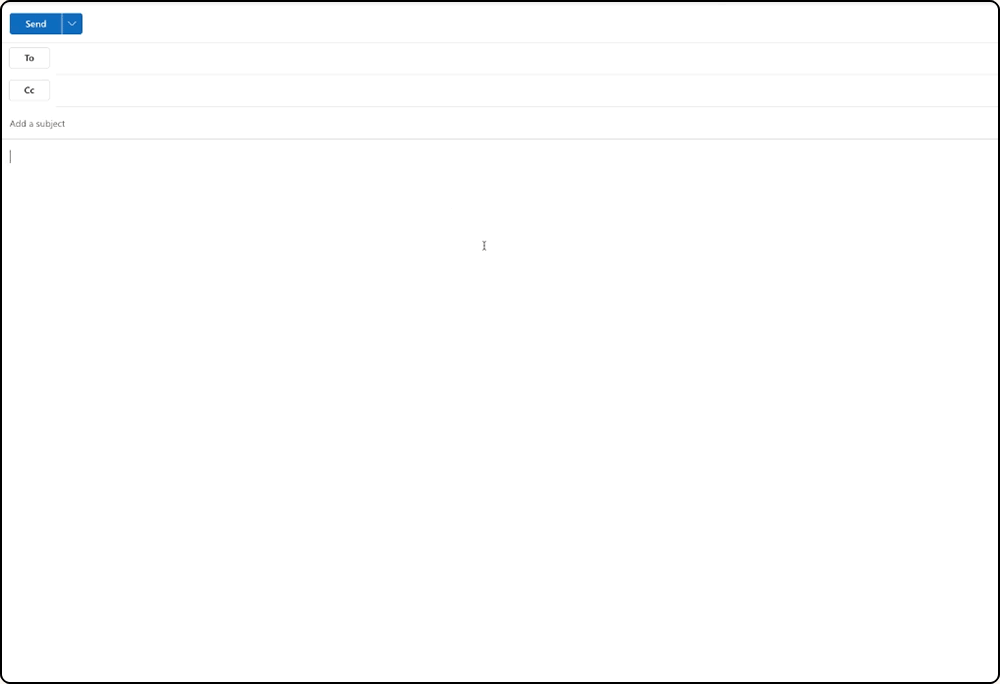
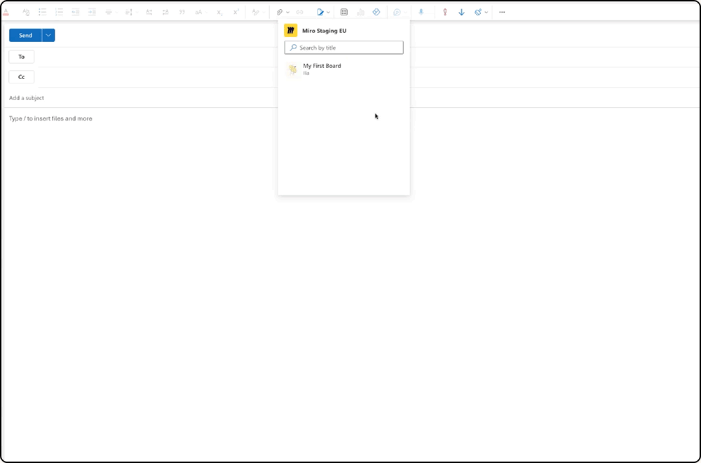

Sorge mit erweiterten Miro-Links für mehr Kontext in Outlook-E-Mails. Mit dieser Integration können Nutzer mehr Informationen über jeden Miro-Link erhalten, der über Outlook per E-Mail gesendet wird.

> **Erhältlich für:** Alle Miro Preispläne
> **Verfügbar mit:** Desktop

:::note
Nutzer müssen die Miro-Integration für Microsoft Teams aktivieren, bevor sie dieses Outlook-Angebot nutzen können. Weitere Informationen findest du in der Dokumentation zu [Microsoft Teams](microsoft-teams/01-miro-for-microsoft-teams-admin-guide.md).
:::

## So funktioniert Miro für Microsoft Outlook

Miro für Microsoft Outlook enthält zwei wichtige Funktionen, die das Nutzererlebnis verbessern: das Entfalten von Links und die Erweiterung von Suchmeldungen.

Wenn Nutzer einen Miro-Link in einer E-Mail verwenden, entfaltet sich der Link zu einer adaptiven Karte, auf der Nutzer weitere Informationen über das Board sehen können, z. B. den Titel, den Board-Eigentümer und den Zeitpunkt der letzten Aktualisierung.

*Miro-Links werden automatisch zu adaptiven Karten*

Beim Verfassen von E-Mails können Nutzer über das App-Menü auf die Miro-Integration zugreifen und nach einem Miro-Board suchen, das dann als adaptive Karte in die E-Mail eingefügt werden kann.

*Boards können aus Outlook heraus gesucht und in E-Mails eingefügt werden*
