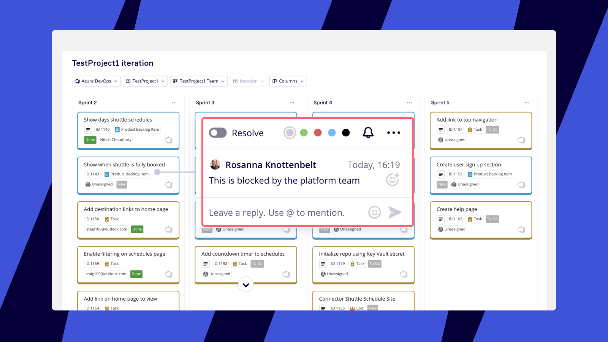
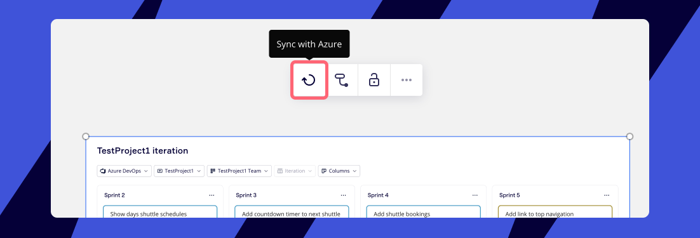
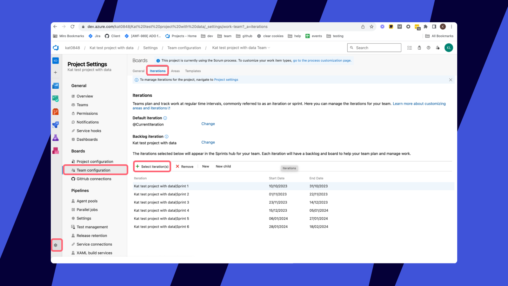

Bei Planungsevents auf Team- oder Unternehmensebene, wie beispielsweise Program Increments (PI), Big Room, Roadmapping und Sprints, tauschen sich die Entwicklungsteams aus und sprechen sich untereinander ab.

Mit dem Planer für Azure können Moderierende und Teams Planungsevents auf einem Miro-Board durchführen und daran teilnehmen, während sie gleichzeitig die Updates in Echtzeit mit ihrem Azure-Board synchronisieren. Das spart viel Zeit.

## So erstellst du einen Planer für Azure DevOps

:::note
Um einen Planer für Azure DevOps zu verwenden, [richte zuerst deine Azure-Integration ein](03-azure-cards.md).
:::

1. Gehe zur [Erstellungssymbolleiste](../../getting-started/start-here/your-first-board/05-toolbars.md) auf der linken Seite deines Boards.
2. Klicke auf ****Mehr Apps**** (+) und suche nach „Planer“.
3. Klicke auf **Planer**.
4. Auf dem Board wird ein Cursor angezeigt. Klicke irgendwo, um einen leeren Planer zu platzieren.
5. Die Datenquelle deines Planers ist standardmäßig die von dir autorisierte Integration.  Wenn du noch keine Integration autorisiert hast, wird standardmäßig Jira verwendet. Du kannst dies ganz einfach in Azure DevOps ändern, indem du auf das Dropdown-Menü **Jira** klickst und **Azure DevOps** auswählst.
6. Wenn du dein Azure DevOps-Konto noch nicht in Miro autorisiert hast, wirst du aufgefordert, dich anzumelden.
7. Sobald du angemeldet bist, klicke auf das Dropdown-MenüAzure-Projekt und wähle ein Projekt aus, um eine Verbindung mit dem Planer herzustellen.
8. Klicke als Nächstes auf das Dropdown-Menü **Teams** und wähle ein Team aus.
9. Das erste Feld ***Spalten*** ist dein Spaltentyp. Die Iteration wird automatisch ausgewählt. In Kürze kommen noch weitere Azure-Felder dazu.
10. Verwende das zweite Dropdown-Menü **Spalten**, um festzulegen, welche Iterationen du anzeigen möchtest.

## So arbeitest du mit dem Planer

Ziehe Azure-Karten über Spalten, um sie zu aktualisieren.  Wenn du beispielsweise eine Azure-Karte im Planer von Iteration 1 auf Iteration 2 ziehst, wird sie sowohl in Miro als auch in Azure aktualisiert.

Teilnehmer können Azure-Karten kommentieren, um aktuelle Diskussionen und Notizen zu verfolgen.

*Den Planer kommentieren*

## Planer synchronisieren

### Von Miro zu Azure

Wenn du eine Karte zwischen benutzerdefinierten Feldern in Miro verschiebst, wird Azure automatisch aktualisiert.  Dies kann einige Sekunden dauern.

### Von Azure zu Miro

Um sicherzustellen, dass dein Planer die Änderungen, die du in Azure vornimmst, übernimmt, wähle den Planer aus und klicke im Kontextmenü auf **Synchronisieren**.

*Den Planer mit Azure synchronisieren*

Derzeit werden folgende Felder für Azure unterstützt:

- Iteration (auch Sprint genannt).
- Zugewiesen an
- Alle anderen Felder, die die folgenden Kriterien erfüllen:
  - Bearbeitbar (d.h. nicht schreibgeschützt).
  - String (Text) Werte.
  - Eine Liste mit vordefinierten Werten, die eingestellt werden können (d.h. kein freier Text).
  - Gültig für Azure-Arbeitsaufgaben (einige Azure-Felder haben andere Verwendungen).

# Kannst du die Sprints deines Teams nicht sehen?

Stelle sicher, dass deine Iterationen in Azure deinem Team zugeordnet werden, damit du sie im Planer visualisieren kannst.

1. Gehe in Azure zu deinem **Projekt**.
2. Klicke unten rechts im Menü auf das Symbol **Projekteinstellungen**.
3. Gehe zum Abschnitt **Boards** und klicke auf **Teamkonfiguration**.
4. Klicke oben auf dem Bildschirm auf den Tab **Iterationen**.
5. Klicke auf **+ Iteration auswählen**. Stelle sicher, dass du alle Iterationen für dein Team hinzugefügt hast.

*Hinzufügen von Iterationen zu Azure*

## Darstellung von Abhängigkeiten

Teilnehmer können die Abhängigkeiten zwischen den Aufgaben im Planer visuell darstellen. [Erfahre mehr über Abhängigkeiten für Azure.](../../using-miro/facilitation-tools/08-dependencies-for-azure-devops.md)
