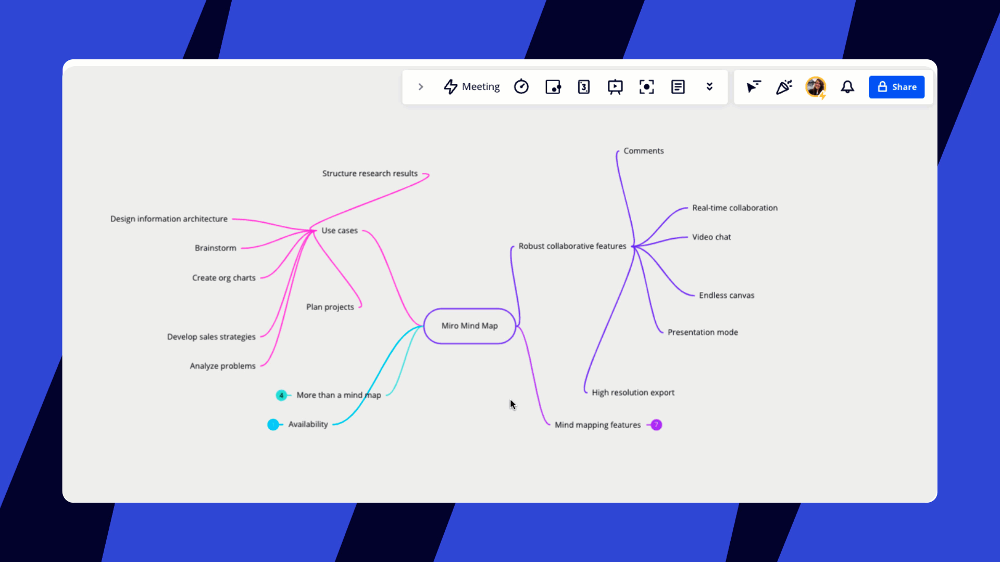
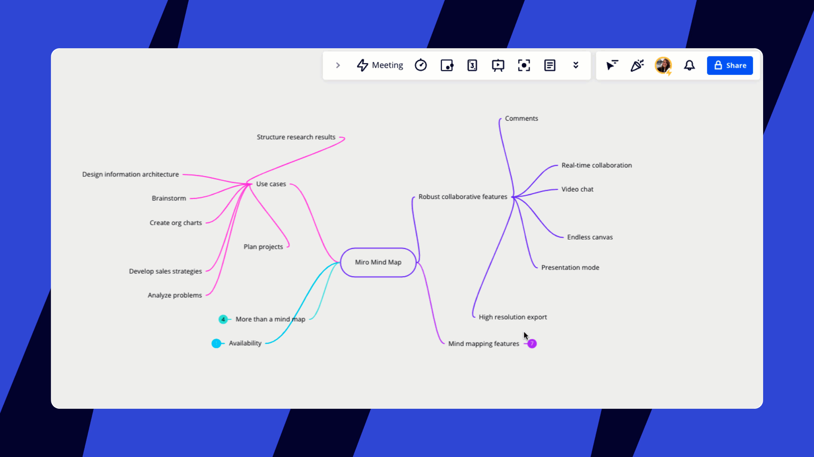
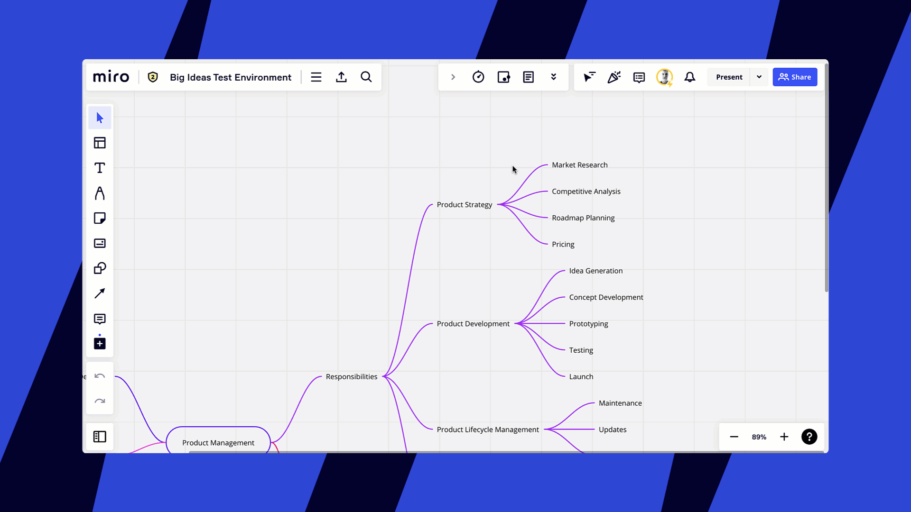
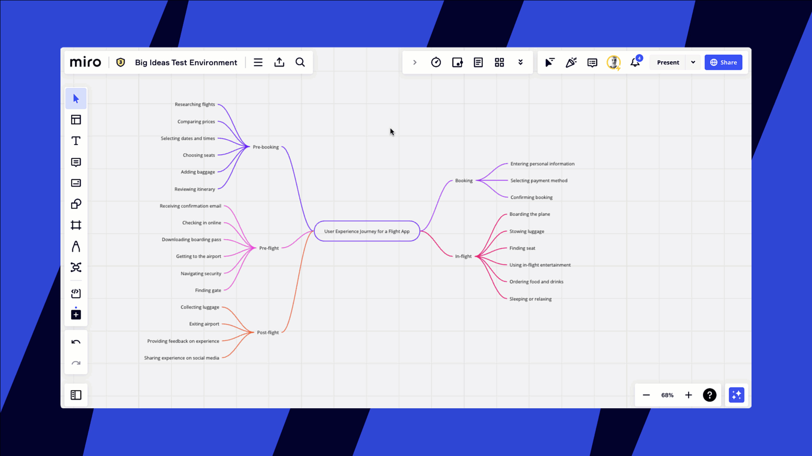
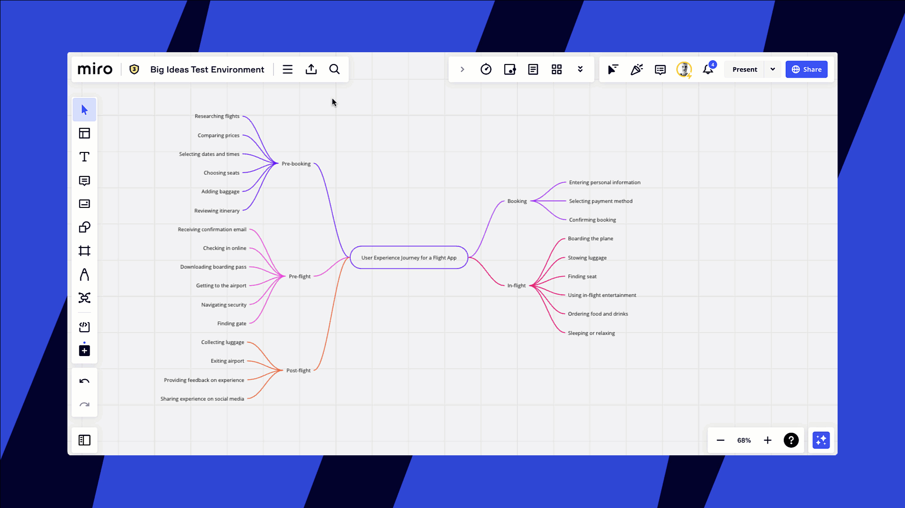

Mit der [Miro-Mindmap](https://miro.com/mind-map-software/) kannst du dieses weltweit anerkannte Tool zur Diagrammerstellung verwenden, um deine Inhalte hierarchisch zu strukturieren.

> **Verfügbar für:**Browser-Version, [Desktop-App](../../getting-started/apps-for-devices/05-desktop-app.md), [Tablet-App](../../getting-started/apps-for-devices/11-tablet-app.md), [mobile App](../../getting-started/apps-for-devices/08-mobile-app.md) (begrenzte Funktionalität)

### So erstellst du eine Miro-Mindmap

Von der Erstellungssymbolleiste her Miro AI verwenden

1. Suche nach **Mindmap** in der Erstellungssymbolleiste. Du kannst das Symbol einfach auf deine Symbolleiste ziehen.*Mindmap in der Symbolleiste*
2. Wähle **Mindmap** aus und klicke auf eine beliebige Stelle auf dem Board, um den übergeordneten Knoten hinzuzufügen. Das ist der Startpunkt deiner Mindmap. Mit den Pluszeichen auf beiden Seiten des Knotens kannst du Zweige beginnen und untergeordnete Knoten erstellen. Du kannst eine vertikale oder horizontale Mindmap erstellen.*Erstellen eines übergeordneten Knotens und Starten einer horizontalen Mindmap*

Mit diesen Abkürzungen kannst du den Erstellungsprozess beschleunigen:

- **Enter**, um einen gleichgeordneten Knoten zu erstellen und ihn sofort zu bearbeiten
- **Shift + Enter** für den Zeilenumbruch innerhalb eines Knotens
- **Tab**, um einen neuen untergeordneten Knoten zu erstellen
- **Pfeile** zum Bewegen zwischen Knotenpunkten
- **Strg + C** und **Strg + V** (*auf Windows*)/ **Cmd + C** und **Cmd + V** (*auf Mac*), um einen Knoten zu duplizieren
- **Escape**, um den Bearbeitungsmodus zu verlassen
- **Löschen**, um den gesamten Knoten zu löschen
- **Strg** (*auf Windows*)/**Cmd** (*auf Mac*) (gedrückt halten), um die automatische Neuzuweisung zu stoppen

Du kannst die Knoten auswählen und ziehen, um ihre Position auf dem Canvas zu ändern.

1. Erstelle den Stammknoten und fülle ihn mit Inhalt.
2. Klicke auf das Symbol  Miro**AI** .
3. Klicke auf **Mindmap generieren**.
   Deine Mindmap wird auf dem Board um deinen Stammknoten herum platziert. Du kannst deine Mindmap wahlweise behalten, wiederholen oder verwerfen.
4. Bearbeite deine Mindmap weiter, um sie deinen Bedürfnissen anzupassen.

Miro AI bietet noch weitere Methoden zur Erstellung einer Mindmap an, z. B. Erweitern mit Fragen, Erweitern mit Ideen und Erweitern mit Themen. Mehr über Miro AI erfährst du im Abschnitt „Mindmaps mit KI“ im [Überblick über das Erstellen und Bearbeiten mit KI](../miro-ai/03-create-with-ai.md).

## Mit Mindmaps arbeiten

Du kannst so viele Knoten zu deiner Mindmap hinzufügen, wie du möchtest. Du kannst die Knoten verschieben oder das automatische Layout verwenden, damit eine übersichtliche Mindmap entsteht. Du kannst untergeordnete Knoten auch anderen übergeordneten Knoten neu zuweisen oder Knoten löschen.

### Knoten verschieben, ihre Größe ändern, hinzufügen, löschen

Wenn du Knoten in deiner Mindmap neu anordnest, werden alle untergeordneten Knoten automatisch mitgenommen. Dies liegt daran, dass das **automatische Layout** standardmäßig aktiviert ist. Um das automatische Layout zu aktivieren oder zu deaktivieren, klicke auf den übergeordneten Knoten und aktiviere im Kontextmenü die Option **Automatisches Layout**.

*Automatisches Layout verwenden, um Änderungen an Knoten auszurichten*

**Wenn das automatische Layout deaktiviert ist**, kannst du trotzdem alle untergeordneten Knoten ausrichten. Wenn du mit der Organisation deiner Mindmap fertig bist, klicke auf den übergeordneten Knoten, klicke dann im Kontextmenü auf die drei Punkte (…) und wähle **Layout-Knoten** aus.

Um einen untergeordneten Knoten einem anderen übergeordneten Knoten zuzuordnen, ziehst du den Knoten einfach an die entsprechende Stelle.

:::note
Halte **Strg** (*Windows*) bzw. **Cmd** (*Mac*) gedrückt, wenn du den Knoten verschieben möchtest, anstatt ihn neu zuzuweisen.
:::

*Einen Knoten neu zuweisen*

Nutze Knotenverknüpfungen, um Abhängigkeiten zwischen Ideen in deiner Mindmap darzustellen, wenn du komplexe Konzepte visualisierst.

*Verknüpfung von Knoten*

Du kannst auch die Größe deiner Mindmap ändern, indem du [sie auswählst](../working-on-the-board/10-working-with-objects.md) und den weißen Punkt verschiebst.

*Die Größe der Mindmap ändern*

Um einem Knoten Text hinzuzufügen, doppelklicke darauf.

:::note
Mit **Umschalttaste + Eingabe** kannst du Zeilen innerhalb eines Knotens umbrechen.
:::

Um eine Aufzählungsliste in einem Knoten zu erstellen, gib **-** ein und drück die Leertaste. Um eine nummerierte Liste zu erstellen, gibst du am Anfang einer Zeile **1.** ein.
Um eine Aufzählung ab der zweiten (oder dritten/vierten/etc.) Zeile zu erstellen, erzeuge eine neue Zeile mit **Cmd + Enter***(für Mac*) oder **Ctrl + Enter***(für Windows*).

*Zusätzlichen Text in einen Knoten einfügen*

Wenn du einen Knoten löschen willst, drückst du auf **Entfernen** oder klickst im Kontextmenü auf die drei Punkte und wählst **Löschen**. Der Knoten wird zusammen mit allen Unterknoten gelöscht.

*Löschen eines Knotens*

:::warning
Mindmap-Knoten können weder [gesperrt](../working-on-the-board/17-locking-content-on-the-board.md) noch [gruppiert](../working-on-the-board/08-structuring-board-content.md#grouping) werden.
:::

### Mindmap-Elemente formatieren

Du kannst den Stil für deine Mindmap auswählen (die Knoten können entweder gebogene oder gerade Linien verwenden) und die Ausrichtung ändern. Und wenn du möchtest, dass deine Mindmap bunt und farbenfroh aussieht, verwende das Tool **Zufällig festlegen**.

*Stil deiner Mindmap*

Da der wichtigste Bestandteil jeder Mindmap der Text ist, kannst du in der gekürzten Version verschiedene Textgestaltungsoptionen anwenden. Beachte bitte, dass sich eine Änderung der Textgröße im übergeordneten Knoten auf die gesamte Mindmap auswirkt, damit die visuelle Einheitlichkeit der Mindmap erhalten bleibt.

*Ändern der Schriftgröße der Mindmap*

Einzelne Knoten kannst du mit verschiedenen Optionen im Kontextmenü ändern: Stil und Farbe ändern, Text hervorheben und eine URL hinzufügen. Derzeit ist es nicht möglich, die Schriftart zu ändern.

*Ändern eines Knotens*

### Ändern des Knotentyps

Es gibt vier visuelle Darstellungen für einen Knoten:

- **Keine**: es wird keine Form verwendet
- **Pille**: eine ovale Tablettenform
- **Abgerundetes Rechteck**: eine rechteckige Form mit abgerundeten Ecken
- **Rechteck**: rechteckige Form

So fügst du einen Knotentyp hinzu:

1. Wähle den Knoten aus, den du anpassen möchtest
2. Klicke in der Symbolleiste auf **Knotentyp**
3. Wähle die gewünschte Darstellung des Knotentyps aus
4. Die Darstellung wird übernommen und der Knoten wird mit der gleichen Farbe wie der Zweig gefüllt
5. Du kannst auch die Farbe des Knotens und die Deckkraft der Füllung ändern, um die visuelle Wirkung zu erhöhen:
   *Ändern des Typs und der Farboptionen eines Knotens*

### Mindmaps aus- und zusammenklappen

Erstelle Mindmaps jeder Größe, ohne dich in den Details zu verlieren. Du kannst die Zweige aus und zusammenklappen, um:

- einen besseren Überblick über deine Mindmap zu erhalten
- dich bei der Arbeit auf die richtige Detailstufe zu konzentrieren
- den Nutzern zu helfen, sich in der Mindmap zurechtzufinden
- deinem Publikum nur bestimmte Detailebenen zu zeigen

**So kannst du die Zweige zusammen- und ausklappen**

Um einen Zweig zusammenzuklappen, fahre mit der Maustaste darüber und klicke auf das Minus (**-**). Alle Kommentare, die diesem Zweig beigefügt sind, werden ebenfalls ausgeblendet.

Nachdem du den Zweig zusammengeklappt hast, wirst du eine Nummer sehen, die dir anzeigt, wie viele Knoten und Kommentare ausgeblendet wurden. Um den Zweig wieder zu erweitern, klicke einfach auf die Nummer.

*Erweitern und Zusammenklappen von Zweigen einer Mindmap*

### Mindmap exportieren

Du kannst deine Mindmap auch als Bild oder PDF-Datei exportieren. Erfahre mehr über die Exportfunktionalität auf [dieser Seite](../import-and-export/export/03-how-to-export-your-board.md).

Um deine Mindmap als Bild zu exportieren, gehe wie folgt vor:

1. Klicke auf das Symbol **Dieses Board exportieren**. Du musst nichts ausgewählt haben.
2. Wähle **Als Bild speichern**.
3. Verwende die Ziehpunkte, um deine Mindmap auszuwählen.
4. Wähle die gewünschte Größe aus und klicke auf **Exportieren**. Du kannst hier auch PDF auswählen.
5. Die Datei wird auf deiner lokalen Festplatte unter dem Namen deines Boards gespeichert.
   
*Export deiner Mindmap als Bild*

Um deine Mindmap als PDF zu exportieren, gehe wie folgt vor:

1. Klicke auf das Symbol **Dieses Board exportieren**. Du musst nichts ausgewählt haben.
2. Wähle **Als PDF speichern.** Du wirst aufgefordert, einen Rahmen für deine Mindmap zu erstellen, falls er noch nicht vorhanden ist.
3. Um einen Rahmen zu erstellen, klicke im Pop-up-Feld auf **Einen Rahmen erstellen**. Wähle einen Stil aus den Optionen auf der linken Seite aus. Ändere die Größe des Rahmens, um deine Mindmap zu erfassen.
4. Klicke erneut auf **Dieses Board exportieren** und wähle **Als PDF speichern**.
5. Wähle die für dich beste PDF-Option und klicke auf **Exportieren**.
   
*Export deiner Mindmap als PDF-Datei*

Du kannst auch die Mindmap auswählen, mit der rechten Maustaste klicken und **Als Bild kopieren** wählen, wodurch nur das ausgewählte Objekt kopiert wird, nicht das gesamte Board. Dadurch wird deine Mindmap nicht exportiert, aber es wird einfach die Kopie auf dem Board platziert.

## Häufige Fragen

Wie viele Knoten kann meine Mindmap haben?

Es gibt keine Begrenzung für die Anzahl der Knoten (übergeordnete oder untergeordnete), die du erstellen kannst.

Kann ich einen Knoten verschieben/neu zuweisen?

Ja, ziehe den Knoten einfach an eine andere Stelle.

Kann ich ein Bild an einen Knoten anhängen?

Derzeit gibt es die Option, ein Bild an einen Knoten anzuhängen, zwar noch nicht, aber es steht auf unserer Liste.

Kann ich die Daten von einer Mindmap als intelligente CSV-Daten exportieren?

Ja, bitte verwende dazu den [Mindmap-Downloader](https://miro.com/marketplace/mindmapdownloader/?backUrl=%2Fmarketplace%2F).

Kann ich mehrere Knoten mit demselben untergeordneten Knoten verknüpfen?

Als Workaround kannst du [Verbindungslinien](../essential-tools/05-connection-lines.md) verwenden, um einen untergeordneten Knoten mit mehreren übergeordneten Knoten zu verknüpfen.

Kann ich meine Mindmap auf ein anderes Miro-Board kopieren?

Ja, du kannst sie wie alle anderen Inhalte kopieren und einfügen – wähle den übergeordneten Knoten aus, klicke im Kontextmenü auf die drei Punkte, wähle **Kopieren** und füge das Widget auf einem anderen Board ein. **[Strg + C/Strg + V](../working-on-the-board/06-shortcuts-and-hotkeys.md)** [*(auf Windows)*](../working-on-the-board/06-shortcuts-and-hotkeys.md) **[oder Cmd + C/Strg + V](../working-on-the-board/06-shortcuts-and-hotkeys.md)** *[(auf Mac)](../working-on-the-board/06-shortcuts-and-hotkeys.md)* funktionieren auch. Bitte vergewissere dich, dass der Board-Eigentümer das Kopieren [des Board-Inhalts erlaubt](../sharing-boards/14-how-to-allow-or-restrict-copying-and-exporting-boards-and-content.md).

Wie kann ich die gesamte Mindmap auf dem Board verschieben?

Wähle den übergeordneten Knoten aus und verschiebe ihn.

Kann ich die Textgröße eines einzelnen untergeordneten Knotens ändern?

Nein, im Moment kannst du nur die Größe des übergeordneten Knotens ändern, was zur Änderung der Größe der gesamten Mindmap führt.

Kann ich [Notizen](../essential-tools/14-sticky-notes.md), [Textblöcke](../essential-tools/16-text.md), [Karten](../essential-tools/02-cards.md) und andere Widgets in Mindmap-Knoten umwandeln?

Nein, das ist derzeit nicht möglich. Du kannst aber den Text von einer Notiz/Karte/Textblock kopieren und in einen Knoten einfügen.

Wie kann ich einen Knoten zwischen zwei bereits existierenden einfügen?

Ordne einen der Knoten vorübergehend einem anderen Knoten zu, erstelle einen neuen Knoten und ordne den Knoten wieder zu.
*Einfügen eines Knotens zwischen bestehenden Knoten*

:::tip
Wenn du die Funktion, die du suchst, nicht gefunden hast, kannst du deine Idee in der [Community-Wunschliste](https://community.miro.com/wish-list-32) kostenlos freigeben.
:::

:::note
Wenn du Probleme bei der Verwendung einer Mindmap hast, versuche [diese Tipps zur Fehlerbehebung](../tools/troubleshooting/07-how-to-troubleshoot-and-report-a-bug.md).
:::
