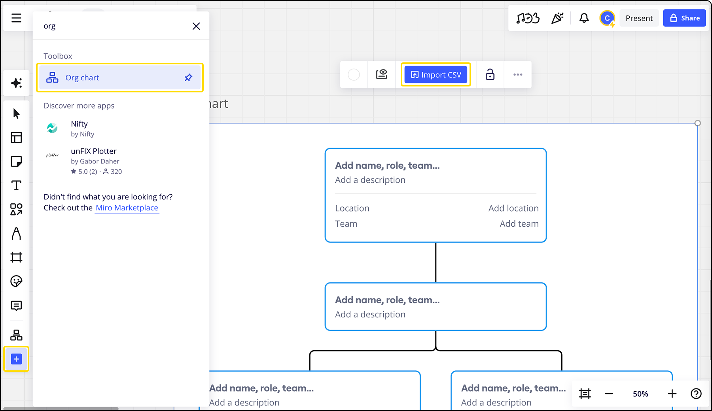

Du kannst Organisationsstrukturen, Hierarchien und Beziehungen innerhalb eines Unternehmens erstellen und visualisieren, um die organisatorische Effizienz zu steigern und die Planung zu vereinfachen.

Bringe Leute auf dem Board zusammen, um zu diskutieren, Feedback zu geben und gemeinsam an Organigrammen zu arbeiten. So könnt ihr sicherstellen, dass sich alle hinsichtlich der Strategie einig sind. Mit Echtzeit-Daten und Tools für die Zusammenarbeit kannst du sicherstellen, dass die Ressourcen deines Unternehmens effizient eingesetzt werden, um sowohl den aktuellen als auch den zukünftigen Bedarf zu erfüllen.

> **Verfügbar für:** Free-, Starter-, Business-, Education- und Enterprise-Preispläne

## Wichtige Funktionen

- **Importiere Daten aus CSV-Dateien** in dein Organigramm.
- **Du kannst dein Organigramm ganz einfach aktualisieren**, indem du bei Bedarf neue CSV-Daten hochlädst.
- **Passe dein Organigramm** mit einer einzigen, vielseitigen Karte an, mit der Nutzer Felder aktivieren oder deaktivieren und offene Rollen festlegen können.
- **Du kannst das Aussehen deines Diagramms** mit anpassbaren Formatierungsoptionen wie farbigen Zweigen, Hintergrundfarben und Filtern an deine Vorstellungen anpassen.
- **Mit** **dem automatischen Layout** kannst du die Kartenanordnung für eine effiziente Organigramm-Erstellung optimieren.

## Ein Organigramm erstellen

1. Öffne das Miro-Board, in dem du das Organigramm erstellen möchtest.
2. Gehe zur [Erstellungssymbolleiste](../../getting-started/start-here/your-first-board/05-toolbars.md) auf der linken Seite des Boards.
3. Klicke auf **Weitere Apps** (**+**) und suche nach „Organigramm“.
4. Klicke auf **Organigramm**, um einen Entwurf des Organigramms auf dem Board zu erstellen.
5. Klicke auf den Entwurf des Organigramms, um das Kontextmenü zu öffnen. Klicke dann auf **CSV importieren**, um deine Organisationsdaten hochzuladen.
6. Miro verarbeitet deine Daten automatisch und füllt das Organigramm entsprechend aus.

*Ein Organigramm erstellen*

:::tip
Die Aktualisierung eines Organigramms mit einer CSV-Datei kann auch über die Schaltfläche **CSV importieren** erfolgen.
:::

### Rollen und Teams neu zuweisen

Mithilfe des automatischen Layouts kannst du die Karten ganz einfach neu anordnen. Klicke einfach auf die Karten und ziehe sie, um Rollen und Teams neu zuzuweisen.

### Karten hinzufügen

Um weitere Karten hinzuzufügen, klicke auf die Plus-Symbole, die eine vorhandene Karte umgeben. So kannst du dein Diagramm weiter individuell anpassen.

### Kartentextfelder bearbeiten

Doppelklicke auf die Textfelder einer Karte, um den Namen, die Rolle, das Team, die Beschreibung und den Standort zu bearbeiten. Du kannst auch alle importierten, benutzerdefinierten Felder bearbeiten.

### Bestimmte Informationen ein- oder ausblenden

Rufe das Kontextmenü auf und klicke auf das Filtersymbol. Über die Auswahlfelder kannst du dann die Sichtbarkeit von **Standort-** oder **Teaminformationen** oder anderen benutzerdefinierten Feldern bestimmen. Um Rollen anzuzeigen, für die derzeit eingestellt wird, aktiviere die Option **Einstellung**.

### Farben deines Organigramms ändern

Personalisiere dein Organigramm, indem du die Hintergrundfarbe änderst, einen Rahmen hinzufügst oder die Zweigfarben anpasst.
