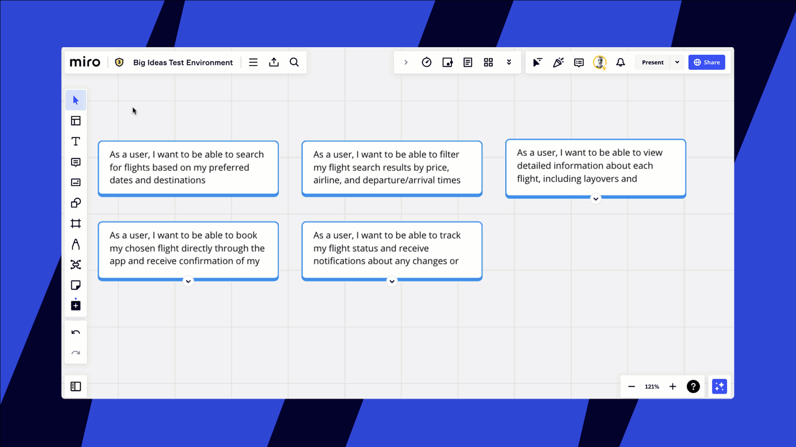

Miro-Karten geben dir die Möglichkeit, die Aufgaben zu organisieren und zuzuweisen, Details bereitzustellen, dich mit den Stakeholdern abzustimmen und alles im Blick zu behalten. Verwende Karten für die [Planung](../advanced-tools/02-columns-formerly-kanban.md) oder für das [Story-Mapping](../advanced-tools/07-user-story-mapping.md).

> **Verfügbar mit:** Desktop-**Browser, Desktop-App, eingeschränkte Funktionalität auf Tablet-App und mobile App**

## Karten verwenden

### So fügst du die Karten-App zur Symbolleiste hinzu

Wenn du oft mit Karten auf deinem Board arbeitest, füge die Kartenfunktion zu deiner Symbolleiste hinzu, um schneller auf Karten zuzugreifen.

1. Gehe zur Erstellungssymbolleiste auf der linken Seite des Boards
2. Klicke auf das Symbol **Mehr Apps**
3. Suche nach „Karte“
4. Klicke auf das Symbol **Karte**, um es zur Symbolleiste hinzuzufügen

*Die Karten-App auf die Symbolleiste setzen*

### So fügst du Karten zum Board hinzu

Es gibt drei Möglichkeiten, eine Karte zu deinem Board hinzuzufügen.

**Zieh das Kartensymbol** aus der Erstellungssymbolleiste und lege es an einer beliebigen Stelle auf dem Board ab.

*Ziehen der Karte auf das Board*

**Klicke auf das Kartensymbol** und dann auf eine beliebige Stelle auf dem Board.

*Klicken auf das Kartensymbol, um eine Karte auf das Board zu setzen*

**Verwende den Kurzbefehl D** und klicke auf eine beliebige Stelle auf dem Board.

*Mit dem Kurzbefehl D eine Karte zum Board hinzufügen*

:::tip
[Aktiviere die Abmessungen](../formats/diagramming/01-miro-for-mapping-diagramming.md), um Karten der gleichen Größe auf deinem Board zu erstellen.
:::

### So löschst du Karten vom Board

1. Klicke auf die Karte und drücke die Rücktaste auf deiner Tastatur.
2. Du kannst auch auf die drei Punkte im Kontextmenü klicken (**...**) > **Löschen**

***Löschen einer Karte*

### So wandelst du andere Objekte in Karten um

Du kannst jede vorhandene [Notiz](14-sticky-notes.md), jedes [Textfeld](16-text.md) oder jede [Form](11-shapes.md) mit der Funktion [Typ wechseln](../working-on-the-board/20-switch-type.md) in eine Karte umwandeln.

1. Klicke auf das Objekt, um das Kontextmenü zu öffnen.
2. Klicke auf das Symbol **Typ wechseln**.
3. Wähle das Kartensymbol aus dem Dropdown-Menü aus.

*Umwandlung einer Notiz in eine Karte*

**Um mehrere Objekte auf einmal in Karten umzuwandeln**, klicke und ziehe, um die Objekte auszuwählen, und klicke dann im Kontextmenü auf das Symbol „Typ wechseln“. Wähle das Kartensymbol aus.

*
Mehrere Notizen auf einmal in Karten umwandeln*

:::tip
Du kannst [Karten in Jira-Karten umwandeln](../../integrations-apps/atlassian/03-jira-cards.md). Verwende die Massenumwandlung, wenn du nach einer Brainstorming-Sitzung oder einem agilen Meeting mehrere Jira-Karten erstellen möchtest.
:::

### So öffnest du den Kartenbereich

Wenn du den Kartenbereich öffnest, kannst du dir alle Kartendetails anzeigen lassen, alle Änderungen auf einmal vornehmen und eine Beschreibung hinzuzufügen.

Um den Kartenbereich zu öffnen, klicke auf das Symbol **Erweitern** in der oberen rechten Ecke der Karte oder im Kontextmenü der Karte. Du kannst auch den Kurzbefehl **Strg** + **Shift** + **Enter** (*für Windows*) **Cmd** + **Shift** + **Enter** (*für Mac)* verwenden**.**

*Öffnen des Kartenbereichs*

## Karten bearbeiten und anpassen

### So bearbeitest du eine Karte

Klicke auf die Karte, um das Kontextmenü zu öffnen, oder öffne den Kartenbereich. Hier kannst du die Farbe und Größe der Karten ändern, Tags, Links und Daten hinzufügen und den Nutzern Karten zuweisen.

*Bearbeiten einer Karte*

### So bearbeitest du mehrere Karten auf einmal

1. Ziehe das Auswahlfeld über die Karten oder wähle eine Karte nach der anderen aus, während du die **Shift-** oder **Strg-Taste** *(für Windows)* oder **die Befehlstaste** *(für Mac)* gedrückt hältst.
2. Das Kontextmenü öffnet sich.
3. Wähle ein beliebiges Tool aus dem Kontextmenü aus, um Änderungen vorzunehmen.

*Bearbeitung mehrerer Karten auf einmal*

### So änderst du die Größe einer Karte oder drehst sie

Klicke auf die Karte und ziehe die weißen Punkte. Du kannst die Karte drehen, indem du das Pfeilsymbol ziehst.

*Ändern der Kartengröße und Drehen der Karte*

### So weist du jemandem eine Karte zu

Karten können Nutzern zugewiesen werden, die über eine [E-Mail-Einladung](../sharing-boards/03-sharing-boards-and-inviting-collaborators.md), [Team-Freigabe](../sharing-boards/03-sharing-boards-and-inviting-collaborators.md) oder ein [Projekt](../sharing-boards/16-projects.md) Zugriff auf das Board haben . Karten können keinen [Besuchern](../sharing-boards/08-collaboration-with-visitors.md) zugewiesen werden.

1. Klicke auf die Karte, um das Kontextmenü zu öffnen, oder öffne den Kartenbereich.
2. Klicke auf das Symbol **Bearbeiter hinzufügen**.
3. Wähle einen Nutzer aus dem Dropdown-Menü aus.

*Eine Karte einem Nutzer zuweisen*

### So fügst du Tags zu Karten hinzu und entfernst sie

1. Klicke auf die Karte, um das Kontextmenü zu öffnen, oder öffne den Kartenbereich.
2. Klicke auf das Symbol **Tag hinzufügen**.
3. Gib den Text für deinen Tag ein (und wähle die Tag-Farbe aus).
4. Klicke auf „Erstellen“ oder drücke die Eingabetaste.
5. Klicke auf ein Tag, um es von der Karte zu entfernen

:::tip
Verwende Tags, um  deine Karten zu [suchen und filtern](../working-on-the-board/19-searching-text-on-the-board.md).
:::

*Hinzufügen und Entfernen von Tags auf einer Karte*

### So aktualisierst du den Status einer Karte

1. Klicke auf die Karte, um das Kontextmenü zu öffnen, oder öffne den Kartenbereich.
2. Klicke auf das Symbol **Status hinzufügen**.
3. Wähle aus dem Dropdown-Menü **Zu erledigen**, **In Bearbeitung** oder **Fertig** aus.
4. Um einen Status zu entfernen, klicke auf **Status entfernen**

*Aktualsisieren des Status einer Karte*

### So fügst du Daten auf einer Karte hinzu und entfernst diese

1. Klicke auf die Karte, um das Kontextmenü zu öffnen, oder öffne den Kartenbereich.
2. Klicke auf das Symbol **Datum festlegen.**
3. Gib das Startdatum und/oder das Fälligkeitsdatum ein.
4. Um ein Datum zu löschen, klicke auf **x** neben dem Datumsfeld

*Hinzufügen eines Start- und Fälligkeitsdatums zu einer Karte*

### Kartentitel und Kartenbeschreibungen

Du kannst bis zu 20.000 Textsymbole in die Kartenbeschreibung und den Titel einfügen. Der Titel einer Karte ist immer sichtbar. Die Nutzer können die Karte erweitern, um die Beschreibung zu sehen.

#### **So fügst du einen Kartentitel hinzu**

Klicke auf die Karte und beginne zu tippen. Es ist nicht möglich, die Schriftart und die Größe des Titels einer Karte zu ändern.

*Hinzufügen eines Kartentitels*

#### **So fügst du eine Kartenbeschreibung hinzu**

Klicke auf das Symbol zum Erweitern, um den Kartenbereich zu öffnen, und beginne mit der Eingabe in das Feld **Beschreibung**. Du kannst den kopierten Text auch direkt mit  **Strg + C** / **Strg + V** (*für Windows*) oder **Cmd + C / Cmd + V** (*für Mac*) in das Beschreibungsfeld einfügen.

*Hinzufügen einer Kartenbeschreibung*

## So exportierst du Karten

1. Ziehe das Auswahlfeld über die Karten oder wähle eine Karte nach der anderen aus, während du die **Shift-** oder **Strg-Taste** *(für Windows)* oder die **Befehlstaste** *(für Mac)* gedrückt hältst.
2. Klicke auf **Exportieren** > **Als Tabelle** **exportieren (CSV)**.

*Exportieren von Karten in eine CSV-Datei*

## Tastenkombinationen für Karten

- **D** + klicken, um eine neue Karte zum Board hinzuzufügen
- **Strg + Shift + Enter *(für Windows)*, Cmd + Shift + Enter *(für Mac),*** um alle Karten zu öffnen
- **Tab-Taste**, um eine neue Karte zu erstellen und den Kartentitel zu bearbeiten
- **Strg + B** *(für Windows)*, **Cmd + B** *(für Mac)* – fett
- **Strg + I** *(für Windows)*, **Cmd + I** *(für Mac) –* kursiv
- **Strg + U** *(für Windows)*, **Cmd + U** *(für Mac) –* unterstrichen
- **„-“**+ **Leerzeichen** am Anfang einer Zeile für eine Aufzählung
- **„1.“** am Anfang einer Zeile für eine nummerierte Liste
- Wähle Text und **Strg + V** *(für Windows) oder* **Cmd + V** (*für Mac)*, um einen Hyperlink zu erstellen

## Häufige Fragen

**Wenn ich einem Nutzer eine Karte zuweise, erhält dieser eine E-Mail-Benachrichtigung?**

Nein, die Person erhält keine E-Mail-Benachrichtigung.

**Kann ich E-Mail-Erinnerungen konfigurieren, die auf dem Fälligkeitsdatum basieren, das ich zu einer Karte hinzugefügt habe?**

Das ist derzeit nicht möglich.
