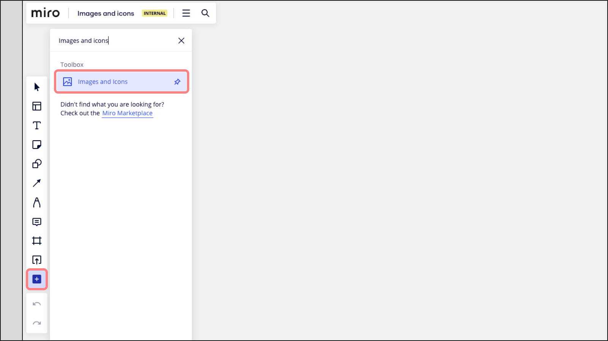
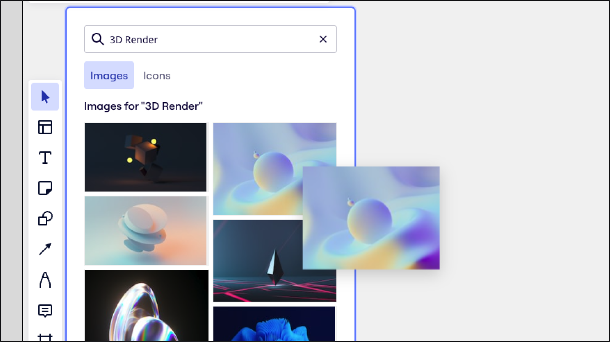
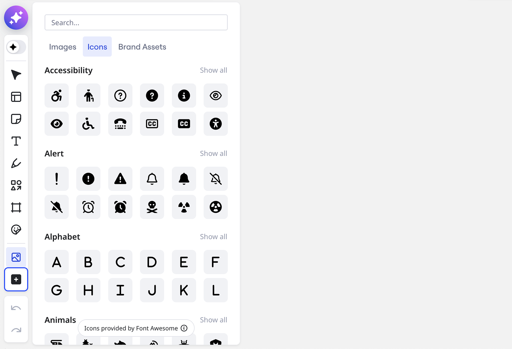
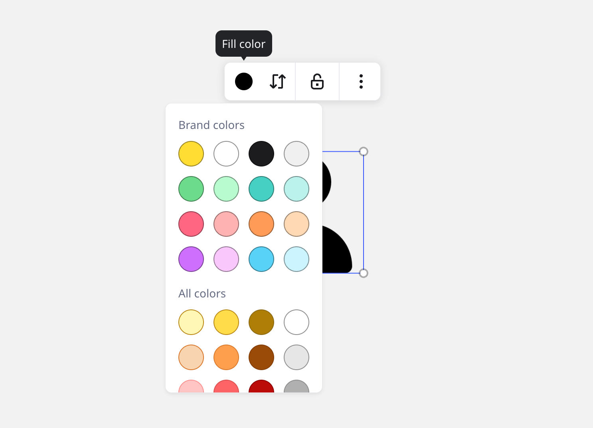

Erstelle ansprechende und professionell aussehende Boards und Präsentationen. Du kannst von einer einzigen Bibliothek aus Bilder und Symbole von Unsplash und Iconfinder suchen und austauschen.

## Erste Schritte mit Bildern und Symbolen

Admins können den Zugriff auf die Unsplash-App in ihren [App-Verwaltung](../../enterprise-administration/managing-apps-on-enterprise-plan/02-app-management.md)-Einstellungen verwalten und den Zugriff jederzeit erlauben oder einschränken.

:::warning
Wenn du nicht auf die Unsplash-App von deinem Board aus zugreifen kannst, überprüfe mit deinem Admin, ob die App für dein Unternehmen freigegeben wurde.
:::

Wenn der Zugriff auf Unsplash erlaubt ist, wird ein eigener Tab für Bilder von Unsplash in die Bilder- und Symbolbibliothek aufgenommen. Wenn der Zugriff auf Iconfinder erlaubt ist, wird dieser auch als separater Tab in der Bibliothek angezeigt.

*Unsplash- und Iconfinder-Tabs*

### So greifst du auf Bilder und Symbole zu

1. Gehe zur [Erstellungssymbolleiste](../../getting-started/start-here/your-first-board/05-toolbars.md) auf der linken Seite deines Boards.
2. Klicke auf das **Mehr Apps**-Symbol (**+**) und suche nach „Bilder und Symbole“.
3. Öffne die **Bilder und Symbole** App.

*Starten der Bilder und Symbole App*

### Bilder von Unsplash

Hol dir lizenzfreie Bilder von Unsplash. Durchsuche Bildkategorien nach Inspiration oder suche nach einem bestimmten Bild.

*Durchsuchen von Unsplash-Bildern*

Bewege den Mauszeiger über ein Bild und klicke auf das Informationssymbol (**i**) in der unteren linken Ecke, um die Details zu öffnen. In den Bilddetails kannst du den Verfasser, die Lizenz und die Nutzung des Bildes anzeigen lassen.

*Anzeigen der Bilddetails*

Um ein Bild von Unsplash hinzuzufügen, wähle es durch Anklicken aus und platziere es auf deinem Board, oder verwende Drag-and-Drop.

*Hinzufügen eines Bildes zum Board*

### Symbole von Fontawesome

Du kannst auf eine Vielzahl von Symbolen von Fontawesome zugreifen. Durchsuche Symbolpakete oder suche nach einem bestimmten Symbol.

*Symbole durchsuchen*

Um ein Symbol hinzuzufügen, wähle es durch Anklicken aus und lege es auf deinem Board ab. Alternativ kannst du Drag-and-Drop verwenden.

### Farbe eines Symbols ändern

1. Wähle ein Symbol auf dem Board aus, um das Kontextmenü zu öffnen.
2. Klicke auf **Füllfarbe**.
3. Wähle die Farbe, in die das Symbol geändert werden soll.

*Symbolfarbe ändern*

### Bilder und Symbole ersetzen

Du kannst Bilder direkt aus der Bilder- und Symbolbibliothek ersetzen. Dies ist besonders nützlich, um Präsentationsvorlagen zu aktualisieren. [Vorlagen](../../getting-started/start-here/your-first-board/04-templates.md).

1. Klicke auf das Bild oder Symbol, um das Kontextmenü zu öffnen.
2. Klicke auf das Symbol **Bild ersetzen**.
3. Wähle **Aus Bibliothek ersetzen**.
4. Die App „Bilder und Symbole“ wird geöffnet.
5. Wähle ein neues Bild oder Symbol aus.

*Symbole und Bilder auf dem Board austauschen*

## Bilder gestalten

Du kannst das Aussehen deiner Bilder in Miro ganz leicht mit verschiedenen Gestaltungsmöglichkeiten verbessern. Du kannst einen Rand hinzufügen, die Rand-Deckkraft anpassen oder die Ecken abrunden – Miro bietet flexible Optionen zum Anpassen deiner Bilder an die Ästhetik deines Boards an.

*Bilder stylen*

Hier erfährst du, wie du deine Bilder gestalten kannst und welche Optionen zur Anpassung zur Verfügung stehen:

### Randstil

- **Randdicke**: Mit einem Schieberegler kannst du die Dicke des Rands um dein Bild anpassen. So kannst du den Rand je nach Bedarf auffälliger oder unauffälliger gestalten.
- **Randfarbe**: Wähle eine Farbe für den Rand aus der Farbpalette von Miro aus, einschließlich Marken- und benutzerdefinierter Farben.
- **Randdeckkraft**: Du kannst die Deckkraft deines Rands mit einem Schieberegler ändern und ihn transparenter oder vollständig undurchsichtig machen.
- **Abgerundete Ecken**: Mit dem Schieberegler kannst du den Eckenradius anpassen, wodurch das Bild weicher Kanten erhält. Setze den Wert auf 0, um scharfe Ecken zu erhalten, oder erhöhe den Wert, um abgerundete Ecken zu erhalten.

### Bilder zuschneiden

Du musst keine Software von Drittanbietern verwenden, um Bilder zuzuschneiden, da Miro ein Tool dafür hat. Wähle ein Bild aus oder wähle **Zuschneiden** im Kontextmenü. Dies aktiviert den Zuschneidemodus, der die Bearbeitung der **rechteckigen** Auswahl ermöglicht.

Die Beschnittgrenzen rasten am umgebenden Boardinhalt ein, um sicherzustellen, dass das Layout der Bilder visuell klar ist. So kannst du die Position und den Maßstab der Bilder, die du zuschneidest, aktualisieren, ohne die Ausrichtung mit anderen Inhalten auf dem Board zu verlieren. Wenn es fertig ist, klicke einfach irgendwo auf das Board.

Du kannst **Bilder in verschiedenen Formen zuschneiden** (z. B. Kreis, Quadrat usw.). Wähle das Bild aus, klicke im Kontextmenü auf das Symbol **Zuschneiden** und wähle eine Form aus dem Dropdown-Menü aus.

Du kannst auch mehrere Bilder auf einmal in verschiedenen Formen zuschneiden. Klicke und ziehe, um die Bilder auszuwählen, klicke auf das Symbol **Zuschneiden** im Kontextmenü und wähle eine Form aus dem Dropdown-Menü aus.

*Mehrere Bilder gleichzeitig zu einem Kreis zuschneiden*

:::tip
Du kannst dein zugeschnittenes Bild stets wieder auf seine ursprüngliche Größe zurücksetzen, indem du einen Doppelklick machst und die Zuschneideauswahl auf ihre ursprüngliche Größe erweiterst.
:::

Weitere Bildbearbeitungsoptionen stehen direkt auf deinem Board mit Adobe Express zur Verfügung. Klicke im Kontextmenü auf **Bild bearbeiten**, um Adobe Express zu starten. **Mehr Informationen:** [Adobe Express (Betaversion)](../../integrations-apps/adobe/01-adobe-express.md).

### Die Größe von mehreren Bildern auf einmal ändern

Du kannst Höhe oder Breite von mehreren Bildern auf deinem Board auf einmal ändern. Danach kannst du sie mit [Auto-Layout](../working-on-the-board/08-structuring-board-content.md) direkt ausrichten.

**So änderst du die Größe mehrerer Bilder gleichzeitig**

1. Ziehe den Cursor, um alle Bilder auszuwählen, deren Größe du ändern möchtest.
2. Klicke im Kontextmenü auf das Symbol zum Ändern der Größe. Du musst mehrere Bilder auswählen, damit die Option zum Ändern der Größe erscheint.
3. Wähle **Höhe anpassen** oder **Breite anpassen**
4. Klicke auf das graue **Auto-Layout**-Symbol in der oberen rechten Ecke

### GIFs hinzufügen

Füge deinen Miro-Boards GIFs hinzu, um Ideen mit lustigen, animierten Inhalten zum Leben zu erwecken. GIFs werden für einzelne Nutzer 8 Sekunden lang oder in einer Schleife abgespielt, wenn sie zum Board hinzugefügt werden und wenn jemand den Mauszeiger darüber bewegt. GIFs werden nur für einzelne Nutzer abgespielt, die mit dem Board interagieren, nicht für alle in Echtzeit.

Aktiviere [Bewegung reduzieren](../../getting-started/accessibility-in-miro/06-reduce-motion.md), um das automatische Abspielen des GIFs zu deaktivieren.

:::tip
GIFs in Präsentationen und [Miro Talktracks](../facilitation-tools/asynchronous-tools/02-talktrack-board-recordings.md) werden automatisch in einer Endlosschleife abgespielt, solange sie auf dem Bildschirm sichtbar sind.
:::
