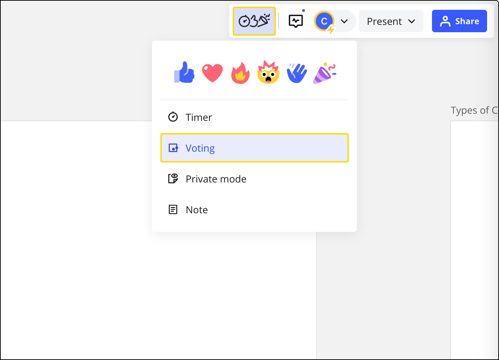
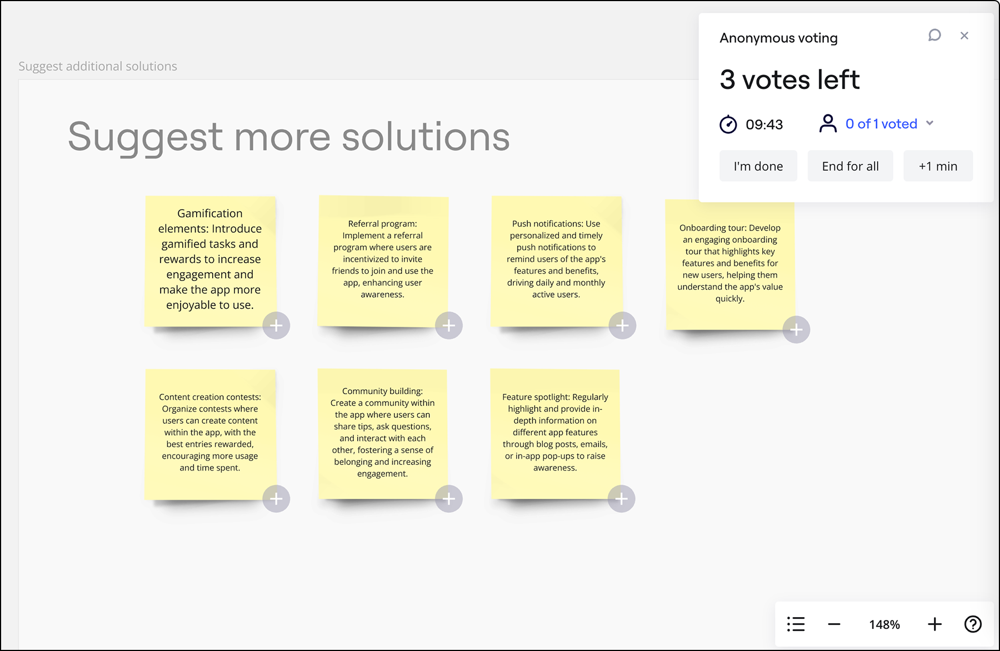
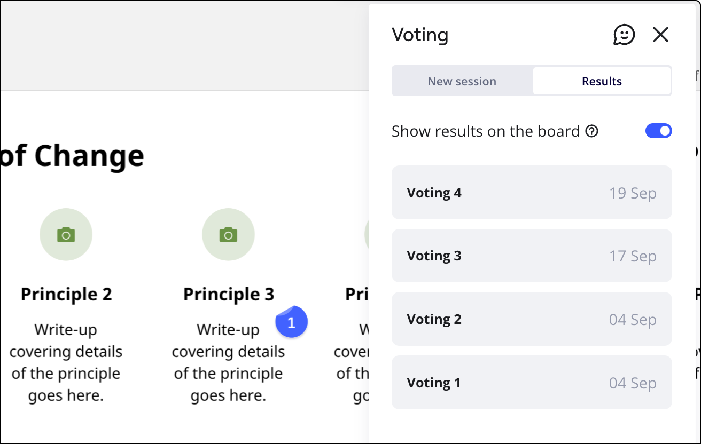
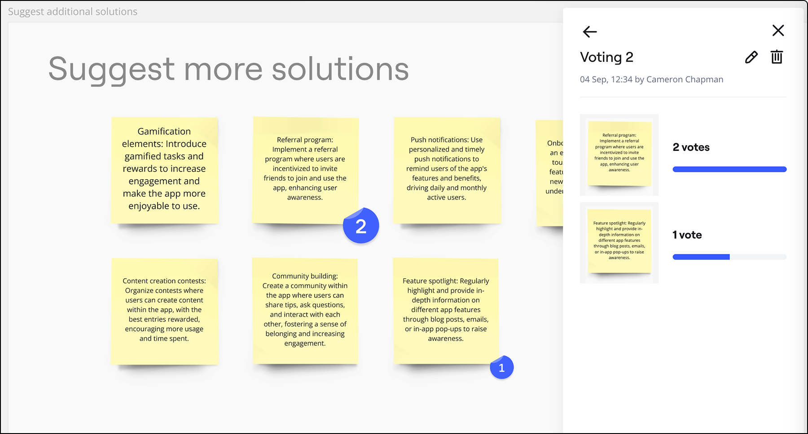

Du musst schnell ermitteln, welche der besprochenen Optionen oder Ideen dein Team bevorzugt? Richte direkt auf dem Miro-Board eine Abstimmungsrunde ein – unser Abstimmungs-Tool hilft dir dabei.

> **Erhältlich für:** Starter-, Business-, Enterprise- und Education-Preispläne
> **Verfügbar mit:** Browser-Version, [Desktop-App](../../getting-started/apps-for-devices/05-desktop-app.md), [Tablet-App](../../getting-started/apps-for-devices/11-tablet-app.md)
> **Einrichtung durch:** Teammitglieder, die das Board bearbeiten dürfen. Alle Nutzer können an der Abstimmungsrunde teilnehmen.

### Einrichten einer Abstimmungsrunde

Das Tool ist oben rechts in der Symbolleiste für die Zusammenarbeit unter dem Symbol **für die Moderation und Reaktionen** zu finden.

*oting Symbol auf der Symbolleiste für die Zusammenarbeit*

:::note
Wenn die Abstimmung für dich nicht verfügbar ist, stelle bitte sicher, dass das Board in einem kostenpflichtigen oder Education-Team gespeichert ist.
:::

Der Abstimmungsbereich erscheint auf der rechten Seite deines Boards. Dort kannst du die Einstellungen für die Abstimmung aufrufen, von denen die meisten optional sind. Bevor du die Sitzung beginnst:

- Bestimme die Objekte, über die deine Teilnehmer/innen abstimmen sollen, indem du den Abstimmungsbereich festlegst. Objekte zur Abstimmung schnell filtern und Unterkategorien wie Notizen auswählen
- Lege die Anzahl der Stimmen pro Person fest, indem du die Schaltflächen **+** und **-** benutzt oder die Zahl eingibst (beachte, dass die Abstimmung anonym ist, die maximale Anzahl der Stimmen beträgt 99)
- Lege die Dauer der Abstimmungsrunde mit den Schaltflächen **+** und **-** oder durch Eingabe der Zahl fest, wähle zwischen Minuten, Stunden und Tagen
- Wenn jeder Teilnehmer nur eine Stimme pro Objekt abgeben soll, aktiviere den entsprechenden Toggle (optional)

Wenn du fertig bist, klicke auf **Start**.

*Einrichtung einer Abstimmungsrunde*

Du kannst auch eine Abstimmungsrunde einrichten und sie für eine spätere Präsentation speichern. Richte die Abstimmungsrunde wie gewohnt ein, aber anstatt auf **Start** zu klicken, klicke auf **Zum Board hinzufügen**.

### Abstimmung im Gange

Du und deine Board-Mitwirkenden können an der Abstimmung teilnehmen oder sie überspringen. Sobald du die Abstimmungsrunde eingerichtet hast, sehen die Teilnehmer des Boards (registrierte Nutzer und nicht registrierte Nutzer) ein Pop-up-Fenster, das sie darüber informiert, dass die Abstimmungsrunde begonnen hat und wie viel Zeit sie für die Abstimmung haben.

Wenn ein Nutzer die Abstimmung versehentlich übersprungen hat, kann er ihr beitreten, indem er auf das Abstimmungssymbol auf der rechten oberen Symbolleiste klickt. Das Symbol zeigt die verbleibende Zeit.

Diejenigen, die an der Abstimmung teilnehmen, können Objekten ihre Stimmen geben, indem sie auf das Plussymbol daneben klicken. Alle Stimmen sind **anonym**. Teilnehmer können signalisieren, dass sie mit der Abstimmung fertig sind, indem sie auf **Fertig** klicken. Teilnehmer können den Status der anderen Nutzer sehen (wer hat bereits abgestimmt), wenn sie auf **Teilnehmer** klicken.

Während der Abstimmungsrunde kannst du deine Stimmen ändern, indem du auf das Plus- und Minus-Symbol bei den ausgewählten Objekten klickst. Wenn du das Abstimmungs-Fenster geschlossen hast, kannst du erneut an der Abstimmung teilnehmen, indem du auf den Abstimmungs-Button auf der Symbolleiste klickst.

### So funktioniert das für moderierende Personen.

Derjenige, der die Abstimmung veranlasst hat, sieht den aktuellen Stand der Abstimmung in der oberen rechten Ecke des Boards. Klicke auf **Teilnehmer**, um zu sehen, wie viele Stimmen pro Person abgegeben wurden und ob die Teilnehmer die Abstimmung beendet haben. Du kannst auch jederzeit die **Abstimmungsrunde beenden** oder Minuten hinzufügen, indem du auf die entsprechenden Schaltflächen klickst.

Wenn du die aktuelle Abstimmungsrunde zurücksetzen musst, beende die Sitzung und beginne eine neue.

### Ergebnisse der Abstimmung

Sobald die Abstimmung vorbei ist, können alle Teilnehmer die Top-3-Ergebnisse sehen und auf die Schaltfläche **Alle Ergebnisse anzeigen** klicken.

Wenn du auf **Alle Ergebnisse anzeigen**klickst, siehst du die Liste der Ergebnisse der Abstimmungsrunde auf dem Abstimmungsfeld. Dein Abstimmungsverlauf und die Ergebnisse anderer Abstimmungen sind auf der entsprechenden Registerkarte verfügbar. Du kannst auch festlegen, dass die Abstimmungsergebnisse auf dem Board sichtbar bleiben sollen, indem du den Schalter auf dem Tab **Ergebnisse** betätigst.

*Die Umschaltfunktion Ergebnisse auf dem Board anzeigen im Tab Ergebnisse*

Um eine Abstimmungsrunde umzubenennen oder Abstimmungsergebnisse zu löschen, öffne eine Runde und klicke auf die entsprechenden Symbole.

*oder Löschen von Symbolen in einer Abstimmungsrunde*

## Häufige Fragen

1. *Kann ich die Abstimmungsergebnisse exportieren?*
   - Es gibt keine Möglichkeit, die Abstimmungsergebnisse zu exportieren, aber du kannst einen Screenshot machen.
2. *Wer kann an einer Abstimmungsrunde teilnehmen?*
   - Alle Nutzer auf dem Board.
3. *Ich bin ein Bearbeiter des Boards, aber ich kann keine Abstimmungsrunde starten. Warum?*
   - Du kannst keine Abstimmungsrunde starten, wenn du ein Gast auf dem Board bist oder ein Besucher, der es bearbeiten kann. Nur Teammitglieder mit Bearbeitungsrechten können Abstimmungen einrichten.
4. *Wenn ich [mein Board dupliziere](../managing-boards/03-how-to-duplicate-a-board.md), werden dann die Ergebnisse der Abstimmungsrunde auf der Kopie des Boards gespeichert?*
   - Nein, das werden sie nicht.
5. *Wie ermögliche ich es den Teilnehmern, in einem Textfeld für einzelne Wörter/Sätze zu stimmen?*
   - Beachte, dass ein Nutzer jeweils nur für ein ganzes Textfeld abstimmen kann. Wenn du möchtest, dass für einzelne Wörter/Sätze in einem Textfeld abgestimmt werden soll, schreibe bitte jedes Wort oder jeden Satz in ein eigenes Textfeld.
6. *Bietet ihr ein Tool für die Punktabstimmung an?*
   - Versuche, [diese Vorlage](https://miro.com/templates/dot-voting/) aus der Vorlagenbibliothek zu verwenden oder füge die Vorlage über die [Vorlagenauswahl](../../getting-started/start-here/your-first-board/04-templates.md) hinzu.
