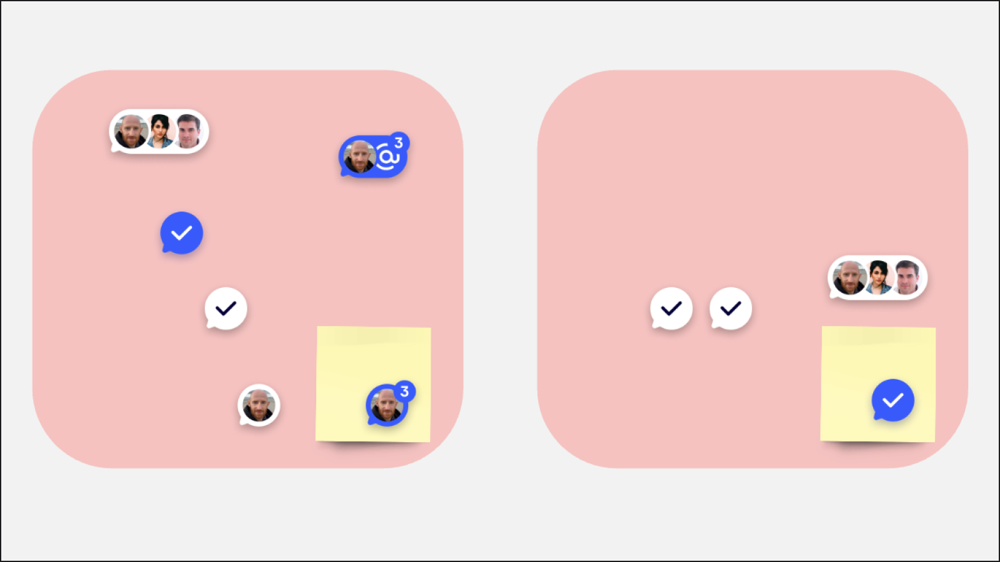
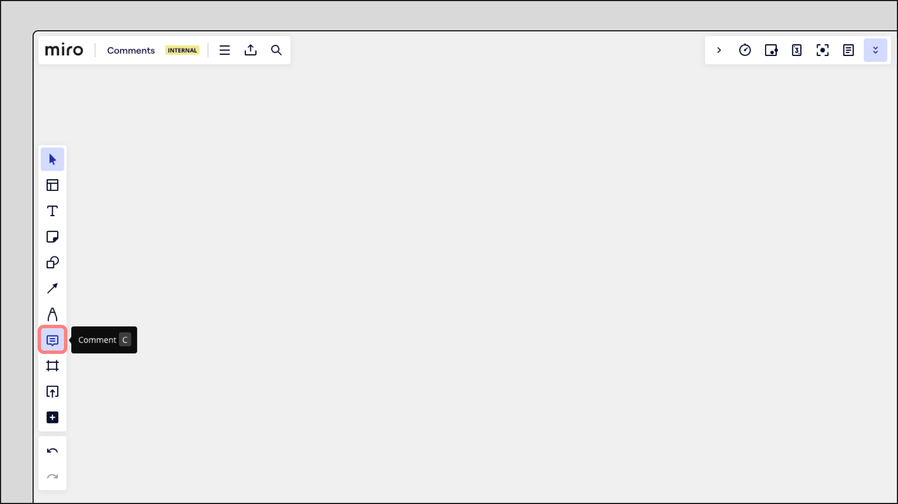
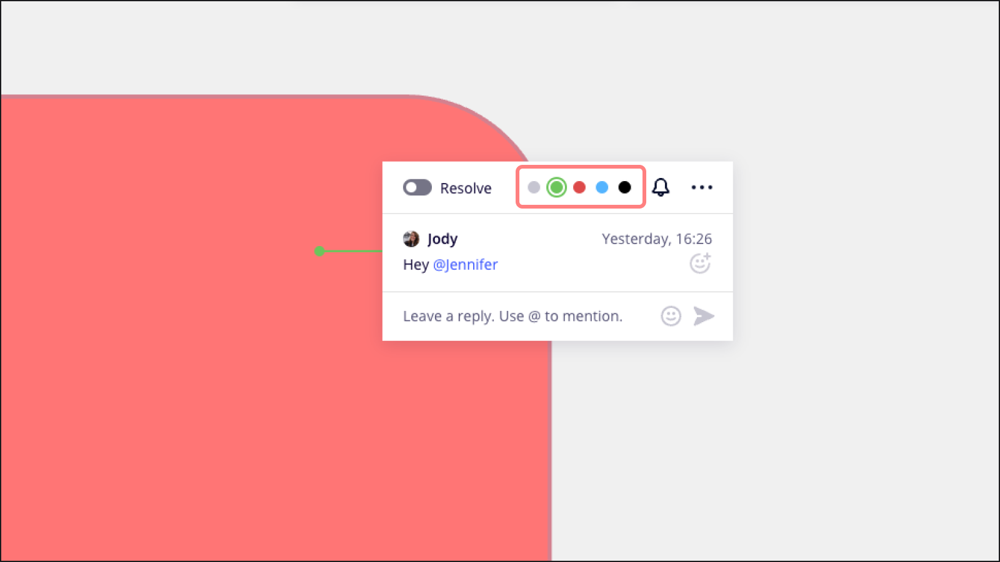
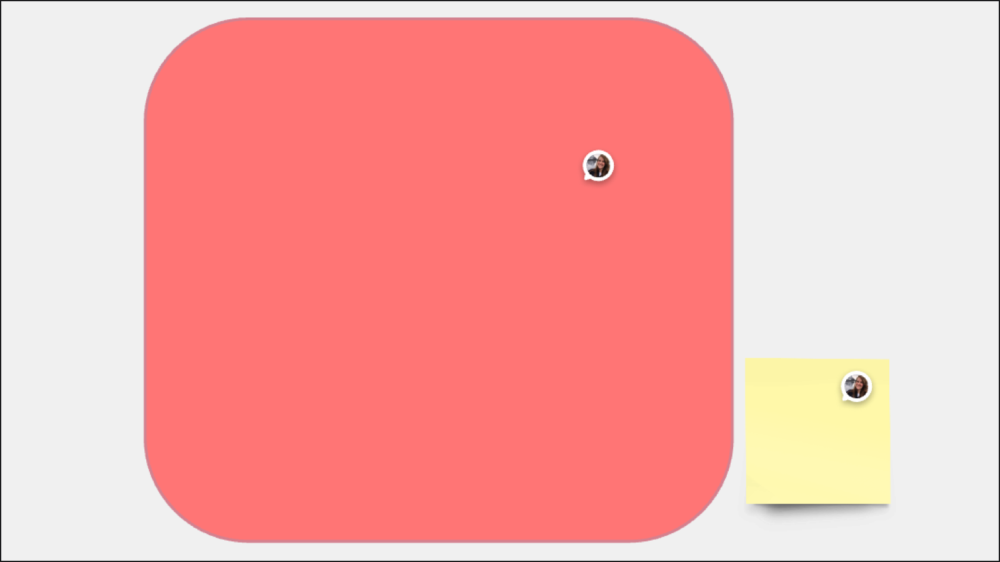
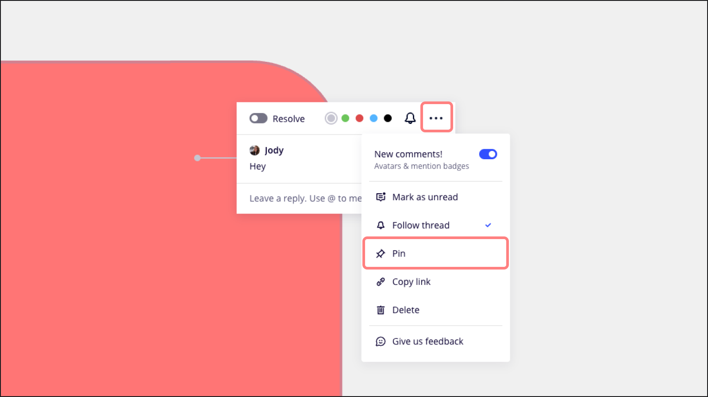

Fördere die Zusammenarbeit im Team durch Kommentare. Du kannst damit deine Gedanken und Ideen direkt auf deinen Boards mitteilen, dich an konstruktiven Diskussionen beteiligen und jedes Projekt interaktiver und produktiver machen.

- **Beginne Unterhaltungen** direkt auf dem Board mit Kommentaren.
- **Beteilige dich an Thread-Diskussionen**, um ganz einfach euer Teamwork zu verbessern.
- **Verwende @Erwähnungen**, um Teamkollegen zu benachrichtigen.
  - Wenn du in einem Kommentar erwähnt wirst, wird er mit einem @-Symbol versehen.
  - Neue Erwähnungen sind **blau**.
  - Gelesene Erwähnungen sind **weiß**.
- **So bleibst du auf dem Laufenden**:
  - Neue Kommentare sind **blau**.
  - Gelesene Kommentare sind **weiß**.
  - Geklärte Kommentare haben einen **Haken**.

*Kommentare auf einem Board*

## Vorschau der Kommentare

Du kannst laufende Unterhaltungen oder Feedback direkt auf dem Board sehen. Fahre einfach mit dem Mauszeiger über einen Kommentar, um eine Vorschau zu sehen.

*Vorschau eines Kommentars*

## Kommentare schreiben

1. Klicke auf das Symbol **Kommentar** in der [Erstellungssymbolleiste](../../../getting-started/start-here/your-first-board/05-toolbars.md) auf der linken Seite oder drücke den [Kurzbefehl](../../working-on-the-board/06-shortcuts-and-hotkeys.md) **C**.
2. Um einen Kommentar zu schreiben, klicke irgendwo auf das Board oder auf ein Objekt. Nachdem du geklickt hast, fang an zu tippen, um deinen Kommentar zu verfassen.
3. Benutze [@Erwähnungen](../01-@mentioning-people-on-the-board.md), um jemanden zu taggen. Für [vorgeschlagene Erwähnungen](../01-@mentioning-people-on-the-board.md) gibst du einfach @ ein. Du kannst dich auch selbst taggen, um dir Aufgaben zuzuteilen und Erinnerungen in deinen [Feed-Benachrichtigungen](../../managing-boards/10-feed.md) zu setzen.
4. Um deinen Kommentar zu veröffentlichen, klicke auf die blaue Schaltfläche **Veröffentlichen** oder drücke die **Eingabetaste**.

> **✏️** Möchtest du direkt mit Objekten arbeiten? Klicke auf ein beliebiges Objekt auf dem Board, um das Kontextmenü zu öffnen und einen Kommentar hinzuzufügen.

> **✏️** Benutze **Shift + Enter**, um eine neue Zeile in deinem Kommentar zu beginnen. Textformatierung wird in Kommentaren nicht unterstützt.

*Anklicken des Kommentarsymbols in der Erstellungssymbolleiste*

### Entwurf eines Kommentars

Wenn du den Kommentar verlässt, ohne auf die Schaltfläche **Veröffentlichen** zu klicken oder die **Eingabetaste** zu drücken, wird dein Kommentar als Entwurf gespeichert.

Um auf deinen Kommentarentwurf zuzugreifen, klicke auf das Board, um den Kommentar-Thread zu öffnen. Du siehst dann den Textentwurf. Wenn dein Entwurf eine Antwort auf einen bestehenden Kommentar-Thread ist, klicke einfach auf den Kommentar, um den Thread zu öffnen und deinen Entwurf zu finden.

*Benachrichtigung zum gespeicherten Entwurf*

### Einen Kommentar bearbeiten

Um einen Kommentar zu bearbeiten, klicke auf den Text, aktualisiere ihn nach Bedarf und klicke dann auf **Speichern**.

*Bearbeiten eines Kommentars*

### Einen Kommentar löschen

Um einen Kommentar aus dem Board zu löschen, öffne den Kommentar, klicke auf die drei Punkte (**...**) und wähle **Löschen.**

:::warning
Es ist nicht möglich, mehrere Kommentare oder alle Kommentare auf einmal aus dem Board zu löschen. Außerdem werden durch das Entfernen eines Nutzers aus einem Team nicht automatisch seine Kommentare aus den Boards entfernt.
:::

*Löschen eines Kommentars*

### Eine Farbe für Kommentare auswählen

Passe deine Kommentare mit Farben an, um die Wichtigkeit zu kennzeichnen oder Nachrichten für dein Team zu kategorisieren. Verwende zum Beispiel Blau für Ideen und Grün für Diskussionen. Um die Farbe eines Kommentars zu ändern, öffnest du den Kommentar und wählst eine Farbe aus den Optionen am oberen Rand.

*Die Farbe eines Kommentars ändern*

## Der Bereich „Kommentare“

Der Bereich „Kommentare“ fasst alle deine Erwähnungen und Kommentare zusammen. Um den Bereich „Kommentare“ zu öffnen, klicke auf das Symbol **Aktivität** in der Symbolleiste für die Zusammenarbeit oben rechts. Wenn du in diesem Bereich einen Kommentar auswählst, gelangst du sofort zu seiner Position auf dem Board.

## Kommentare an Objekte anhängen

Hänge einen Kommentar direkt an ein beliebiges Objekt an, um sicherzustellen, dass sie sich gemeinsam auf dem Board bewegen. Dazu positionierst du den Kommentar einfach über dem gewünschten Objekt. Wenn du einen Kommentar auf ein anderes Objekt verschieben möchtest, klicke und ziehe ihn an die neue Stelle.

*An eine Form und eine Notiz angehängte Kommentare*

:::warning
An Objekte angehängte Kommentare können nicht zusammen mit den Objekten kopiert, ausgeschnitten oder eingefügt werden. Außerdem können die Kommentare nicht exportiert werden. Wenn du jedoch [ein Board duplizierst](../../managing-boards/03-how-to-duplicate-a-board.md), werden alle Kommentare mit kopiert.
:::

## Benachrichtigungen verwalten

Lass dir keine Neuigkeit in einer Unterhaltung entgehen. Du kannst entweder allen Themen folgen oder nur denen, die dich interessieren. Sobald du einen Kommentar hinterlässt, antwortest oder [@erwähnt](../01-@mentioning-people-on-the-board.md) wirst, erhältst du eine Benachrichtigung. Wenn du keine Updates mehr erhalten möchtest, schaltest du einfach die Funktion „Thread folgen“ aus.

:::tip
Du kannst deine [Benachrichtigungseinstellungen](../../managing-your-profile/02-miro-notifications.md) in deinen Profileinstellungen anpassen.
:::

### Allen Kommentar-Threads folgen

Um allen Threads eines Boards zu folgen, gehst du zur Überschrift des Boards in der oberen linken Ecke, klickst auf das Symbol mit den drei Punkten (**...**) **und** schaltest unter **Einstellungen** die Option **Allen Threads folgen** ein.

*Die Option, allen Threads zu folgen*

### Folge einem bestimmten Kommentar-Thread

Um einem bestimmten Thread zu folgen, öffne den Kommentar und klicke auf das Symbol **Thread folgen** in der oberen rechten Ecke.

*Die Option, einem bestimmten Thread zu folgen*

### Einen Thread anheften

Halte die Kommentar-Threads auf dem Board für Diskussionen und Brainstorming offen. Um einen Thread auf dem Board offen zu halten, öffne den Kommentar, klicke auf die drei Punkte (**...**) und wähle **Anheften**.

Indem du mehrere Kommentare anheftest, kannst du mehrere Threads gleichzeitig auf deinem Board offen halten.

*Einen Kommentar*

## Kommentare verwalten

Markiere Kommentare als gelesen oder ungelesen , um dich besser auf wichtige Nachrichten und Aufgaben zu konzentrieren, die deine Aufmerksamkeit erfordern.

### Einen Kommentar als ungelesen markieren

Um einen Kommentar als ungelesen zu markieren, öffne den Kommentar, klicke auf die drei Punkte (**...**) und wähle **Als ungelesen markieren**.

*Markierung eines Kommentar-Threads als ungelesen*

### Alle Kommentare als gelesen markieren

Um alle Kommentare als gelesen zu markieren, öffne den Bereich „Kommentare“, klicke auf das Symbol für **Einstellungen** und wähle **Alle als gelesen markieren**.

*Markierung aller Kommentare als gelesen*

### Einen Kommentar klären

Richte deine Aufmerksamkeit dorthin, wo sie am meisten gebraucht wird. Du kannst jeden Kommentar-Thread als geklärt markieren, um ihn auf dem Board auszublenden. Öffne den Kommentar und schalte in der oberen linken Ecke auf **Klären** um**.**

*Klären eines Kommentar-Threads*

### Geklärte Kommentare anzeigen

Um geklärte Kommentare anzusehen, öffne den Bereich Kommentare, klicke auf das Dropdown-Menü **Anzeigen** und aktiviere die Option **Geklärte Kommentare anzeigen**.

*Geklärte Kommentare anzeigen*

### Auf Kommentare mit Emojis reagieren

Klicke auf das Emoji-Symbol neben einem Kommentar, um eine Reaktion hinzuzufügen.

*Hinzufügen von Reaktionen zu Kommentaren*

### Kommentare auf dem Board ausblenden

Um alle Kommentare auf dem Board auszublenden, öffne den Bereich „Kommentare“, klicke auf das Symbol für **Einstellungen** und schalte die Option **Kommentare auf dem Board anzeigen** aus.

*Kommentare auf dem Board ausblenden*

## Kommentare zum Merkzettel hinzufügen

Du kannst in deinem [Merkzettel](../../essential-tools/17-visual-notes.md) Kommentare hinzufügen, um zusätzlichen Kontext zu geben und Feedback zu erhalten. Klicke dazu einfach auf das Symbol **Kommentieren** neben dem Text.

*Hinzufügen von Kommentaren auf dem Merkzettel*

## Kommentare in der mobilen App

Mit unserer mobilen App kannst du dich mühelos an Diskussionen beteiligen. Das Navigieren durch Kommentare und Threads funktioniert ähnlich reibungslos wie in der Desktop-Version.

**Ansehen und Beantworten von Kommentaren:**

- **Threads öffnen**: Tippe auf einen Kommentar, um den gesamten Thread anzusehen.
- **Antwort schreiben**: Teile deine Gedanken und trage zur Diskussion bei.
- **Thread klären**: Markiere Diskussionen als abgeschlossen.
- **Benachrichtigungen verwalten**: Durch Drücken auf das Glockensymbol kannst du einem Thread folgen oder ihm nicht mehr folgen.
- **Darstellung anpassen**: Ändere die Farbe des Kommentars, um ihn leichter zu finden und zu organisieren.

**Hinzufügen eines neuen Kommentars:**

Das Hinzufügen eines Kommentars auf dem Mobiltelefon unterscheidet sich geringfügig von der Desktop-Version:

1. Tippe auf das Plus-Symbol (**+**) in der unteren rechten Ecke deines Bildschirms.
2. Wähle **Kommentar**, um deine Gedanken oder Ideen mitzuteilen.
