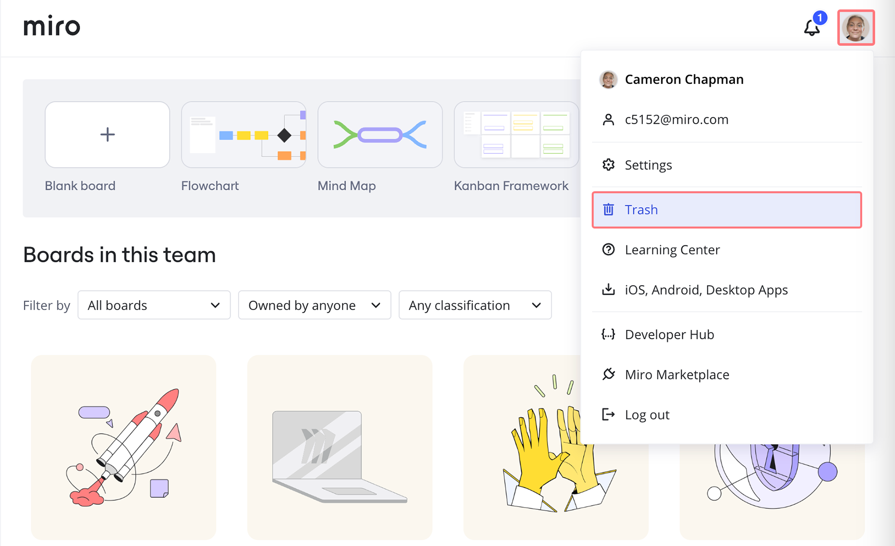
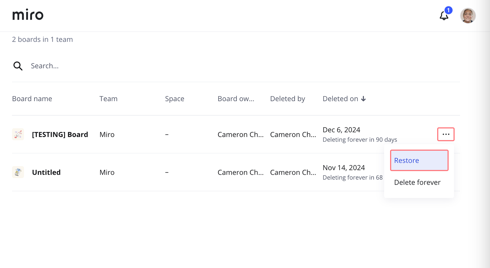

**Fehlende oder gelöschte Miro-Boards wiederherstellen Du kannst ein gelöschtes Board innerhalb von 9****0 Tagen** **wiederherstellen.**

:::tip
Du kannst deine Boards schützen, indem du [Board-Backups speicherst](../import-and-export/export/05-how-to-save-board-backup.md).
:::

## Ein Board mithilfe des Board-Links wiederherstellen

> **Verfügbar für:** Board-Eigentümer
>
> **Gilt für:** alle Preispläne
>
> **Verfügbar mit:**Browser

### Ein Board über den Link wiederherstellen

Wenn du dein Board versehentlich gelöscht hast oder es verschwunden ist, kannst du es mithilfe des Board-Links wiederherstellen.

Beispiel eines Board-Links bei Miro:

```
https://miro.com/app/board/o9L_kSnC_0=/
```

Du kannst versuchen, den Board-Link durch die Eingabe deines Board-Namens zu finden:

- in deiner Browser-Adressleiste
- in deiner Browser-Verlaufssuche
- in deiner E-Mail-Suche

*Ein Miro-Board suchen*

Sobald du den Link gefunden und ihn in deinem Browser geöffnet hast, siehst du eine Meldung, dass das Board gelöscht wurde.


*Nachricht: Board wurde gelöscht*

Klicke auf **Board wiederherstellen**. Dadurch wirst du zu deinem Miro-Dashboard weitergeleitet, wo du dann das wiederhergestellte Board öffnen kannst.

*Ein Miro-Board mithilfe des Board-Links wiederherstellen*

## Ein Board aus dem Papierkorb wiederherstellen

> **Verfügbar für:** Board-Eigentümer
>
> **Relevant für:** Starter-, Business-, Enterprise- und Education-Preispläne
>
> **Verfügbar mit:** **Browser,** Desktop-App, Tablet-App

### Wo finde ich die Papierkorb-Funktion?

Die [Funktion „Papierkorb“](../../getting-started/start-here/miro-dashboard/01-what-is-on-your-dashboard.md) ist nur für kostenpflichtige und Education-Preispläne verfügbar. Wenn du einen Free-Preisplan hast, kannst du [das Board mithilfe des Board-Links wiederherstellen.](08-how-to-restore-a-deleted-board.md)

In deinem Papierkorb kannst du nach allen kürzlich gelöschten Boards suchen und diese wiederherstellen. Den **Papierkorb** findest du in deinem [Dashboard](../../getting-started/start-here/miro-dashboard/01-what-is-on-your-dashboard.md), wenn du in der oberen rechten Ecke auf deinen Avatar klickst.


*Das Papierkorbsymbol*

### Wie man ein Board aus dem Papierkorb wiederherstellt

1. Öffne den **Papierkorb**, indem du oben rechts im Dashboard auf deinen Avatar klickst, um alle gelöschten Boards anzuzeigen.
2. Klicke auf das Menü mit den **drei Punkten** (**...**) neben dem entsprechenden Board, um die Option zum **Wiederherstellen** anzuzeigen.
3. Klicke auf **Wiederherstellen**.
4. Das Board wird für den ursprünglichen Eigentümer und das ursprüngliche Team wiederhergestellt.


*Ein Board aus dem Papierkorb wiederherstellen*

## Ein Board eines früheren Nutzers wiederherstellen

Wenn ein Nutzer aus dem Team entfernt wurde und seine Boards gelöscht wurden, bitte deinen Miro-Admin um Hilfe. Sie können die gelöschten Boards im Papierkorb sehen und **das Board** **innerhalb von 90 Tagen nach dem Löschen** wiederherstellen. Der Admin wird zum Eigentümer des wiederhergestellten Boards.

:::note
Denke daran, [deine Boards zu exportieren](../import-and-export/export/03-how-to-export-your-board.md) oder [Boards-Backups zu speichern](../import-and-export/export/05-how-to-save-board-backup.md), bevor du dein Team löschst.
:::

## Häufige Fragen

**Ich kann mein Board nicht finden. Was soll ich tun?**

Hier erfährst du, was du tun kannst, wenn du [ein Miro-Board nicht finden kannst oder bestimmte Inhalte fehlen](../tools/troubleshooting/11-i-lost-my-board-or-content.md).

**Ich habe versehentlich einige Inhalte meines Boards gelöscht. Kann ich sie wiederherstellen?**

Ja, du kannst Inhalte finden und wiederherstellen, die du versehentlich gelöscht hast. Weitere Informationen findest du unter [Board-Inhalte wiederherstellen](../working-on-the-board/18-restoring-board-content.md).
