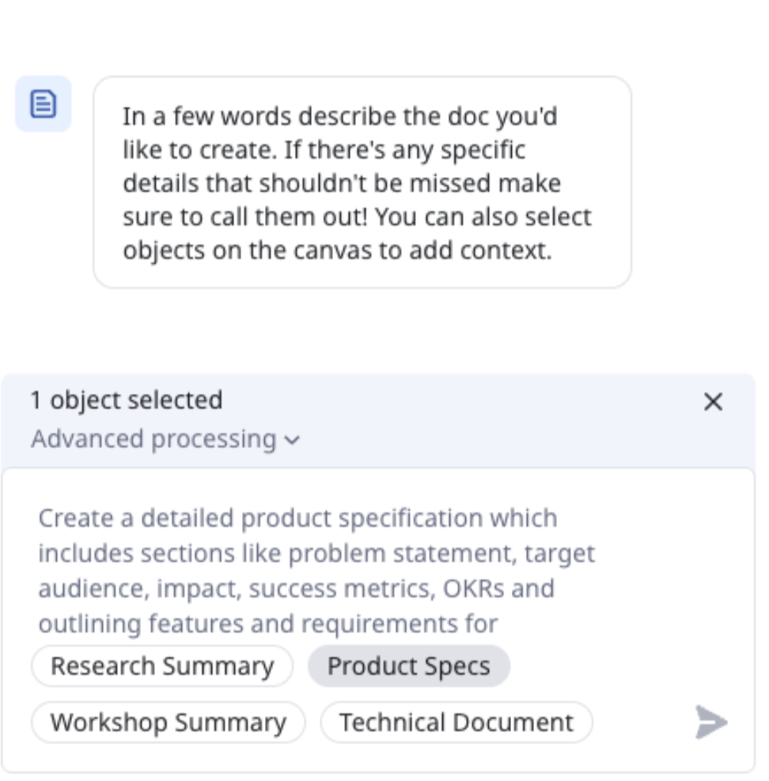
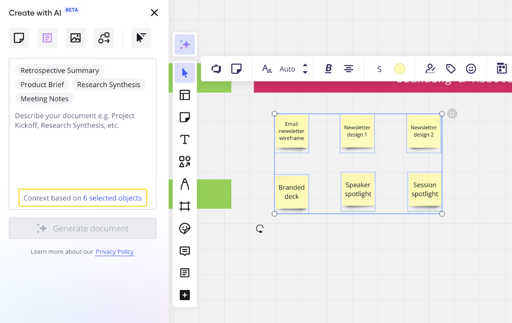
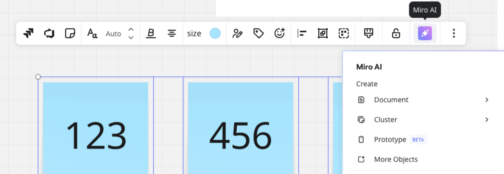

Mit "Create with AI" können Benutzer verschiedene Arten von Inhalten mit Miro AI und Formaten anstoßen, generieren und iterieren. Nutze "Create with AI", um Miro AI mit bestehenden Inhalten auf deinem Miro-Board anzustoßen oder schreibe deine eigenen Prompts, um neue Inhalte zu generieren.

Dieser Artikel beschreibt die Funktionen von „Create with AI“. Allgemeine Informationen zu Miro AI finden Sie in der [Miro AI Übersicht](01-miro-ai-overview.md). Informationen zum Verbrauch von AI-Credits finden Sie unter [Miro AI Credits und AI-Add-on](../../plans-billing/billing-and-payments/03-miro-ai-credits.md) oder (Enterprise) unter [Miro AI Credits für Enterprise-Pläne](../../enterprise-administration/enterprise-subscription-management/enterprise-billing/03-miro-ai-credits-for-enterprise-plans.md).

„Create with AI“ unterstützt die folgenden Formate:

- [**Diagramme oder Mindmaps**](13-miro-ai-with-diagrams-and-mindmaps.md)
  Generiere und visualisiere Ideen, Systeme, Prozesse oder Verbindungen.
- [**Dokumente**](14-miro-ai-with-docs-and-text.md)
  Generiere Dokumente wie Design-Briefs, Zusammenfassungen oder Gliederungen. Zum Beispiel Interviewleitfäden.
- [**Bilder**](15-miro-ai-with-images.md)
  Kreiere, iteriere und füge Bilder basierend auf Eingaben und bestehendem Board-Inhalt hinzu.
- [**Kanban**](../formats/05-kanban.md)
  Organisiere Aufgaben in Spalten, um den Fortschritt zu verfolgen, und wechsle nahtlos zwischen Kanban-, Timeline- und Tabellenansichten, um alles an einem Ort zu planen, auszuführen und anzupassen.
- [**Miro-Prototypen**](../miroverse/prototyping/03-miro-prototypes.md)
  Kreiere Interfaces für Apps, Websites oder Landingpages.
- [**Notizzettel**](16-miro-ai-with-sticky-notes.md)
  Generiere Ideen für Brainstorms, Einblicke, Workshops oder Roadmaps.
- [**Tabellen**](../formats/14-tables.md)
  Erstelle Tabellen für Planung, Nachverfolgung, Recherche, Backlogs oder Analysen.
- [**Zeitachse**](../formats/15-timeline.md)
  Plane oder strukturiere dein Projekt mit einer anpassbaren und interaktiven Zeitachse, die Stakeholder und Teams aufeinander abstimmt.

:::note
In Miro, falls „KI nutzen“ nicht über der [Erstellungsleiste](../working-on-the-board/02-miro's-new-simplified-user-interface.md) verfügbar ist, dann kontaktiere deinen Unternehmensadministrator. Unternehmensadministratoren müssen Miro AI für eure Organisation aktivieren.
:::

## Auf „KI nutzen“ zugreifen

Klicke auf einem beliebigen Miro-Board auf **KI nutzen** über der [Erstellungsleiste](../working-on-the-board/02-miro's-new-simplified-user-interface.md). Der Bereich „KI nutzen“ öffnet sich.

Wähle aus dem Bereich eine der folgenden Optionen aus:

- **Sidekicks**
  Erstelle einen individuellen KI-Partner, der dich beim Entwickeln deiner Ideen, Lösungen und nächsten Schritte unterstützt.
- **Formate**
  Nutze Miro AI, um Dokumente, Diagramme, Tabellen und mehr zu generieren.

Als Nächstes öffnet sich das Eingabe-Panel. Um mit der Erstellung zu beginnen, folge den Anweisungen im Panel.

## Create with AI nutzen

### Erstellen aus dem Eingabe-Panel

Das Create with AI-Eingabe-Panel ermöglicht es dir, Miro AI zu instruieren, Inhalte zu generieren. Optional kannst du einen vorgeschlagenen Hinweis auswählen, der in Form von Tags im Antwortfeld angezeigt wird.

*Gib im Eingabefeld des Aufforderungspanels Text ein. Optional kannst du eine Vorschlag-Auswahl treffen.*

Für einige Formate kannst du auf klicken **Erweiterte Verarbeitung** um die **Grundlegende Verarbeitung** -Option anzuzeigen. Nutze die grundlegende für schnelle Ergebnisse oder die erweiterte für relevantere Ergebnisse, die mehr Zeit in Anspruch nehmen.

Für Bilder ist erweiterte Verarbeitung erforderlich.

:::tip
Gib so viele Details wie möglich in deinen Prompts an. Du kannst auch Inhalte auf deinem Board auswählen, um zusätzlichen Kontext zu bieten und relevantere Ergebnisse zu erzielen.
:::

### Verfeinere deine Prompts

Nachdem dein Inhalt generiert wurde, bleibt das Eingabe-Panel geöffnet. Um sicherzustellen, dass du die relevantesten Ergebnisse erhältst, kannst du Miro AI weiterhin eingeben.

Die Verfeinerung der Eingabe ermöglicht es dir, verschiedene Eingabestrategien auszuprobieren, um das gewünschte Ergebnis zu erzielen.

### Miro AI mit Board-Inhalten eingeben

Erstellen mit AI nutzt visuelle Kontextverarbeitung, um visuelle Elemente auf deinem Board zu analysieren.

Du kannst beliebige Inhalte, die auf deinem Miro-Board nicht verborgen sind, als Kontext für deinen Prompt auswählen. Zum Beispiel Diagramme, Bilder oder Haftnotizen auswählen.

*Miro AI mit ausgewähltem Kontext von deinem Board ansprechen.*

### Erstellen aus dem Miro AI-Kontextmenü

Auf deinem Miro-Board kannst du auf die Erstellen mit AI-Optionen über das **Miro AI**-Kontextmenü zugreifen.

Zum Beispiel eine Gruppe von Haftnotizen auswählen. Eine Symbolleiste erscheint über deiner Auswahl. Klicke auf **Miro AI**, und das Kontextmenü öffnet sich.

*Greife auf die Optionen von „Create with AI“ über das Miro AI-Kontextmenü zu.*

In diesem Beispiel kannst du Sticky Notes in ein Dokument umwandeln, zum Beispiel eine Sitzungszusammenfassung oder einen Prototyp. Du kannst deine Notizen auch nach Stimmung oder Schlagwort clustern.

:::tip
Wähle **Weitere Objekte**, um auf das **Create with AI**-Panel zuzugreifen.
:::
