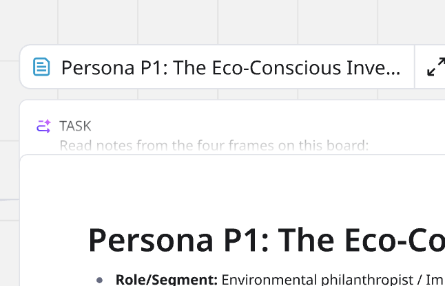

Flows ermöglichen es dir, auf dem Canvas Formate zu verketten, um KI-gestützte Workflows zu erstellen. Jedes Format dient als Eingabe für das nächste und verwandelt komplexe, mehrstufige Prozesse wie Sprintplanungen, das Schreiben von Briefings oder die Nutzung von Kundendaten in automatisierte Flows.

Um zu erfahren, welche Formate Flows unterstützen, siehe Unterstützte Formate.

Dieser Artikel erklärt, wie man Flows verwendet. Für allgemeine Informationen über Flows, siehe [Überblick über Flows](04-flows-overview.md).

:::tip
Hol dir einsatzbereite Flows-Vorlagen im [Vorlagen-Picker](../../getting-started/start-here/your-first-board/04-templates.md).
:::

## Erstellen und Ausführen eines Flows

Die folgende Anleitung verwendet grundlegende Flows-UX-Elemente, um einen Flow von Grund auf zu erstellen. Um schneller mit der Erstellung von Flows beginnen zu können, siehe Flows UX-Elemente.

Gehe dazu wie folgt vor:

1. Füge ein unterstütztes Format oder einen Anweisungsblock zum Canvas hinzu.
2. (Optional) Verbinde ein vorhandenes Format oder einen Anweisungsblock mit dem soeben hinzugefügten Format. Verwende die AI-Diamantverbinder, um deinen Flow zu verbinden.
3. Oberhalb des Formats klicke auf die **TASK**-Leiste.
   Die **TASK**-Leiste öffnet sich zu einem Feld, in dem du deinen Prompt für diese Position in deinem Flow spezifizieren kannst.
4. Füge im **TASK**-Feld deinen Prompt hinzu. Zum Beispiel kannst du in einem Dokument ein Product Requirements Document (PRD) erstellen. Du kannst Ausgaben aus jedem verbundenen Format oder Anweisungsblock verwenden.

   > 💡 Das **TASK**-Feld ermöglicht es dir, ein Large-Language-Modell (LLM), einen Wissensanbieter oder eine Websuche auszuwählen. Wähle unten links ein KI-Modell, eine Wissensdatenbank, oder durchsuche das Web. Die Optionen variieren je nach Format.
5. (Optional) Um ein neues Ergebnis zu erstellen, klicke rechts auf den rautenförmigen KI-Konnektor.
   Das Menü **Neues Ergebnis erstellen** öffnet sich.
6. (Optional) Um eine neue Eingabe zu erstellen, klicke links auf den rautenförmigen Miro AI-Konnektor.
   Das Menü **Neue Eingabe erstellen** öffnet sich.
7. Um deinen Flow abzuschließen, wiederhole die Schritte 1–6 nach Bedarf.
8. Um deinen Flow auszuführen, klicke in der **TASK**-Leiste auf **Ausführen**.
   *Das Kontextmenü **Ausgewählter Flow** zeigt dir, wie viele Schritte der Flow umfasst.*

## Wissen mit Flows nutzen

Wissen integriert sich mit Anbietern wie Glean, Websuche und Miro Insights, um unter Verwendung interner und externer Quellen alles abzurufen, was dein Unternehmen weiß.

Für jedes Format in deinem Flow klicke auf die **TASK**-Leiste. Die **TASK**-Leiste erweitert sich. Wähle unten links deine Wissensdatenbank aus und verbinde sie.

 *Eine interne Wissensdatenbank für deinen Flow angeben*

Du kannst Daten aus deinen eigenen Wissensressourcen in Formate wie Dokumente, Tabellen, Notizen und Präsentationen umwandeln. Verbinde dann jedes Format, um deine Daten als Eingabe oder Ausgabe eines Flows zu verwenden.

**Mehr Informationen:** Siehe [Wissen](09-knowledge.md).

## Ausgabe in einem Flow rückgängig machen

Du kannst die Ausgabe für jedes Format in deinem Flow rückgängig machen. Zum Beispiel, wenn du einen Flow versehentlich ausführst und ein Dokument überschreibst.

Um ein Format in deinem Flow auf einen früheren Zustand zurückzusetzen, klicke auf die Format **TASK**-Leiste. Die **TASK**-Leiste wird erweitert. Klicke unten rechts auf das gegen den Uhrzeigersinn drehende Symbol. Wähle eine beliebige Version der letzten 24 Stunden aus, um sie wiederherzustellen.

*Mit der Rücksetz-Funktion kannst du jede Version deines Formats aus den letzten 24 Stunden wiederherstellen.*

## Flows-Elemente

Das Verständnis für die folgenden Elemente von Flows hilft dir, schneller Flows zu erstellen.

### Miro AI-Konnektor

Unterstützte Formate und Anweisungsblöcke haben links einen rautenförmigen Miro AI-Konnektor, der es dir ermöglicht, Eingaben zu verbinden, und rechts einen Konnektor, der die Ausgaben verbindet.

Klicke auf den Miro AI-Konnektor auf einer der Seiten, um die Menüs **Neue Eingabe erstellen** oder **Neue Ausgabe erstellen** zu öffnen.

*Klicke auf den Miro AI-Konnektor, um die Eingabe- und Ausgabemenüs zu öffnen.*

:::tip
Du kannst den Miro AI-Konnektor auch zu bestehenden Inhalten ziehen.
:::

### Intelligente Konnektor-Hervorhebung

Klicke auf ein beliebiges Objekt in deinem Flow, um nur diese Verbindungen hervorzuheben.

### Flow-Konnektoren ausblenden

Für komplexe Flows mit vielen Verbindungen kannst du alle Flow-Verbindungen ausblenden, um die Ansicht zu vereinfachen.

Klicke in der [Board](../working-on-the-board/02-miro's-new-simplified-user-interface.md)-Leiste auf die vertikalen drei Punkte. Wähle dann **Ansehen**. Schalte **Flow-Verbindungen ein-/ausblenden** auf "aus". Um alle Flow-Verbindungen einzublenden, schalte sie auf "ein".

 *Alle Flow-Verbindungen auf deinem Board ein- oder ausblenden.*

:::note
**Flow-Verbindungen ein-/ausblenden** beeinflusst nur deine Board-Ansicht. Mitwirkende können ihren eigenen Schalter anpassen.
:::

### Prompt für das Format

Du kannst jeden Format oder Anweisungsblock in deinem Flow mit einem Prompt versehen, was sicherstellt, dass jedes Format in der Kette eine spezialisierte Flow-Aufgabe ausführen kann.

Klicke auf die **TASK**-Leiste über einem Format in deinem Flow. Die **TASK**-Leiste wird erweitert. Füge deinen Prompt hinzu und beschreibe, wie du möchtest, dass das Format Eingabedaten oder sonstige Inhalte auf dem Board liest, und spezifiziere Regeln und Output für das nächste Format in deinem Flow.

 *Das Eingabefeld für den Prompt erscheint in der **TASK**-Leiste über jedem Format in deinem Flow.*

### KI-Anweisungsblock

Du kannst ein Large-Language-Modell (LLM) oder einen verfügbaren [Wissensanbieter](09-knowledge.md) auswählen, um an beliebiger Stelle in deinem Flow einen Prompt in einem eigenständigen Block auszuführen.

Klicke beim jeweiligen Format auf den rautenförmigen Miro AI-Konnektor. Wähle im Eingabe- oder Ausgabemenü **KI** **Anweisung** aus.

 *Anweisungsblöcke ermöglichen es dir, Anweisungen zu verketten, Eingaben zu akzeptieren und Ausgaben an das nächste Format weiterzugeben.*

### Globaler Ausführungsbutton

Du kannst deinen Ablauf von jedem Format oder Anweisungsblock in deinem Flow aus starten. Klicke, um das Format oder den Block auszuwählen. Das Kontextmenü **Flow ausgewählt** erscheint neben der Zusammenarbeitsleiste.

 *Das Kontextmenü "Flow ausgewählt"*

Das Menü **Flow ausgewählt** zeigt an, wie viele Schritte noch auszuführen sind. Um den Flow auszuführen, klicke auf **Ausführen**.

## Unterstützte Formate

Flows unterstützen die folgenden Miro-Formate.

- Diagramme
- Dokumente
- Bilder
- Eingebetteter iFrame-Code
- Kanban
- Prototypen
- Präsentationen
- Tabellen
- Zeitachse
