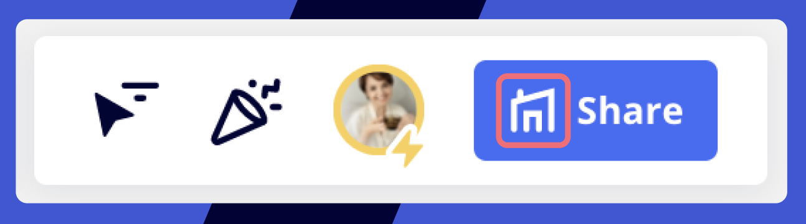

Miro-Nutzer können Boards jederzeit für Teammitglieder freigeben und den Zugriff einschränken.

### So überprüfst du die Freigabeeinstellungen für dein Board

Um zu sehen, wer auf dein Board zugreifen kann, öffne den **Freigabedialog** des Boards. Das kannst du im Dashboard oder im Board selbst tun.

*Öffnen des Dialogs Boards Freigeben über das Dashboard*

*Die Schaltfläche "Freigeben" in der oberen rechten Ecke des Boards*

Ein Board kann auf verschiedenen Ebenen geteilt werden:

- [Team](03-sharing-boards-and-inviting-collaborators.md) (jeder im Team kann es ansehen/kommentieren/bearbeiten)
- [Unternehmen](03-sharing-boards-and-inviting-collaborators.md) (jedes Mitglied kann auf das Board über den Link zugreifen – verfügbar nur bei [Enterprise-Preisplänen](../../plans-billing/miro-plans/04-enterprise-plan.md))
- [Öffentlich](03-sharing-boards-and-inviting-collaborators.md) (jeder mit dem Board-Link kann als [Besucher](08-collaboration-with-visitors.md) das Board ansehen/kommentieren/bearbeiten)
- [Bereiche](../spaces/01-spaces.md) (jeder Teilnehmer an einem Bereich kann diesen ansehen/kommentieren/bearbeiten, je nach seiner Rolle in diesem Bereich)
- Board (bestimmte Nutzer werden[per E-Mail](03-sharing-boards-and-inviting-collaborators.md) in das Board  eingeladen)

Klicke auf **Freigabeeinstellungen**, um die E-Mail-Adressen der Nutzer zu sehen, die per E-Mail zum Board eingeladen wurden. Im folgenden Beispiel kann jedes Mitglied von **Mein Team** das Board [kommentieren](01-board-access-rights.md), während **Jane** es [bearbeiten](01-board-access-rights.md) kann.

*Freigabeeinstellungen zeigen E-Mails von Nutzern an, die zum Board eingeladen wurden*

Ein Board kann auf verschiedenen Ebenen gleichzeitig geteilt werden. Das Level mit **höherem Zugriff** gilt für eine Person. Hier einige Beispiele:

- Wenn ein Teammitglied per E-Mail als **Kommentator/-in** zum Board eingeladen wurde *und* alle im Team das Board **bearbeiten können**, gilt der Zugriff auf Teamebene für die Person und sie kann das Board **bearbeiten**.
- Wenn das Board mit Bearbeitungsrechten öffentlich geteilt wurde (alle mit dem Link **können es bearbeiten**), kann jede Person den Inhalt des Boards ändern.

:::tip
[Erfahre, wie du ein privates Board erstellst](15-make-a-miro-board-private.md).
:::

### Bedeutung der Symbole neben dem Freigabeschaltfläche

Board wird für ausgewählte Nutzer per E-Mail freigegeben:

Board wird [für das Team freigegeben](03-sharing-boards-and-inviting-collaborators.md):

Board wird [über einen öffentlichen Link geteilt](03-sharing-boards-and-inviting-collaborators.md) (zugänglich für alle, die den Link haben):

Board wird [mit der Firma geteilt](03-sharing-boards-and-inviting-collaborators.md):

Board ist privat und mit niemandem geteilt:

### Wer kann die Freigabeeinstellungen des Boards ändern?

Board-Eigentümer, [Miteigentümern](06-co-owners-of-boards-and-spaces.md) und Bearbeiter, die Mitglieder des Teams sind, in dem das Board gespeichert ist, können das Board freigeben und den Zugriff darauf einschränken. Board-Eigentümer und [Miteigentümer](06-co-owners-of-boards-and-spaces.md) können im Rahmen von kostenpflichtige[n Preisplänen Freigabeberechtigungen](02-who-can-share-a-miro-board.md) konfigurieren und die optionale Änderung des Board-Zugriffs durch Bearbeitende zurückziehen und andere Personen einladen.

### Board-Zugriff im Free-Preisplan

Bitte beachte, dass Boards, die in [Free-Teams](../../plans-billing/miro-plans/09-free-plan.md) gespeichert werden, von allen Teammitgliedern abgerufen werden können. Um Boards privat einzurichten, mach ein Upgrade deines Teams.

*Board Dialog auf Free-Preisplan freigeben*
