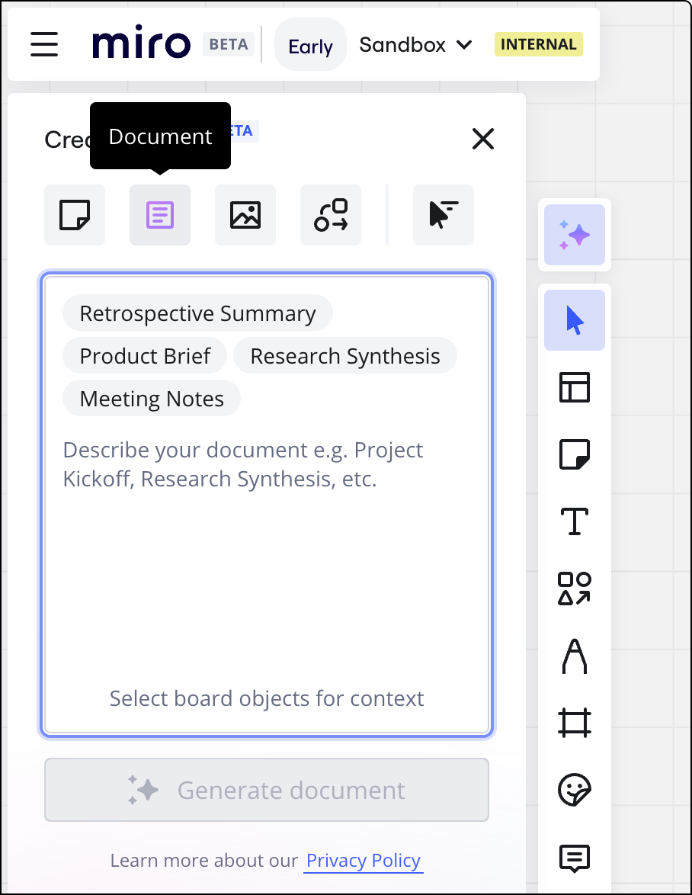
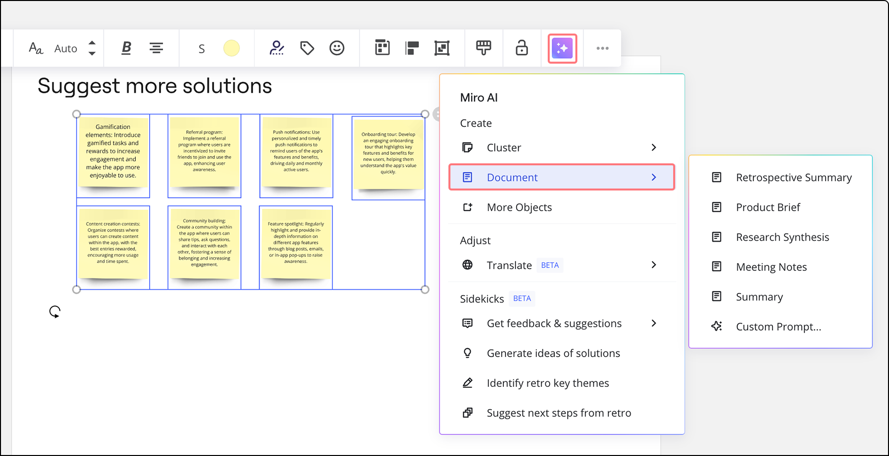
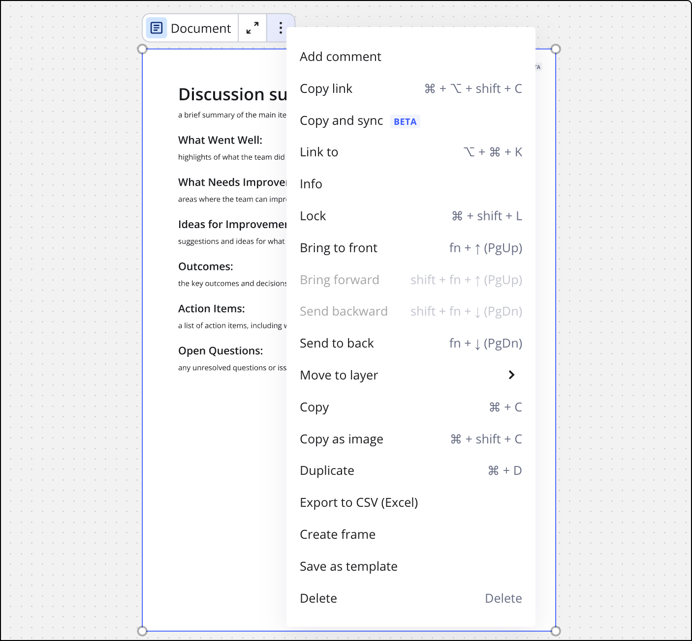
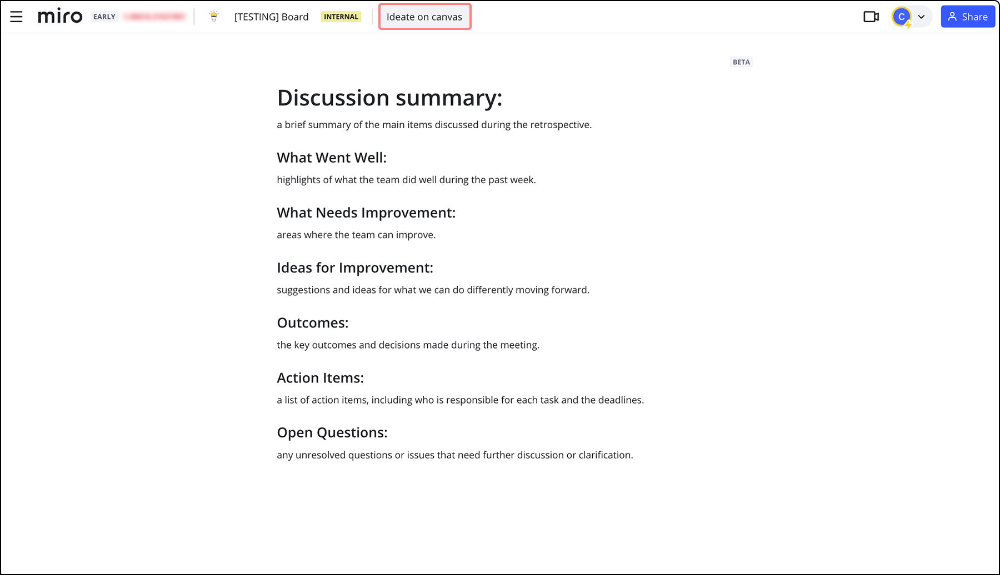
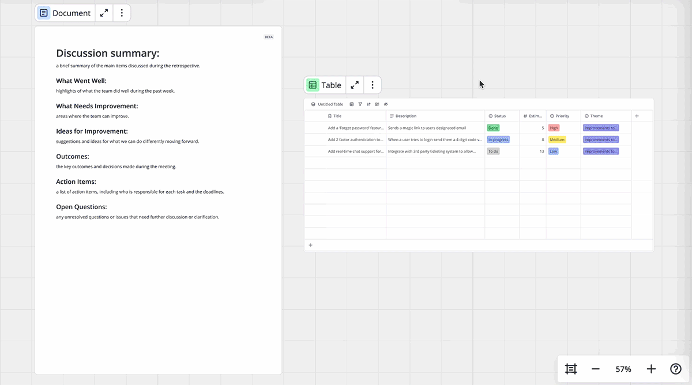
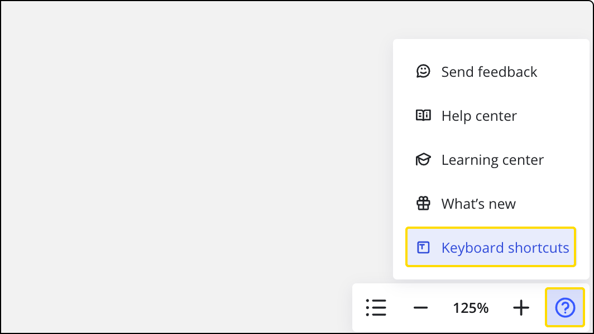

Übertrage deine Board-Inhalte in das strukturiertere Format eines Dokuments. Wenn du Objekte auf dem Canvas als Eingabe verwendest, kannst du Zusammenfassungen, Studienberichte und Produkt-Briefs erstellen, um deine Erkenntnisse im Handumdrehen zusammenzustellen und zu analysieren.

> Verfügbar für: Alle Miro-Preispläne
> Verfügbar auf: Desktop-, mobiler, interaktiver Ansicht

## Dokumente öffnen

Um ein neues Dokument hinzuzufügen, klicke auf das Plus-Symbol, suche nach „Dokumenten“ und klicke dann an beliebiger Stelle auf dem Canvas, um es hinzuzufügen. Dokumente sind auch in einigen Board-Vorlagen enthalten.

*Ein neues Dokument über das Dokumentesymbol hinzufügen*

Du kannst auch ein Dokument mit Miro AI hinzufügen.

*Ein Dokument mit Miro AI hinzufügen*

Ein Dokument aus dem Kontextmenü hinzufügen:

1. Erstelle ein Dokument, indem du mehrere Objekte auf dem Board auswählst (wie Notizen).
2. Wähle im Kontextmenü über das Symbol **Miro AI** **Dokument** aus, um das Untermenü zu öffnen.
3. Wähle eine Vorlage oder verwende einen **eigenen Prompt**.
4. Das Dokument wird erstellt und auf dem Board platziert.

*Ein Dokument über das Kontextmenü hinzufügen*

So fügst du ein Dokument mit Miro AI hinzu:

1. Öffne das Panel **KI nutzen**.
2. Wähle den Inhaltstyp **Dokument** aus.
3. Verwende einen der vordefinierten Prompts oder schreibe deinen eigenen.
4. Wähle Objekte (wie Notizen) auf dem Board aus, um bei Bedarf Kontext hinzuzufügen.
5. Klicke auf **Dokument generieren**.
6. Das so erstellte Dokument wird in einem leeren Bereich auf dem Canvas angezeigt.

## Miro-Dokumente – Vorlagen

Es sind derzeit vier Vorlagen verfügbar, um ein neues Dokument zu erstellen: Produktübersicht, Zusammenfassung einer Retrospektive, Meeting-Notizen und Zusammenführung von Research-Daten.

Wenn du ein neues Dokument erstellst und eine Vorlage auswählst, wird die Vorlage zum Dokument hinzugefügt.

*Ein Beispiel einer Vorlage für die Zusammenfassung einer Retrospektive*

## Kontextmenü in Dokumenten

Wenn du an Dokumenten arbeitest, kannst du zusätzliche Funktionen über das Kontextmenü nutzen, das du erreichst, indem du auf das Symbol mit den **drei Punkten** (**...**) klickst. Das Kontextmenü enthält:

- Kommentar hinzufügen
- Link kopieren
- Kopieren und synchronisieren
- Verlinken mit
- Informationen
- Sperren
- In den Vordergrund
- Nach vorne bringen
- Nach hinten senden
- In den Hintergrund
- Zur Ebene verschieben
- Kopieren
- Als Bild kopieren
- Duplizieren
- In CSV exportieren (Excel)
- Rahmen erstellen
- Als Vorlage speichern
- Löschen

*Das Kontextmenü in Dokumenten*

## An Dokumenten im Vollbildmodus arbeiten

Du kannst Dokumente im Vollbildmodus öffnen, wenn du dich ausschließlich auf das Dokument konzentrieren möchtest, an dem du arbeitest, und nicht auf andere Inhalte auf dem Board. Um auf diesen Modus zuzugreifen, klicke auf das **Vollbildsymbol** über dem Dokument, an dem du gerade arbeitest.

*Das Vollbildsymbol im Dokument*

Im Vollbildmodus wird das Kontextmenü zur Textformatierung weiterhin angezeigt. Es entfernt den Board-Hintergrund, damit du nicht abgelenkt wirst.

Um den Vollbildmodus zu verlassen, klicke oben auf dem Bildschirm auf die Schaltfläche **Ideenfindung auf dem Canvas**.

### Zeichenlimit

Miro Docs können bis zu 80.000 Zeichen enthalten. Wenn du mehr Platz benötigst, kannst du zusätzliche Docs auf dem gleichen Board erstellen und deine Inhalte entsprechend aufteilen. Dies hilft dir, innerhalb der Grenzen zu bleiben, während du dennoch alle deine Informationen an einem Ort organisierst.

## Inhalte in Dokumente kopieren

Du kannst folgende Inhalte von deinem Board in ein Dokument ziehen und ablegen:

- Notiz
- Textfeld
- Bild
- iFrame
- Vorschau
- Tabelle
- Zeitleiste
- Diagramm

:::note
In Dokumenten werden Notizen und Textfelder in eine Aufzählungsliste umgewandelt.
:::

*Ziehe Daten-Widgets in ein Dokument und lege sie ab*

### Diagramme in Dokumenten

Wenn du ein Diagramm in ein Dokument ziehst und ablegst, erstellt Miro eine [synchronisierte Kopie](../working-on-the-board/11-synced-copies.md). Das bedeutet, dass Änderungen am ursprünglichen Diagramm auf dem Board in der Kopie im Dokument übernommen werden, aber nicht umgekehrt. Um den Inhalt der Kopie zu ändern, modifiziere den Inhalt des ursprünglichen Diagramms.

Dadurch wird sichergestellt, dass deine Dokumentation stets mit den neuesten visuellen Informationen auf dem aktuellen Stand bleibt.

### Anderes Inhaltsverhalten in Dokumenten

Bei Widgets mit einem Fokusmodus, wie z. B. einer Tabelle, kannst du weiterhin auf den immersiven Modus zugreifen, wenn sich das Widget in einem Dokument befindet. Die Abmessungen werden skaliert, um ins Dokument zu passen und darin zu scrollen.

Du kannst die Inhalte auch aus dem Dokument ziehen, um sie wieder auf deinem Board zu platzieren.

## In Dokumenten formatieren

Dokumente bietet grundlegende Optionen für die Textformatierung, mit denen du den Text leichter lesen, durchsuchen und verstehen kannst.

Um die Formatierungssymbolleiste zu öffnen, wähle einfach den Text aus, den du in deinem Dokument formatieren möchtest:

*Formatierungssymbolleiste in Dokumenten*

Du kannst Text mit fett, unterstrichen, kursiv oder durchgestrichen formatieren, indem du auf das **Textstile**-Symbol klickst:

*Das Symbol für das Menü „Textstile“ in den Dokumenten*

Du kannst aus einer Vielzahl von Überschriften- und Listentypen auswählen, um deinem Dokument Struktur zu geben:

*Untermenü für Überschriften und Listentyp in Dokumenten*

## Tastenkombinationen in Dokumenten verwenden

Mit Tastenkombinationen kannst du Überschriften- und Listentypen für den Text übernehmen (diese Tastenkombinationen können im Untermenü „Absatztypen“ angezeigt werden):

Verwandeln in: **Mit cmd + opt + \{number\}**

- Absatz
- 1 -> Überschrift 1
- 2 -> Überschrift 2
- 3 -> Überschrift 3
- 4 -> Aufzählungsliste
- 5 -> Nummerierte Liste
- 6 -> Checkliste

Du kannst auch Tastenkombinationen für die Blockauswahl verwenden: Drücke einmal die Escape-Taste, um in den Blockauswahlmodus zu gelangen, und dann:

- **Shift + hoch/runter** -> deine Auswahl erweitern
- **cmd + opt + hoch/runter** -> deine Auswahl nach oben und unten verschieben

Hier sind noch weitere Funktionen in Dokumenten, auf die du über Hotkeys zugreifen kannst:

|  |  |
| --- | --- |
| **⌘** + **eingeben** | Textauswahlmenü aktivieren |
| **⌘** + **Umschalttaste** + **X** | Durchstreichen an-/ausschalten |
| **⌘** + **Umschalt** + **U** | Link hinzufügen |
| **⌘** + **E** | Inline-Code an-/ausschalten |
| **⌘** + **,** | Checklisten-Element aktivieren/deaktivieren |
| **⌘** + **/** | Block-Kontextmenü öffnen |
| **⌘** + **D** | Ausgewählte Blöcke duplizieren |
| **⌘** + **I** | Link zu einem Block kopieren |

Du kannst die vollständige Liste der Tastenkombinationen in der Miro-App aufrufen, indem du in der unteren rechten Ecke des Bildschirms auf das Symbol **Hilfe und Ressourcen** klickst:

*Tastenkombinationen über das Hilfe- und Ressourcensymbol*

## Miro AI in Dokumenten verwenden

Miro AI zur Bearbeitung deiner Dokumente zu verwenden ist eine großartige Möglichkeit, den Bearbeitungsprozess zu beschleunigen und prägnantere, leicht lesbare Dokumente zu erstellen.

Du kannst Miro AI verwenden, um hervorgehobenen Text in einem Dokument zu ändern.

Fordere *Miro AI* auf, markierten Text in einem <em>Miro-Dokument</em> zu ändern.

Um Inline-Text zu verwenden, um Miro AI zu aktivieren, markiere den Text in deinem Miro-Dokument. Wähle ganz rechts im Kontextmenü die Option **Mit Miro AI verbessern** aus. Wähle im Dropdown-Menü **Benutzerdefinierter Prompt** oder einen der verfügbaren Prompts aus.

## Zusammenarbeit in Miro Dokumenten

Miro Dokumente ermöglichen die Echtzeit-Zusammenarbeit mit anderen Nutzern. Wie bei anderen Inhalten auf dem Canvas ist die Cursorverfolgung aktiviert, sodass du sehen kannst, wo im Dokument andere Nutzer arbeiten.

Inline-Kommentare sind auch möglich, mit der Möglichkeit, andere Nutzer zu @erwähnen (was sie sowohl in der App als auch per E-Mail benachrichtigt). Sowohl Kommentar-Threads als auch Reaktionen auf Kommentare sind ebenfalls aktiviert.

### Nutzerchips in Miro-Dokumenten

Nutzerchips ermöglichen es dir, Details über Nutzer in einem Dokument bereitzustellen. Du kannst zum Beispiel @user-Chips für wichtige Teammitglieder oder Stakeholder hinzufügen.

Um einen Nutzerchip hinzuzufügen, gib in einem Miro-Dokument „@“ ein. Gib den Nutzernamen weiter ein, um die Ergebnisse zu filtern, oder wähle einen Nutzer aus dem Dropdown-Menü aus, das sich öffnet.

*Du kannst Nutzerchips überall in einem Miro-Dokument hinzufügen.*

Fahre mit der Maus über einen @Nutzerchip, um Informationen über den Nutzer zu sehen.

*Nutzerchips enthalten Informationen über den Nutzer.*

Nutzerchips verhalten sich getrennt von Erwähnungen in einem Kommentar, z. B. senden Nutzerchips keine Benachrichtigungen an einen bestimmten Nutzer.

## Dokumente kopieren, freigeben und exportieren

Dokumente können zwischen Boards kopiert werden. Spätere Änderungen werden dann aber nicht synchronisiert. Mit anderen Worten, alle Bearbeitungen, die am Dokument auf einem Board vorgenommen werden, werden nicht auf anderen Boards vorgenommen, von denen oder in die das Dokument kopiert wurde.

Dokumente können über einen Link anderen Nutzern freigegeben werden.

Dokumente können über das Symbol **Mehr** () im Kontextmenü in das PDF-Format exportiert werden.
