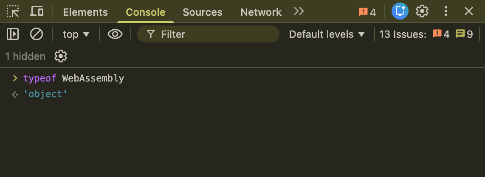

WebAssembly (WASM) kann deaktiviert sein, beispielsweise aufgrund von Compliance mit von Ihrer Organisation festgelegten Sicherheitsrichtlinien oder aufgrund fehlender Unterstützung in älteren Umgebungen.

> **TIPP:** Die [WebAssembly-Vergleichstabelle](https://webassembly.org/features/?categories=browsers) zeigt, welche WASM-Funktionen in Ihrem Browser unterstützt werden.

Sie können überprüfen, ob Ihr Browser WASM unterstützt.

Befolge diese Schritte:

1. Öffne die Entwicklertools.
   - In deinem Browser:
     - (MacOS) Chrome, Edge, Firefox: `⌘ + ⌥ + I`
     - (Linux, Windows) Chrome, Edge, Firefox: `Strg + Umschalt + I` oder `F12`
     - (MacOS) Safari: Gehe zu **Einstellungen** > **Erweitert**. Aktiviere **Entwicklermenü in der Menüleiste anzeigen** | **Features für Webentwickler anzeigen**. Öffne **Entwickeln** > **JavaScript-Konsole anzeigen**.
   - In der Miro Desktop-App:
     - Klicke oben links auf **Hilfe** > **Entwicklertools öffnen**.
2. In den DevTools klicke auf den **Konsole**-Tab.
3. Gib in der Konsoleingabezeile `typeof WebAssembly` ein oder füge es ein.
4. Drücke auf deiner Tastatur die Taste **EINGABE**.
5. Interpretieren Sie das Ergebnis:
   - Wenn die Konsole `undefined` zurückgibt, dann wird WebAssembly nicht unterstützt oder ist deaktiviert.
   - Wenn die Konsole `object` zurückgibt, dann wird WebAssembly unterstützt.
     *Die DevTools-Konsole zeigt* `object`*, wenn WASM in deinem Browser verfügbar ist.*

     > **HINWEIS:** Wenn die Konsole `object` zurückgibt, du aber trotzdem keinen Zugriff auf Miro hast, kannst du andere [mögliche Probleme und Fehlerbehebungen](../troubleshooting) überprüfen oder den [Miro Support](../../tools/troubleshooting/06-contacting-miro-support.md) kontaktieren.
