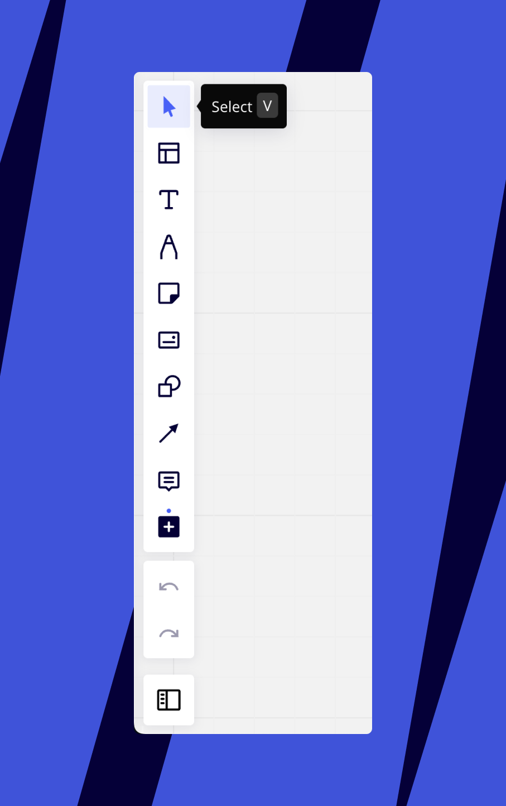
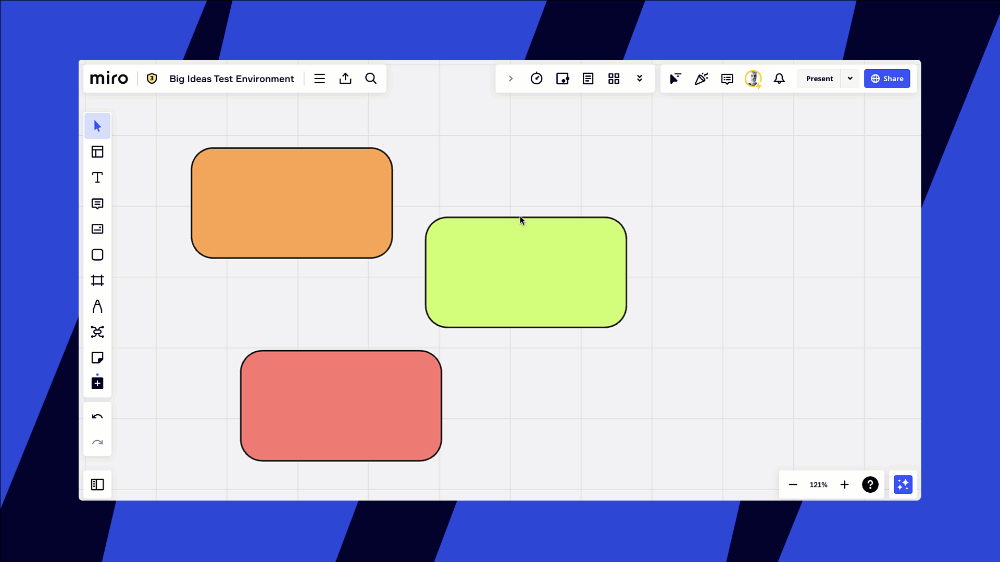
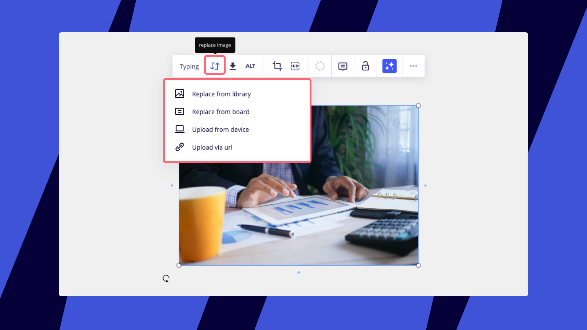
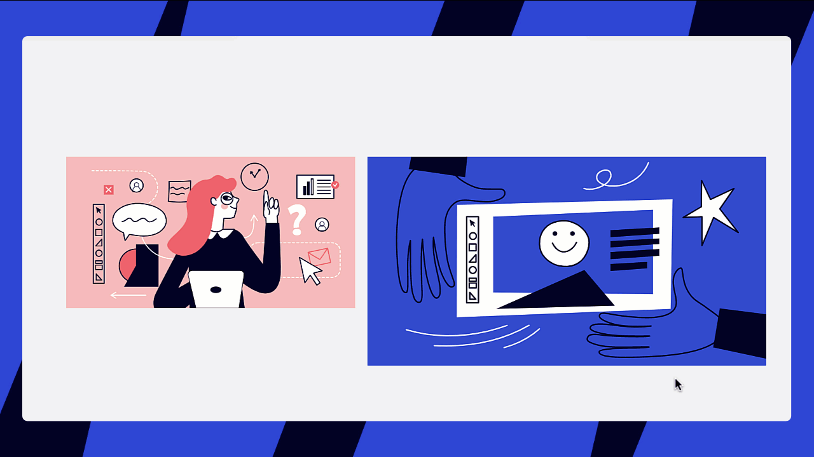
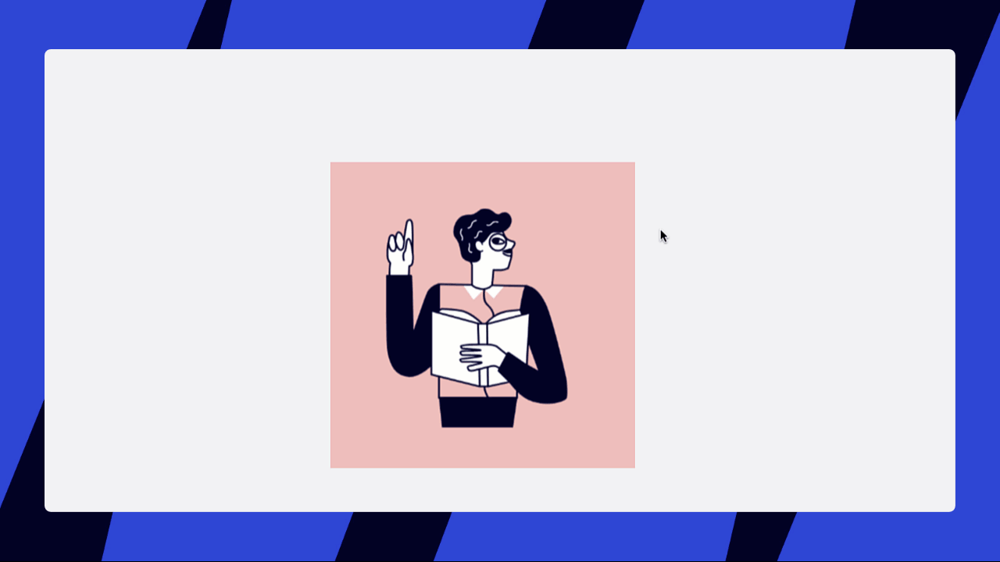
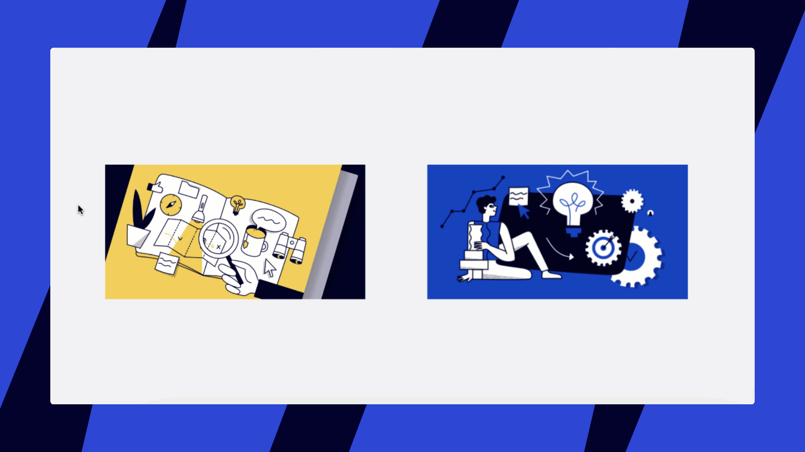

Miro gibt dir fast unendlich viele Möglichkeiten, mit Objekten auf einem Board zu arbeiten. Hier sind einige Tipps, wie du deine Ziele einfacher und schneller erreichst

## Board-Navigation

### Minimap verwenden

Nutze die Minimap, die du in der unteren rechten Ecke des Boards findest, indem du auf das Symbol für den Prozentsatz und dann auf **Minimap anzeigen** klickst (oder drücke einfach den [Kurzbefehl](06-shortcuts-and-hotkeys.md) **M**, um sie zu öffnen/zu schließen).

*Anzeigen der Minimap*

### Umschalten zwischen Auswahl-/Schwenkmodus

Probiere [Tastenkürzel](06-shortcuts-and-hotkeys.md) aus, um ein bestimmtes Objekt auszuwählen oder über das Board zu schwenken. Verwende die Tastenkürzel **V** und **H**, um zwischen dem **Auswahl-/Bearbeitungsmodus** (Cursor-Tool) und dem **Hand**-**/Schwenkmodus** zu wechseln. Du kannst den Auswahlmodus auch in der Symbolleiste aktivieren.

:::tip
Mehr über die Navigation auf dem Board erfährst du [in diesem Artikel](05-using-miro-with-a-mouse-trackpad-or-touchscreen.md).
:::

*Das Auswahlwerkzeug in der Werkzeugleiste*

## Arbeiten mit Objekten

### Intelligente Duplizierung

Um effizienter zu arbeiten, kannst du mit der Tastenkombination **Strg + D** schnell und einfach Objekte auf dem Board duplizieren.

*Intelligentes Duplizieren*

:::note
Du kannst auch **Alt + Pfeile** verwenden, um ein Objekt vertikal oder horizontal zu duplizieren.
:::

### Objektabmessungen für präzise Diagramme

Erstelle professionelle Diagramme schneller und einfacher. Verwende [Objektabmessungen](../formats/diagramming/01-miro-for-mapping-diagramming.md), um auf dem Board Objekte mit identischer Größe zu erstellen.

### Ein Objekt sperren

Schütze Objekte davor, versehentlich verschoben, bearbeitet oder gelöscht zu werden, indem du sie sperrst. Nutze die geschützte Sperre, um zu verhindern, dass andere Personen deine Inhalte ändern. Mehr dazu erfährst du in diesem Artikel: [Sperren von Inhalten auf dem Board](17-locking-content-on-the-board.md).

*Die Sperrfunktion*

### Objekte ausrichten

Wenn du diese Option aktivierst, werden Ausrichtungslinien für alle Objekte erstellt, die du bewegst. So kannst du sie sauber und gut ausbalanciert platzieren.

*Ausrichten von Objekten auf dem Board*

Du kannst die Funktion im Hauptmenü aktivieren/deaktivieren. Klicke auf die **drei Punkte** (**...**) > **Voreinstellungen** > **Objekte ausrichten.**

*Option zum Aktivieren von "Objekte ausrichten" in den Board-Einstellungen*

### Objekte anordnen

Ordne die Objekte auf deinem Board an. Diese Funktion hilft dir, Boards und Diagramme präzise zu gestalten, vor allem bei einer großen Anzahl von sich überschneidenden Inhalten.

1. Wähle das Objekt aus.
2. Klicke im Kontextmenü auf die drei Punkte (**..**.), um das Menü **Mehr** zu öffnen.
3. Wähle eine der folgenden Optionen:

- **In den Vordergrund:** Verschiebe ein Objekt an die oberste Position aller Objekte.
- **In den Hintergrund:** Verschiebe ein Objekt an die unterste Position aller Objekte.
- **Nach vorne bringen:** Verschiebe ein Objekt vor das Objekt direkt vor ihm.
- **Nach hinten senden:** Verschiebe ein Objekt hinter das direkt dahinter liegende Objekt.

:::note
Diese Funktion ist für Rahmen nicht verfügbar. Rahmen werden immer hinter Board-Objekten platziert.
:::

Objekte auswählen und filtern

Wenn du einen bestimmten Objekttyp in einer Gruppe im Massenmodus ändern möchtest, sind Filter sehr hilfreich: Markiere mehrere Objekte, klicke im Kontextmenü auf **Filter** und wähle einen Objekttyp. Erfahre mehr über die Objektauswahl in [diesem Artikel](10-working-with-objects.md).

*Auswählen, Filtern und Ändern von mehreren Objekten*

Objekte drehen

Drehe die Objekte auf dem Board, um deinen Inhalt anzupassen. Suche das Symbol in der unteren linken Ecke des Objekts, klicke darauf und ziehe es, um die Position zu ändern, wie unten gezeigt.

*Drehen eines Objekts*

### Inhalt klären

Du kannst den Inhalt von mehreren Widgets (wie Notizen, Formen und Karten) gleichzeitig löschen. Mit dieser Funktion kannst du alle Texte, Tags, Emojis, Verfasser, Beauftragten und Fälligkeitsdaten aus den ausgewählten Widgets entfernen und sie in ihren ursprünglichen Zustand zurückversetzen, wobei ihr Styling (Farben, Größen usw.) beibehalten wird.

Um den Inhalt zu löschen:

1. Wähle die Widgets aus, die du löschen möchtest.
2. Klicke mit der rechten Maustaste, um das Kontextmenü zu öffnen.
3. Wähle „Inhalt löschen“ aus dem Menü.
4. Alternativ kannst du auch die Tastenkombination Cmd + Backspace (Mac) oder Ctrl + Backspace (Windows) verwenden.

Klare Inhalte funktionieren nicht auf anderen Widgets (z. B. Text, Tabellenwidgets) und nicht auf Jira- oder Azure-Karten. Wenn ein Nutzer mehrere Notizen, Formen und Karten auswählt, werden die Inhalte in allen Widgets gelöscht, außer in den Jira/Azure-Karten.

## Mit Dokumenten arbeiten

### Mehrseitige Dokumente aufteilen

> **Verfügbar mit:** Browser-Version, [Desktop-App](../../getting-started/apps-for-devices/05-desktop-app.md)

Lass dein Team gemeinsam an Dokumenten, PDF- oder Powerpoint-Dateien arbeiten – du kannst beliebige Seiten erweitern, sie auf dem Board auslegen und Kommentare direkt auf den Seiten hinterlassen.

So unterteilst du eine PDF- oder Powerpoint-Datei in eine bestimmte Anzahl von Seiten:

1. Lade die Datei auf das Board hoch.
2. Klicke auf die Datei und wähle im Kontextmenü ****Seiten extrahieren.****
   > ✏️ Die Option ist nur im [Cursor-Modus (Auswahl)](#mini) verfügbar.  Wenn die Option nicht im Menü erscheint, drücke **V** oder wähle den Cursor in der Symbolleiste und klicke das Objekt erneut an.

   *Die Option zum Extrahieren von Seiten im PDF-Kontextmenü*
3. Wähle, wie du die Datei aufteilen willst – alle oder nur bestimmte Seiten –- und klicke auf **Extrahieren.**
   *Extrahieren von Seiten*

Die erweiterten Seiten werden direkt unter der Originaldatei angezeigt. Falls du die Originaldatei nicht mehr brauchst, kannst du sie löschen – alle extrahierten Seiten bleiben auf dem Board.

Seiten anheften

Um eine bestimmte Seite eines Dokuments an ein Board zu heften, wechselst du im Kontextmenü des Dokuments zu dieser Seite, wählst **Anheften** und wählst **Aktuelle Seite als Start festlegen**. Jedes Mal, wenn du das Board öffnest, wird diese Seite als erste eingestellt.

> **✏️** Die Option **Aktuelle Seite als Start festlegen** ist nur im [Cursor-Modus (Auswahl)](#pan) verfügbar. Ist die Option ausgegraut, drücke **V** oder wähle den Cursor in der Symbolleiste aus und klicke erneut auf das Objekt.

*Anheften einer Seite*

## Mit Bildern arbeiten

### Bilder ersetzen

Jedes Bild auf dem Board kann ersetzt werden, ohne dass andere Objekte auf dem Canvas davon betroffen sind.

1. Klicke auf das Bild, um das Kontextmenü zu öffnen.
2. Klicke auf das Symbol **Bild ersetzen** und wähle eine der folgenden Optionen aus:

- **Aus der Bibliothek ersetzen:** Die App [Bilder und Symbole](../essential-tools/08-images-and-icons.md) wird geöffnet, und du kannst ein neues Bild auswählen.
- **Vom Board ersetzen:** Du wirst aufgefordert, ein anderes Bild auszuwählen, das bereits auf dem Board vorhanden ist.
- **Von Gerät hochladen:** Lade das Bild hoch und ersetze es durch ein Bild von deinem Gerät.
- **Über URL hochladen:** Ersetze das Bild durch ein online gehostetes Bild, indem du die URL des Bildes in das Dialogfeld eingibst.

### Bilder zuschneiden

Du musst keine Software von Drittanbietern verwenden, um Bilder zuzuschneiden, da Miro ein Tool dafür hat. Wähle ein Bild aus oder wähle im Kontextmenü **Zuschneiden** aus. Dies aktiviert den Zuschneidemodus der die Bearbeitung der **rechteckigen** Auswahl ermöglicht. Die Beschnittgrenzen passen sich dem umgebenden Board-Inhalt an, damit das Layout der Bilder visuell klar ist. So kannst du die Position und den Maßstab der Bilder, die du zuschneidest, aktualisieren, ohne die Ausrichtung mit anderen Inhalten auf dem Board zu verlieren. Wenn du fertig bist, klicke einfach irgendwo auf das Board.

*Ein Bild zuschneiden*

Du kannst **Bilder in verschiedenen Formen zuschneiden** (z. B. einen Kreis, ein Quadrat usw.). Wähle das Bild aus, klicke auf das Symbol **Zuschneiden** im Kontextmenü und wähle eine Form aus dem Dropdown-Menü aus.

*Ein Bild auf einen Kreis zuschneiden*

Du kannst auch **mehrere Bilder auf einmal in verschiedenen Formen zuschneiden**.  Klicke und ziehe, um die Bilder auszuwählen, klicke auf das Symbol **Zuschneiden** im Kontextmenü und wähle eine Form aus dem Dropdown-Menü aus.

*Mehrere Bilder auf einmal auf einen Kreis zuschneiden*

:::tip
Du kannst dein zugeschnittenes Bild stets wieder auf seine ursprüngliche Größe zurücksetzen, indem du einen Doppelklick machst und die Zuschneideauswahl auf ihre ursprüngliche Größe erweiterst.
:::

### Bilder umranden

Du kannst Bilder und Screenshots, die du hochlädst oder in dein Board einfügst, umranden, um sie hervorzuheben.

1. Klicke auf das Bild
2. Klicke im Kontextmenü auf das Symbol für Umrandung
3. Such eine Farbe aus und stell die Dicke des Randes ein

*Hinzufügen eines Bildrahmens zu einem Screenshot*

### Die Größe von mehreren Bildern auf einmal ändern

Du kannst die Höhe oder Breite von mehreren Bildern auf einmal auf deinem Board ändern. Dann benutze [Auto-Layout](08-structuring-board-content.md), um sie sofort auszurichten.

**So änderst du die Größe von mehreren Bildern auf einmal**

1. Ziehe den Cursor, um alle Bilder auszuwählen, deren Größe du ändern möchtest.
2. Klicke im Kontextmenü auf das Symbol zum Ändern der Größe. Du musst mehrere Bilder auswählen, damit die Option zum Ändern der Größe erscheint.
3. Wähle **Höhe anpassen** oder **Breite anpassen**.
4. Klicke auf das graue Symbol für **Automatisches Layout** in der oberen rechten Ecke

***Änderung der Höhe oder Breite von mehreren Bildern auf einmal*

### GIFs hinzufügen

Füge deinen Miro-Boards GIFs hinzu, um Ideen mit animierten Inhalten zum Leben zu erwecken. GIFs werden für einzelne Nutzer 8 Sekunden lang oder in einer Schleife abgespielt, wenn sie zum Board hinzugefügt werden und wenn jemand den Mauszeiger darüber bewegt. GIFs werden nur für Nutzer abgespielt, die mit dem Board interagieren, nicht für alle in Echtzeit.

Aktiviere [Bewegung reduzieren](../../getting-started/accessibility-in-miro/06-reduce-motion.md), um das automatische Abspielen des GIFs zu deaktivieren.

:::tip
GIFs in Präsentationen und [Miro-Talktracks](../facilitation-tools/asynchronous-tools/02-talktrack-board-recordings.md) werden automatisch in einer Endlosschleife abgespielt, solange sie auf dem Bildschirm sichtbar sind.
:::

*Automatisches Abspielen eines GIFs beim Darüberfahren*

## Häufige Fragen

1. *Kann ich Objekte auf dem Board ausrichten?*
   - Ja, mehr Informationen findest du auf [dieser Seite](08-structuring-board-content.md).
2. *Kann ich [Text](../essential-tools/16-text.md) drehen?*
   - Ja, du kannst Textfelder drehen, indem du das Symbol mit dem Pfeil ziehst.
3. *Kann ich PDF-Dateien zuschneiden?*
   - Nein, das ist im Moment nicht möglich.
