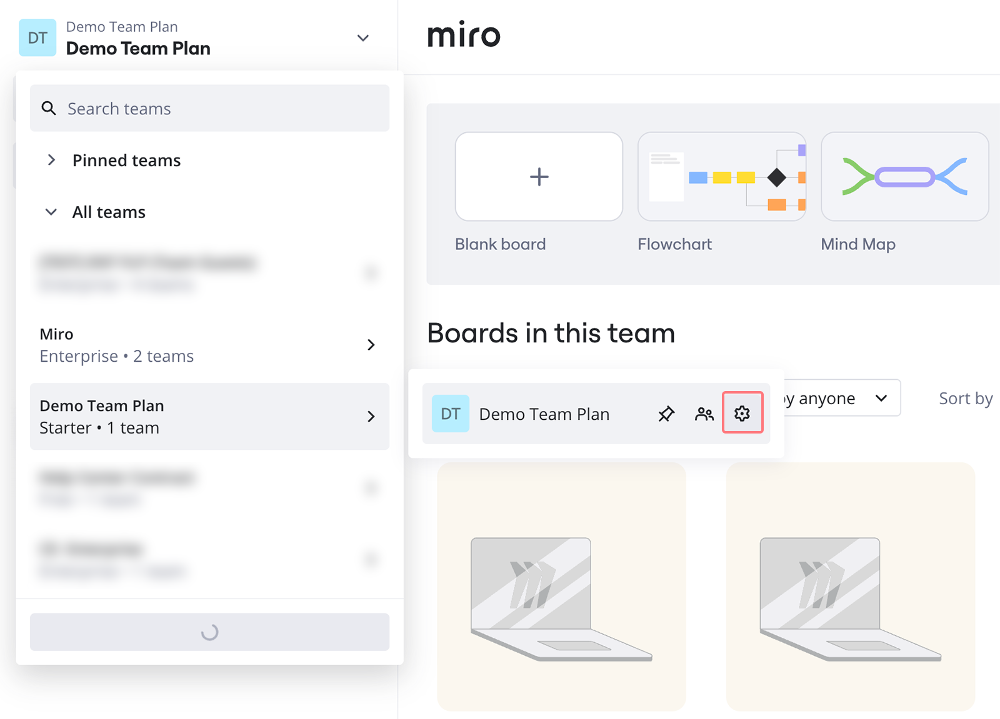
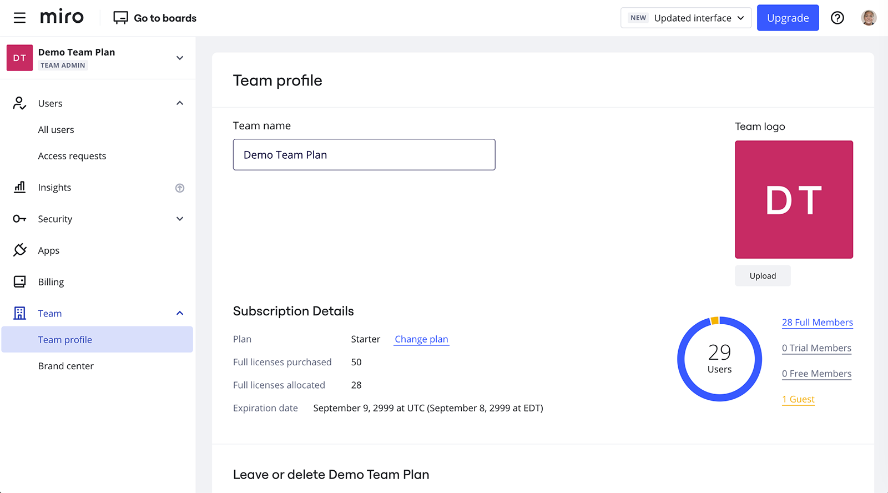
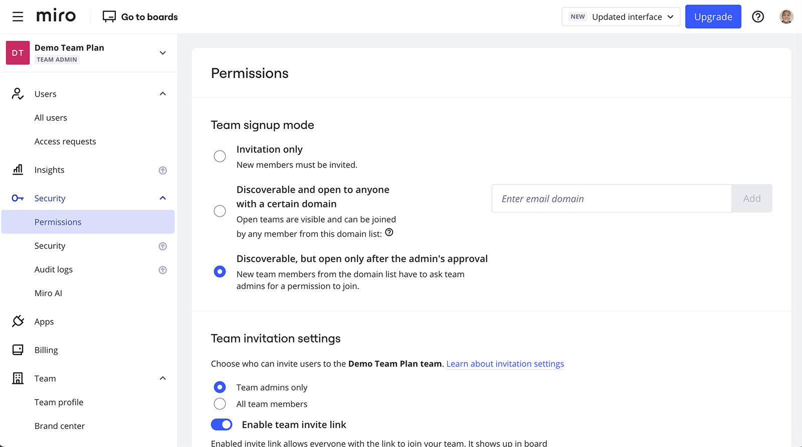
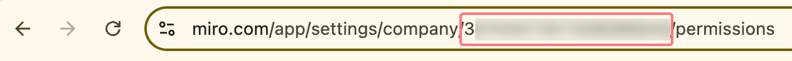

Cuando creas un nuevo equipo en Miro o [te ascienden al rol de admin](../user-management/06-how-to-manage-admin-roles.md), obtienes acceso a la consola de admin con opciones como permisos de equipo, usuarios, integraciones y otros atributos del equipo y de la empresa. El artículo ofrece una rápida visión general de la consola admins de Miro.

### Ajustes de equipo

Puedes ver todos tus equipos en el menú desplegable de la barra lateral izquierda de tu panel de control. Para acceder a la configuración del equipo, pasa el ratón por encima del nombre del equipo y haz clic en el **icono del engranaje**.

*Ir a la configuración del equipo*

Si eres miembro o administrador de varios equipos, también puedes cambiar entre equipos en ajustes del equipo al seleccionar el equipo que deseas en el menú desplegable ubicado en la esquina superior izquierda.

### Configuración de la empresa

Para acceder a la configuración de la empresa en el plan Business o el plan Enterprise, haz clic en **Empresa** en la esquina superior izquierda de la consola Admin.

**Los ajustes de equipo** pueden diferir entre [distintos planes de Miro](../../plans-billing/miro-plans/02-plans-and-features-available.md), pero todos los administradores en Miro pueden ver las siguientes opciones a la izquierda:

- Perfil del equipo
- Aplicaciones e integraciones
- Permisos
- Usuarios activos

**Perfil del equipo** es la pestaña en la que puedes cambiar el nombre y el logo del equipo, así como ver los detalles de tu plan: plan actual, número de tableros y número de miembros del equipo. Desde allí también puedes [salir de tu equipo](../../using-miro/managing-your-profile/06-how-to-leave-a-team.md) o [eliminarlo](../team-management/06-delete-and-restore-teams.md).

En la sección **Apps**, el admin puede:

- Ir a Miro Marketplace haciendo clic en**Install apps (instalar aplicaciones)**
- permitir o restringir la capacidad de los miembros del equipo de instalar nuevas aplicaciones para el equipo
- desinstalar aplicaciones (selecciona una aplicación de la lista para ver la opción de desinstalar)

Para establecer los permisos de equipo, haz clic en **Seguridad** > **Permisos**. Desde allí, los admins de equipo pueden

- configurar [el modo de registro del equipo](../team-management/02-manage-team-signup-mode.md)
- establecer [ajustes para invitaciones](../user-management/02-invitation-settings.md)
- Manejar [los ajustes de uso compartido](../../using-miro/sharing-boards/11-default-sharing-settings.md) (solo en planes pagos)
- Definir [los ajustes de contenido de los tableros](../../using-miro/sharing-boards/14-how-to-allow-or-restrict-copying-and-exporting-boards-and-content.md) (solo en planes pagos)
- En el plan Enterprise, los admins pueden configurar [ajustes adicionales para compartir tableros](../../enterprise-administration/canvas-25-admin-features/data-security/07-sharing-policy-on-enterprise-plan.md)

Permisos del equipo

La pestaña Usuarios activos (situada en **Usuarios** > **Usuarios activos**) es donde tienes acceso a las opciones de gestión de usuarios y puedes:

- [Invitar a miembros nuevos](../user-management/01-invite-users.md)
- [Eliminar a miembros e invitados de los equipos](../user-management/08-remove-users.md)
- [promover a otros usuarios a administradores](../user-management/06-how-to-manage-admin-roles.md)

Visita estas páginas para conocer más sobre administración en diferentes planes de Miro:

- [Plan Free](07-manage-free-plan.md)
- [Planes Starter y Education](06-manage-starter-and-education-plan.md)
- [Plan Business](05-manage-business-plan.md)
- Ve al [Centro de ayuda](https://help.miro.com/hc/en-us) y desplázate hacia abajo para llegar a la sección de administración del plan Enterprise.

### Administrador de equipo y administrador de empresa

> **Disponible para: planes Business y Enterprise**

Los planes Business y Enterprise permiten crear varios equipos dentro de una misma suscripción; dichos equipos están vinculados a una Empresa "paraguas". Existen ajustes de dos niveles (**ajustes de equipo** y **ajustes de la empresa**) y dos funciones de admin (**admins de equipo** y **admins de empresa**).

:::tip
En la Consola de administración, el icono de equipo muestra qué ajustes de equipo puede cambiar un admin de equipo. Como admin de empresa, ve a **Consola admin** > **Equipos** > **\{nombre del equipo\}** > pestaña **Configuración** .

Icono del equipo: 
:::

El admin de equipo tiene derecho a [cambiar el nombre y el logotipo](../team-management/04-update-team-name-or-logo.md) del equipo, a instalar y desinstalar aplicaciones para el equipo, a [promover a otros usuarios a admins de](../user-management/06-how-to-manage-admin-roles.md) equipo, a eliminar miembros, a invitar a usuarios nuevos si esto está permitido en [los ajustes de invitación](../user-management/02-invitation-settings.md), a administrar ajustes [predeterminados de uso compartido](../../using-miro/sharing-boards/11-default-sharing-settings.md), a [hacer ajustes de contenido de tablero](../../using-miro/sharing-boards/14-how-to-allow-or-restrict-copying-and-exporting-boards-and-content.md) y a habilitar o deshabilitar el rol de copropietario.

Los admins de empresa pueden administrar a todos los equipos dentro de la subscripción y todos los atributos del nivel de la empresa:

- Cambiar el nombre y el logotipo de la empresa.
- Consulta los detalles de la suscripción en la pestaña **Perfil de empresa** (sólo plan Business). Para obtener información sobre la suscripción al plan Enterprise, ve a **la consola Admin** > Facturación > Suscripción).
- [administrar la subscripción](../../plans-billing/manage-your-subscription-and-plan/01-manage-your-subscription.md) en la sección de **Facturación**
- Convertir licencias de usuario, invitar y eliminar a usuarios de la empresa en la sección de **Active users** (Usuarios activos).
- gestionar **invitaciones**

### Preguntas frecuentes

1. *¿Cómo puedo ascender a admin a otro usuario?*
   - Consulta los pasos aquí: [Cómo ascender a un usuario a admin](../user-management/06-how-to-manage-admin-roles.md) (disponible también en el plan Free).
2. *¿Cómo creo un nuevo equipo?*
   - Lee el artículo para saber más: Cómo crear un equipo en Miro
3. *¿Cómo encuentro el ID de mi equipo?*
   - Conéctate a Miro en un navegador, ve a la configuración del equipo desde tu panel - podrás copiar el número de identificación del equipo desde la barra de direcciones del navegador (sólo disponible en la versión web). Serán los números situados después de **/empresa/**.
   
   *ID de equipo en la barra de direcciones del navegador*
