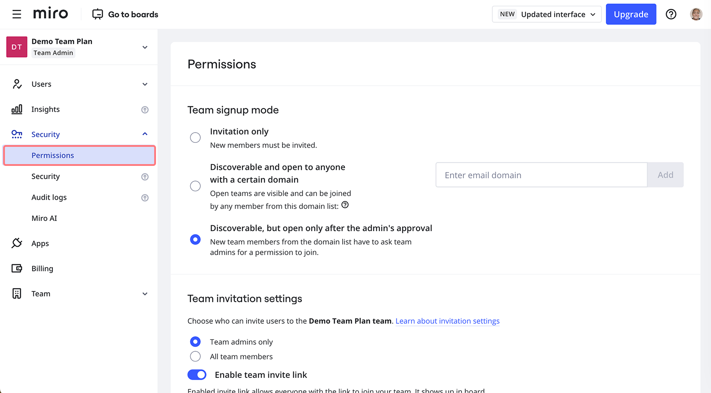

Para gestionar los permisos de equipo, desde tu panel de Miro selecciona tu avatar en la parte superior derecha. Ve a **Admin console** > **Seguridad**. A continuación, abre la pestaña **Permisos** .

*Permisos de equipo sobre los planes Free, Starter, Business, Education*

Desde **Permisos** puedes gestionar los siguientes permisos de equipo:

- (plan Business) [**Modo de inscripción de equipos**](02-manage-team-signup-mode.md)
  Especifica cómo pueden unirse nuevos miembros a un equipo de tu organización. La configuración debe habilitarla un admin de empresa.
- (Plan Business) [**Configuración de la invitación de equipo**](../user-management/02-invitation-settings.md)
  Especifica quién puede invitar a nuevos miembros a unirse a un equipo. Por ejemplo, puedes prohibir a los miembros que no sean admins que inviten a nuevos miembros. La configuración debe habilitarla un admin de empresa.
- (plan Business) **Configuración de la colaboración**
  Habilitar y deshabilitar [el rol de copropietario](../../using-miro/sharing-boards/06-co-owners-of-boards-and-spaces.md).
- [Configuración](../../using-miro/sharing-boards/11-default-sharing-settings.md) para compartir
  Especifica los permisos de acceso y compartición por defecto para tableros y Espacios.
- Seguridad del contenido
  Especifica si sólo los miembros del equipo tienen permiso para copiar el contenido de los tableros.

:::note
Plan Enterprise Los admins pueden especificar más permisos para sus equipos. Para más información, consulta [Permisos de equipo en planes Enterprise](../../enterprise-administration/managing-enterprise-teams-and-content/10-team-permissions-on-enterprise-plan.md).
:::
