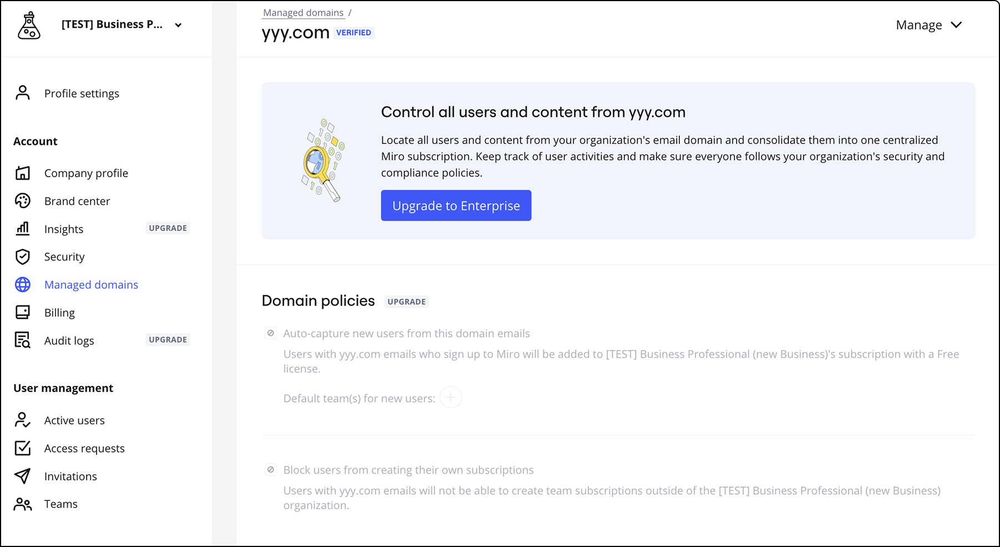
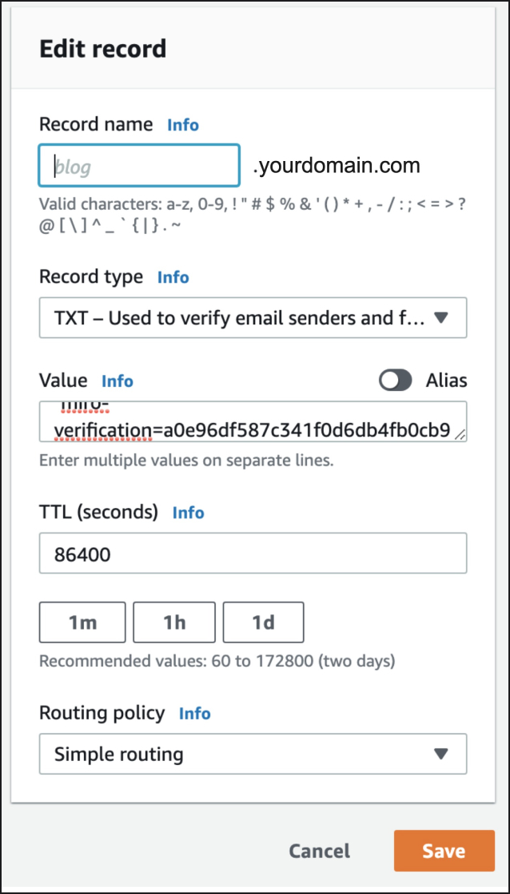
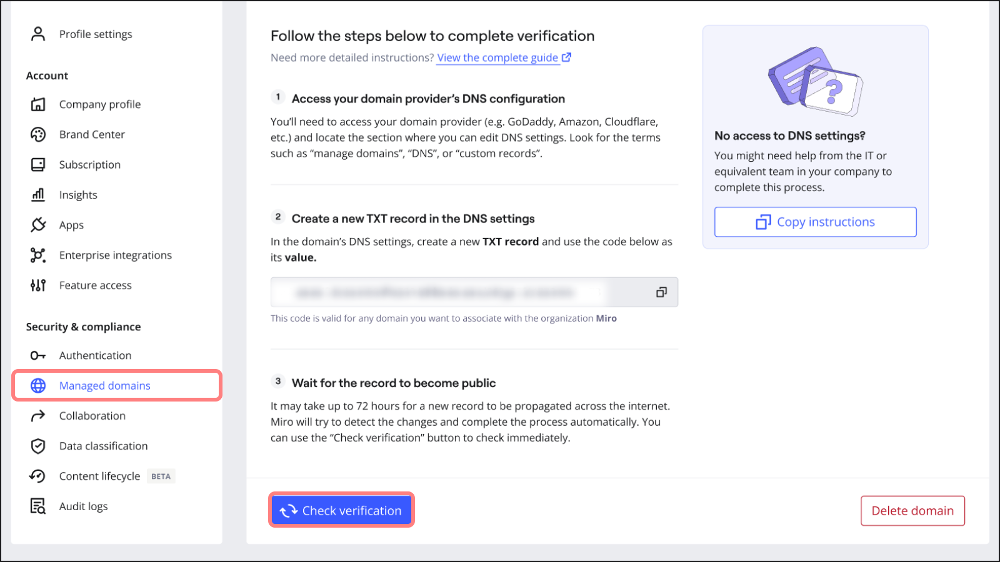
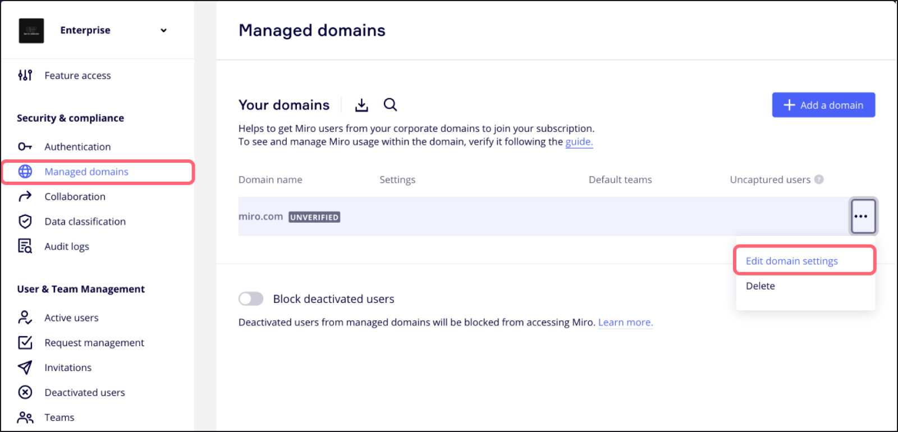
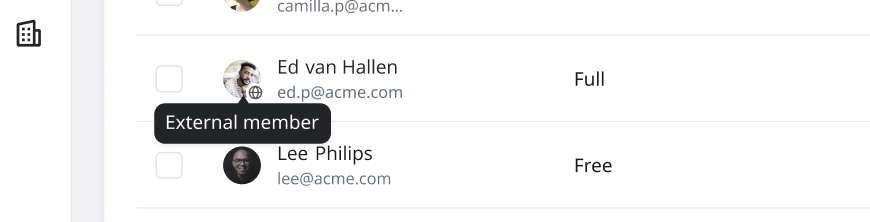

> **Disponible en:** Business, Enterprise
> **Rol requerido:** admin de empresa, admin del sistema

El control de dominio permite a los admins de empresa gestionar el acceso de usuarios dentro de su suscripción. Al utilizar el control de dominio, los admins pueden aplicar el cumplimiento de seguridad corporativa y mantener la supervisión sobre las actividades de los usuarios gestionados dentro de sus dominios.

Aprende cómo configurar y gestionar el control de dominio dentro de tu organización.

**Con el control de dominio, los admins del plan Enterprise pueden:**

- Realizar auditorías para identificar a los usuarios que están asociados a un dominio gestionado que no está incluido en tu suscripción, e invitarlos a unirse.
- Evitar que los usuarios dentro de un dominio creen suscripciones no autorizadas.
- Añadir automáticamente a los usuarios recién registrados a equipos designados.
- [Bloquear usuarios desactivados](../../user-management/02-block-deactivated-users.md) para evitar su acceso a Miro utilizando su dirección de correo corporativo.

**Administradores del plan Business:**

- Pueden usar la verificación de dominio automatizada para gestionar dominios. Solo los dominios añadidos recientemente se verificarán automáticamente.
- No pueden cambiar las políticas de control de dominio.
- No pueden solicitar una auditoría de dominio.

*Las políticas de dominio pueden ser vistas bajo Dominios gestionados para usuarios del plan Business*

Los usuarios del plan Business necesitarán mejorar para otras funciones avanzadas.

:::note
La gestión masiva de dominios no es compatible actualmente.
:::

## Dominio principal

Tu dominio principal determina cómo Miro identifica a los usuarios internos y externos de tu organización. Para aprender a ver, cambiar o administrar tu dominio principal, consulta [Administrar tu dominio principal](https://help.miro.com/hc/en-us/articles/34249718672274).

## Configura el control de Dominio

### Paso 1: Agregar dominios

1. Abre tu panel de Miro.
2. Haz clic en tu foto de perfil en la esquina superior derecha.
3. Selecciona **Configuración** en el menú desplegable.
4. En el panel izquierdo, navega a **Seguridad y cumplimiento** y haz clic en **Dominios gestionados**

   > ✏️ En los planes Business, **Dominios gestionados** se encuentra bajo **Cuenta**.
5. Haz clic en **+ Agregar un dominio** e ingresa el nombre completo del dominio (por ejemplo, tuempresa.com).
   
*Configuración de dominios gestionados*

:::note
Si has habilitado [**Bloquear usuarios desactivados**](../../user-management/02-block-deactivated-users.md), entonces todos los usuarios desactivados asociados con un dominio recién verificado se bloquean automáticamente.
:::

### Paso 2: Verificar dominios

1. Después de añadir un dominio, recibirás un código de verificación dentro de la configuración de tu **dominio gestionado**. Copia este código.

   
*Copiando el código de verificación*
2. Si gestionas tus registros DNS, actualiza tu configuración DNS añadiendo un registro TXT con el código de verificación como su **valor**. (Si otra persona gestiona tus registros DNS, envíales el código de verificación con instrucciones para actualizar los registros DNS.)
3. Inicia sesión en el sitio web de tu proveedor de dominio (GoDaddy, Amazon, Cloudflare, etc.) y navega a la sección de **DNS** **registros**.
4. Crea un nuevo **registro TXT** con las siguientes especificaciones:
   **Valor/Respuesta/Descripción:** *"miro-verification=[INSERTAR CÓDIGO DE VERIFICACIÓN]"*
   **Nombre/Host/Alias:** Déjalo en blanco o escribe @ para incluir un subdominio.
   **Tiempo de vida (TTL):** "86400" (esto también se puede heredar de la configuración predeterminada).

   
   *Creando un nuevo registro TXT*

:::note
Puedes actualizar el registro TXT a través de la consola de administración o del panel del proveedor de DNS del alojamiento del dominio. Ver la [lista de proveedores de DNS](https://support.google.com/a/topic/1409901).
:::

### Paso 3: Verificar la verificación del dominio

1. Después de actualizar el registro DNS, verifica el estado de la verificación de tu dominio inmediatamente en tu **configuración de Dominio gestionado** haciendo clic en **Comprobar verificación**.
2. Si el dominio no se verifica de inmediato, Miro comprobará automáticamente el código de verificación cada 2 horas durante los próximos 30 días.

### Paso 4: Notificación del estado de verificación

1. Una vez que tu dominio esté verificado exitosamente, recibirás una notificación por correo electrónico confirmando el estado de verificación.
2. Por favor, no elimines el registro DNS después de la verificación, ya que puede ser necesario para futuras verificaciones.
   
*Verificación de dominio*

## Reglas para la verificación de dominios

- Tendrás que crear un registro TXT separado para cada dominio de nivel superior y cada subdominio que uses. Sigue los pasos 1 al 4 anteriores para cada dominio o subdominio que quieras verificar.
- Tu dominio debe coincidir exactamente.

  > ✏️ No se permiten subdominios.
- Asegúrate de que todas las zonas utilizadas en la configuración del dominio verificado estén incluidas.
- El nombre de dominio completo (FQDN) debe coincidir con tu dirección de dominio. Por ejemplo, [www.mycompanydomain.com](http://www.mycompanydomain.com).
- Si usas tanto DNS interno como externo, recomendamos verificar ambos para asegurar un control de dominio completo.

## Gestionar usuarios y acceso

### Editar configuración de dominio

Las configuraciones de dominio determinan cómo se gestionan los usuarios existentes y los recién registrados dentro de tu(s) dominio(s).

1. Una vez verificado un dominio, haz clic en los tres puntos (**...**) y selecciona **Editar configuración de dominio**.
   
*Editando configuración de dominio*
2. Verás opciones para gestionar nuevos usuarios en tu dominio:

- **Captar automáticamente a los usuarios nuevos**: Añadir automáticamente a los usuarios que se registren en Miro con un correo electrónico de un dominio gestionado a la suscripción de este dominio con su tipo de licencia predeterminado. Aquí también defines a qué equipos se añadirán los usuarios (obligatorio).
- **Bloquear a los usuarios para que no creen sus propias suscripciones**: Prohíbe a los usuarios gestionados dentro de tus dominios crear nuevos equipos fuera de tu suscripción. Sin embargo, estos usuarios aún pueden ser invitados a equipos en tus dominios y colaborar externamente.

  
*Opciones para manejar nuevos usuarios en tu dominio*

  > ✏️ Si habilitas **Bloquear a los usuarios para que no creen sus propias suscripciones**, entonces los usuarios no pueden auto-registrarse a menos que sean invitados, o que auto-captura o JIT estén habilitados.

### Usuarios internos y externos

Cuando se reclama un dominio, los detalles del usuario incluyen una clasificación **Interna** o **Externa**.

 *Los detalles del usuario muestran si el usuario es externo o interno a tu dominio verificado*

Los usuarios internos tienen una dirección de correo electrónico de un dominio reclamado por tu cuenta Enterprise. Por ejemplo, `user@acme.com` donde `acme.com` es uno de tus dominios verificados.

Los usuarios externos tienen una dirección de correo electrónico fuera de cualquier dominio reclamado por tu cuenta Enterprise. Por ejemplo, `user@not-domain.com` donde `not-domain.com` no es uno de tus dominios verificados.

:::note
Los detalles del usuario son visibles en el perfil del usuario. En la Consola de Administración, los detalles del usuario también son visibles en la lista de usuarios, donde puedes filtrar opcionalmente por clasificación de **Interno** o **Externo**.
:::

La clasificación como interna o externa es automática y se basa en si el dominio del usuario está reclamado y verificado por tu cuenta Enterprise.

## Consolidación de equipos de autoservicio al plan Enterprise

Como admin de empresa puedes reunir todos los equipos creados desde tus dominios en tu plan Enterprise. Esto asegura una mayor seguridad, colaboración y una gestión simplificada al unificar todos los equipos en un solo lugar. Además, también puedes auditar dominios para identificar y consolidar usuarios y equipos que son parte de tu dominio gestionado pero que actualmente están fuera de tu suscripción.

Para más información, [consulta la documentación sobre consolidación de equipos](../../managing-enterprise-teams-and-content/06-self-serve-teams-to-enterprise-plan-consolidation.md).

## Solicitudes de cambio de correo electrónico

Si tu empresa ha reclamado un dominio, cualquier usuario asociado con este dominio no podrá cambiar su correo electrónico en Miro sin la aprobación del admin de empresa. Al intentar cambiar su correo, los usuarios recibirán el siguiente mensaje de error: **No puedes cambiar tu correo electrónico a o desde un dominio que pertenezca a una organización**. Se recomienda que los usuarios contacten a su admin de empresa, quien entonces se comunicará con el soporte de Miro para obtener asistencia.

## Preguntas frecuentes

¿Puedo usar el control de dominio con un subdominio?

Sí, los subdominios se tratan como entidades separadas de los dominios principales. Sigue el proceso de configuración para cada subdominio que quieras verificar.

¿Cómo uso el inicio de sesión único (SSO) con el control de dominio?

Necesitarás configurar el control de dominio antes de habilitar la autenticación de [inicio de sesión único](../../security-integrations/single-sign-on-sso/09-single-sign-on-(sso).md).

¿Qué pasa si mi nombre de dominio cambia o quiero añadir un subdominio?

Si tu nombre de dominio cambia, elimina el dominio y reinicia el proceso de verificación con el nuevo dominio o cualquier subdominio que añadas.

¿Dónde puedo encontrar los registros DNS para mi dominio?

Para localizar los registros DNS de tu dominio, deberás acceder a la plataforma de tu registrador de dominios donde registraste tu dominio. Si no sabes quién es tu registrador de dominios, puedes encontrar esta información utilizando **who.is** para buscar el dominio. Una vez que hayas identificado a tu registrador, inicia sesión en su sitio web y navega a la sección generalmente etiquetada como **Dominios** o **Gestión DNS**. Aquí encontrarás la configuración o los registros DNS para tu dominio.

¿Por qué no puedo ver **Dominios gestionados** dentro de la **Configuración de seguridad y cumplimiento**?

Si no puedes ver la opción de **Dominios gestionados**, podría ser por dos razones:

- No estás suscrito a un plan Enterprise que incluya esta función.
- No tienes el rol de admin de empresa necesario para acceder a esta configuración.

Por favor, verifica los detalles de tu plan y tu rol con un admin de empresa para obtener más ayuda.

¿Puedo eliminar el registro TXT de mi dominio una vez que ha sido verificado?

Aunque eliminar el registro TXT después de la verificación no afectará de inmediato el funcionamiento del control de dominio, se recomienda encarecidamente mantener este registro. Conservar el registro TXT es crucial para potenciales procesos de reverificación en el futuro. Eliminar el registro TXT podría complicar estos procesos y requerir que repitas los pasos de verificación.
